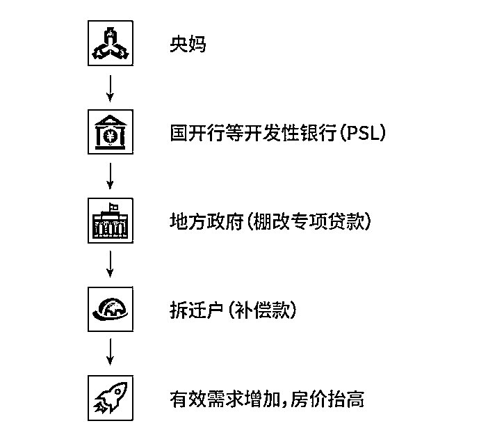
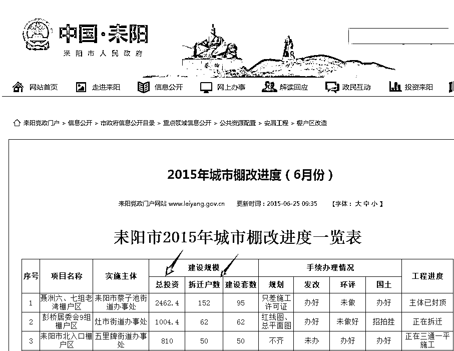

# 三四线城市会不会继续涨价？答案只有一个，看棚改户的进度！

作者：川中寻牛  

最近三四线城市房价相继破万，高房价的同时竟然还出现了“千人排号抢房”的情况，难道三四线城市真的有什么吸引力是我们不知道的！人口不增长的同时房子稀缺有暴涨，完全不符合市场规律，到底是什么原因让三四线城市能够房价破万的呢？

**【最核心的原因】**

以往，政府拆掉棚户区，会给你换一套安置房，这叫“以房换房”；而现在，实行了“棚改货币化安置 “以钱换房”。都流行给你一笔补偿款，你自个儿拿去买房吧。

这笔钱可不是个小数字，那么政府从哪搞到这么多钱？

这背后，又有央妈的贡献。在 2014 年年底的时候，央妈搞出了一种期限长、利率低的“抵押补充贷款（PSL）”的东西来帮地方政府推进棚改。

影响房价的短期因素，其实就是货币。如今央妈正在不断收紧货币，但是通过这个 PSL，依然可以给地产市场送钱。

这钱有多少？截止 2016 年末，央行 PSL 余额为 20526 亿。

换句话说，两年来，央行为房地产市场定向放水 2 万亿，而且主要都流向了三四线城市。

然后就看到，在一二线城市普遍限购、限贷、限售、限价，资金锁死的同时，三四线城市的房价水位渐渐抬高，领涨了楼市的下半场。

其中涨得最多的三四线城市所在的省份是山东，例如威海、胶州、潍坊、临沂等城市。

原因也很简单。因为山东省已经连续 3 年，蝉联棚户区改造任务的全国冠军了。

【棚改下的推手】

2017 年后中国三四线的房价很奇怪。就是房价先涨起来，然后才有了交易量。

这也就是说，房子在交易量低迷的情况下，房价竟然暴涨了。这完全不符合市场经济规律。

所以三四线房价疯涨的起因是庄家故意把价格抬高，制造上涨预期吸引散户入场，然后击鼓传花，一棒接一棒的传下去。

这个传棒者，就是炒房团。

【炒房团的故事】

2017 年 4 月初，魏广华在宾馆满面春风。他说这辈子从未想过有如此轻松的赚钱方式！

A 市区有两片旧城拆迁，以及 6 个自然村要征迁。这些拆迁户大约 1.5 万户，平均每户至少握着百来万拆迁补偿款，此刻拉升房价，不愁没有接盘侠。均价低、流通盘小、有旧城改造的刚需，配合一点学区房的概念，是个很适合讲故事的地方。”

到 A 市安营扎寨后，魏广华首先相中当地名校某实验小学的学区房，彼时该小区均价约为 1 万元。这是个典型的“学区房”二手盘，小区内“流通盘”不到 50 套，介于 60—80 平米之间，只需不到 1000 万的资金，便可一把吃下“流通盘”，这就相当于控制住了该盘近乎全部的流通市场。

这一“套路”屡试不爽，他们如法炮制，陆续在市区扫掉接近 500 套小两居，这在当时，几乎相当于 A 市二手房交易市场的三分之一存量，花费则不到 1 亿元。

旧城改造和自然村拆迁形成的刚需，以及临近地级市的土豪纷纷赶赴这里扫楼，这个曾偏居一隅的四线农业城市，在市区人均收入约 3000 块钱的情况下，市区房价却以近乎“一天一价”的态势，从六七千元起步，向 1.5 万元、2 万元、2.5 万元、2.8 万元进发。

【三四线城市的未来房价】

棚改户是这一轮房价上涨的最大原因，三四线城市未来的价格还会不会涨，盯着棚改户的数据就可以了；

以耒阳市为例：

首先要找到能看到棚改户进度的网站。

在当地的政府官网里可以查询到；

顺序是：信息公开→市政府信息公开目录→重点领域信息公开→公用资源配置→安居工程→棚改区改造。

找到这一章表以后，重点是留意建设规模；因为限制买卖的制度原因，短期房价几乎不可能降下来。

所以明年这个时候再来看官方网站也管用；

如果明年棚改户的规模相比今年大幅度降低；说明房价上涨的汽油差不多就见底了。该出手就出手。

如果明年棚改户的规模比今年还大比例提高，说明今年当地的房价不高，政府会想方设法的拉上平均值，更多的炒房客会流入当地，房价还会涨上去。

当然，如果有渠道提前知道下一年的政府棚改户规划，那就直接得到答案了。如果没有渠道又着急想看，从当地政府官网里或者微信搜索里，找到 2018 年当地政府工作报告，也是能知道个大概的。

作者：川中寻牛