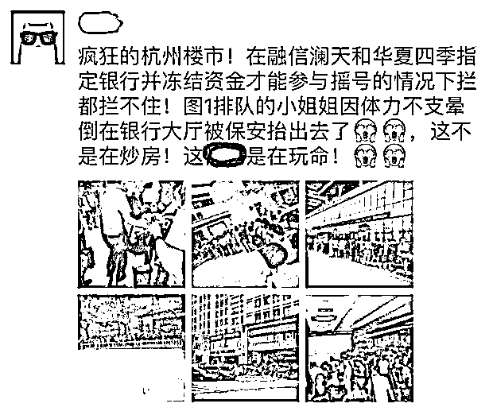
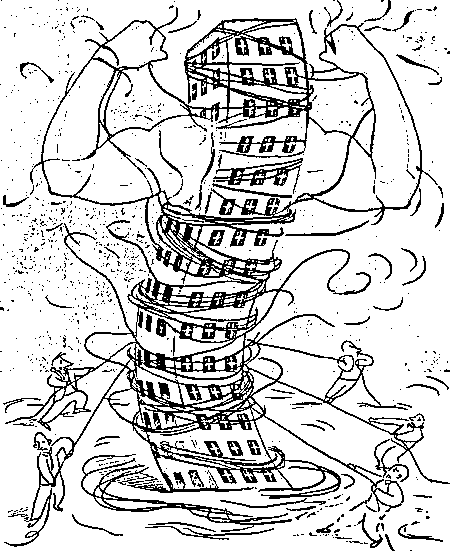
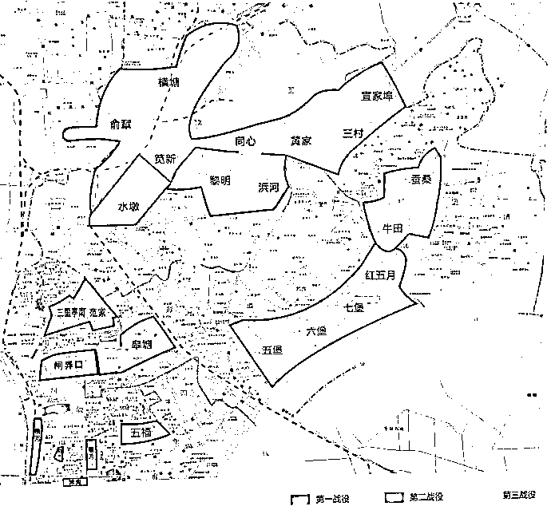
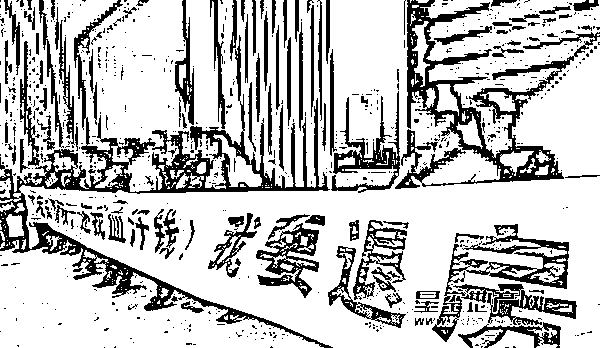

# 杭州新房摇到立赚一倍，为何政府不愿打开限价

紫竹张先生

可能是被抄袭次数最多的财经类公众号

近日，杭州楼市出现万人摇号盛况，大量市民在开发商指定银行排队等候购房诚意金冻结，很多人为了增加中签率，动用了父母、子女的名额前来抢房，一位女性购房者甚至由于体力不支而在排队现场晕倒。

图中提到的融信澜天和华夏四季，到底有什么魔力，吸引购房者如此的抢购，几百万的房子眼都不眨一下，就算去菜市场买白菜，好歹还挑拣一下呢。

那是因为，这些新房和周围的二手房价格倒挂，而且倒挂的非常严重。融信澜天最新备案均价为 18460 元/平方米，而周边最近的万科未来城二手房挂牌价超过 3 万元/平方米。华夏四季单价仅 26105 元，而距楼盘直线距离仅 2 公里的二手楼盘万科西庐单价已达 52000 元。算算这个比例，接近 5 折了，也就是说，买到之后瞬间你的资产就无风险增值一倍，这哪是抢房啊，就是在抢钱，买的越多赚的越多啊。

新房和二手房价格差距如此之大，难怪购房人如此疯狂，而实际上，面对这种套利机会，越理智的人，越会义无反顾的冲上去买，因为收益和风险的比例实在太划算了。这种情况正常吗？明显不正常，虽然我可能无法理解透彻房住不炒的政治深意，但是我也能直观的感受到，这绝对不符合房住不炒的精神纲领。

1**为什么会出现房价倒挂现象**

一二手房折价率达到 20%以上的城市都会引发对新房的抢购，如果是 40~50%的，更是会出现万人空巷的盛况，中签比例堪比打新股，而且还频繁曝出有官员安插关系户来抢房的新闻。为什么在多个城市都出现抢新房摇号的情况，难道这些城市的领导不知道这样现象非常有违和谐吗？

他们知道，但是他们没办法，2016 年 10 月，中国主要的省会城市负责人在北京立下军令状，以 2016 年 10 月的房价为红线，严禁超越。这个限价令对一线城市如北上广深影响很小，因为他们是第一波上涨的，例如上海刚需盘出现滞销，金山某项目推出 456 套新房仅 8 人摇号，房价自己就上不去了。但是二线省会城市可就惨了，因为那个时候他们涨幅不多，后来上涨向二线城市蔓延之后，涨一倍，就会出现 50%的倒挂率，最后实在压不住了，就只能用行政手段干涉房价，哪怕掩耳盗铃，也比行政问责要强。

2**货币化拆迁是引发倒挂现象突然加重的根源**

一开始的时候，一二手房的倒挂还不严重，因为压住了一手房价格，对二手房的预期是有影响的，二手房也上不去，自去年年底以来出现的严重一二手倒挂现象引发多城抢购，其核心原因就是货币化拆迁这个妖怪被放出来了。

货币化拆迁，不再给予拆迁户以房换房，而是直接给予货币补偿让其向市场自由购买，这是个好政策，符合市场经济的精神，但是用在了这个错误的时机，就引出了天大的麻烦。以杭州为例，去年杭州市区拆迁力度空前，可能有 5 万多户。拆迁的基本都是城中村，每户都瞬间成为了千万富翁。

这些人拿到现金之后，第一件事就是去市场上买房子，每户会购买一套大户型或者数套小户型来满足居住需要，这一下子就释放了接近 5000 亿的多头货币涌入市场。有房产中介人士向媒体表示，“比如去年城东融创某楼盘，有传言周边拆迁户购买量就占了将近一半。近期我们手中成交的大户型房源全部都是拆迁户（买走的），很多甚至是全款付清。”

杭州拆迁规划图

杭州七堡地区现状

这五万户居民，自家房子已经被拆成一片废墟，是必须要买房住的，买新房要等二年才能入住，何况还买不到，没办法只能买二手房，于是杭州的二手房被迅速的抢购一空，价格嘛自然迅速飞涨。

我这里举个例子，我们都知道 A 股里，很多大公司，例如茅台里面的很多筹码都是常年不动的，不买也不卖，就长期持有，如果这个时候，国家把各大公司的股东召集起来，说国家看上你们的股份了，出资 2 万亿购买你们的股份，然后你们拿这 2 万亿再去市场上自由购买股票，爱买啥买啥，但是必须买股票。你猜 A 股会涨多少？傻子都知道这么巨量的多头资金涌入股市，会让股市大涨特涨。

楼市也是一个道理，杭州的这批拆迁户带着高达 5000 亿的货币涌入了市场，房价怎么可能不涨，而他们的老房子被拆迁之后，被开发成新小区，还需要 2~3 年的时间，于是杭州楼市出现了暂时的供不应求局面。

3**为什么政府不敢放开一手房的控价**

但是这个供不应求只是暂时的，一旦这批新土地被改造成小区进入市场，供应量马上会激增，但是买方资金却已经在 2 年前就透支出去了，这个时候会出现供大于求的局面，杭州市只能启动第二批拆迁，用第二批拆迁户的资金去购买第一批拆迁改造出的新房子。

但是，这里面一定是有缺口的，如果政府花 5000 亿买来的土地开发出的房子只能卖 5000 亿的话，那一定是巨亏的买卖。正常来说，政府花 5000 亿成本收来的土地，至少卖个 7000 亿才有赚头，7000 亿的地买来之后，最终要卖到 1.5 万亿左右，开发商才能有赚头。

第二批拆迁怎么都填不上这 1.5 万亿的缺口的，那就需要外来人口去接盘了，如果接不了，那价格必然下滑，当房价下滑的时候，就会出现一个具备中国特色的种族——闹事一族。

买二手房的亏了，亏再多也没办法闹事，买卖自愿，盈利自担，风险自负。但是买一手房的，虽然还是买卖自愿，但是效果就不一样了，购房人会去闹事，去售楼部闹，甚至去政府大楼闹，这种事是屡见不鲜的。

所以，二手房价格下跌很麻烦，但是一手房价格下跌更麻烦，尤其是在立下军令状之后，地方政府更不可能冒着违背中央意志的风险，去放松对一手房价格的管控，宁愿看起来像个闹剧，也比将来担责要好。

4**严格限制一手房价格可以预防开发商高价拿地**

至于二手房的价格会不会脱离一手房迅速上涨，这个并没有什么必然关系，主要还是看供需关系而定。关于杭州的房价，这里还有一个数据要参考，截止 4 月份，杭州商品房库存去化周期仅在 3 个月左右，这个数据可以堪称是全国绝对前列，别说要去库存了，马上都快无房可卖了，库存如此之低，和杭州大拆大建制造大批千万富翁冲进楼市扫货是密不可分的。

按我国中央所定的规矩，对库存消化周期在 36 个月以上的，应停止供地；36-18 个月的，要减少供地；12-6 个月的，要增加供地；6 个月以下的，不仅要显著增加供地，还要加快供地节奏。

那么库存只剩 3 个月是个什么概念，那肯定是要显著增加供地，还要加快供地节奏的，实际上，从去年开始，杭州市的土地供应明显开始加速，杭州市区 2017 年全年成功出让土地 153 宗，总成交金额 1942.98 亿元，同比上涨 21.6%，创历史纪录。而 2018 年的数据就离谱了，截至 2018 年 5 月 28 日，仅仅 5 个月，杭州市土地出让金达 1244 亿元，同比上涨 210%。

这些土地刚刚卖出，进入市场需要时间，所以对房产价格的打压是滞后性的，那么假设政府没有严格限制一手房的价格，那么就会给予开发商一个错误的市场判断。以华夏四季为例，他的售价是 2.6 万还是 5.2 万，对开发商的预期是完全不同的，开发商会按照现有的售价来评估他周围土地的价格，如果放开价格，那么开发商在今年的这波土地拍卖中，会疯狂的高价拿地，你不出高价别人出，土地就没你的份了。

政府是多收钱了，但是风险也大了，如果 2 年之后房产大批入市，价格没有在现有的基础上继续上涨，开发商就很有可能亏损，如果价格不涨反跌，开发商亏损的会更厉害甚至可能会破产。这就严重损害了土地市场的可持续发展，对金融安全造成了重大威胁，并会被中央问责。所以，政府不能给开发商错误的价格预期判断，就压死开盘价，顶住巨大压力，绝对不能涨价，哪怕是万人排队的闹剧也不能涨，你就按照 2.6 万的开盘价，去倒推你应该多少钱拿地，等你拿的地开盘之后，政府还是按 2.6 万给你发预售证，你一分钱别想涨，这样可以最大化的预防金融风险，并且让土地财政可持续发展，而不是一锤子买卖后面一地乱摊子。

那些去抢房的人疯狂的抢房，试图买了一手房直接把自住的老房子在二手市场抛售赚取差价。他们的确是无风险套利，但是风险不会消失，只会转移，转移到那些买二手房的人头上了。

那些去买二手房的人，有没有考虑过当前杭州库存已经达到了历史最低点，在房源极度紧张下，房价也已经被推升到了当前货币环境下的极致，这个时候买很有可能是接盘侠呢。如果人人都不买，二手房的价格会迅速下去，直接和一手房拉平，但是很明显，现在很多人还在买高价二手房，这是为什么呢？

因为，很多百姓，他们真的根本想不通这里面的门道，金融思维实在太过简单了。

往期回顾（回复“目录”关键词可查看更多）

001 《为什么中国必须购买美国国债？》 

002 《租房贷款会将房子拆分成房骨和房皮》

003 《中国自古以来就是一夫一妻制》

004 《宁波老虎事件遇难者不应该得到赔偿》

005 《中国的房价什么时候会崩盘？》

006 《中国地产达到什么样的条件会崩盘？》

007 《你根本不知道烟草公司有多赚钱》

008 《如何把自家孩子培养成一个顶尖人才》

009 《我是如何保证自己不近视的》