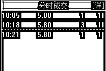
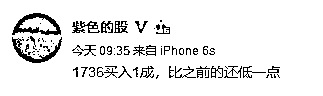
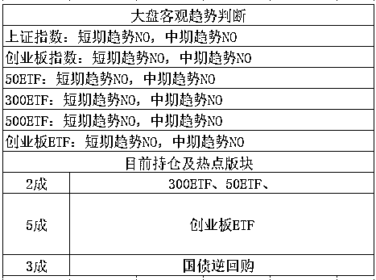

# 股市飞来个黑天鹅，大只的 | 夜报

今天，二只退市股开始进行退市整理，无悬念跌停，其中 600806 退市昆机，全天成交 5 手，几乎是全部活埋。 

这里给大家科普一下，按照 A 股的现行规定，如果要让当日交易有效，那么至少需要 1 手交易，也就是假设退市昆机今天一手买卖都没有，那么全天交易作废，明天的开盘价和今天的一样，理论上说，是可以永远维持账面不跌的。

可惜，这是不可能的，只要一手交易，全天价格就算生效了，不管一致性预期有多强，A 股总是有那么几个闲的无聊的人和你玩反向操作。

~~~~

今天，MSCI 宣布，东方园林、海南橡胶、中国中铁、太钢不锈和中兴通讯因为停牌被 剔除出指数，外国投资者最痛恨停牌，因为丧失了流动性。

而实际上，我也没觉得这个所谓的停牌制度，是在保护中小投资者，因为停牌吃大亏的事情还少吗？比如乐视网，还比如一些停牌 1 年、2 年，甚至更久的股票，持有者简直痛不欲生。

所以，中国修理不了这些乱停牌的人，让 MSCI 出手修理一下，还是挺不错的，乱停牌没有保护中小投资者利益，保护的是上市公司的利益，毕竟停牌权在他手里，他肯定选择一个对自己最有利的停牌时机。

~~~~

然后谈谈一只黑天鹅，很大只的很天鹅

今天早上，看到官媒开始对美国 500E 产品征收 25%关税进行评论了，外交部回应白宫声明：每次变脸都是对国家信誉又一次损耗。

这个东西其实我昨晚就想说的，但是你们知道吗，昨天晚上凡是发这个的，任何网站上，全部是杀无赦，只要沾边就一律删，我也不知道为什么，只看到人头滚滚，我就没敢提这个，免得浪费了辛苦写的文章。然后就看到官媒开始发这个了，网站才停止删除。

这就是今天股市大跌的最关键因素，又是贸易战黑天鹅，4 月份的时候，每一次暴跌，都和贸易战有关，今天也不例外，所以，今天开盘直接大幅跳空低开，创业板的开盘价是 1744 点，直接低于我昨天预设的加仓为 1756，于是我稍微等了一下，9 点 34 看到 1736 了，果断买进。

碰到这种黑天鹅，我并不慌，相反，历次黑天鹅打出的低点，基本都是送钱的机会，A 股曾经有过多次暴跌，但是没有一次是因为境外黑天鹅而引发的，我只能说，本来我应该在 1756 买的，现在 1736 搞到手了，还不错。

整个 5 月，原定计划是越长越卖，准备把 4 月底抄底的仓位卖到轻仓状态，从 7 成仓位，恢复到 3 成左右，做一个大波段。结果总操作是卖 2 成买 2 成，上证 3192，创业 1866 各卖 1 成，创业 1826 和 1736 各加 1 成。总的来说，5 月的上涨比我预估的要弱，只达到了我预估的第一层卖出位置，同时利空有点多，没涨上去，直接给打下来了，所以最终是做个小波段。

今天 200 股跌停，一片哀嚎，6 连阴加上跳空低开暴跌摧毁了大部分人的信心，跌的的确是非常惨烈，不过还算好，毕竟，6 连阴大幅度释放了空头动能，不涨就不会跌的下一句话是，不跌就不会涨。

既然跌那么多了，一口气跌破 3000 几乎是不可能的，而稍微顶个一二天，深成指就会触发日 K 底背离，这点是比较舒服的。

那么什么情况下不会触发呢，全面大破位，上证跌破 3000 点，深成指估计也止不住，这个时候底背离就消失了，这样的话，非常有悖于上交所刚刚宣布的避免暴涨暴跌啊，击穿股灾最低点这意味着啥，大家心里都清楚，什么 IPO 和注册制，就别想再发了。

这种情况概率大不大，不大，很小，属于史诗级黑天鹅才有可能达到的目标，我留 3 成子弹等着他，如果跌不到直接反弹，那就更好了，反正我是按照横盘做的，位置越低，我仓位越重，位置越高，我仓位越轻，然后按照一层层的压力位和支撑位的划定，进行每层 1 成的操作。

大概就这样，黑天鹅都是好事，看看过去一年的历史就好了，不管是英国脱欧引发的黑天鹅暴跌，还是 4 月贸易战突然打响，对实际走势，都没构成干扰，只是短期牵引剧烈而已，几天就会回到原有轨迹。

