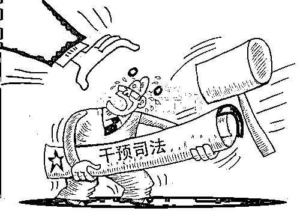
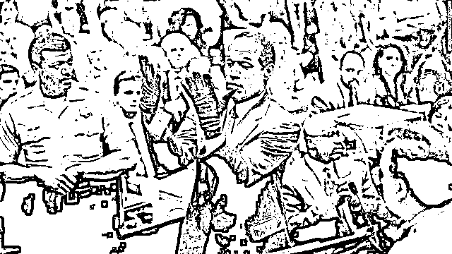
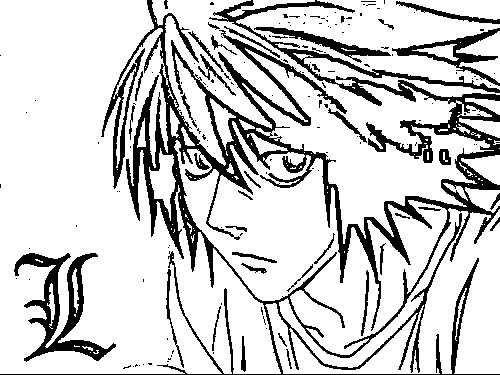
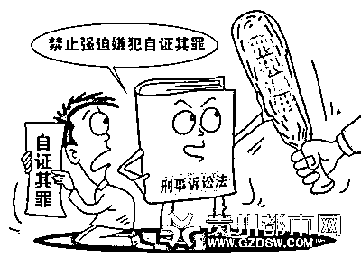
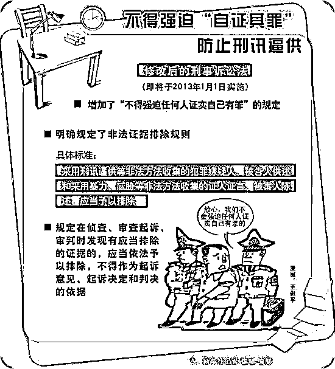

# 持枪藏毒的周立波被无罪释放，凭什么？

紫竹张先生

每篇都有干货的财经公众号

我今天看到了一个最新的消息，周立波在美国涉嫌持枪藏毒一案在纽约第十次开庭审理，法院决定撤销对周立波的指控，无罪释放，该案将在 6 月 4 日最终宣判。 

2017 年 1 月 19 日凌晨，周立波在长岛莱亭顿驾车时被警察拦下，警方搜查车辆时发现手枪和毒品，可以说是当场人赃并获，这么明确的证据都能无罪释放，凭什么？难道周立波在美国手眼通天，有能力干涉司法？恰恰不是，经过十次庭审都没能脱罪的周立波，本次能够脱罪，全依赖他请了一位好律师，以及美国有一个很难干涉的好司法。

这次庭审，法院判周立波无罪释放的核心原因，是因为其辩护律师提出根据美国法律规定，没有明显违法犯罪行为的话，警察没有经过当事人允许或者拿到法院搜查令是不能搜查汽车的。

所以，警方当场搜查出的枪支和毒品等证据，都是无效证据，失去了这些关键证据，当然没办法判周立波持枪藏毒。这种辩护是完全符合美国法律的，美国对公权力的限制非常严格，要求警察办案必须合法合规，如果警察不能证明证据是合法取得的，哪怕有一丝不合规，那么一律判为无效证据。

**美国辛普森案**

周立波持枪藏毒案，简直就是和当年辛普森杀妻案一模一样的套路，由于美国一直奉行疑罪从无，辛普森杀妻在全美国人一致认为铁证如山的前提下，硬生生的被律师团找到了警方的程序失误，在采集证据的过程中有重大违法行为，否决了其中的部分证据，导致整个证据链不完整，无法证实辛普森有罪。

最后辛普森案，从证据不足的角度出发，判决辛普森无罪释放，但是与此同时，却判决辛普森对死者负有民事赔偿责任，如此矛盾的判决，是因为所有人都知道这个人就是辛普森杀的，但是却不能判他有罪，所以就出现这种无罪释放但是在民事上却有罪需要赔偿的奇葩判决。这就是鼎鼎大名的辛普森杀妻案，引发全球司法界大震荡，号称世纪审判。美国特地拍了一个纪录片，叫《辛普森：美国制造》，专门描述这次世纪判决，纪录片长达 7 个小时，非常详实，有兴趣的可以看一看。

当庭被要求试戴血手套的辛普森

辛普森案件是美国程序正义的典型，而今天的周立波持枪藏毒无罪释放案，只是美国程序正义办案理念的一个小小缩影而已。

**程序正义和结果正义**

证据充沛到警方认为无懈可击，放话给媒体绝不可能让辛普森有机会脱罪的的辛普森杀妻案，无罪释放。被当场搜出持有枪支和毒品的周立波，因为搜查时警方没有申请搜查令导致证据失效，无罪释放。二个明显铁证如山的案件，在美国法律上，被判决无罪。

日本曾经有一部出名的漫画叫死亡笔记，在这部漫画里，L 可以 99％确定夜神月就是犯人，且犯人能够轻松的杀人，对破案相关人员包括 L 自身都造成了极大的威胁。L 只是缺少直接证据而已，所以一直没有实施逮捕，最后 L 为了追求程序正义最终被月杀死才使得证据链完整，最终顺利逮捕了月。这部漫画的这个情节引出了人们对结果正义和程序正义长久的矛盾心理，为了追求程序正义而放弃结果正义，这真的值得吗？ 

答案是值得，非常值得，我国就是一个最大的实例证据。如果说长期以来美国是追求程序正义的话，那么我国就是长期追求结果正义，美国的程序正义固然导致一部分罪犯逃脱了法网，但是我国的结果正义却带来了什么呢？

那就是冤案横行，仅仅已经被公开平反的冤案，就有数千起之多，没被平反的不知道有多少。其中甚至有十几年后，原本应该在杀人案中死去的受害者，活蹦乱跳的出现在人们面前这样的奇闻。为什么会出现这种事呢，因为在过去几十年的司法实践里，我国非常轻视程序正义，而追求结果正义。

我国要求命案必破，而实际上这是根本不可能的事情，以美国为例，美国每年平均发生重案 16000 件，大概有 30%的案件没有破，其中性犯罪案有 50%是悬案，司法如此发达的美国都不敢说命案必破，中国如何敢说？

中国不仅敢说，而且还真的做到了，在命案必破的口号提出的一段时间里，各地区的命案，真的就是必破。但是命案必破不仅没有给群众一个朗朗乾坤，反而带来了一个昏暗的天空。

在命案必破的压力面前，一切以迅速破案为前提，即便是用非法的手段，如果能取得详实的证据，那么警方都会毫不犹豫的去干。这个逻辑没有错，如果真的能破案的话，我们不像美国人那样死板的固守程序正义又有什么所谓呢，只要抓住杀人犯，什么都是值得的。

但是很不幸，这种做法，在实际操作中出了大问题，原因也很简单，你怎么知道谁是杀人犯，你要是真知道谁是杀人犯，那还办什么案，直接抓来判刑不就好了。既然你不能确定谁是杀人犯，哪怕你追求结果正义宁愿放弃程序正义，想非法搜集真正的物证，你也没有目标去搜集啊。

这个时候，在结果正义的幌子下，诞生了刑讯逼供和伪造物证的恶果，找不到犯罪嫌疑人没关系，可以推理，说难听点就是靠猜，选出这片区域内犯罪嫌疑最大的人。然后事情就简单了，这案子不是他做的还能是谁做的，如果不是他做的，那就不可能有人做了，如果连嫌疑人都找不到，怎么实现命案必破给上头一个交代，所以杀人犯就是他了。他拒不承认怎么办，没关系，肯定是嘴硬，打一顿他就招了，他一招我们就知道物证在哪了。

于是刑讯逼供诞生了，如果这个人是真正的嫌疑人那还好说，恶人有恶报，但是很可惜，我们不可能确定他是嫌疑人，否则就像上面说的，能确定的话直接判刑不就好啦。既然不能确定他是嫌疑人，刑讯逼供，那必定是有一定概率制造冤案的。更有甚者，当警方刑讯逼供到一定程度的时候，发现这个人确实是清白的，因为实在拷问不出什么证据，无法定罪，但是这个时候如果无罪释放嫌疑人，就会被嫌疑人上诉，追究刑讯逼供的责任，所以为了摆脱刑讯逼供的罪名，警方甚至会伪造证据，强行定罪。

鉴于过去几十年，我国警方的刑侦技术非常落后，人员素质参差不齐，这种破案招数只能带来一个后果，那就是冤案率飞涨，而且会有很多匪夷所思，正常人一看就知道是冤案的案件，也被拿来定罪了，只是为了命案必破，拿来充数用。

追求程序正义而放弃结果正义的美国，虽然放走了一部分罪犯，但是每一个定罪的，都是罪证确凿，铁证如山，基本不会冤枉一个好人。追求结果正义而放弃了程序正义的中国，看似命案必破，实际上冤枉了好多好人，而每冤枉一个好人来顶罪，就必定有一个坏人逍遥法外，实际上还是放走了很多罪犯。

**司法的进步**

经过全球几十年的司法实践，结果正义和司法正义谁更好的争论已经慢慢平息，现在都倾向于向美国的程序正义靠拢，我国在这些年里相继提出禁止刑讯逼供、单口供不能定罪、严格要求办案程序合法合规等，都是在向程序正义靠拢，程序正义能严格限制公权力作恶，保护无辜的普通人，而且在惩罚坏人上，实际结果并不亚于结果正义太多。

所以，对于美国法院判周立波无罪释放的裁决，我表示理解和支持，甚至我希望中国也应该发生一次这样的案件审判。当然，这并不影响我对周立波这种违法持枪藏毒行为的鄙视。

中国的每一个案件，大家都应该从首先从警方办案是否合法合规上去监督，千万不能为了惩罚自己心中的罪犯强迫法院违规办案，否则将来只会害了我们自己。

记住，惟有程序正义，才有可能带来执法正义，每一个中国人，都必须知道这些知识，并进行转发扩散，只有当每一个中国人都拥护程序正义的时候，我们才能真正的保护自己的合法权利。

往期回顾（回复“目录”关键词可查看更多）

001 《为什么中国必须购买美国国债？》

002 《租房贷款会将房子拆分成房骨和房皮》

003 《中国自古以来就是一夫一妻制》

004 《宁波老虎事件遇难者不应该得到赔偿》

005 《中国的房价什么时候会崩盘？》

006 《中国地产达到什么样的条件会崩盘？》

007 《中等收入陷阱为何如此难以突破》

008 《如何把自家孩子培养成一个顶尖人才》

009 《我是如何保证自己不近视的》

<link rel="stylesheet" href="view/css/APlayer.min.css">

