# 这个 Ayawawa 被封了，还会不会出现第二个 Ayawawa？

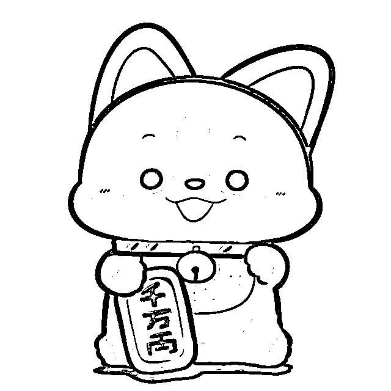

小飞大侠 相信本侠，你得到的将不止于此！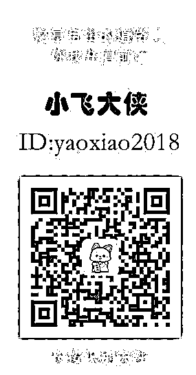

本文转载自：小飞大侠（yaoxiao2018）公众号

继“暴走漫画”发布含戏谑侮辱董存瑞烈士的视频内容被今日头条封禁后，近日又有个叫 Ayawawa 的新浪情感博主被共青团中央、紫光阁和中国妇女报联合点名谴责，场面一度热闹且震撼。 

新浪官方随即以“鉴于该账号使用者已经形成一定影响力，且已经造成了严重的社会不良影响”为由，将其封杀六个月。

后面各大主流媒体开始转载，标题均为“情感教主 Ayawawa 惹众怒！中国妇女报：该封杀封杀”。至此，Ayawawa 终于“凉凉”。

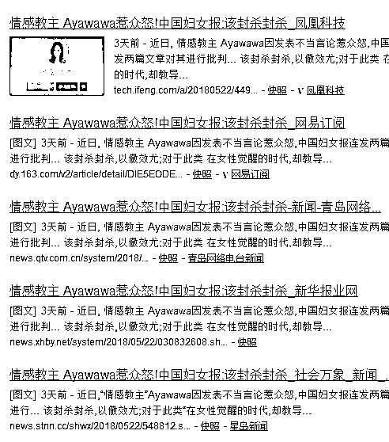

那么，当这个 Ayawawa 被封杀后还会不会出现第二个 Ayawawa 呢？

在扒这个问题前，我们还需要先聊聊 Ayawawa 这个人。

**Ayawawa 是谁**

Ayawawa 真名杨冰阳，在电视塔担任过情感嘉宾及主持人，在各大杂志社开设过情感专栏，出过几本情感专著，同时还经营着淘宝店铺，曾被誉为“网络第一人气美女”。

头衔挺多，最关键的一个便是“**情感分析专家**”。

不过大家要把她当成“知心姐姐帮你解答情感问题”类的普通级别那可就大错特错了，Ayawawa 的级别可高级多了。

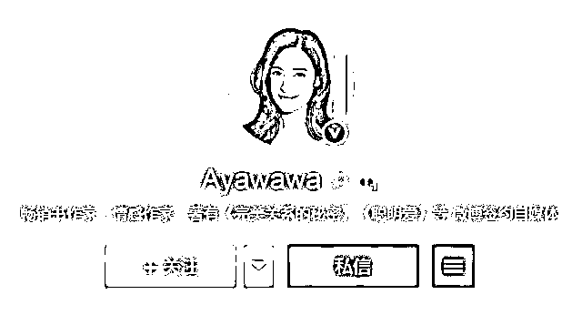

**Ayawawa 走红的条件**

首先，Ayawawa 是网络上屈指可数的，懂得利用先进的理论知识来武装自己的情感类大 V。

她常提到 MV 和 PU 两个概念。

简单来说，MV 就是指女性的肉体本身的生育价值。越美越年轻，则你的 MV 值越高，Ayawawa 认为要在 MV 值最高的时候出售自己。

PU 就是指亲自不确定性（可理解为伴侣忠诚焦虑）。因为男性无法直接判断出孩子是否是自己的，会对女性的忠诚有天然的焦虑。所以 Ayawawa 认为，女性要做出各种努力来帮助男性降低这种焦虑，不然男性就会倾向于出轨生“私生子”。

结合起来，女性的魅力吸引力=MV-PU。

最理想的组合为又美丽又乖巧。

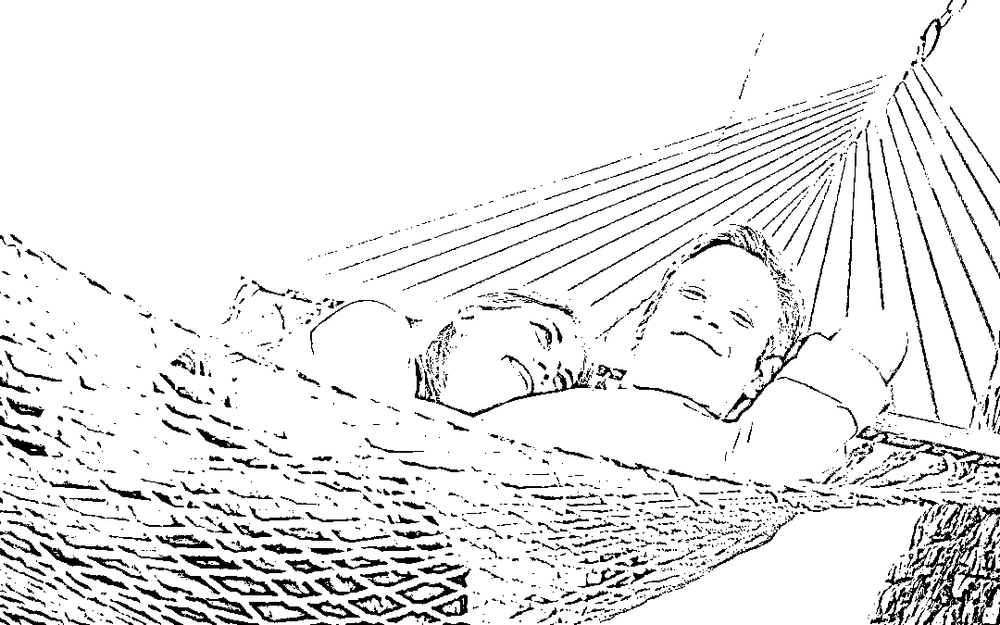

其实，包含着 PU 和 MV 两个概念的理论并不是 Ayawawa 自创出来的，而是来自于 **进化心理学**，在学术界是存在的。

所以，表面上看来她的逻辑推理没有硬伤，无论什么样的情感问题都能套用在她的理论模板上。比起其他“知心姐姐”来说，Ayawawa 不仅能指出你的问题，还能告诉你要如何解决问题“提高 MV 值、降低 PU 值”，所以能受到追捧也就可以理解了。

但问题是，进化心理学探讨的是以百万年跨度为单位的时间长河中发生的事情，并且这套理论是忽视了文化在进化中的作用的，明显是不能用来套用及解释发生在身边的案例的。这犯了宏观理论解释微观现象的错误。

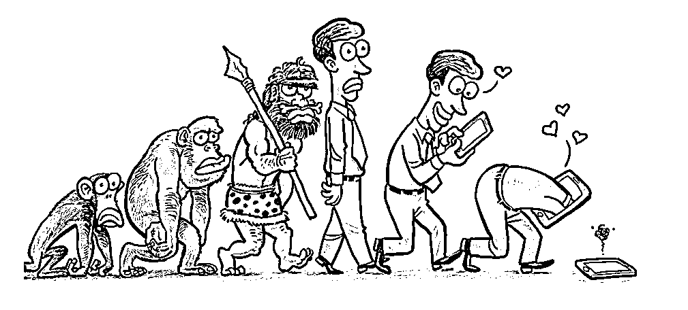

其次，Ayawawa 一开始的走红得益于中国互联网时代的崛起。

最开始的时候混迹于猫扑，那个年代家用电脑还未普及，猫扑上的男性用户居多，Ayawawa 便是在猫扑上 po  了一张自己的照片并靠着那句“**比我聪明的没我漂亮，比我漂亮的没我聪明**”彻底走红。

那时候的互联网人气聚集起来比现在容易得多，大家逛来逛去也就那几个网站。且那个年代还没有喷子水军等负面产物，网络环境简单、网民友好，正是一个靠几张照片就能火的黄金时代。

之后 Ayawawa 带着聚集起来的人气陆续转战天涯、新浪博客、新浪微博、公众号。不仅热度不减，还更火了。

连她自己都承认“我的点儿赶上了”。“什么火的时候我就在玩什么。猫扑火的时候，我在玩猫扑；天涯火的时候，我在玩天涯”，还有后来的博客、开心网，到现在的微博、微信。

一直致力于走在网络时代的风口浪尖上，所以她能从“互联网远古时代”走红至今不是没有道理。

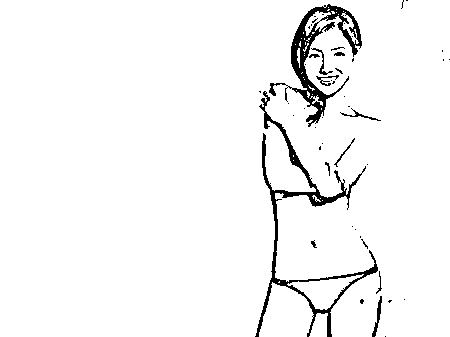

最后，也最重要的一个条件是，群众基础。

现代的社会女性，找不到对象焦虑；婆媳关系不好焦虑；生不出儿子焦虑；各种焦虑。

不论什么样年龄的女性都会面临着各种各样的焦虑，而 Ayawawa 恰恰就是“贩卖”治疗焦虑方法的“教主”。

当一个女性面临着情感危机求助无门的时候，遇到了一个能耐心倾听并帮助分析，还能提供理论依据及操作性强的解决方法，那简直是奉为神明都不为过，推荐给身边的小姐妹自不必说了。

而女性恰恰是一种情感至上的生物，她们在人生中的每一个阶段几乎都会有情感方面的问题，这就构成了 Ayawawa 强大的群众基础。

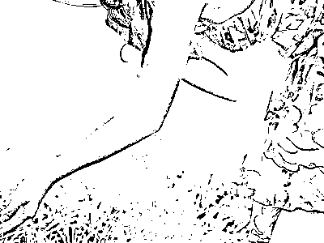

**Ayawawa 被封的原因**

表面上看，Ayawawa 是因为犯了一个低级别的错误引发的。

她在一堂“女性情感培训课”上提到了“慰安妇”。她让大家想象日军侵华战争时期的慰安妇制度受害者，并说，同时期的男人更惨，都被打死了，女人至少还能留下一条命。“所以你看，就算遇到战争，女生还是有性别优势的。”

Ayawawa 大言不惭地用“慰安妇”当女性红利的例子，终于触犯了众怒，在主流舆论的压力下被新浪封杀。

同时她还犯了和之前一样的错，用宏观理论去解释微观个案。

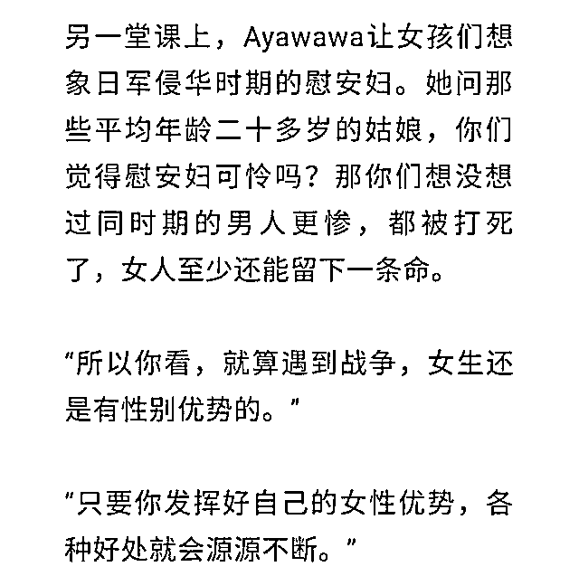

懂点南京大屠杀历史的小伙伴们都知道，战争中死去的女性并不少，并且因为是女性，在被杀死前平白受到侮辱。

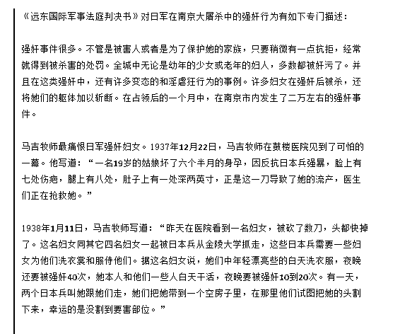

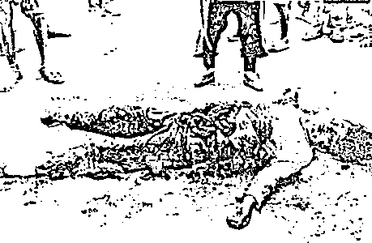

“五一”大扫荡中先奸后杀的妇女

> 约翰·马吉是南京一位著名的牧师，在南京大屠杀期间，他和朋友一起用相机记录下来了很多大屠杀的事实，从他拍摄的影像来看，日本随意的屠杀我国无辜百姓，这种照片张惨不忍睹！妇女们被纷纷送到集中营充当日军的“慰安妇”！每天都有大量的妇女被送进去，每天都有大量的尸体被抬出来！

况且，以能否能够在战争中存活下来为标准，来衡量性别的优劣，是对女性的不尊重，对人类价值的蔑视。而且，ayawawa 真的了解慰安妇吗？活着比死了更好，前提是能够有尊严的活着，而并不是被关起来每天被日军强奸无数次然后得了许多妇科病。同时一边忍受着凌辱和病痛折磨，一并火灾随时会被杀死的阴影恐惧之下。

她教的是利用女性的优势，在男权社会示弱以便多占便宜，而不是教女性通过努力去争取同等的地位、人格和尊严。她的一套理论，不论是 MV （努力变美），还是 PU （做小伏低），看似是在“跪舔”男权，但是本质上却只是一种手段。努力变美是手段，做小伏低是手段，而目的是要从男性那里获得利益，用 Ayawawa 自己的话来说叫“充分利用性别优势”。

她的理论中把主动性都放在了女性这一边，而男性只是提供不同输出结果的一个反馈个体罢了。这与真正的所谓“男权”其实是相悖的，说明了 Ayawawa 骨子里其实是鄙视男性的“伪男权主义者”。

在女权意识逐渐觉醒的今天，这样落后的理论必定存活不久。

而且，如果一个情感专家，只教你术，而不讲道，即不告诉你如何去善待你的另一半，而是叫你如何耍手段玩心机当绿茶婊，即使最终你获得了一些利益，你和他之间将来也会陷入无止境的斗智斗勇的穷途困境之中。

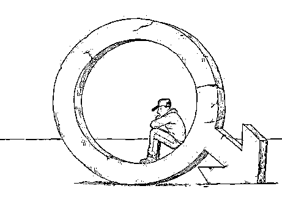

但是要我说这并不是 Ayawawa 被封杀的真正原因，Ayawawa 的“伪男权”理论也好，“慰安妇”这种不当言论也好，都只是一个引子。

更深层的原因是 Ayawawa 的言论触犯了社会主流思想的底线。

一个宽容且多元化的社会，容得下不同的观点和理念，但是不包括歪理邪说。对恶的纵容，就是对善的不公。所以 Ayawawa 的“凉凉”是意料之中的。

**会不会出现第二个 Ayawawa**

**出现第二个 Ayawawa 是必然的。**

首先情感类咨询的准入门槛非常之低，路上随便抓一个女性同胞就能充当“知心姐姐”的角色，并且群众基础庞大。我们上文也说了，女性是情感生物，基本上每个女性每一阶段都会存在情感焦虑。虽说市场竞争异常激烈，但是架不住受众庞大啊！

其次，成名后所带来的经济收入简直太可观。

Ayawawa 就是一个很好的例子，自她成名后利用 IP 到处圈钱，在网上的一次咨询费都要十几万起步，羡煞了多少人。

再一个，Ayawawa 的成功模式具有极强的可复制性。

从前沿理论搬出一套概念并套用之、完善之，使其能自圆其说。再利用网络和自媒体等渠道进行营销，多管齐下。当覆盖的群众足够多，圈到的目标受众数量也就上来了。

而情感迷茫期的女性往往会“病急乱投医”，一旦接触到便难以自拔，甚至还会鼓励身边的闺蜜一起关注，最终呈现裂变式的增长。

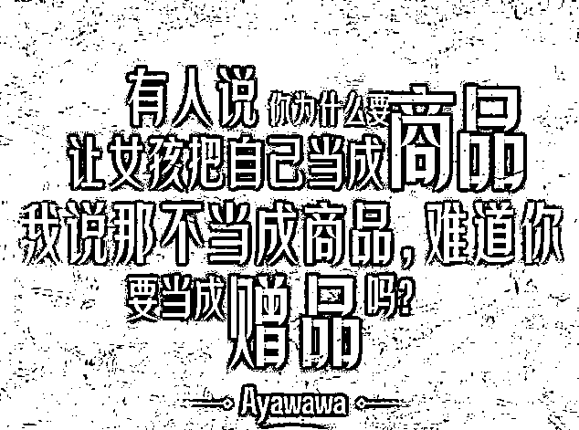

我们阻止不了想红的人成为第二个 Ayawawa，只愿下一个 Ayawawa 能脱离邪教的本质，引导女性往真正自强自立方向行进。

而作为新时代的女性，应该**树立正确的现代女性意识，提高独立思考的能力**。在面对情感问题时才不至于方寸大乱、手足无措找错了方向，不经意间给了这种“邪教”存活的土壤。

作者：小飞大侠。见微知著，从小处着手，捕捉资本新动向；角度新颖，于大处着墨，洞察市场新变幻。从业超过五年，行文洋洋洒洒、通俗易懂；功底扎实，对市场有独到的见解。小飞大侠，每晚带给你不一样的投资理财新启发，值得关注。长按下方二维码关注。

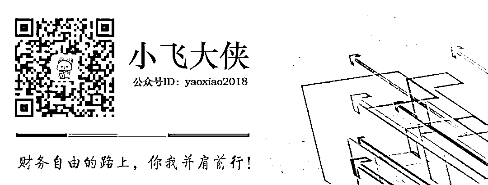