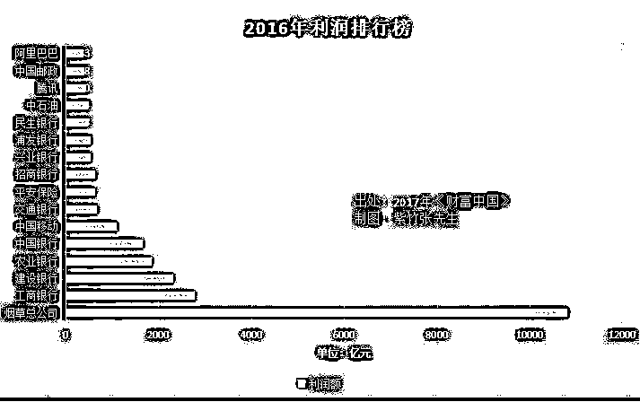
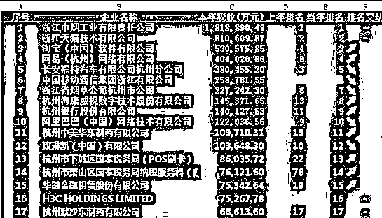
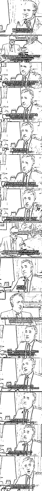

# 你根本不知道烟草公司有多赚钱

紫竹张先生

每篇都有干货的财经公众号

在中国，什么公司最赚钱，是我们所熟知的腾讯、阿里巴巴这样的新兴互联网巨头，还是中石油、工商银行这样的大型传统国企，都不是，这些看似巨无霸的企业，在中国烟草总公司面前，都被衬托的无比渺小。 

中国烟草总公司到底有多么挣钱，我从 2017 年《财富中国》里摘出了一些数据，从这些数据我们可以看到，烟草总公司一年的利润居然是破万亿的，一家可以直接挑战四大行+二桶油。

更恐怖的数据是，烟草公司几乎把所有的利润都拿出来当税收给缴纳了，16 年的数据我没查到，但是 2015 年烟草行业实现利润总额 11436 亿元，上缴财政总额 10950 亿元，这就是中国烟草人津津乐道的二个破万亿，利润破万亿，税收破万亿。

万亿是个什么概念，2017 年中国财政总收入也才 17 万亿，也就 17 家烟草总公司而已，其实在中国还没有开始控烟的 90 年代，烟草公司的地位更重，那个时候烟草缴纳的税收常年高达全国财政收入的 10%以上，现在开始逐渐下降，不过也高达 7%左右，每年中国烟草总公司缴纳的税收，大概和国防总开支差不多，而且，这还是在他支付了上下游近千万就业人口工资的前提下。我们看看大名鼎鼎的浙江杭州淘宝的数据，2017 年税收排行榜，浙江省排名 2、3、4 位的天猫、淘宝、网易三家公司的总和，大概和烟草公司浙江分部差不多。

而另外一个可以横向比较的数据是，我们为之民怨沸腾的房地产行业，在房价暴涨，房企疯狂拿地的 2016 年，全国一年的土地出让总收入，也就仅仅只有 3.7 万亿元。从 1999 年至 2015 年，这十七年全国土地出让收入总额约 27.29 万亿元，年均 1.6 万亿元，大部分还要分给地方政府。

相比而言，几乎不会引起民众反感的烟草税收，是多么的可爱。

1**为什么烟草这么挣钱**

中国烟草总公司为什么这么挣钱，是不是把香烟的价格抬的很高，利用垄断地位迫使民众不得不购买高价烟，以此来获取暴利呢。

还真不是，我国的香烟价格远远比欧美国家要便宜，甚至比一些发展中国家还要便宜，过高的香烟价格会明显降低吸烟人群的比例，尤其是能够有效阻挡青少年进行香烟的首次尝试，而中国烟草总公司的目标是总盈利额最大，在烟草公司的努力下，中国有 52%的男性和 2.7%的女性成为了烟民。

香烟的成瘾性非常高，在首次尝试吸引的人类里，大概三个里面就会有一个上瘾，这样的成瘾性并不比可卡因和海洛因弱。而只要进行了初次尝试，上瘾之后，除非是经济实在无法负荷，否则想断掉烟瘾也是不可能的，过高的香烟价格会让烟民无法吸到足够的香烟从而导致部分烟民被迫戒烟，看似单只香烟利润上升了，但是利润总额却降低了，这是烟草公司不可容忍的损失。

所以，中国香烟的价格并不贵，之所以烟草公司能获得如此之高的利税，那是因为**中国烟民的数量太多**。

而在其他国家，烟草一样是最赚钱的行业，十五世纪哥伦布的船队从美洲大陆第一次把烟草带回欧洲的时候，上层社会是很反感烟草的，也得不到统治者的支持。而咀嚼烟草，或者点燃烟草吸取烟雾，怎么看都会严重损害贵族优雅的形象，烟草的热爱者，主要是贫穷的水手。但是后来，统治阶级发现烟草的利润大的超乎想象，于是烟草瞬间获得了统治阶级的全力支持，并进行全方位的美化宣传，一直到 20 世纪，我们都可以看到很多论证烟草有益于身体健康的文献报告出来。

实际上，近代所有的欧洲强国，基本都是以烟酒等瘾品收入作为主要财政来源的，这是一种隐性税收，是财政的刚需，所以我们可以看到，现代科学民智觉醒之后，即便大力反烟，欧美国家也只是控烟，而从未谈过全面取缔烟草行业，因为涉及的利益太大了。

2**烟草对国家的重要性**

对于我国而言，烟草同样是财政的重要基石，其实在我国官员高层，控烟的声音一直很大，谁都知道烟草有害健康，但是奈何谁也背不起影响万亿税收的黑锅。

国家烟草专卖局一位官员就曾指着卫生部官员大骂：“你们要控烟？我告诉你们，你们这是在卖国，你们是公务员，工资的十分之一都是拿的我们的钱！”如果全面取缔烟草，国家的 1/10 税收瞬间就灰飞烟灭了，谁来填补这个窟窿，谁能抗的起这个责任。

在某烟草行业网站上，曾刊载了这样一段话——“如果没有烟草连续的‘两个超万亿’，或许我们的第二艘航母还只是图纸，万吨大驱还存在于想象，高铁还遍布不了南北东西，大规模的税收减免也还停留于规划。对了，你或许还不能享受到这么多这么好的社会福利，更不能心安理得地扮公知、打嘴炮，可能连耍嘴皮动键盘骂烟草的机会都没有。”

看起来好像是强词夺理，歪理邪说，但是如果换成你我去当政，在涉及到万亿收入来源的时候，还真的没办法下这个禁烟的决定，还是上面那句话，减少财政万亿收入，让烟草业上下游近千万就业人口失业，哪个官员也背不起这个天大的黑锅。

大家都知道有一句话传播很广，叫“吸烟有害健康”，是爱迪生说的，但是很多人都不知道爱迪生接下来说的那句话，“但是有利于国家”。

3**吸烟对社会整体的危害性**

这个时候，有人开始反驳了，这个账不能这么算，要算总账，烟草公司获得的利润，是从未来烟民生病的前提下换来的，烟民生病会造成社会医疗负担，给整个社会造成损害，总体而言，吸烟是负效果的。

从社会总体而言，吸烟可能真的是负效果的，但是从国家这个整体而言，可不一定会这么认为。香烟这个东西有一个特性，在烟民处于壮劳力阶段的时候，也就是 18~50 岁，吸烟只会单纯的带来税收，并不会给烟民的身体带来什么明显的医疗负担。吸烟对人体的伤害性，需要连续吸烟 20~30 年才能体现出来，也就是 60 岁之后，吸烟者的身体会明显比普通人要差，寿命会明显的缩短，根据外国科研资料显示，大概会早死 10 年左右。

但是，烟民早死 10 年会增大社会负担还是会减少社会负担，很不幸，结论是会减少社会负担，因为这个阶段的人群，正是在领养老金的时候，据英国经济事务研究所（IEA）的报告认为，烟民的过早死亡为英国政府提供了大量节余，据其估算，每个烟民早死的社会收益，大概是 91 万人民币，注意，这个收益是额外的收益，并不包含在烟草公司正常的利税之中。

而中国国内曾经出具过一份研究报告，报告显示，中国为每个烟民额外支付医疗费用负担，大概在 5.5 万人民币左右。看起来很多，但是仔细算一算，这个钱大概也就相当于一年多一点的养老金罢了。而且，身体健康的人由于活的久，其对国家造成的总体医疗负担甚至会超过吸烟者。所以中国越是老龄化，越是养老负担重，国家可能越不会反对群众抽烟。

不影响壮劳力的身体，但是能够有效缩短老年人的寿命，这种神器简直是老龄化社会和社保基金的最爱，从中国经济大盘来说，香烟创造的财政收入远不止每年一万亿，因为他还同步减少了中国的养老金以及医疗系统的支出负担。

所以这笔账，绝对是非常划算的，英国曾经拍摄了一个电视剧描述这一经济原理，剧名叫《是，首相》，我们可以来欣赏下里面的精彩对话片段。

4**不要当一个为挽救同胞而牺牲自己的烟民**

从国家的角度去看，香烟简直是百利无一害的迷人工具，所以肯定是利国的。那么是不是会利民呢，我们把民众分为二派，一派是不抽烟的，一派是抽烟的。对于不抽烟的人来说，只要烟民不在公共场合抽烟，不让二手烟影响自己的身体健康，他们不会反对，因为实质上烟民的存在对非吸烟者是有利的，降低了自己的税收负担，少了一个抢养老金的人。而对于烟民来说，谁敢提禁言他就敢和谁玩命，有烟赛神仙，无烟不能活，第一个反对禁烟的人，就是烟民。

所以烟草行业这个东西，受益者很多，都不会去反对，唯一的受害者反而是烟草行业最坚定的拥护者，在几乎没有利益阶层反对的情况下，能做到公共场合禁烟，就已经是莫大的胜利了。烟民是国家的恩人，牺牲自己，为国造福，这句黑暗格言阐述的是人间真理，但是我不希望大家去当国家的恩人。

转发此文，让你身边的烟民，不要为挽救同胞而牺牲自己，我们更希望你能戒烟，来保护你自己和你的家人，成为他们眼里的英雄。

往期回顾（回复“目录”关键词可查看更多）

001 《为什么中国必须购买美国国债？》 

002 《租房贷款会将房子拆分成房骨和房皮》

003 《中国自古以来就是一夫一妻制》

004 《宁波老虎事件遇难者不应该得到赔偿》

005 《中国的房价什么时候会崩盘？》

006 《中国地产达到什么样的条件会崩盘？》

007 《中等收入陷阱为何如此难以突破》

008 《如何把自家孩子培养成一个顶尖人才》

009 《我是如何保证自己不近视的》

