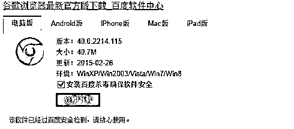
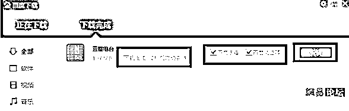
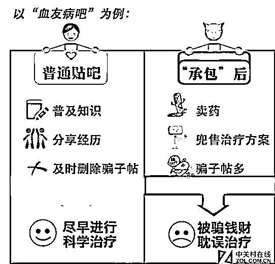
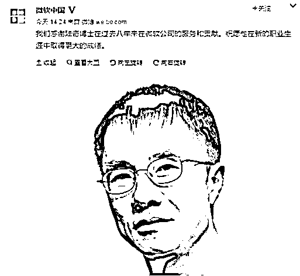
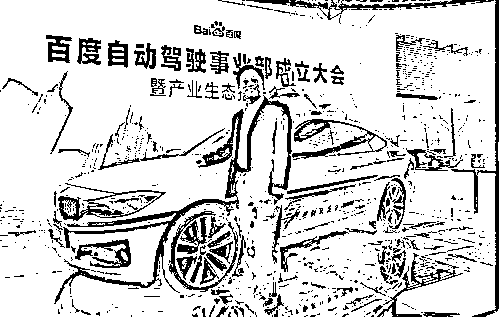
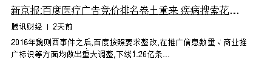
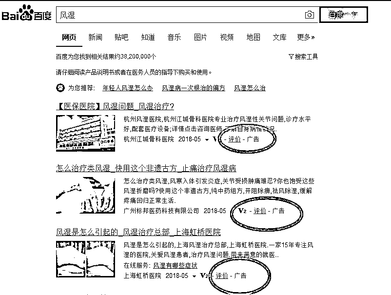

# 失去灵魂的百度还能撑几年？

紫竹张先生

每篇都有干货的财经公众号

近日来，关于陆奇从百度离职，导致百度股价暴跌 17%，市值损失近 900 亿人民币的消息非常引人注目，对于很多吃瓜群众来说，百度非常熟悉，陆奇是谁？今天我就给大家深扒一下百度和陆奇的来龙去脉。

01 百度的发家

首先回顾一下我们熟悉的百度，1999 年底，身在美国硅谷的李彦宏携搜索引擎专利技术，于 2000 年 1 月 1 日在中关村创建了百度公司。

百度拥有数万名研发工程师，使中国成为美国、俄罗斯、和韩国之外，全球仅有的 4 个拥有搜索引擎核心技术的国家之一。除了搜索引擎之外，百度还全面布局互联网流量业务，旗下知名的产品包括但不限于：百度地图、百度糯米、百度贴吧、百度百科、百度输入法、Hao123、百度杀毒等。

中国互联网四大巨头是 BATJ，也就是百度、阿里巴巴、腾讯、京东，为什么是 BATJ，而不是 ATJB，把百度排在第一个，这是有原因的，百度曾经是中国第一互联网公司，完全碾压阿里腾讯和京东，是当之无愧的老大。

而且，现在都流行以技工贸和贸工技来评判一家公司，那么可以说，在这四家公司里，最符合技工贸路线的，就是百度，因为百度是靠技术吃饭的，所以百度身上也承载了中国互联网技术革新先锋的使命。

而现在，当初那个只知道抄袭和买买买，怎么看怎么是贸工技路线的腾讯，开始慢慢的转向技术派了，无论是微信、公众号还是小程序，都是实打实的脑洞大开，技术革命，让微信成为了一种生活方式。而当初的技术专家百度，现在已经声名狼藉，市值甚至已经被京东超越，从 BATJ 之首，变成了吊车尾，这是为什么呢？

02 百度的衰落

一家企业，由盛而衰是有一个过程的，当一家企业处于全盛时期的时候，哪怕有一些负面消息，也难以掀起什么波澜，因为支持者多，反对者少。一家企业爆出问题之前，必定是有一个长期的衰退过程的，在这种过程中，他慢慢的丧失了用户的信任，大量的铁杆支持者慢慢的开始讨厌他，不再为他说话，最后当几个负面事件出现的时候，才会成为点燃火药桶的火星，直接引爆全局，这方面，联想就是一个活生生的例子。而百度，是第二个例子。

百度的衰弱原因是全方位的，但是最重要的一点，就是非常重视自己的商业利益，极其漠视用户的使用感受，很多百度的商业行为都可以体现这一中心指导思想，其中最典型的，当属臭名昭著的百度全家桶。

百度全家桶这个外号到底是什么意思，我给大家解释一下，所谓百度全家桶，是网友戏称百度流氓的行为，你在装百度某个软件的时候或者重装的时候可能会被捆绑上百度安全套件，包括百度卫士、百度杀毒、百度浏览器、爱奇艺等产品。你安装百度的任何产品，甚至你从百度上下别家公司的软件都要万分小心，他上面都会有个勾，只要你忘了取消，那么恭喜你，你的电脑上立刻会出现一堆乱七八糟的软件。。。

更过分的是，有些时候，他会自动安装，只给你 5 秒时间，5 秒内不取消勾选则自动默认安装，完全是在锻炼用户的手速。

还有更恐怖的，这些软件安装的过程中，会连锁推荐其他百度旗下的软件，如果你都不取消勾选，那么你的电脑上会瞬间出现十几个百度的各种程序。这事实在太破坏用户体验了，以至于外国媒体公开质疑百度到底是一款应用程序，还是一款病毒。

泰国媒体曾发布文章《百度是如何摧毁自己在泰国的品牌形象?》据泰国媒体声称，百度因强制捆绑、静默安装旗下 hao123 和 PC Faster 两款软件，无视用户利益，品牌形象尽毁。媒体称"百度捆绑其安全软件在知名下载网站的免费软件里面，一旦用户下载这些免费软件，就会不经过用户同意，自动安装上百度 PC faster，浏览器主页会被被窜改为 Hao123。并且，此前很多报道也表示即使在下载程序中没有点击安装，百度的产品还是会通过其他途径出现在电脑上。"

巴西媒体就更搞笑了，因为百度利用自己的技术优势，人为增大自家产品的卸载难度，增加卸载步骤，隐藏卸载图标，试图通过这种手段强制用户使用。所以巴西多家科技媒体曾经发表《学习如何从电脑卸载百度杀毒》，《学习如何卸载 hao123》，巴西媒体称：百度被称作"中国谷歌"，但是百度会采取非正当手段为用户强制安装软件，捆绑百度杀毒、百度旗下 hao123 浏览器以及百度 PC Faster 等产品，而更让人意外的是，这些产品一旦捆绑就无法卸载还会拖慢电脑速度，质疑百度产品是否实则为病毒。

这些外国媒体的报道让我们汗颜，而这种流氓行为登峰造极的时刻，是在 2014 年初，这一年，百度在国内推出了百度云 rom，又称为百度轻系统，这个听起来高大上的东西是干嘛用的呢，只要你脑抽点了他一下，他立刻把你的手机系统软件直接替换成百度的，然后给你自动安装一堆百度应用，一觉醒来，你的手机就变成了这个样子。

一家人躺的整整齐齐的，于是喜提称号“百度全家桶”，大量占用内存，各种推送通知，不断的死机、崩溃、重启。更过分的是，由于你安装了百度轻系统，你卸载这些百度软件非常的困难，他没收了卸载权限，有网友卸了 12 个小时都没卸载成功，不得不拿给维修人员直接重置整个底层系统。

这款百度轻系统，集流氓软件之大成，在推出的第一天就引爆了网络，成为了第一热搜关键词，引发了用户的极度反感和疯狂抗议，不得不紧急撤回，但是百度的形象已经没了，从这一天开始，百度全家桶正式成为了一个网络新词汇。

03 医疗竞价排名事件

长期的流氓软件行为慢慢的折损着用户的感情，2014 年的百度全家桶事件让百度的名声和群众基础衰弱到了极致，所以在 2016 年的魏则西事件和血友病吧事件中，百度遭遇了一边倒的指责。

2016 年 5 月 1 日，一篇题为《魏则西之死》的微信文章引爆了舆论热点。这名年仅 21 岁的小伙子，在 2 年前体检出滑膜肉瘤晚期，通过百度搜索找到武警北京总队第二医院，花费将近 20 万元医药费后，仍不治身亡。后被证实这是一家莆田系医院，医疗水准极差，之所以能登上百度搜索排行第一名，完全是因为塞给百度的钱多，百度实行的是搜索竞价排名制度，群众以为百度是靠医疗技术和患者口碑进行排序，排前面的一定是好医院，但是实际上百度是按照谁给的钱多来进行排序的，至于质量如何完全不予审查。

而在 2016 年，百度还做了另外一件事情，就是大量撤销原先为百度义务劳动的贴吧的吧主，把贴吧按照每个 30~200 万元的价格出售给承包商，而这些花钱买来吧主之位的人，上任的第一天就是狂发黑广告给自己谋利回本，卖游戏贴吧虽然龌龊了点，但是还可以理解，但是百度居然连医疗贴吧都敢卖。把卖贴吧这件事推上热搜的，是血友病贴吧被重金出售，然后整个贴吧被新吧主的莆田系广告给占领了，如果血友病患者在贴吧里寻求帮助，看到了这些广告，去了这些莆田系医院，只有一个后果，那就是散尽家财，不治身亡。在血友病原吧主把这件事捅到媒体上去的时候，人们才惊讶的发现，整个百度贴吧，近 40%的热门疾病吧已经被卖。

结合魏则西事件和血友病贴吧事件，百度被媒体称之为吃人血馒头，一代英名，在 14 年被磨损到只剩一条内裤，而在 16 年，则被直接扒光了。

04 陆奇来了

整个百度的商誉和用户信任已经跌到了谷底，在整个百度处于最黑暗的时候，陆奇来了，陆奇是何许人也？他是海外华人科技领域第一人，为何这么说，看看他的工作经历。

陆奇在国内恢复高考后，是第一批大学生，考上了复旦大学，拿到复旦的硕士学位后，成为国内去卡耐基大学读博的第一人。博士毕业之后，陆奇进入 IBM 工作，2 年之后转入雅虎，一路做到雅虎副总裁，负责当时的雅虎搜索引擎业务。

而当时的微软正在打造自己的搜索引擎 Bing，奈何人才不足，打造的产品一塌糊涂，于是微软 CEO 亲自邀请陆奇加入微软。陆奇加入之后，没有让微软失望，把 Bing 从一个无人问津的小应用，打造成了美国搜索引擎霸主之一，占据了 30%的市场份额，陆奇一路升迁为微软副总裁之位，这个位置可以说是海外华人目前在美国获得的最高职位了。

2016 年 9 月，陆奇从微软离职，离职的原因是因为骑车被严重摔伤，自行离职，也有小道消息说是争夺微软总裁之位失败，被迫离职。虽然真实原因不可考证，但是陆奇在微软地位声望非常之高，这是公认的事实。

这是国际互联网科技界出名的大将，更是搜索引擎公司的泰斗，这样的人加入任何公司，都是巨大的财富，所以陆奇刚从微软辞职，就接到了小米、京东等大公司的热烈邀请，均开出优厚条件。但是陆奇最后选择了处于低谷的百度，而百度李彦宏直接给予了陆奇百度的总裁兼首席运营官的职位，放手让陆奇管理整个百度公司。

陆奇上任之后，对百度进行了大刀阔斧的改革，该砍的砍，该卖的卖。什么百度外卖，91 无线之类的边缘业务直接卖掉，医疗竞价搜索这种人血馒头直接砍掉。他确立了百度未来的主航道：信息资讯和人工智能，把所有的资源全部投入到人工智能领域，我们今天看到的百度语音，百度自动驾驶，都是陆奇在位搞出来的，陆奇认为百度几乎没有拿得出手的科技产品来创造利润，全靠百度广告挣钱，这不像个高科技公司的样子。

陆奇的大方向无疑是非常明确的，做自动驾驶百度是国内第一人，也是紧跟外国最新方向，谷歌独立出来做自动驾驶的子公司都高达 700 亿美元的估值，而且还没到落地阶段，可想而知陆奇的野心有多大，如果陆奇成功，等于重造数个百度，这也可能是百度弯道超车再度回归互联网第一集团的机会。

05 陆奇的离开

而在陆奇在百度搞的热火朝天的时候，他突然宣布辞职了，至于辞职原因，小道消息满天飞，说内斗的有，说李彦宏小三宫斗的也有，但是陆奇自己宣布的官方原因是自己因为家庭缘故不能继续担任职务。

不管陆奇是什么原因辞职的，但是他辞职了，而辞职之后，百度的主方向，立刻从自动驾驶，人工智能，转回了老本行，整个百度现在已经无人提及陆奇树立的科研方向，而是改口称开始拥抱视频新时代。

同时，媒体发现，已经销声匿迹二年之久的医疗广告，再度出现在了百度搜索，人血馒头重出江湖。

也许这些医疗广告竞价排名能给百度挣很多钱，也许人工智能的研发会给百度增加很多负担，虽然我不太懂科技，但是我也知道，百度内部的这两种路线纠纷，完全雷同于联想和华为的贸易和技术之争，至于结果大家也看到了，也许联想辉煌了 10 年，或者 20 年，但是注定是被埋头研发的华为超越的，衰亡无非就是个时间问题，搜索广告竞价排名，把公司利益放于用户利益之上，看似给百度带来了很多利润，但是却是让百度逐渐走向死亡的慢性毒药。

百度控制着普通人接触信息时代的入口，却把路标指向邪恶欺骗的世界。失去灵魂的百度，我不知道他还能撑几年。

往期回顾（回复“目录”关键词可查看更多）

001 《为什么中国必须购买美国国债？》

002 《租房贷款会将房子拆分成房骨和房皮》

003 《中国自古以来就是一夫一妻制》

004 《宁波老虎事件遇难者不应该得到赔偿》

005 《中国的房价什么时候会崩盘？》

006 《中国地产达到什么样的条件会崩盘？》

007 《中等收入陷阱为何如此难以突破》

008 《如何把自家孩子培养成一个顶尖人才》

009 《我是如何保证自己不近视的》

