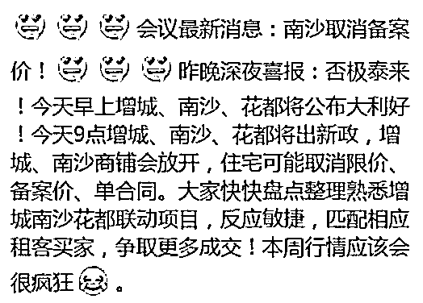
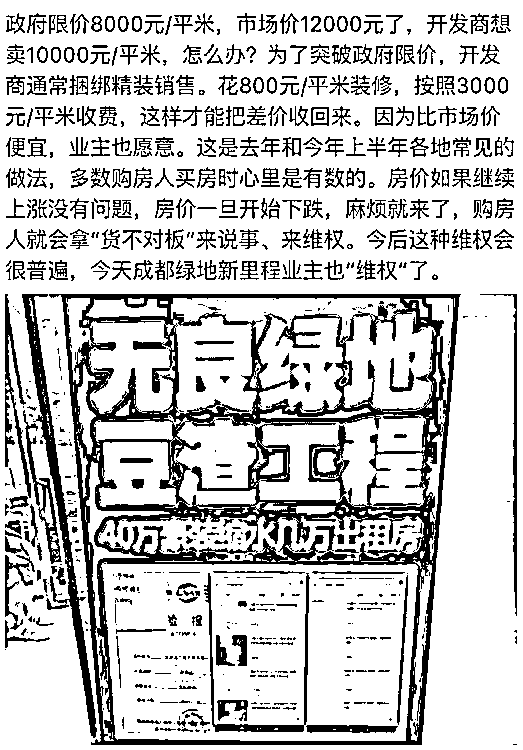
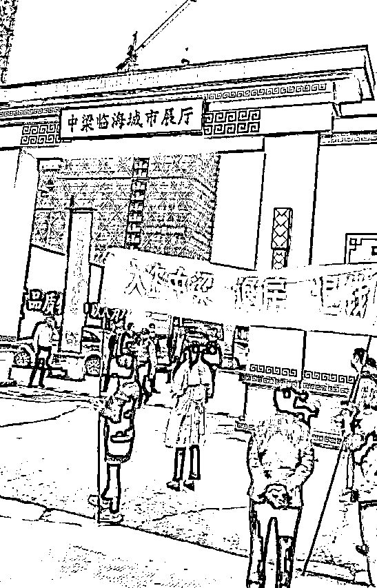

# 放开限价有毛用，又不是放开限贷

这几天，关于广州取消限价的新闻刷屏了，各大自媒体热议这是广州政府对中央底线的试探，是一种托房价的举措，还有人甚至直接说这是中央打算更改房价调控政策的前奏，总之他们就一个结论，广州放开限价等于**房价要涨了！**

舆论大热之下，连广州政府都被迫直接出来辟谣，直接否认自己要放开限价，其实广州政府根本不介意限价这个东西，他是介意媒体说广州有意松开调控，要避嫌，所以一口否认。

实际上，限价压根不会对楼市产生什么影响，大量的市民其实是把限价和限购限贷混为一谈，看到限这个字眼，就以为他们都一样，实际上他们的区别是很大的。我今天主要和大家说一说，限价、限购和限贷的区别，他们被取消分别会产生什么样的后果。

什么是限价

先说限价的定义，它的意思很简单，就是政府强制开发商新房开盘价不允许超过某一限定值，是在前几年的房价暴涨中，政府临时推出的一项举措。

限价这个东西最主要的作用就是降低新房成交价，即便是很多开发商用阴阳合同或者大幅提高装修价格等来变相涨价，也终归是涨不到自由定价的那种价格，所以才产生了一二手房倒挂，万人排队抢新房，买到就是赚到，买房插队需要五十万茶水费这种奇葩现象，本质上都是市场经济对套利洼地的一种填补而已。

政府为什么对新房进行限价，用这么原始粗暴的手段去干涉市场，其实还是因为房价涨的太猛了，已经超过政府的期望值了，下猛药怕出事，下小药又见效太慢，于是只好先吃点止疼药缓一下。

有没有作用呢，有的，而且作用很大！我们这几天看到了很多打砸售楼处的新闻了，注意他们打砸的是售楼处，也就是开发商销售新房的地方，而不是二手房中介，有很多还是在采取了限价的城市发生的，这说明现在的市场价已经跌破他们新房的实际成交价很远了，如果当初没有执行限价，现在北上广早就乱成一锅粥了，到处是退房示威的人群。

当初限价越猛的城市，现在应对退房维权潮越轻松，越是限价不利的城市，越是头疼，例如当初很多开发商偷偷的搞所谓精装修，成本 1000 的东西卖到 5000~10000 元每平米，很多业主心知肚明这是怎么回事，但是为了抢到房子已经顾不得了，因为即便是装修加价，他还是比二手房便宜。

但是等楼市退潮之后，这些业主不干了，拿装修出来说事要求退房，那些以为耍小聪明就能多赚一笔钱的开发商开始自吞苦果，那些管控不力的城市开始承受维稳压力。

如果不涨价，开发商只能卖 1 万每平米，现在翻了倍可以卖 2 万，但是政府限价 1.3 万，开发商不会认为自己赚了 3 千，而是会认为自己少赚了 7 千，会想法设法找补回一点，怎么也得搞个 6 千利润。所以要么是精装修弄一笔钱回来，要么是减料减配弄一笔钱回来，吃定了涨价过程中业主都能接受，不愿意退房，所以这些都不是问题。

但是等开始降价之后，这些原本不会成为问题地方全是问题，各种退房理由千千万万，因为当初老老实实完全执行限价且完全合法合规经营的开发商几乎没有，总能找到理由退房的。

所以，限价是很有作用的，但是只是在房价暴涨的时候起作用，现在很多城市的一二手房倒挂现象已经消失，新房开盘几无认筹，限价这个政策已经名存实亡，是否取消，毫无影响。

什么是限购

那么相对而言，政策调控三板斧里面的第二斧，限购，相对而言还有点用，不过用处并不大。什么叫限购，限购的意思就是不允许外地人买房，或者符合某种条件可以买一套，本地人只允许买二套等等。

总之，不管限购政策是怎么规定的，他的核心含义就是给买房设置门槛，只允许你购买一定数量的房产。

这个政策能不能遏制房价的上涨呢，能，而且立竿见影，取消他能否带来房价的上涨呢，能，而且也立竿见影。但是这都是仅仅只针对一个城市而言的，对全国总盘子毫无作用。

因为限购政策的本质，是把资金从某个城市赶走，赶到了其他城市。例如北京限购之后，北京房价的确不涨了，但是你只是北京限购，不是全国限购，资金马上会去购买天津、合肥、杭州等二线城市房产，如果这些城市也限购了，那么就会去买那些三线城市的房产。

北京、天津、合肥、杭州、成都等几十个城市，每个城市各来一套房子，这是完全做的到的，一点都不违反限购原则。某个城市限购，只是把资金赶走，赶到其他城市去，仅此而已，这些购房资金始终存在。这也就是北上广深等一线城市限购之后，二线立刻暴涨，二线限购之后，三线立刻暴涨的原因所在。

所以，限购政策会立刻对本城市的房价造成重大影响，但是对于全国房价总盘子而言，毫无影响，因为购房资金的总量是不变的。

看清楚限购的本质，你就知道限购的作用了，现阶段执行限购的城市，因其实际需求是被抑制，客观上是在被不限购的城市吸血，“肥”水东引，所以其泡沫程度会小很多，炸裂之后的危害，也远小于那些不限购的城市。

除非是全国联网，连县城房产都算进去，统一限购，否则某城市放开限购，的确会导致本市的房价迅速上升，但是同时会导致周边城市的房价下跌，互相抵消，如果全国所有城市均取消限购，那么和没取消限购之前的房价会一模一样。

什么是限贷

调控三板斧里面，唯一能动摇房价根基的，就是限贷，如果是限价是止疼药，限购是治标不治本的话，那么限贷，就是那个能除根的调控良药，不过因为药效太猛，所以政府一直慎重使用。

限贷分两重含义，第一重含义是限制银行住房贷款总量，从央行的源头强制某银行今年只能放出去多少多少房贷，也就是所谓的房贷额度进行限制。第二重含义，是直接增加房贷利率，增大房贷成本。

直接限制房贷总量，能从根源上断绝房价上涨的动力，我们都知道，购房资金大部分都来源于银行，实际首付只有 20~30%意味着动辄 1 比 3 甚至 1 比 5 的高杠杆，也意味着 70~80%的购房资金都来自银行。

所以本质上，房价是银行资金抬上去的，我曾经说过，房价=购房货币量/住宅供应量，这个购房货币量里，70%来自于银行。那么你说，当房屋贷款总量被限额的时候，会不会对房价产生影响？

所以，对银行房贷总量进行限额，会立竿见影的让房价上涨丧失动力，我不管你是在北京买还是在南京买，还是跑到乌鲁木齐去买，只要你买房，就要用资金，这些资金哪怕表面上是全款，绕来绕去其实都离不开银行，把银行的总阀门关掉，随便你跑哪个城市去买都会受到影响，这是釜底抽薪的办法，威慑力和作用远远超过限购。

如果说房贷总额进行限制能直接抑制房价的话，那么增大房贷利率，则能够直接降低房产投机的热度。

投机者买房，看的是涨幅，压根不是为了自住，甚至都懒得出租，如果房产平均每年上涨 15%的话，他们以 5%的成本贷款，年化收益就是 10%左右。而如果他们投向实体经济，每年盈利 10%的话，扣掉 5%的成本只有 5%的年化收益。

而实际上在资本市场，你的年化收益能多 1%，都会引来疯狂的资金追捧，直到填平这个 1%的差距为止。这里指的是扣除风险溢价后的无风险收益，但是过去 20 年里，实体经济的投资风险都反而大于房地产，所以资金疯狂的追捧房地产，直到把房地产的投资风险堆的高高的，用风险溢价来填平这个投资收益的差距，才会降低资金流入的速度。

增大房贷的成本，就是在降低炒房者的年化收益，会严重抑制房价泡沫，如果能像美国那样提升个 3~4%的房贷利率，则会直截了当的刺破泡沫。

增大房贷利率，降低实体经济税负，会直接影响资本市场的投资收益预期，资金才有可能进入实体经济，这是一个根本性的扭转。

这就是房贷利率的作用，我个人认为，他是所有调控政策里，最直指核心的一条，其作用也是最大，大家可以看看历史，**当房贷利率上浮的时候，房价很快就会进入下行趋势，没有例外，次次见效**。

怎么判断调控政策

那么，我们应该怎么判断中央对于房价调控政策的松紧程度呢，其实很简单，**紧盯住房贷款**。

从控制房价而不是维持社会稳定的角度考虑，当房价暴涨的时候，限价有用吗？有毛用。限购有用吗？有点用，但是不过是“肥”水东引导致其他城市暴涨而已，总体是没用的。限贷有用吗？有用，而且非常有用。

所以在上涨过程中，我们什么都不用看，只看限贷就可以了，限制银行贷款总量，能抑制房价上涨，**增大房贷利率成本，能直接导致房价下行**。

反过来，当房价下行的时候，松开限价有用吗？有毛用。松开限购有用吗？有点用，但是不过是“肥”水东吸而已，自家城市楼市获得了资金，周边城市开始失血，总体是没用的。

那么什么是有用的，政府松开银行房贷总量，再次放水就有用，具体的表现有两个，**第一个是首付比例下降为 2 成，第二个是房贷利率再次 9 折或者 85 折**。

这是赤裸裸的给房地产注水啊，不涨才见鬼了，**这才是调控终结，房地产逆势的标志**，至于那个什么限价，一边凉快去吧，放开限价有毛用，又不是放开限贷。