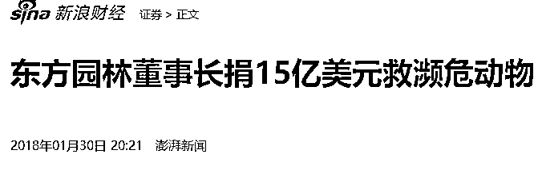
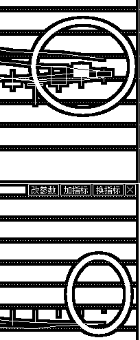
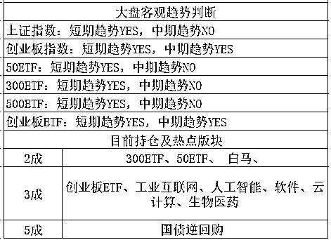

# 一家国外捐款，国内借钱的上市公司

紫竹张先生

每篇都有干货的财经公众号

今天 A 股出现一个大新闻，东方园林上了头条，为什么呢。因为东方园林获批了 10 亿公司债，但是这家 PPP 明星公司（002310）今天却公告说，实际发行仅 0.5 亿元，其余 9.5 亿发不出去，无人认购。

东方园林的债权可是 AA 级债权啊，仅次于国债 AAA 级，年化 7%，这么好的债券居然发不出去？说明公司肯定出了巨大的问题，被机构严重的不看好，所以这家公司的股票今天盘中差点被砸跌停。

除此之外，股民更愤怒的是，东方园林的董事长在 2017 年 10 月份宣布海外捐款 15 亿美金拯救濒危野生动物，国内在 18 年 1 月份进行了广泛报道。

刚对海外进行了 15 亿美金，折合 100 亿人民币的捐款，这边就对国内进行 10 亿人民币的借款，这逻辑是不是很矛盾啊，7%的利率借给自家公司行不行，为什么非要捐到海外去。如果你说公司完全不缺钱，那么还没半年呢就发行 10 亿债券是什么意思。

莫非你当我们傻？

可惜机构不傻，所以无人愿意认购东方园林的债券，股民也不傻，看到势头不对赶紧抛售，盘中差点砸跌停。

无论如何，国外捐款，国内借钱，这逻辑无法说服我，估计也无法说服任何人。

~~~

周末爆出贸易战终止的消息之后，我直接就判断，周五尾盘我卖亏了，周一注定高开，因为这属于重大利好。

不过幸好，我只减了 1 成，持仓从 7 成减到了 6 成，依然属于重仓，而且是 3190 之上减的上证指数，创业板我丝毫没动，只有上涨，我才会卖，不涨我绝对不卖，无非是赚小肉和大肉的，我的逻辑很明确，5 月很安全，阳多阴少，阳肥阴瘦，下跌不用怕，不涨就不卖。

而今天，创业板全天拉高，再度冲击 1866 压力位，按照昨天的计划，我在 1866 这里再度减掉了 1 成，持仓降低到了 5 成，创业减仓属于妥妥的收肉，最近几个月肉都是从创业板来的，对创业板好感无限多，上证我就是当压舱石用的，扶不上墙啊。

今天创业板冲击 1866 后再度回落，但是回落的很浅，这个走势怎么评判呢，评判是很强。

这个图我都贴了 N 次了，是创业板的月 K 图，1866 是图中紫线的位置，压力非常强大，而今天是 5 月 21 日，濒临 5 月收尾，如果本周能站稳 1866，那很快就是一骑绝尘，如果本周站不稳，只要回落的很浅，那么 20 月线也是注定被突破的。

所以，在 1866 这里，我先减 1 成，回收一点子弹，一旦突破 1866，那么 1900 根本不在话下，必破无疑，剩下的就是 1946 左右了，也就是说，只要 1866 被突破，上涨 80 个点左右我才会考虑第二次高抛，看的非常之远，我个人认为，创业板这一波是完全有希望冲击 2000 点的。冲破 1900 是大概率，冲破 1946 概率较大，冲破 2000 点有一点概率，大家好好体会里面的语境，反正 2000 附近的话，我是随时打算跑路的。

这次在 1866 减仓 1 成，是因为仓位太重，18 年美国加息大背景下，也就是 4 月跌那么惨我才敢重仓，5 月的话，随着价格的上涨和时间的推移，逐渐减仓是我的大方向，我绝不追求卖在最高点，分批收肉，有的赚就好，这是我的大计划。

所以，我今天只剩 5 成啦，下一步，上证 3246-3256 我会再次出售 1 成，至于创业板就比较遥远了，1946-1956 附近才会考虑，要么攻不破 1866，回调之后蓄势再冲。如果破了就会一口气打破 1900 再向上冲，所以这个位置是比较恰当的。

顺便做个预警，随着价格的持续上涨，上证的中期趋势快转 YES 了，但是我在持续减仓。额，这个提前给大家打个预防针，让大家知道我为什么加，为什么减，我是按照另外一套逻辑准备的，如果过几天转了 YES 指标，我会适当考虑上移减仓位，因为他的确具备参考价值。

