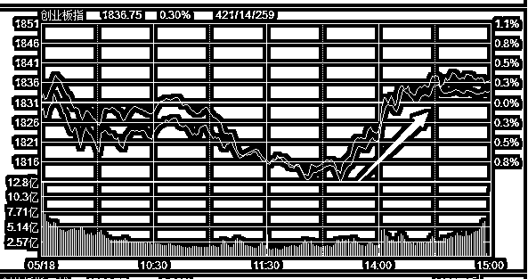
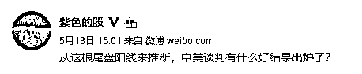
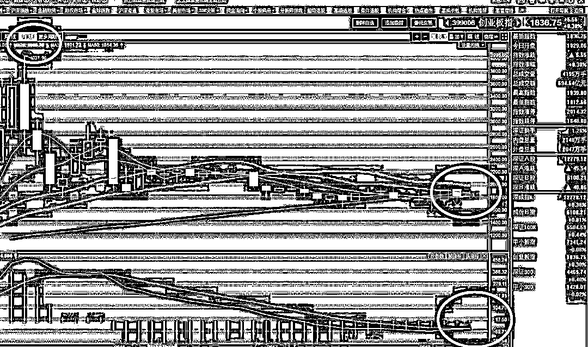
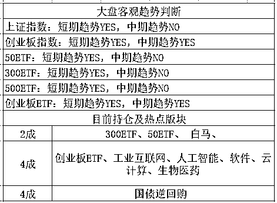

# 周五尾盘卖亏了。。。

紫竹张先生

每篇都有干货的财经公众号

周五的时候，全天萎靡，尤其是创业板，盘中一度下跌 1%，结合前二天的阴线，其实累计下跌幅度已然不少了，盘中击破 20 日均线且整体多空能量开始有多转空的趋势，非常的难看。

秉承看多 5 月的态度，我并没有恐慌，而是非常淡定，因为中美贸易谈判的缘故，市场产生暂时的避险情绪是正常的，谁也不知道是不是又要打贸易战了，但是 4 月的时候连续黑天鹅都没能把创业板给打垮，如今最差也就是再出一只黑天鹅呗，还能怎么样，所以淡定。

但是到了下午 1 点 40 的时候，一股力量突然出现，拼命买进，指数翻红不说，收盘还小阳线，全天红盘的上证指数更是收出了 1.24%的阳 K，收盘于 3193，突破 60 日均线。

尾盘的拉升是莫名其妙的，这是周五啊，晚上不知道又要出啥 IPO 幺蛾子呢，美国那边还在谈判，资金不避险了，真奇怪。我当时就猜测，估计是美国那边可能出什么好消息了，否则不会这么走。

猜测归猜测，由于上证指数达到了周四计划的位置，我还是减仓了 1 成，收盘持仓 6 成，因为计划已经制定了，那就要执行嘛。不过本周末，正式公告出来了，中美贸易战不打了，达成了和谈的纲领性文件，在这么大的利好下，周一注定高开，周五收盘很明显卖亏了。。。

不过我并不后悔，因为炒股就是讲概率，周五尾盘莫名其妙的拉升我也只是猜测是贸易战会出好消息，但是并没有 100%的把握，猜这个东西并不能拿来当实战的，尤其是盘中突发消息引起的走势异动。

再其次，我对上证指数的仓位是拿来压舱石的，从 3 月拿到现在，所有的利润都是创业板身上抄底挣来的，上证就躺在那一动不动，就算按照 3200-3300 分批出货完毕了，还是小亏，我对上证印象比较差，并不打算主要做他。

所以，在 5 月快结束之前，先出一点货，总是没错的，后面继续涨就继续出，要是跌下来，我再买回来不是更好，对于上证我的态度就是压舱石，配点仓位调节奏用的。

那么还有没有一种可能，5 月上涨，6 月继续上涨，涨个没完没了。憋逗我了，俗话说五穷六绝七翻身，虽然股市不可能那么简单的描述走势，但是 5 月我重仓看多已经属于很冒险了，你要说把五穷六绝改成五月六月大涨特涨，我觉得这个难度不是一般的大吧，属于 SSS 级的难度。

所以，5 月和 6 月，涨一波就跑，胜率应该是比死看多的人要高的。而下一步，我们把上证的高抛定在 3246 附近。创业板则定在 1860-1866 区域，也是出 1 成。

值得注意的是创业板 1866 这个压力位，前期已经试探过一次被打落，这里如果再次突破失败，则要拖入 6 月了，我们择机低吸即可。如果突破成功，会猛拉一波，我们会把第二次高抛的位置定的很高。总的来说，我倾向于重点操作创业板，首先连续几个月高抛低吸赚的很舒服，其次，从月线看，创业板的走势好看很多。

周五还发布了 IPO，60 亿元，2 家，其中包含宁德时代，又一个独角兽来了，不知道是发审委命好还是胆子大，富士康的发行，和宁德时代的发行，周末都夹杂着贸易战和解的利好，市场都给消化掉了，这运气杠杠滴。

