# 96-01 年的牛市与 15 年牛市对比（上）---下一个牛市在哪里？

**本文转自公众号：只会炒股。一个靠炒股养家的职业投资人的炒股笔记**

从以往的历史经验来看，大部分牛市都是因为经济复苏而生，因为政策收紧利率上行而死。但我们 15 年这一轮牛市却在经济疲弱、盈利下滑的环境下形成了，这注定了他不是一次典型的常规牛市。

因此我们也应该从历史上去寻找那些不同寻常的案例——96-01 年的中国牛市是我们现在比较下来和 15 年最相似的牛市。因此当时这轮牛市从开始到结束的时代背景和经验教训值得我们好好学习:

 **一、96 年进入牛市前的三年熊市背景**

 **1、92-93 年过度投资引发“恶性通胀”。**92 年邓小平南巡讲话之后，全国各地密集展开固定资产投资，92-94 年投资增速保持在 60%上下。然而过度投资带来了恶性通胀，92 年以来 CPI 水平大幅上升，94 年 11 月 CPI 已飙升至 27.5%。

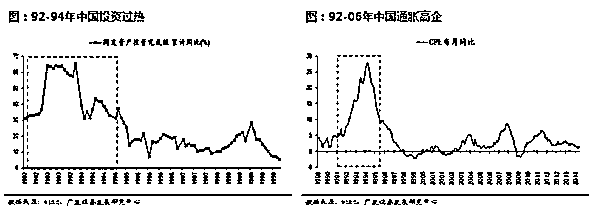

**2、“恶性通胀”促发货币政策收紧，93-95 年股市进入三年熊市。**93 年 7 月为抑制高通胀央行开始实施紧缩政策，93-95 年三次加息，对股市形成持续压制—— A 股从 93 年 2 月的 1499 点下跌至 96 年 1 月牛市启动前的 525 点，3 年熊市下跌 65%。

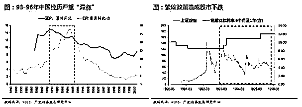

**二、96 年牛市启动时，市场环境发生了什么变化？**

 **1、宏观背景——通胀已大幅回落，经济增长下台阶。**在三次加息、持续紧缩的货币政策压制下，1996 年的 CPI 已从 27%回落至 8%；96 年以后，经济数据相比前期明显下台阶。

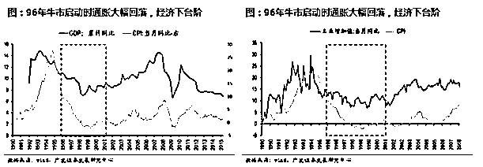

**2、货币政策和财政政策——从紧缩转向宽松。**迫于经济下行压力，96 年 4 月央行重启降息操作，货币政策宽松的通道正式打开，利率开始下行（在 96-01 年整个牛市期间内，央行共 7 次降息、2 次降准）。此外国家还配合实施了积极的财政政策，通过加速发行国债用于基建投资。 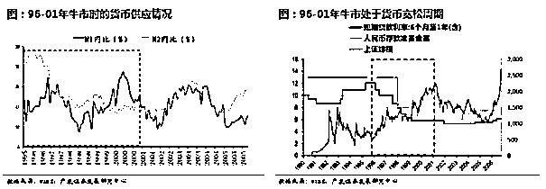

**3、改革深化——97 年第一轮国企改革启动、98 年实施住房体制改革。**1997 年 7 月启动了国企“三年脱困”改革，实施“抓大放小”，鼓励企业兼并重组，积极推进国企“债转股”。1998 年 7 月，国务院发布《关于进一步深化城镇住房制度改革加快住房建设的通知》，全面停止住房实物分配，实行住房分配货币化，第二年央行放开住房按揭贷款业务，中国地产市场被全面激活。 

**4、股市流动性充裕——实体经济对资金的需求下降，保值贴补率取消引导居民“存款搬家”。**随着实体经济的回落，企业对资金的需求开始下降，贷款增速自高位回落。此外，由于通胀持续回落，自 95 年 12 月起央行接连下调了存款保值补贴率，并在 96 年 4 月 1 日宣布取消办理新的保值业务，这直接导致 96 年后居民存款增速出现大幅回落，“存款搬家”进入股市。

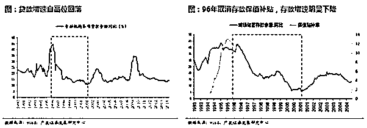

**三、96-01 年“胡萝卜与大棒”式的股市监管政策**

**整个牛市经历了“救市、打压、再救市、再打压”四个阶段——**

95-96 年 9 月第一次救市：当时的中共中央十四届五中全会明确提出“积极稳妥发展债券和股票融资”，上交所还下调了股票基金的交易手续费；

96 年 10-12 月第一次打压：随着股市暴涨，股市监管转向高压，出台了著名的“十二道金牌”，造成股市短期的剧烈回调；

99 年第二次救市：97 年下半年以后 A 股受亚洲金融危机拖累走弱，因此从 99 年开始监管层再次“救市”，当时证监会向国务院提出了六项刺激股市的政策建议获得批准，人民日报也在头版头条刊登鼓励股市发展的文章，监管层对股市的“呵护”直接促发了“5.19”行情；

2000 年下半年后第二次打压：2000 年后期，《财经》杂志刊登揭露文章《基金黑幕》引起社会强烈反响，随后证监会暂停了近两年的新基金发行和新基金公司成立申请，斩断了机构资金入市的渠道；2001 年 6 月发布的《减持国有股充实社保方案》引发股民对股市“抽水”的恐慌，直接压垮牛市。

**四、96-01 年牛市的市场节奏、风格与行业特征**

**1、市场节奏——历经“上涨-停歇-上涨”3 个阶段。**当时的牛市在 1997 年 5 月至 1999 年 5 月被中断——受亚洲金融危机影响，上证综指下跌 28%，但相比亚太其他国家的股市，A 股跌幅相对较小一些。 

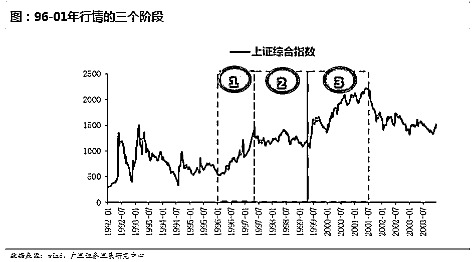

**2、风格特征——小盘股几乎持续跑赢大盘股。**由于我们没有当时的大小盘指数，因此采用每年初总市值前 30%的股票作为大盘股样本，以每年初总市值后 30%的股票作为小盘股样本，追溯了 90 年代牛市期间的大小盘股票的表现。**下图可以看出，在 96-01 年牛市期间，小盘股持续跑赢大盘股，几乎没有明显的风格转换。** 

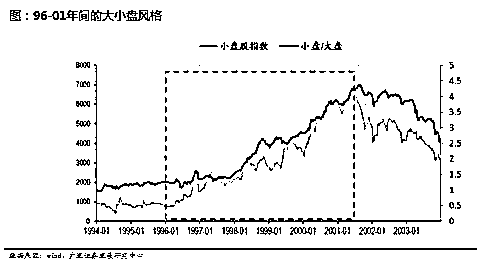

**3、行业特征——地产股是绝对龙头。**由于 96 年以前 A 股只有 280 家上市公司，因此行业代表性还不强，而涨幅在 5 倍以上的公司，大部分都是地产股。 

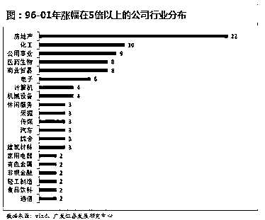

  **五、01 年牛市结束时，市场环境发生了什么变化？**

**1、经济转向复苏，但通胀仍在低位，货币政策也未见收紧信号。**2000 年以后，经济转向复苏，由于通胀水平仍然较低，因此货币政策仍在宽松的进程中。

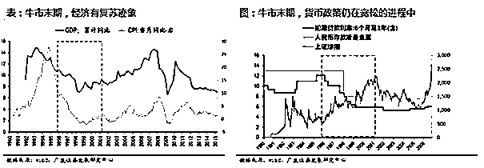

**2、当时牛市结束的特征具有非典型性。**一般牛市都是在经济过热阶段结束的，因为通胀上行会引发货币政策收紧，但 96-01 年的牛市在通胀低位且货币宽松仍处周期中就结束了，具有非典型性。

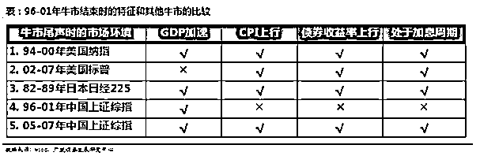

**牛市结束的原因（1）——监管层对股市的态度转向负面。**2000 年 10 月《基金黑幕》发布后，01-02 年新基金发行暂停；2001 年 6 月，《减持国有股充实社保方案》出台，引发股市“抽水”的担忧；2001 年 10 月 22 日，证监会宣布暂停国有股减持办法，但股指仅反弹 2 天后再次步入“漫漫熊途”。

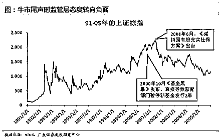

**牛市结束的原因（2）——股权融资规模大幅扩张。**2000 年的股权融资规模为 1590 亿元，是当时 A 股历史上的最高峰。而当年信贷融资规模为 5636 亿元，因此股权融资比信贷融资的比例接近 0.3，为至今的最高水平。

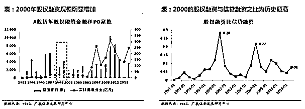

**牛市结束的原因（3）——实业投资的热潮在持续分流股市的资金。**2001 年以后，在地产和出口同时改善的刺激下，中国经济不断加速，实体企业 ROE 也随之不断上升，并通过加杠杆的形式大幅扩张资本开支，资金从股市流向实体，对股市流动性形成了压力。 

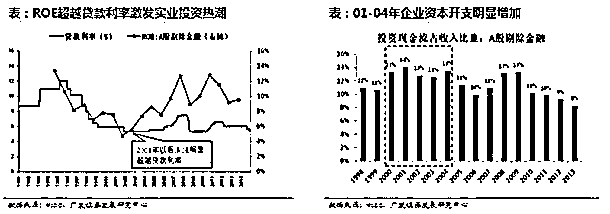

**六、96-01 年牛市给当前市场的四点启示** 

**启示一：经济复苏不一定是牛市的必然条件，甚至可能成为牛市终结的原因。**96-01 年牛市是先见“股市底”，再见“政策底”，最后见“经济底”。而经济见底回升后，股市反而进入熊市，因为实业投资热潮分流了股市的资金。A 股本轮牛市也是先见“股市底”，再见“政策底”，经济何时见底现在还不得而知。

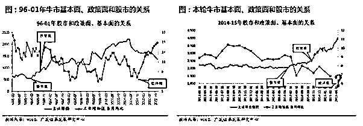

**启示二：牛市中能够实现“泡沫化”的公司并不在于其市值大小，而在于其所属产业是否最贴合当时的大时代背景。**现在大家对 2007 年“530”记忆犹新，很多人在猜想这轮牛市最后会以大盘股的“泡沫化”结束吗？但回顾 96-01 年牛市，当时小盘股又是持续强于大盘股的，并没有发生风格转换。我们认为，其实每一轮牛市中，真正能够“泡沫化”的股票，往往因为其所处行业迎合了当时的大时代背景——**2007 年“泡沫化”的大盘股，如煤炭、有色、机械等行业，刚好是当时中国最好的成长性行业，而 1996-2001 年中国最好的成长性行业是地产，而大部分地产股在当时是小盘股。**

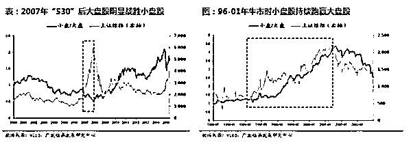

 从下表我们可以看出，海外也有同样的案例（美国、日本）。本轮牛市中，符合大时代背景的行业应该来自于中国产业政策扶持的重点方向——“互联网+”、“中国制造 2025”、“绿色化”。

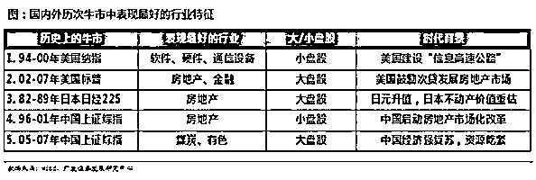

**启示三：在盈利和估值因素以外，股市自身的供求关系变化也是影响趋势的重要因素。**96-01 年牛市的终结，与牛市后期供需关系的失衡也有一定关系——当时股票供给放量（2000 年股权融资规模明显增加；01 年 6 月出台国有股减持充实社保方案），而需求又不足（2000 年底证监会暂停了近 2 年的新基金发行审批；01 年后实业投资热潮分流了股市资金）

**启示四：要适应“胡萝卜与大棒”式的股市监管政策，不可能是持续高压或者持续放松；一般的股市监管政策变化很难改变牛市的趋势，但要当心那些可能改变股市供需关系的政策出台。**96-01 年牛市中，股市刺激政策与高压政策的交织贯穿始终，因为对监管层来说，始终是希望“慢牛”，但不希望暴涨暴跌——如果监管高压导致股市暴跌，往往会“否极泰来”，会有对冲性的利好政策出台；而如果监管放松引致股市暴涨，又可能“乐极生悲”，带来再次的监管收紧。从 96-01 年牛市的经验可以看出，一般的股市监管政策变化很难改变牛市的趋势，但要当心那些可能改变股市供需关系的政策出台——2000 年底证监会暂停新基金发行审批，以及 2001 年的国有股减持充实社保方案就对市场形成了致命的打击。

**其实这些特点在 15 年的背景中非常相似，只是 15 年的杠杆牛市远远超出并冲击了管理层的想像，下一篇我们讲解 15 年股市的方方面面，如何从技术形态来提前感知牛市的到来以及下一个牛市将会在哪里。**

（作者：只会炒股，职业股民。历经 15 年股灾走出来的短线复利高手，擅长做妖股，连扳股票。善于把握市场情绪，打板、低吸、追涨、均是手到擒来。用超短的手法来获取股市的暴利。人气决定标的、情绪决定买卖。心有大格局，才有大未来！跟我一起去找人气最旺的妖股，见证账户翻倍的快感。）

