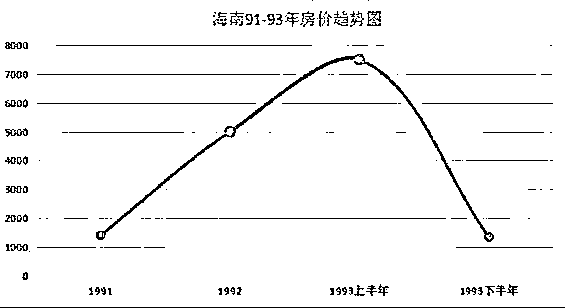
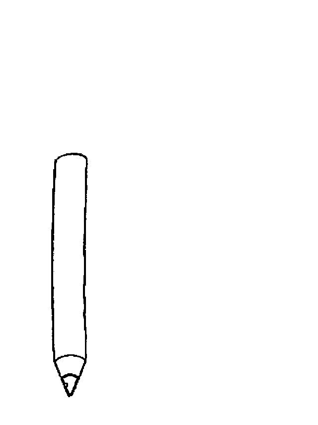
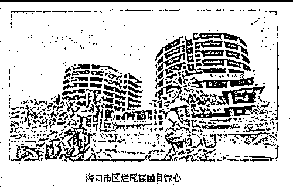

# 烂尾楼无人愿意出资接盘，最后宁愿让政府爆破的原因是什么|紫竹张先生

喜欢我的都关注我了~

烂尾楼，并不是一个新鲜的词汇，不过近日刚拆除的一个烂尾楼还是把很多人震撼到了，我今天就顺便说一下烂尾楼的形成原因和未来中国人会因此受到的影响。

视频里爆破的这个烂尾楼，位于哈尔滨，资料称始建于 1993 年，楼房高 87 米，地上 23 层，地下 1 层，共计 24 层。之所以让人震撼也是因为他烂尾的时间之长，以及设计之豪华。要知道这房子是在 1993 年啊，那个时候地上 23 层地下 1 层的大楼放到北京都是有头有脸的大佬。

1993 年的时候，中国的房地产市场刚刚起步，没有地产大佬，都是小虾米。可以说，当年建造这个楼盘的开发商如果能活到今天，一定是超级大佬级别的人物。

但是很可惜，他没有熬过去，其始建时间和死亡时间和海南地产泡沫炸裂时间表高度雷同，我估计必然有千丝万缕的关系。

但是这个并不重要，25 年前的事情已经和今天太遥远了，大家也不关心，这个视频新闻下面大家疑问最多的就是，这么好的大楼为什么政府直接炸掉，这不是浪费民脂民膏吗？为什么不出点钱修一修，这个楼就可以直接用了，多节约。

烂尾楼没你想的那么简单

很多人印象中的烂尾楼，是一个产权清晰无负债的房子，只不过是因为开发商暂时手里没钱了，所以没有进行最后的外立面装修、通水通电工作，所以只要政府随便出点钱，甚至自己掏点钱出来把收尾工程做了，这房子就可以卖了，然后就能赚大钱。直接炸了多可惜啊，下令爆破的人脑子有问题吧。

围观吃瓜群众之所以这么想，是因为他们根本没接触过工程，也不知道烂尾楼的复杂程度，如果真的是像他们想的那个样子，那哪里会成为烂尾楼啊，随便去哪个银行都会给钱的，这点小钱谁出不起，银行可不傻。

但是实际上，能成为烂尾楼的房子，他一定后面跟着一屁股烂账，有些楼盘甚至都已经装修完毕通水通电了，花几十万就能彻底收尾，依然是烂尾楼，施工方封锁工地，禁止所有人进行最后的收尾工作。

为什么会这样呢，因为任何开发商都不会允许资金链断裂，会尽一切可能拖延时间熬到转机之日来临，能想到的找钱办法，他都会去尝试，他会抵押一切可以抵押的东西，甚至不惜以违法违规的手段反复抵押，重复抵押，用类似欺诈的手段骗取资金。

只要他能活下来，项目做成了，这都不是事，如果做不成，反正也是死。所以烂尾楼的一大特征就是债务极多，且债权结构极为复杂，同一个房产，甚至会因为重复抵押被银行冻结十余次。

肉只要一块，要吃肉的人却有十几个，你说这肉该怎么分，一旦彻底完工瞬间就会引发抢房事件，所以哪怕还差一万块钱这个楼盘就会完工，他也永远完不了工。这根本不是工程问题，是一个债权问题。

刚才说过，这个大楼始建于 1993 年，是当年的超豪华楼盘，开发商一定很有实力和关系。而自 1993 年海南楼市泡沫崩盘，烂尾楼成为和天涯海角并列的第三大景观之后，中国楼市陷入了超级熊市。

到 1995 年底，全国商品房累计空置建筑面积高达 5031 万平方米，这是一个在当年让人绝望的数据。

1997 年亚洲金融危机爆发，中国房地产行业濒临崩溃。

1998 年 7 月 3 日，政府开始对房地产行业救市，宣布全面终止福利分房，强制民众购买房产。

1998 年底，房地产市场大热，全国存量空置房被一抢而空，然后开启了中国地产 20 年的大牛市。

从这个时间轴可以看出，哈尔滨的这个楼盘，要熬到 1999 年才算熬出头，而 1997 年更是一个生死劫。从这个楼盘烂尾到今天都无人接盘的情况来看，这个开发商当年一定是极具实力，用各种合法或者非法的手段给自己续命，借贷了大笔资金，可能熬到 1997 年才挂掉。

由于债务关系过多，债务总量过大，所以一拖再拖始终烂尾，如果 90 年代这个开发商实力不强，死的利索一点，说不定还不会烂尾这么久。

别以为烂尾楼对你没威胁

从 1998 年开始，中国地产始终处于大牛市，单边上涨，偶尔回调，所以除了像鄂尔多斯这样的特例，绝大多数的中国人都对烂尾楼没有什么感触。

实际上，在这 20 年里，中国产生的烂尾楼多如牛毛，因为乱用杠杆死去的小开发商可以填满黄浦江。而烂尾楼产生的最核心原因我上面也说了，那就是开发商拿了本不属于自己的钱，这个钱要么是借贷产生的，要么就是预售产生的。

按理说烂尾楼产生之后，已经支付房款的业主利益会严重受损，那为什么我又说绝大多数中国人对烂尾楼没有什么太大的感触呢。

那是因为，这 20 年里，房价一直在涨涨涨，涨价可以解决一切矛盾和问题。假设某烂尾楼盘价值 1 个亿，开发商欠债 3 个亿，中间有 2 亿的窟窿无人愿意填坑，导致烂尾楼问题始终无人处理。

这个一亿的窟窿怎么解决？没办法解决，死结、无解。但是只要房价涨了，一切都好说，房价翻一倍，楼盘就价值 2 个亿，再翻一倍，就价值 4 个亿。原来是 2 亿的窟窿，现在是 1 亿的利润，这个时候就会有人愿意来接手了，谁接手谁赚钱。很多烂尾楼都是这么被消化的，大家皆大欢喜。

所以，初始阶段开发商欠债越少，烂尾楼消化的越容易，欠债幅度在 2 倍以内的，一次翻倍暴涨行情，就全部解决了。

也正是因为这个原因，我才对哈尔滨那个烂尾楼敬佩不已，从 90 年代初期开始算，房价涨了 20 倍都不止了，结果他居然还是烂尾，说明涨价的利润空间至今都没有填平当年的大窟窿。这个开发商当年到底是融资借贷了多少钱啊，就冲这份融资能力，他是当之无愧的大佬，如果他的借钱能力不是这么强，也不会烂尾如此之久，海南的那些小开发商弄的烂尾楼，早就都被人接盘了。

商业住宅土地的使用年限只有 40 年，他动工都 25 年了，原来的建筑材料也都过时老化了，上面的建筑可能还没脚底下土地的零头值钱，所以政府干脆就把他给炸了，重新规划土地，改成住宅的话，说不定还能解决他的烂尾问题，毕竟 1993 年的土地，一定的位于哈尔滨黄金地段的，93 年的时候，北京三环那全是荒地呢。

换句话说，过去的 20 年里，政府主要依靠涨价来解决烂尾楼问题，从来没有过在不涨价的情况下解决烂尾楼的经验。一旦产生开发商欠债跑路烂尾问题，业主通常到政府门前请愿，说相信政府，但是这个事情政府真的没办法。

而实际上，中国地产已经足足牛了 20 年了，如今的租售比已经达到了 70 倍了，几乎没有人是为了租金去购买房产的，都是奔着投机去的。所以中国的地产还想像以前那样过几年就翻倍，那是绝对不可能的事情，房价就算不跌，后面也一定涨的极为缓慢。

而即便是在地产大牛市里，都有不知死活的小开发商破产导致烂尾问题产生，如果房价失去上涨速度，那么烂尾问题会急剧增多，毕竟是预售制度，该拿的钱都已经拿完了。开发商把业主的钱拿到手了，施工队的钱欠着，银行的钱欠着，二手一摊说自己没钱了，你能把他怎么样。。。

以前，这种欠债黑洞，政府都是依靠涨价解决，每一个烂尾楼，都是依靠后面的翻倍行情才消化掉的。而这种翻倍行情，以后绝对不会再有了，在没有翻倍行情带来的巨大利润填掉债务大坑的情况下，这个烂尾楼就是无解的存在。

有关部门也就是因为预测到了这一点，今年才紧急推行现房政策，取消预售房制度采用现房销售之后，即便烂尾，那也是开发商自己的债务问题，不至于引发大规模的业主维权暴动，如果不能依靠翻倍涨价解决问题，这种烂尾楼引发的业主维权简直是绵绵无尽的维稳炸弹，随时都有可能引爆，毕竟这些业主是掏空了六个钱包，背负一辈子的房贷买来的房子，哪怕跌了一点他们都受不了，何况是烂尾开发商跑路。

烂尾楼只要产生，绝对没有你想的那么容易处理，找政府也没用，谁摊上谁倒霉，碰上翻倍行情才能解决，其他啥招都不好使。过去这个并不困难，熬几年就回本了，顶多别人翻倍赚钱自己不赚钱而已，也不至于亏，但是未来这种好事不会再有了，烂尾楼会成为巨大的难题。就像 1994~1998 年那样，各地政府对烂尾楼都束手无策。

所以最近几年，那些实力不强的小开发的预售楼盘，尽量别买，如果必须要买，请购买之前查清所有的五证，并仔细审查合同，慎重交款，如果一旦自己碰上了烂尾楼，确保自己有承受这个风险的能力。预售制度是存在烂尾风险的，以前这个风险可以忽略不计，但是现在情况不太一样了。

觉得此文的分析有道理，对你有所帮助，请随手转发。

长按下方图片，识别二维码，即可关注我

近期精彩文章回顾（回复“目录”关键词可查看更多）

华为员工都这么穷，怪不得拼多多能火 | 房价跌 20%就会全面崩盘，地产杠杆远比你想的要脆弱 |  为什么碧桂园的质量那么差 | 清醒点，放弃全面开征房产税的幻想 | 央行和财政部隔空掐架，我支持央妈 |中国土地制度源自香港，但是香港却是劏房密布 | 为什么中介哄抢租赁房源，因为贩毒都没它来钱快 

复活号+紫竹林功能的公众号

**长按扫描下方二维码即可关注**

