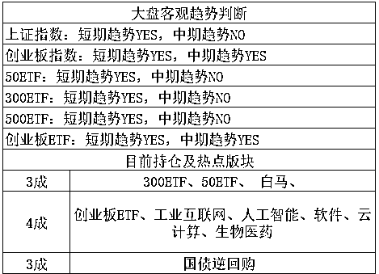

# 谭医生道歉了，但鸿茅药酒的名声更差了|晚评

紫竹张先生

每篇都有干货的财经公众号

今天，被鸿茅药酒抓走一百多天，被折磨的后来住进精神病院的谭医生用老婆的微博号发布了一个道歉声明，时间，是下午 4 点 12 分。

这个声明出来后没多少时间，5 点 23 分，鸿茅药酒官 V，就发布了声明，宣布接受了谭医生的道歉并撤销对谭医生的侵权诉讼。

至于这个声明的效果大家也看到了，清一色骂鸿茅药酒的，鸿茅受不了直接把评论给关闭了，不允许任何人发表评论。

谭医生刚发布声明 1 个小时之内，鸿茅官 V 就发布了一个带有公章的声明，这明显是提前准备好的，用强权逼谭医生道歉，然后撤销指控，因为他们知道，再控诉谭医生没什么意义了。

这里我深度怀疑鸿茅公司的智商，继续控诉谭医生当然没意义，你强逼谭医生低头认错就有意义了？你的目的是怕谭医生以后反诉你，还是想努力恢复一点自己的名誉，用谭医生的道歉来证明自己行为的合法性？

我相信鸿茅公司担心的肯定不是前者，作为一个能随便动用公权力跨省抓人的恐怖存在，他会怕谭医生起诉？被折磨了一百多天的谭医生，再借给他几个胆，他也不敢去起诉鸿茅药酒。

那么鸿茅药酒的用意恐怕就是后者了，在自己名声已经臭大街的时候，逼谭医生认错，利用这一点证明自己的合法性，能挽回一点名誉就挽回一点，反正情况已经差的不能再差了。

他们估计就是这么认为的，但是情况还真的就能变的更差，本来这件事已经偃旗息鼓了，媒体的热度已经过去了，鸿茅药酒如果够聪明，就悄悄撤诉，把这件事冷处理，当没发生过，只要不引起媒体的兴趣，媒体就不会继续报道，度过这段风头，再出来悄悄活动。

但是鸿茅药酒今天自作聪明的逼谭医生道歉，只会再次激怒网民，做出这种天怒人怨的事情，自己不反思改正，居然还利用权力强压别人道歉？中国出现这样的企业，政府不管管吗?如果中国的企业环境无法实现劣汰，那就不能实现优胜。

鸿茅接受了谭医生的道歉，可鸿茅的道歉不知道公众愿不愿意接受。这种行为只会把你再次送上头条，让这件事得到更广泛的传播。

* * *

本来今天的次条是应该写股市的，但是刚刚看到媒体报道说谭医生和鸿茅的声明，一时激愤就随手写了一段分析感想，跑题有点多，现在回归到股市。

今天的股市走势很弱，全天走势非常疲软，我在前天收盘上证 3192 之后，曾分析说一旦抵达 3200，就先减仓 1 成，后面再进行分批减仓。

按理说收盘都 3192 了，次日除非全天皆绿，不然是一定可以达到 3200 的减仓标准的，没想到昨天还真是全天皆绿，愣是没让我减仓，今天再次下跌，就差那么一点点，就没高抛成功。

非常可惜，但是没什么，整体来说，我认为走势还是可以接受的，尤其今天的下跌是缩量的，说明抛压并不大，而且外围也挺给力，这二天都在涨，至少不会带来负面干扰。

我的 5 月总策略，依然是越涨越卖，但是不涨不卖，同时追加一条，5 月底之前即便没有达到理想的高抛位置，我也会减仓 2 成，整如同 4 月底我的抄底一样，高抛位置降低一点无非少赚一点而已，这么做的理由，主要是提防 6 月。

是不是说 6 月肯定跌，当然不是，股市玩的就是概率，而不是非黑即白，非涨即跌的游戏。我举个例子，如果今天上帝显灵，告诉所有人说 6 月大盘必跌，而且收盘会跌到 3000 点之下，7 月才会涨上来，而所有人都无条件的信任上帝，那么股市会怎么走。

我可以明确告诉你，大盘必然会在 5 月 31 号之前跌到 3000 点以下，因为大家都不傻啊，既然上帝都说了 6 月必然跌破 3000 点，那么 5 月的时候谁还傻乎乎的在 3000 之上持股啊。然后大盘在 6 月不会跌，还会涨，因为上帝都说了，只有 6 月会跌破 3000 之下，7 月会涨上来，所以 6 月的收盘价，一定是高于 3000 点的，傻子才会在 3000 之下卖股票。然后，7 月的大盘，大概率会跌，因为 6 月买入的多头都等着 7 月兑现利润呢，到了最后，显灵的上帝，脸就被啪啪啪的打肿了。。。这就是所谓的上帝悖论。

所以，没有任何人能确认 6 月一定跌，如果能确定，那么这个下跌会提前体现出来，最终 6 月反而不会跌。玩股市玩的就是概率，我们评估就是 5 月有多大概率上涨，6 月有多大概率上涨，按照上涨的概率来确定自己的仓位。上涨概率越大，持有仓位越重，上涨概率越小，持有仓位越小，这样才是炒股的正确之道。

所以，在 4 月的时候，我始终坚持轻仓，因为我认为上涨概率很小，但是我还留有极少量的仓位，因为你没有 100%的把握，4 月底的时候我恢复到重仓，因为我认为 5 月的上涨概率很大。

那么现在，如果 5 月上涨幅度很多的话，我会大幅度减仓，重新恢复到 3 成轻仓，因为对应 6 月的下跌概率很大。如果 5 月上涨幅度很小的话，那么我也会减仓 2 成先行落袋，因为哪怕 5 月涨的不多，6 月的上涨概率也会变小，保持和 5 月一样的仓位是不合适的，需要略微降低。

当然，这都是后话，暂时没有操作，整个 5 月多头为主，下跌不用慌，我会继续拿着。上证抵达 3186-3196 附近，创业抵达 1850-1860 附近，我会各减 1 成，标准略微降低了点，其他没什么了。

