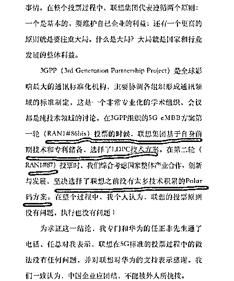
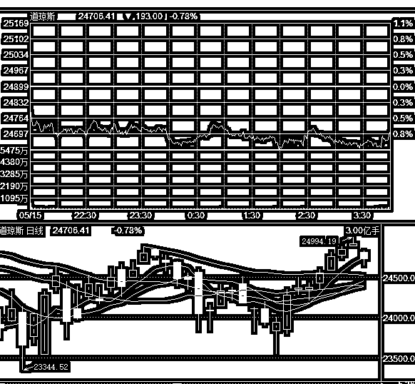

# A 股药企公告显示，中国人大部分都有病

紫竹张先生

经济-金融-投资，点击右边按钮关注我

今天常山药业涨停，为什么涨停呢，因为常山药业发布公告说自己获得了江苏省食品药品监督管理局颁发的《药品 GMP 证书》，拿下了枸橼酸西地那非片剂的生产权利，有效期至 2023 年 5 月 13 日。

枸橼酸西地那非片剂是个什么鬼，他还有个耳熟能详的名字，叫伟哥，也称万艾可。这款美国神药属于原研药，目前专利已经到期，白云山的金戈属于国内首款仿制药，如今常山药业的该类产品也将上市。

今天引爆市场热度的，并不是仿制的伟哥上市了，而是公告中的这段描述：

据统计数据显示，国内 ED 患者人数约 1.4 亿人，假设其中有 30%接受治疗，人数将达 4200 万人，假设接受治疗的 ED 患者每年都能多次使用药物，未来中国潜在的市场规模有望达到百亿元级别，市场空间广阔。

这段引自券商研报的描述让股民炸开了锅，按常山药业引用的统计数据，国内 ED 患者人数约 1.4 亿人，中国有 7 亿男性公民，也就是 5 个男人里就有一个阳痿（不论年龄），如果考虑到年龄因素，排除掉过老的人口和过小的人口，因为他们并不涉及阳痿的问题，那么就代表 3 个成年男性里，就有 1 个是阳痿。

换句话说，今天阅读我这个文章的男性读者里，每 3 个，就有 1 个是阳痿，我先说好啊，我不是，至于你是不是我就不管了。

阳痿人群的比例有这么夸张吗？当然没有，如果事实真是如此的话，今天也不会引发股民的疯狂吐槽和调侃了，实际上，如果按照上市药企公司公告和券商研报所提供的数据来推断：

中国目前共有阳痿 1.4 亿，糖尿病 1.1 亿，不孕不育 2 亿，乙肝携带者 1 亿，精神病 1.8 亿……

中国总共才多少人口，按这个数据，几乎人人有病，还都是大病，必须得治，按这个数据，今天晚上的读者，至少一半带病，做人难，做健康的中国人难上加难。

药企为什么发布这么夸张的数据呢，因为患病人群数据大，说明市场广阔啊，这样才能证明自家的药会大卖，盈利会大涨，这样市场才会给一个高估值，但是每家药企都这么玩，把这些数据累计起来，就比较搞笑了。。。

所以，今天网络对常山药业公告的疯狂吐槽和调侃，不是没有道理的。

另外，今天联想发公告了，号召全体员工保卫联想名誉。

这简直是醉了，直接实锤自己投票事实，至此已经没得辩了，所以我今天都懒得写大文章反驳了，简短评论一下算了。

这篇声明直接证实了在 86 轮投票中，联想集团基于自身前期技术和专利储备，选择了 LDPC 技术方案（高通方案）。在 87 轮投票中，我们综合考虑国家整体产业合作、创新与发展，坚决选择了联想之前没有太多技术积累的 Polar 码方案（华为方案）。这和之前爆出的资料不是一模一样吗，除了证明之前的爆料是正确的，还能说明啥？而且联想真的以为这件事国人反应那么激烈是因为 5G？错了， 他只是个引子，核心原因是联想国内外不同定价策略，歧视国人收获的美帝良心想称号导致了国人的愤怒，顺便把几十年来外国企业始终向中国出售质次价高产品歧视中国人的愤怒一并转移到了联想头上而已，联想最重要的，是立刻修正自己的定价策略，至少要和中兴华为在国内的定价策略保持一个水平线。

~~~

昨天晚上，上证收盘 3192，我和大家说，今天随便跳一跳就到 3200 了，一丝丝而已，而 3200 就会触发我们第一次减仓条件，会减仓一成，那么涨那么好，要不要继续减仓呢，我的回答是要，因为这属于既定计划，那自然要执行。

结果，今天上证指数直接低开，全天都没翻红过，楞是没摸过 3200，我也就没减仓，区区 8 个点，0.3%不到的涨幅就碰到了，居然全天都没有，其原因是昨天美股突然下跌，全天低开低走，道琼斯和纳达克斯的跌幅都接近 1%

有很多人说这是做双头，我认为不是，如果这属于做双头的话，那么花费几个月时间做出的双头是什么概念，那表示大暴跌啊，这种情况目前是不存在的。我个人依旧认为这属于一个小回调，仅此而已。更何况，双头是连续冲高后铸造的，这属于连续暴跌后。。。

这里直接见顶是不会的，怎么看概率都非常小，无非就是多花一点时间罢了，我制定的高抛计划依然有效，而且我说实话，如果不是 5 月快结束了，我要 提前储备一点子弹以防万一，我 3200 都不会考虑高抛，因为冲到 3250-3300 的概率真的挺大的，创业板也一样。

今天没有操作，继续等候。

<link rel="stylesheet" href="view/css/APlayer.min.css">

****