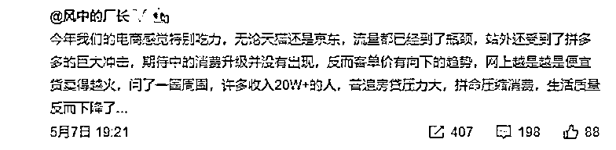
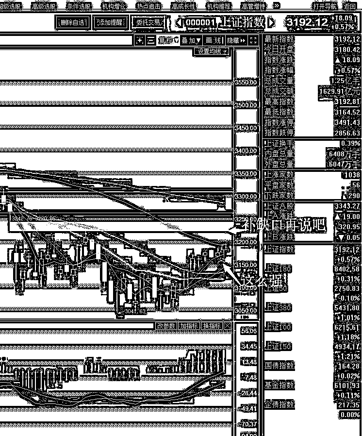
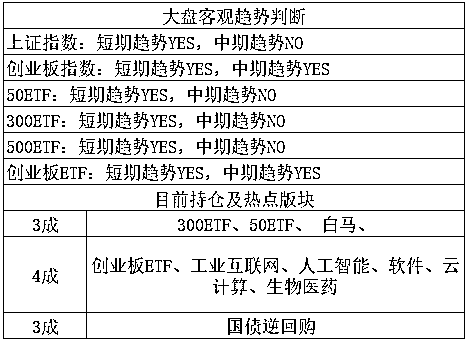

# 有一个新出的概念叫消费降级概念股，来了解一下？

看了这个标题，很多人直接蒙圈了，我只听说过消费升级概念股，什么时候来个消费降级概念股，还有这种操作？ 

先说说消费升级概念，这个大家就比较熟悉了，消费升级指的是消费结构的升级和优化，目的是促进和扩大国内的消费。

听起来好像有点绕口，那我举个简单的例子，你平时喝的都是调配出来的廉价奶茶，一杯 8 元，现在有一种高级奶茶是鲜果做成的，用了各种高端原料做出了一杯鲜果奶茶饮品，一杯 28 元。

为了喝到更好喝或者说更健康的奶茶，消费者宁愿多掏 20 元去购买这种鲜果奶茶，这就叫消费升级。消费者口袋瘪了，但是物质生活得到了丰富，市场内需得到了极大的扩大，经济得到了拉动，GDP 得到了提高。

听起来好像是很好的事情，所以近一年来，A 股的消费升级概念股非常火爆，大家都在响应号召，但是很可惜的是，一地鸡毛，消费升级概念股死的一塌糊涂。

但是与此同时的是，消费降级概念股悄悄兴起了，在消费升级概念股不死不活的一年里，消费降级概念股连创新高，核心龙头就是某榨菜。消费降级概念股主要出售的产品，就是各种廉价物资，越便宜越好，其他不管。。。

这么 low 的东西怎么会火？所有人都没想到，就连这个名字怕也是等涨完了，才被市场给创造出来的新词。其火爆的核心原因所有人都并不清楚，但是我猜测可能是下面这个。

据某电商的数据显示，近一年来期待的消费升级并没有出现，客单价还有越来越低的趋势，越是便宜的东西卖的越好，人们根本不愿意为了追求更高的质量而支付更贵的价格。这位电商做了个市场调查，发现哪怕是年入 20 万+的人，扣掉每个月缴纳的房贷也所剩无几，就是个穷光蛋，只能拼命压缩消费，收入在增加，生活质量反而下降了。。。 

这就跟尴尬了，本来倡导消费升级，结果来个消费降级，热炒的消费升级概念股反而业绩不达标，从这个角度反映，扩大内需这个口号，要落地还有很长的路要走啊。

PS：消费降级概念股，我也是近期才知道，因为不熟所以不做推荐，而且这个概念调侃的成分估计居多，我今天写这个，只是感慨中国怎么会有这么奇葩的概念股跑出来。

今天大盘出现了全面反弹，气势如虹，上证上涨 0.48%，收盘 3192，创业板上涨 1.5%，收于 1858，大面积红盘让今天的士气大振。

我个人对 5 月是强烈看多的，4 月看跌，月末抄底之后，整个 5 月我基本都是持股不动，除非你涨到了我心仪的价格，否则一切免谈。本周末放出富士康这种巨无霸我都打算硬抗，都做好延后一周再涨的心理准备了，幸好周一的时候特朗普救场，所以昨天横盘消化利空，今天就开始上涨了。

目前，上证 3192，极度接近我们的第一目标为，3200 点减仓上证指数 1 成。

我会不会执行这个策略，我会执行，因为涨幅还算满意，剩下的打算 3250/3300 分批抛出，那么上证会不会在 3200 遇阻回落呢，我的看法是不会，因为上证走的太强了，目前连 5 日线都没破。我个人认为，很有可能要补了缺口，也就是 3250 附近才会遇到真正的压力。

我卖的原因，是因为我仓位很重，7 成仓位，比市面上绝大多数 V，都要重，属于绝对多头派别的，必须持续上涨，一旦下跌，我这种仓位就非常的被动，容不得一丝意外。那么在 3200 点，先减个 1 成仓，创业 1886 附近，再减个 1 成仓，我的仓位就恢复成 5 成了，在 18 年的行情中，也算是属于多头了，很多人都 3 成甚至更低。

但是我的策略，其实是非多非空，越跌我越买，越涨我越卖，整个 18 年我都打算执行这种策略，每一波我只赚一点钱，算起来有利差就行了，不追求赚多少，但是求稳，我认为我这样活的会远远比其他人强，而且比那种始终仓位超级轻的人，赚的要多。

大概就这样，今天没有操作，但是明天会有，因为今天上证都 3192 了，明天不可能不冲 3200，大概率收盘是要站稳的，所以明天有很多机会，逢高抛，别抛多了，只抛一点，因为他是我们的先头部队，卖出不代表看空，只是一种操作策略而已。正如同 4 月我分批买进，第一批买进也不代表认为他见底了，也只是一种操作策略而已。

