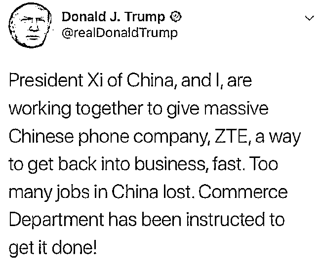
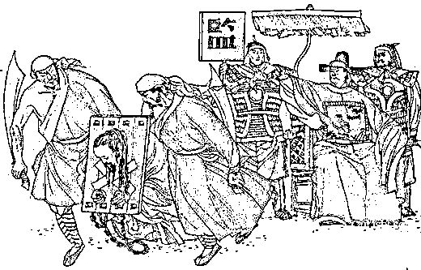
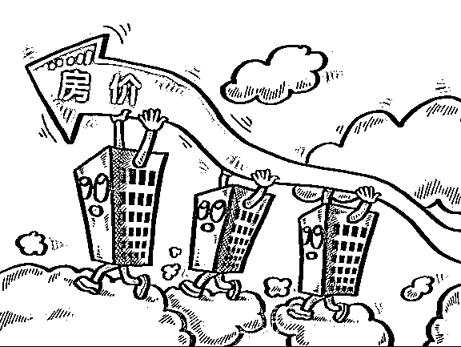

# 今天我们付出重大代价救活了中兴，希望中国因此警钟长鸣

紫竹张先生

经济-金融-投资，点击右边按钮关注我

昨天深夜接近凌晨的时候，特朗普发布推特，宣布解除对中兴的禁令，在制裁中兴一个月整之后，濒临死亡的中兴获得了复活的机会。

*这段话翻译过来就是：中国领导人正**在和我合作，将为中兴提供一种**快速恢复业务**的途径。（中兴事件造成）中国很多工作岗位丢失了。我已指示商务部去尽快完成这项工作*。

这里面有三个关键点要注意：

第一个是“**快速恢复业务**”，表示对中兴的出口要尽快恢复，不会拖延太久，中兴已经快扛不住了。

第二个是“**我已指示商务部**”，说是指示，而不是建议，说明这件事已经是板上钉钉不会更改了，如果特朗普并不想直接放过中兴，还想谈一谈，那他的措辞应该是“建议商务部进行可行性方案的研究讨论”。

第三个是“**中兴事件造成了中国很多工作岗位丢失**”，这说的是实话，也让美国占据舆论道德的制高点。中兴已经停产，8 万员工不知所措，处于随时可能被辞退的危险境地，其中 3 万是研发人员。8 万从业人员的岗位代表什么呢？美国不惜得罪欧洲盟友也要推进的钢铝关税，保护的钢铝行业的总从业人员，也就 18 万而已。

这三个关键点，释放了美国和平解决贸易战的善意，对中兴构成了重大利好，同时，也从侧面泄露了一件事情，那就是我们为了救活中兴，付出了巨大代价。

01 为什么说我们救活中兴付出了巨大代价

这段声明发布于昨天深夜和今天凌晨之间，而今天，是我国特使关于贸易谈判出访美国的日子。美国一直口口声声说中兴案是独立的，制裁中兴是他咎由自取，和贸易争端没有一点关系。但是中兴案发很久了，美国掌握中兴的不利证据也有很长时间了，一直引而不发，选择在中美贸易战的节点放出去，怎么看美国都是在拿中兴作为人质来要挟中国，迫使中国做出让步。

十几天前，美国代表团访问中国，和中国进行了一次友（si）好（bi）的会谈，美方开出了 2000 亿美元的天价，让中国根本无法接受，最后只能变成一场坦诚、高效、富有建设性的讨论。

但是根据新华社的报道，美国代表团来北京的会谈纪要里，有这么一段话：“中方就中兴公司案与美方进行了严正交涉。美方表示，重视中方交涉，将向美总统报告中方立场。”中兴公司对于中国而言太重要了，哪怕是在美国飞到中国来漫天要价的时候，也不得不忍辱负重帮中兴说话，请求美国解除对中兴的禁令。

贸易战里为什么要带个战字，就是因为这是贸易领域的战争，而中兴作为中国经济领域的重要组成部分，就好比战争刚开始，就被美国抓走了当俘虏列于阵前，喊话说给你们一个月时间考虑一下，不肯让步我就先把中兴给砍了祭旗，然后我们再慢慢打贸易战。

你说在这种情况下，抓了俘虏来要挟中国的美国，自然占据先机。这次美国突然说释放中兴，免其一死，肯定不是无代价的，特朗普商人出身，属于不见兔子不撒鹰的主，中方没有给出明确让步和好处，断无可能放走这个重要俘虏。所以我国一定在谈判桌上付出了巨大的代价来救活中兴，只不过没有通告媒体而已，因为这种事知道的人越少越好。

而国家利益受损，就相当于全国人民利益受损，等于是因为中兴高层的愚蠢管理能力让美国抓住把柄，而我们平民百姓付出了巨大代价来救活了他。

2 中国从今天开始要警钟长鸣

在过去的 20 年里，中国的金融业和地产业获得飞跃式的发展，四大行在全球银行里都是排名前列的，房地产那就更不用说了，这颗星球上目前最火爆发达的产业就是中国地产业。

但是中国的金融业只是利用垄断地位赚钱而已，并非自己的真本事，别说外国顶尖银行了，连支付宝这种半路出家的伪银行都干不过。房地产业就更不提了，北京的房价再高，战争年代一颗炸弹丢下来，瞬间海市蜃楼就被戳破了，本来能买下整个美国的，现在可能连买一艘航母的钱都不够了。

而中国目前最火的大企业阿里和腾讯，虽然是互联网企业，列属于高科技领域。本质上来说，只是商业模式的创新而已，降低了中国的交易成本，但是并没有发展出什么核心科技。

最后是中国的制造业，看似强大无比，世界工厂，实际上在浮躁的氛围中，赚快钱的思路成为主流，要是赚的慢风险大，我还不如去炒房地产呢。所以表面看起来中国的制造业什么都能生产，但是实际上核心技术、核心设备等零部件都是采购自国外，一旦发生战争，外国断货，中国瞬间就会熄火，不战自败。

近些年、金融、地产、互联网商业领域聚集了中国太多的资源，剩下的资源也只愿意去做低端制造业，高科技制造业无人问津，产业始终发展不起来。今天是中兴的复活日，也是中国的警钟日，从今天开始，我们要大力倾斜资源导入高科技领域，给予各种政策扶持和税收优惠，外国断货导致中国瘫痪这种事希望只限于中兴这一次。

3 普通人能做点什么吗

其实中国在贸易战中被美国用一颗芯片掐住了脖子，我们普通人也是有一定责任的。

长期以来，追求暴富成为了国人的梦想，笑贫不笑娼成为社会价值观的主流，一名高科技研发人员的科研成果，在丈母娘眼里远远不如一套房重要。科研领域投资的回收周期太长，投入风险太大，导致企业给予研发人员的工资普遍偏低。而整个社会拜金主义盛行，对科研人员并没有给予太大的尊重，我们对影视明星的喜爱，远胜于对袁隆平的喜爱，但是袁隆平对中国的价值，是所有大明星捆在一起乘以 10 也无法比拟的。

所以，对于普通人而言，我们尽自己的力量，对科研多一点包容，多一点支持，用我们微弱的声音，汇聚成一股舆论的洪流来形成对科研的支持，让社会资源倾斜在科研领域，使科研人员的社会地位和工资收入得到全面的提升。这是我们每一个人都做得到的事情，也是我们应该做的事情。

4 今天是一个重要的日子

今天对中兴来说是复活日，但是我希望中兴牢记全国人民为了救他付出的巨大代价，整个国家都因为他的管理失误而进退维谷，希望中兴知耻后勇，努力研发争创一流，不要让我们失望。

今天对中国来说是警钟日，对中兴是杀是放，全在美国一念之间，中国热衷于金融、地产、互联网等来钱快的行业，而轻视核心科技的研发终于吃到了苦果，看似强大的 GDP 犹如沙滩上的高楼，一触即溃。美国以芯片来要挟中国经济，让中国高层警钟长鸣，这一点还需要谢谢美国的提醒。

今天对中国百姓来说是行动日，从今天开始，我们要改变自己拜金主义的思维，对科研人员多一点支持和鼓励，也许单个人的舆论声音很微弱，但是无数的声音汇聚起来，足以引起中央高层的重视，也能改变整个社会的舆论倾向。希望中国多一点年入上亿的袁隆平，而少一点年入上亿的大明星。

最后，希望借此契机让整个中国拧成一股绳，让中国的产业转型，高端制造强国梦早日实现。

<link rel="stylesheet" href="view/css/APlayer.min.css"> 