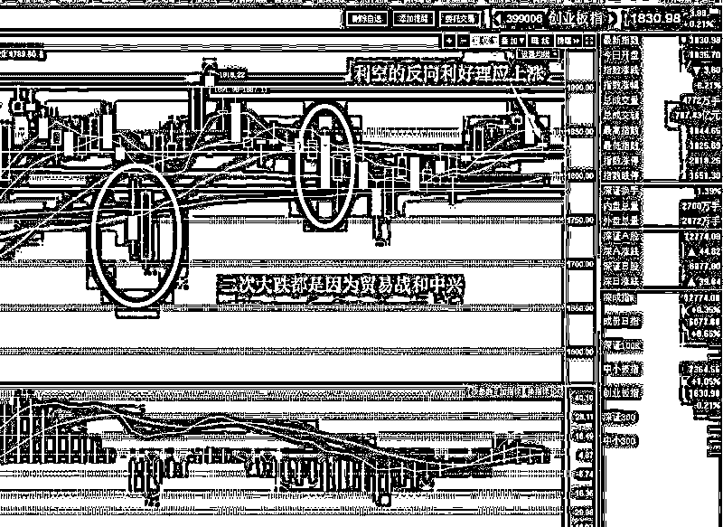
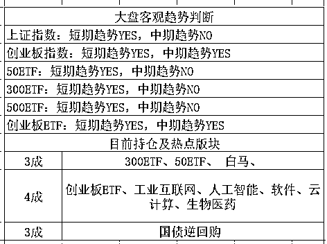

# 特朗普半夜送利好拯救中国股市

紫竹张先生

经济-金融-投资，点击右边按钮关注我

周五夜间，证监会半夜鸡叫，宣布富士康的 IPO，这种巨型抽血机上市导致一片恐慌，我在周末已经做了充分的心理准备，打算周一硬吃大跌的，同时用图片给大家分析了，当前各大指数走势都处于上涨趋势，周一的一个大低开基本就到位了，既然我们没有能力在周五之前获得富士康上市的消息，那么直接跑路已经没什么意义了，硬吃是无奈但是最佳的选择。

但是今天凌晨，救星来了，特朗普宣布不再对中兴进行制裁，展现了和平解决贸易争端的善意，中美激烈的贸易战得到了缓解的曙光，这让中美经济信心大增。要知道，在 4 月份的时候，每一次出现贸易战，制裁中兴等新闻，都会导致股市大跌。那么当这些利空的反向消息，也就是利好出现的时候，股市理应出现反向的走势，也就是大涨。

但是今天没有大涨，为什么呢，因为富士康上市 IPO 了，大利空，不跌就不错了，这个利好消息还无法对冲掉如此巨大的利空消息。但是今天早上 8 点，开始之前，发布的最新消息，让利好再来一个援军，那就是富士康的募资制度采用创新的新制度，这才让今天收出了横盘，多空打了个平手。

那么证监会创新出来的最新募资制度是什么呢，首先，富士康的募资额 272 亿人民币是一点没有减少，这一个是证监会的底线不会改。为什么要有 272 亿呢，首先按照现行证券法，IPO 后公众持股必须达到 10%，那么以富士康的巨无霸体量，10%就是 19.70 亿股，每股 13.83 元。如果要降低募资额，只能通过降低发行市盈率来实现了，但是降低市盈率，你降低一点点无关大局，降低的太多，多方利益都不同意，券商不同意，富士康自己也不同意，我上市是为了赚钱不是来送钱的，你要是降低一半 PE，那我还上市干嘛。

所以市盈率降不了，发行公众的股数也改不了，那怎么办呢，直接把 272 亿募资额推给市场，这个节骨眼上，很明显会引发暴跌，证监会不想背这个锅。

于是一个新发明就出来了，叫战略配售。什么意思呢，就是富士康必须卖给公众的 19.7 亿股，先拿出 30%卖给战略投资者，这些战略投资者有 50%最低锁定 12 个月，有 50%最低锁定 18 个月，如果你要体现和公司合作的诚意，还可以自愿选择承诺锁定 36 个月，这就导致 5.91 亿股直接被锁死了无法抛售，和原始股没太大区别了。

那么还剩下差不多 14 亿股啊，那也是接近 200 亿的巨无霸，市场还是受不了，于是再度创新，网下配售，也就是鼎鼎大名的网下打新的部分要拿出 70%进行强制锁定，直接锁死 12 个月。也就是 6.76 亿股要锁定（回拨机制启动前）；二者相加总锁定股份数为 12.67 亿股，占总发行股份数的 64%

那么也就是说，原本 272 亿的巨型抽血，直接只剩下原预期的 36%抽血量了，虽然还是利空，但是属于超过预期，就构成了利好，和今天早上特朗普的利好叠加，勉强对冲掉了富士康的影响。

其实这里偷偷说一句，这本质上来说，属于抽血后移，移到明年去了，但是资本市场哪能管那么远的事，今年的先搞好再说吧，所以至少对我们来说，暂时不需要操心这么远的事情。

上证指数今天最高冲到了 3183，收盘 3174，基本横盘，而创业板是小阴，其实也算横盘。但是把这么大的利空给消化掉了，我今天还是挺满意的。

对于后续的操作，当然很简单啦，走势依然是向好的，周五那么大的利空我都打算咬牙死扛，因为周一跑不掉了，何况现在，所以继续持股做多，上证 3200 的时候打算先减 1 成仓，其余不变。

<link rel="stylesheet" href="view/css/APlayer.min.css">

