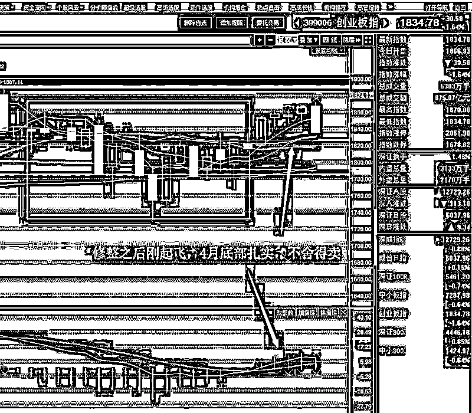
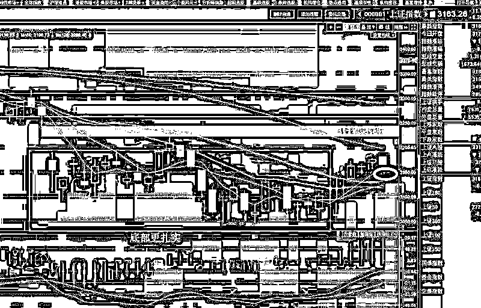

# 半夜鸡叫-周五夜间宣布富士康 IPO

紫竹张先生

经济-金融-投资，点击右边按钮关注我

本周五夜间 23 点 48 分，证监会宣布了本周的 IPO 新闻，只有一家获得了首发申请，不过却是富士康这个巨无霸，几乎是卡着点发，差一点就到周六了。

按照惯例，每周五证监会都会发布新股批文，时间点多集中在晚 8 点到 9 点之间，拖到几乎凌晨来一个半夜鸡叫，这很明显不正常，要么是讨论激烈，要么就是心虚。而更令人意外的是，这次未提及募资金额到底是多少，这是破天荒的头一次，我不管你是 100 亿还是 200 亿，总归是有个金额吧，为啥不提。

不过，按照之前公布的募投项目推测总投资额还是可以算的，按照之前的数据倒推，募资额高达 272.53 亿。如此巨大的抽血巨无霸，怪不得上周四走那么强，周五突然下跌，先知先觉的部分机构跑路了，留下我等后知后觉的人到了收盘才看到富士康的 IPO 消息。

富士康已经过会，但是什么时候 IPO，那谁都不知道，而实际上，离过会已经足足 2 个月了，因为市场行情不好，富士康的 IPO 始终拖着没发，要是他再拖一二个月不 IPO，难道这小半年都不炒股啦？所以只能根据指标玩，谁知道硬吃这么一个大利空。

有人问我对富士康 IPO 怎么看，我可以说这明确就是个大利空，这种大块头上市不是利空，那什么叫利空。但是出这个利空，我打算硬吃，因为整体属于上升趋势，回撤空间不明显，我觉得创业板最多也就回撤到 1800 吧，还在我的接受范围之内。

但是很可惜的是，这种程度的抽血一定会影响整体走势，5 月的形势会产生变化，做多热情会被明显压制，总体的高度可能会被降低，这个我要在后面去观察，后续我会依次降低预期的高度。今天就没必要去测定了，因为刚出利空，不会到我高抛位的。。。

同比之下，上证指数的走势就好看很多，在利空因素下，周五连 5 日线都没破，要知道富士康是大蓝筹，吸血主要对蓝筹是更大的利空。。。

不过我对这种走势的理解，更悲观一点，我的理解是，有权有势能提前知道的机构，已经都不在上证指数里了，还趴在蓝筹里的，都是散户和普通机构，只看指标的话，他们是不愿意卖的，毕竟底部这么扎实，而且连 5 日都不破。知道消息的牛逼机构主要潜伏在创业板，周五直接就砸盘了。

从这一点说，消息灵通的机构主要砸盘创业板，说明他们之前潜伏筹码较多的也是创业板，那么他们为什么会选择创业板，这就是值得思考的了，我理解为中长期利好，虽然短期怎么看都是利空。

所以，很不幸的通知大家，周五我们中招了，踩了个大地雷，富士康巨无霸抽血机上市了，这波雷打算硬抗，我估测他大概只能拖慢上涨时间最多 1 周左右，就当浪费点时间吧。

<link rel="stylesheet" href="view/css/APlayer.min.css">

