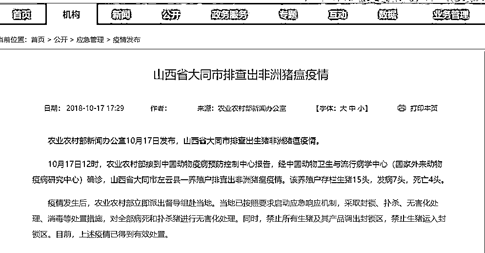
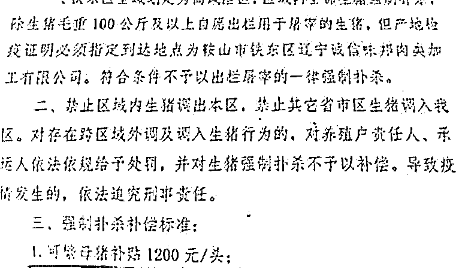

# 非洲猪瘟到底可怕在什么地方

喜欢我的都关注我了~

非洲猪瘟是一个很新的词汇，实际上这个病首次出现在中华大地上，仅仅是今年 8 月份的事情，但是这个词汇突然成了热门词汇，各地政府严防死守，如临大敌。下了疫区封锁令的地区，远远不止一个。

从图中看，只有大同市只有 15 头生猪出现了猪瘟，简直不值一提，但是实际上，一个地区只要出现一例确诊的非洲猪瘟，直接默认整个地区都有问题，防疫部门会划定一片区域为疫区，然后对该疫区内的所有生猪，无论是否得病一律灭杀后销毁，政府给予养猪户一定的补偿。

各地政府如此重视这个疾病，不惜出动大量人力物力围追堵截，一方面说明了政府行使公共职能，为人民负责；一方面也凸显出了非洲猪瘟的强大恐怖，那么，这个病究竟厉害在哪里呢？

非洲猪瘟对人无害

很多人一看到政府严阵以待的样子，就以为这个东西对人有巨大危害，以前的非典、禽流感等疫情都对我们的健康产生了重大的威胁，非洲猪瘟，这个名字一看就很可怕，禽流感都能传染人类，非洲猪瘟呢？

实际上，非洲猪瘟对人类完全无害，你就是天天和病猪待在一起，你也不会被传染，这种病毒完全无法在人体内存活，就算你直接吃病死的猪肉，你也不会有传染这个病，如果是加热后的猪肉，那更是安全到不能再安全，沸水状态下，这个病毒抗不过 10 秒钟。

事实上，在自然界里，非洲猪瘟的唯一宿主就是猪，只有家猪和野猪会感染这个病毒，其他所有动物都不会感染这个病毒，人更不可能因为食用猪肉而感染。

有人说真的假的，怎么可能有病毒只针对一个物种感染。实际上绝大多数病毒都是只针对一个或者几个物种感染的，能对大量物种起效的病毒反而是少数。

所以说，非洲猪瘟对你身体的危害就是零，你可以随便进出疫区，甚至可以放心大胆的吃疫区内出产的猪肉，都没问题。

非洲猪瘟对猪是绝症

看到这里你可能疑惑了，既然非洲猪瘟对人的危害就是零，那各地政府为什么如此重视这次的疫情，花费如此之大的代价灭杀疫区的活猪并掩埋，不是说吃了无害吗？那为什么不运出来吃掉。

非要把这些对人类无害的疫区生猪进行掩埋处理的原因是，这个病毒虽然对人类无害，但是对猪是魔王一样的存在。

非洲猪瘟没有特效药，没有疫苗，猪一旦发病，必死无疑，病死率接近 100%，死亡率堪比狂犬病。

可怕的是，狂犬病是通过伤口传播的，如果不被咬，你是不会得狂犬病的，但是非洲猪瘟不是，病猪的各组织器官、体液、分泌物中均含有高浓度的病毒。这种病毒可以通过饲料、水源、泔水、粪便、蚊虫叮咬、甚至人类的衣服进行传播，你以为这就完了，还没完，非洲猪瘟居然还可以通过空气进行传播。。。

非洲猪瘟拥有完美的传播途径，你能想到的传播途径它几乎都拥有，假设艾滋病能拥有非洲猪瘟的传染力，那简直是人类末日，感谢上帝，让它只对猪有效。

很可怕对吧，不好意思，这还不算完，还有更可怕的在后面。

非洲猪瘟病毒最可怕的地方，在于它的野外生存能力特别强。在水源中三天仍有传染性，在猪的粪便中感染性可以持续数周，在腐烂的血液里可以存活 15 周，在冰冻生猪肉中可以存活数月，一旦接触到活猪则立刻感染然后飞速蔓延。这种超强的存活力导致非洲猪瘟很难除根，在全球各地爆发过非洲猪瘟的地区，都是花费了巨大代价，经历了漫长的努力才最终消除疫情的。

所以，之所以非洲猪瘟对人类无害，地方政府也要严防死守，是因为这个病一旦蔓延，不会产生人命的损失，但是会产生重大的经济损失。如果病毒蔓延出现大量的生猪染病，会对中国养猪业造成毁灭性的打击，而产生的肉价暴涨，也会对经济产生连锁反应。

相比之下，直接把疫区的生猪无差别灭杀，反而是代价最小的选择。至于为什么严禁疫区内的猪肉流出，并不是怕人被感染了，而是怕猪被感染了，这个病毒存活力特别强，感染特别快，一旦有一星半点的病毒跑出疫区，很快又是一次大屠杀。

非洲猪瘟的疫情严峻复杂，一旦管控不力后果特别严重，我们应该庆幸的是它对人无害，这不是在开玩笑，如果这个病毒能传染人，它比当年的非典还要厉害十倍。

所以，海关条例中严禁你携带小动物进进出出，这是有道理的，别嫌麻烦，万一你带的某小动物成了传染源或者入侵物种，你哪里负的起这个责任哦。

目前，我国已经有 10 个省份共报告了 30 多起非洲猪瘟疫情，全部进行生猪灭杀，目前已经有 7 个疫区解除了警报封锁。

但是，根据国际经验来看，一旦某国内爆发了非洲猪瘟，那么短期内是不可能灭绝的，有的国家甚至折腾了数十年才消除疫情，这东西存活力和传染力太强，不然也不会列为重点防控的一级动物疫病。

所以，对我国而言，未来长期和非洲猪瘟斗智斗勇将成为常态，我国养猪业的基础生态甚至可能因为这个病毒而改写。

对于我们而言，首先对于非洲猪瘟不需要恐慌，该干嘛干嘛，这东西是政府防疫部门操心头疼的事情，和我们的健康并无关联。其次就是由于疫情的缘故，养殖户可能会大量出货，降低存栏猪的数量降低自己的风险，所以猪肉会跌价，但是等过一段时间之后，生猪数量不足就会体现出来，到时候会大涨价。。。

所以，趁这几个月跌价，多吃点猪肉吧，经济形势目前这个样子，等明年猪肉再涨价，我怕你吃不起猪肉了。。。

觉得此文的分析有道理，对你有所帮助，请随手转发。

长按下方图片，识别二维码，即可关注我

近期精彩文章回顾（回复“目录”关键词可查看更多）

华为员工都这么穷，怪不得拼多多能火 | 房价跌 20%就会全面崩盘，地产杠杆远比你想的要脆弱 |  为什么碧桂园的质量那么差 | 清醒点，放弃全面开征房产税的幻想 | 央行和财政部隔空掐架，我支持央妈 |中国土地制度源自香港，但是香港却是劏房密布 | 为什么中介哄抢租赁房源，因为贩毒都没它来钱快 

1