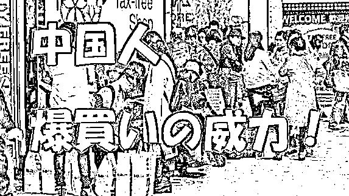
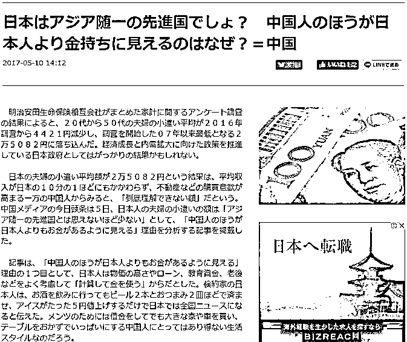
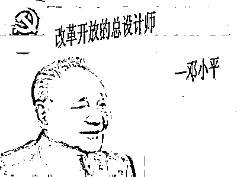
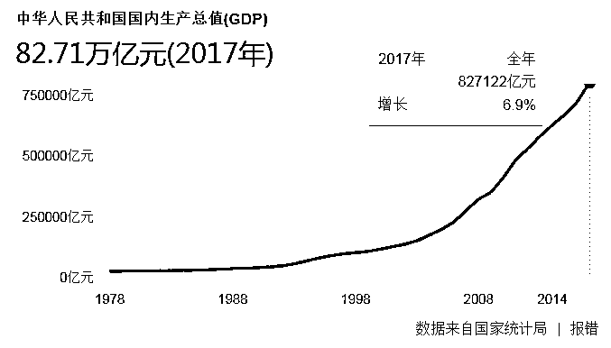
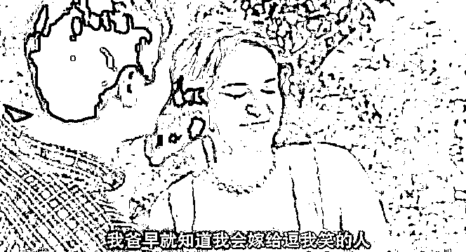
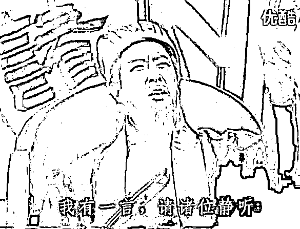

# 日本人困惑美国人惊叹，为什么中国人这么有钱？

**本文转载自公众号：川中寻牛**

如果谁能说清楚中国人的收入，应该离诺贝尔经济学奖就不远了。

为什么人均只有 8000 多美元的中国人会觉得比自己收入多 4 倍以上的日本人还有钱？为什么人均工资只有 5000 元的一个国家，可以拥有这么高额的房地产？

**这是一个对于中国房子、工资和未来的思考。**

1**中国式土豪**

中国人真是太有钱了，有钱到了能大幅推高加拿大和美国房地产市场的价格的地步，这还不够，如今甚至都能拯救萎靡不振的日本房地产市场了，这不仅让美国网友惊呼。

截止到 2015 年 3 月前的一年间，中国人在美购置房产花费了 286 亿美元，在所有在美国置业的国际买家中高居榜首占 28%，其中**近七成人是用现金一次性付清。**

还有一个令人震惊的数字是中国游客一年的境外消费的。据世界旅游理事会最近发表的数据，2015 年中国游客在内地之外消费总额高达 2150 亿美元（约 13944.7 亿人民币），不仅比 2014 年高出 53%。而且要高出云南去年的 GDP 总额（13717.88 亿元）。

难怪很多外媒头条都是“感谢中国游客、日本地价八年来首次上涨”的报道。

在生活方面，日本人平时在家吃饭都非常简单，一碗饭、一点蔬菜、一条烤鱼、一碗酱汤、一点咸菜。相比较起来中国人的生活比日本人奢侈多了。他印象最深刻的是，BBC 的一部纪录片报道中国下岗工人的伙食，日本人看了之后震惊了，因为这个下岗工人的晚饭竟然是四菜一汤，英国人看到这一幕也晕了，他们纷纷感叹：中国人真奢侈！

可是事实上呢，2016 年日本人均 GDP 大约是 38000 美元，而同年中国的人均 GDP 约 8200 美元，两者相差了 4 倍多！**可是为什么中国人处处都显示出比日本人还有钱？**

2**中国发展的秘密**

在西方求学、教学 40 余年的亲身体验，复旦大学中国研究院研究员陈平在东南卫视的《中国正在说》专栏里讲，给我们讲了三个故事，提供了一个不一样的认识中国模式的视角和思维，

**第一个故事**

我曾在在美国第二大州的德克萨斯州住过，比四川面积还要大。因为只有货运而没有客运铁路，他们当时提出要建一条轻轨来连接几个主要的城市。公民民主投票投了多少年？投了 20 年，到现在还在纸上。

为什么呢？因为资本主义制度下利益冲突太多。

修条轻轨谁不高兴？

航空公司不高兴，因为人都跑到轻轨去了，它的利润受损；

旅馆业也不高兴，你坐了轻轨当天就到家了，我的旅馆收入就要下降；

沿线居民也不高兴啊，噪声增加，我的房地产贬值；

稍微远一点的居民高兴，地价增值，但再远一点的居民不高兴：这和我有什么关系啊？凭什么我要交税呀？

所以在西方要修铁路高铁，选线、设站都成了问题。

只有在中国，金融危机时投了四万亿，一下子变成高铁长度全世界第一。所以现在很多国家，包括美国英国要学中国造高铁，但他们的制度成了制约。印度要征地，私有制又征不下来；美国和德国要选线，就会利益不均。

所以中国第一条优势：社会主义大协作。这种协作模式超过西方制度下的分工加市场交易。

**第二个故事**

《纽约时报》调查得出的。《纽约时报》总想不明白，美国科技先进，怎么中国发展老比美国快呢？后来调查出来一个秘密。

乔布斯把新研发的苹果手机和钥匙放在同一口袋里，钥匙把手机的塑料面划痕了。下月就要上市了，乔布斯就想一周内要换成玻璃的外壳。开会的副总裁立马就急了，还没散会就坐飞机到深圳去了。为什么？在美国你单单聚集工人要多少时间？9 个月。然后美国的工人周末要度假，要看球赛。而中国的工人，高管电话一打，24 小时内就来上班了。需要配件、螺丝、电阻，都在隔壁和对面，深圳是产业集聚的、世界最强的加工阵地。

苹果手机 50%以上的利润都被苹果公司的股东赚走了，中国的工人拿的血汗钱只有 5%都不到。

但以今天特朗普的逻辑，是中国赢了还是美国赢了？是中国赢了，因为中国赢得了就业、赢得了发展。美国被苹果解雇的那些高技术的工人失业了，回来只能测试被退回的苹果机。工资下了一大截。所以美国主导的全球化，原来想的是美国一定赢，结果发现中国才是大赢家啊，美国是输家。

**第三个故事**

中国研发不如美国，经济发展为何有那么大动力？

一年春节，我餐宴上遇见了微软的高管，他告诉我一个从未在经济学文献中看到过的数字。他说美国现在保持着研发优势，产品研发出来，从投资到设厂到美国经过议会修改法律标准，到营销，把钱赚回来这个周期要多长？我说起码要十年以上。他说确实，欧洲比十年还要长。但中国平均 23 个月。你说美国怎么和中国竞争？

日本非常有名的管理学家大前研一，他写的《United States of 中华》，即《中华联邦》很畅销，中华联邦是指把东北亚东南亚这些中国周边的国家都加入中国的经济发展的这么一个大家庭。当时西方大谈中国经济要崩溃，他却看好中国经济。因为他认为中国人学习能力太快了。

他说 1970 年代日本人很自信，说，WhatAmerican can do，we can do it。认为美国人能做什么日本人就能做什么。现在，日本人说，What Chinese can do，how can we do it？中国人做的事情，我们日本人怎么做得到呢？

大前研一讲这话是在金融危机之前，金融危机之后，2010 年 2 月，哥伦比亚大学请我去做金融危机演讲。第二天，索罗斯请我在他的量子基金总部吃饭。他问我：西方文明的衰落看来已成大局，将来要看中国能否引领世界了？然后他感叹了一句，和大前研一的观点相同，“中国人学得快啊！”。

我反问“您觉得为什么中国人学得快呢？”索罗斯平时是反应很快的人，但他那次没有回答。我说是因为中国人可以全方位的学习，科学技术可以学苏联、美国，工业制造学德国，管理学日本，分解房地产的使用权学香港，工业园区学新加坡，农业还可以学以色列。中国没有意识形态的障碍，只有中国有这个包容能力。所以到中国讨论多元文化的共存和发展，我认为会比在纽约联合国讨论还要受到大家欢迎。

3**中国人有钱并不突然**

复利效应确实超出人的感知经验。站在 1978 年，怎么也想不到 40 年后中国会发展成这样，就连总设计师也万万想不到。

当年邓公三步走战略：

第一步，从 1981 年到 1990 年国民生产总值翻一番，实现温饱；

第二步，从 1991 年到 20 世纪末再翻一番，达到小康；

第三步，到 21 世纪中叶再翻两番，达到中等发达国家水平。

邓公三步走的目标是从 1981 年至 2050，中国 GDP 规模共计增长 16 倍！但发动机一启动，长期复利增长发挥威力，现实远超出预计。2014 年中国经济规模较 1981 年增长超过 2200%，中国提前 38 年实现了三步走战略。

改革开放 30 多年来，中国确实有了惊人的进步，这得益于国家政策的适宜和亿万人民的辛勤劳动。

中国人是一种总是在努力的人，能够在任何环境、任何遭遇下，绝不放弃的力争改变自己的命运、前途与境遇。不管是活得一塌糊涂，又或者过得挺不错的，中国人不会停下争取更好生活的脚步。这一点实际上非常奇怪，地理纬度比我们高的有老毛子，喝个酩酊大醉就不去想明天；地理纬度比我们低的有三哥，都快要饿死了都懒得动弹。唯独只有中国人，永远不辞辛劳，永远干劲十足，天塌下来也是高个子的顶着，矮个子的该种地种地，该打工打工，继续为美好生活奋斗不息。

中国今天取得的这点成绩，是全国人民几十年艰苦奋斗的结果，不是突然就有钱了。很多外国人对中国的发展历程不了解，容易产生误解。可以这样跟外国人说，中国人仅有的这点钱也是几十年来辛苦打工挣下的血汗钱。

4**中国人也有焦虑**

中国的人均月收入在 5000 元左右，中国的房价是多少呢？按照房地产经济学的一个经验法则，房价的合理区间是工薪族年薪的 6 倍左右。如果超过 6 倍，买房的按揭贷款就很难还清了。

按照这个经验法则来推算，中国城市的房地产的均价应该在 40 万人民币左右。

但事实上，据他了解，40 万在中国连首付都不够。如果要把两者数据匹配起来，中国人的月均收入不是 5000 元，而是 55 万！

拿着每月五六千元的收入，要买下高于月收入 1000 倍的房产，中国的年轻人苦不堪言。曾经日本学者问过一个买不起房的年轻人：如果不买房子，你还会结婚恋爱吗?

年轻人反问：没有房子，还能有爱情吗？

换句话来说，没有房子，等于没有爱情，更不要说结婚、生子了。

而最近一篇《房价是不是透支了未来几十年中国人的购买力？》火遍了网络。赞同最多的回答是：房价根本不只透支了未来几十年中国人的购买力，同时还做了两件事。一是耗尽了一到两代人在过去几十年积累的财富；二是摧毁了对这一代人的创造力。

可见中国年轻人对于未来多么的不安和焦虑！

5**未来的路**

中国就像 1900 年的美国，复旦大学中国研究院研究员陈平说道。中国道路的崛起，突破了西方模式。中国今天的历史地位不是像主流经济学家所讲，中国是 1970 年代的日本，经济速度一定要放慢，我认为中国就像 1900 年的美国，下一步高速发展的空间还很大，更重要的是占领科学、金融、军事的制高点。

此话怎讲？

因为 1900 年的美国，和中国现在一样，工业产量世界第一，但没有占科学的制高点，当时在德国手里；也没占领经济和军事的制高点，当时在英国。严格来说到 1960 年代，美国登月成功以后才全面掌握了科学金融和制造业等全面的制高点。以美为鉴，中国下一步的目标是真正地占领科学的制高点。

因为亚当·斯密讲过，分工受市场限制，市场不是一个平等竞争的市场，科学技术是第一生产力，谁掌握了科学教育的制高点，谁就掌握了军事和工业的制高点，谁就掌握了金融的定价权。我们要不把这个定价权拿下了，中国要真正解决中国的区域差距问题是不可能的。

那中国有无可能在未来十到二十年占领科技金融军事的制高点？我认为很有可能。美国不卖给中国雷达预警飞机，中国就造出来了；不卖给中国航空母舰，中国就造出来了，所以中国的科技上升得很快，但是有一点，中国的科技现在还在追赶美国。

美国的科技为什么可以占领制高点？不是因为美国的教育系统比中国优越，而是因为美国可以搜罗全世界的科技人才。美国在二战之前科技远不如欧洲，二战以后数以十万计的科学家被美国吸收了。

为什么美国能吸收？美国立国时，所有州立大学受惠于“土地赠与大学”制度，大都设在乡村和小城市。不仅地价要远比欧洲、亚洲的便宜，科学家大批地在小城市里专心做学问，不想升官不想发财，才能有世界上最好的研究。

出诺贝尔奖最多的大学在哪？剑桥，旁边就是奶牛。我去看看牛顿的苹果树，奶牛在那哞哞叫。当年德国出了那么多科学家在哪？哥廷根大学，那个小城大概只有几十万人口，在中国相当于一个小的县。

所以解决这个问题，我认为就要像当年大革命时期，沿海有为青年到延安去创建革命根据地一样，把沿海大城市的研究型大学，有计划地迁到内地去，建立十几个全世界最好的综合性的研究中心，而且跟产业、金融营销整合，我们不要搞国企集团，我们学美国，叫做大学基金会。你给我 10 年、20 年时间，中国一定是全面占领世界制高点，我有这个信心。

文尾

你问中国为什么突然这么有钱？因为你只看到少数人的挥霍，没有看到多数人的血与汗！；

在历史长河里

有的国家文化内核被更迭；

有的国家宗教信仰被毁灭；

有的国家人民失去了他们自己的文化底蕴；

只有中国可以掀开自己衣襟，展示那一道道伤疤，带着坚定的笑意骄傲说:中国还是中国，文化底蕴没丢，文化内核没丢，我们还是我们，我们还是这片沃土上的子民。

中国最厉害的地方，就是我们的韧性！！！

（作者：川中寻牛，职业股民；在 18 岁就开始了炒股生涯，最擅长的就是从“新闻联播”中抓住股市大牛，如 16 年的雄安新区，17 年的有色和今年海南博鳌论坛和青岛本地股。他的公众号每晚会推送一篇夜报，会告你市场的主线是什么，潜在的政策面机会在哪里，最应该埋伏的品种是什么。）

