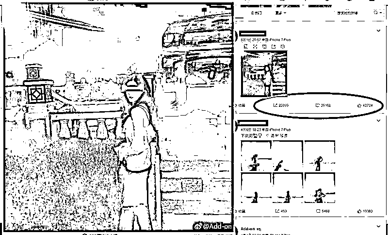
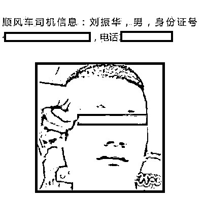
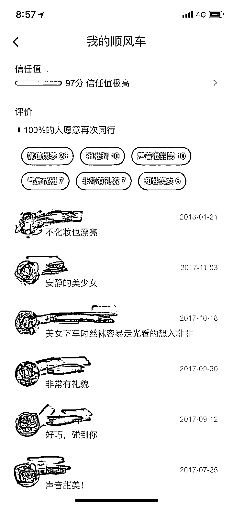
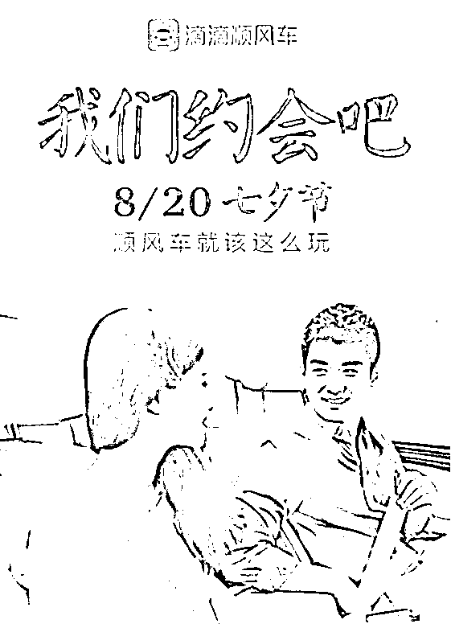
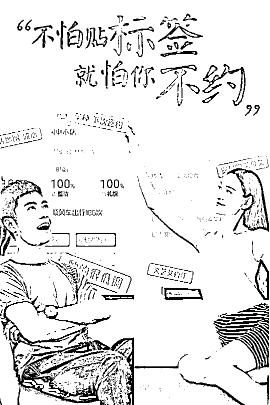
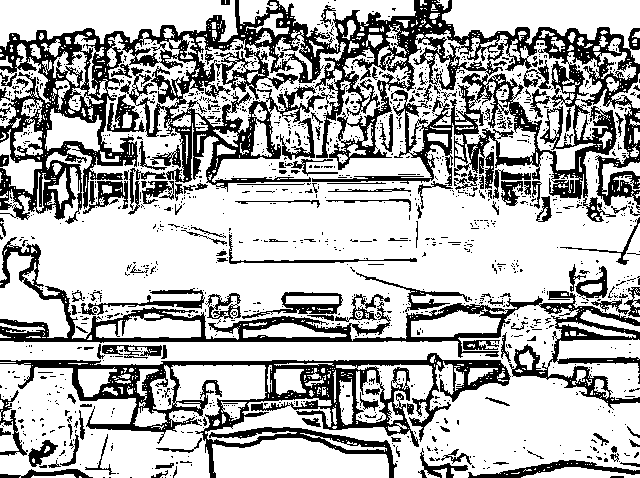

# 美貌空姐搭乘滴滴顺风车被奸杀，折射出大企业的贪婪和不负责任

紫竹张先生

经济-金融-投资，点击右边按钮关注我

近日，一起恶性刑事案件牵动了中国人的心，一位刚刚 21 岁的漂亮空姐，在搭乘滴滴平台顺风车回家的时候不幸被奸杀，身中 20 余刀，在自己风华正茂的年龄香消玉殒。她的个人主页在 5 月 1 号刚更新的一张自拍图，足以说明这位女孩子乐观幸福的生活现状，却遭此横祸。在事件之后，她的主页有大量的人前来悼念，我也认识了这位漂亮可爱的女孩子，很抱歉用这样一种方式认识你，祝一路走好。

凶手是实名制的，据最新警方通报称，凶手溺亡在河里，尸体已经打捞上岸，其 DNA 对比分析和案发现场搜集的证据一致，可以锁定为嫌疑人，案件至此告破。

案件虽然告破，但是人们的恐慌心理丝毫没有缓解，今天是这位漂亮空姐遇害，下次会不会是我们家的女孩子遇害，我们还能安心的打网约车吗？网约车大幅度的增加了社会运行效率，降低了人们的出行难度和出行成本，取缔是不可能的，那属于社会倒退，更何况，换成出租车就没有风险了吗？整个社会任何出行工具都有出事的风险，以前正规出租车也有很多黑案底。

话虽如此，但是我这里还是要说，这件事情，滴滴公司的责任非常大，甚至可以说是始作俑者都不夸张。为什么这么指责滴滴，我是有道理的。

首先我们看看滴滴平台对于顺风车的产品设计，看看车主端这里的评论区吧，**某些车主的色眯眯的猥琐嘴脸都快溢出屏幕了**。

**打个车而已，为什么要特地对乘客的长相身材进行评价**，因为滴滴的产品经理设计的时候，就是把顺风车当成社交软件来进行功能定位的，试图以顺风车作为切入口，进行社交领域的突破。滴滴并不是疏于管理才导致留下漏洞，这个漏洞是它故意留下的，不信的话，可以看看下面这张滴滴的广告图。

乘客只是来打个顺风车回家的安静小女子，不是来和你约会的炮友，什么叫我们来约会吧，顺风车就该这么玩，不和你约会就不能搭你的顺风车是吧，简直是莫名其妙。更过分的是，滴滴还特地设定了一个功能，如果司机满意了就可以免单，免费接送，我想问一下，乘客在什么条件下才能让司机满意，愿意免费搭乘，这就给司机性骚扰女乘客埋下了伏笔。而且滴滴还特地把广告中的车主设定为男，乘客设定为女，不怕贴标签，就怕你不约。

贴的什么标签呢，贴的就是**颜值爆表、气质优雅、声音甜美、知性美女**等标签，以及**想入非非**等留言。看完这种标签和留言，你会有什么冲动？我觉得效果和看了小黄片也差不多了吧，虽然犯罪主体是车主，但是滴滴绝对是有个诱导的责任是跑不掉的，这样的产品设计，大幅度的增加了车主犯罪的概率，也增加了女性遇害的概率。这和女性穿着清凉上街头犯罪是自己诱惑罪犯的概念并不一样，因为女性穿着打扮只要符合社会风俗法律，自身并无过错。但是滴滴是一个平台，不设定这些标签对实现顺风车功能毫无影响，但是偏偏故意设定这些标签和留言，鼓励并增强车主有艳遇的幻想，这就是滴滴的不对了。刘振华奸杀空姐一定不是蓄谋已久，因为他并不知道自己接到的乘客会是谁，没有一个司机在开车前满脑子想的就是奸杀女乘客，而案发曝光后自己跳河自尽也说明他根本承担不了这样的后果，那么他当初作案的时候，更有可能是**一时冲动，精虫上脑犯下大错**。

那么滴滴为什么宁可冒着安全风险，也要设计这样的艳遇产品呢，因为互联网的世界，就是流量的世界，就是社交的世界。一款社交 APP，能够低成本的获取大量流量，你不需要更新任何内容，只需要做一做平台维护就好了，用户会和用户自己聊的不亦乐乎，赚钱赚到手抽筋。我们可以看一下腾讯的 QQ 和微信，就的典型的社交平台，坐拥如此之多的用户，不管推什么游戏和产品出来，腾讯都能立刻获取巨大的财富。

但是**社交平台的护城河是很深的，用户黏性很大，**一旦使用某个社交平台，如果要迁徙，你就要和你的所有的聊天朋友全部迁徙到这个平台，这基本是不可能的，只要你还有一部分朋友懒得换平台，你就只能继续使用这个平台，否则你无法和他们联系。阿里、京东、雅虎，各种各样的大公司都试图推出过自己的社交产品，无一例外都失败了。

滴滴并没有建立自己社交产品的雄心，那太难了，他可能只是想做一个伪社交产品，加入一点社交元素，加入一点约炮的元素，来进行一次尝试，如果尝试的成功，他可能就会正式进军，而在前期，他们选择消费女性用户，利用女色去吸引注意力，来廉价的推广产品，用女性用户的美色来降低自己的产品推广成本。

这种事情阿里就干过，2016 年底，阿里开始尝试进军社交领域，推出圈子功能，在圈子功能中，仅有女性用户可以发布图文消息，而男性用户可以进行点赞打赏，和滴滴的网约车产品设计何其相似，女性用自己的美貌展示来换取金钱，所以后来**阿里喜提“支付鸨”的称号**。

不过阿里好歹还是女用户主动上传，她们自愿用美色换取金钱。但是滴滴的女性用户连自己决定是否上传的权利都没有，乘客年龄、身份、喜好、学校和家庭所在地，车主对乘客外貌身材的评价，这些都是女性乘客的隐私资料，而车主可以轻易获得。顺风车本质上还是一款搭车软件，做成了社交软件的模式，扰乱了公（载客赚取路费/付钱搭车出行）私（撩妹、约炮等/用美色换取好处）的边界，从本质上，这种行为属于强制贩卖用户隐私牟利，牟利的形式为吸引了大量司机资源的加入，降低了公司产品的推广成本，其损害的，就是女性用户的权益。

这一次滴滴公司宣布百万悬赏嫌疑司机，后续也宣布对遇害乘客进行补偿，估计赔个一二百万，媒体和公众都会认为滴滴是个负责任的平台。那为什么滴滴宁愿等出事之后进行补偿，也不愿意提前堵上这个漏洞呢。

因为便宜啊，**出事也就赔几百万而已，不出事就可以一直这么运营**，滴滴当年开拓市场推广产品的时候，巅峰时期一天就烧掉近千万，哪怕能让运营时间多拖一星期，赔这个钱都是划算的，而且是非常划算。其实在一二年前，关于滴滴顺风车司机对女乘客进行语言性骚扰的爆料贴就数不胜数了，但是投诉一律没用，平台置之不理。这次杀害乘客的司机刘振华，就曾经被女乘客投诉性骚扰，如果当时能禁掉他的司机资格，悲剧也不会发生，但是滴滴没有这么做，他也不会去这么做。

因为**滴滴平台本来就是打着艳遇的噱头去吸引车主来开顺风车的**，专职司机一天开十几个小时，一个月才赚几千块钱，顺风车每天就开一二次，顺路接个人而已，能赚几个钱，如果没有艳遇的噱头，滴滴上哪里招募司机资源，既然有艳遇的噱头，那自然免不了语言骚扰，女乘客不喜欢才叫性骚扰，女乘客如果喜欢那不就是你情我愿的艳遇了嘛，和司机聊骚聊的开心了还能免单呢，滴滴怎么会干涉这种事呢。

在这种消费女乘客美色的推广基础上，长相好看的女乘客单人搭乘顺风车遭遇性骚扰必然是个普遍现象，而出现这种见色起意精虫上脑的奸杀案件，也是早晚会发生的事情，滴滴公司为了降低自己的运营成本，人为增大了女乘客的人身安全风险，折射出大企业的贪婪和不负责任。

用户的隐私安全是如此的重要，泄露用户隐私就必然会导致用户的权益受损，在滴滴这里，故意释放用户的隐私，尤其是美貌年轻女子的隐私给顺风车司机知道，只是为了以艳遇的噱头吸引司机加入来降低运营成本，本质上属于触犯法律。**我们可以看一下美国的 Facebook 公司的案例。**

一家名为剑桥的数据分析公司，通过一款心理测试的 APP 获取了 Facebook 部分用户的基础数据，这些基础数据是一些非常普通的数据，但是剑桥公司通过大数据分析，能够推导出这名用户的喜好，就好像现在很多人经常看某领域的网页，系统就拼命给你推送这个领域的产品一样。

这属于典型的搜集用户隐私，虽然对于单个用户来说，搜集的隐私好像并不致命，也没有给用户带来电话骚扰甚至侵害什么的。更甚至这些数据并不是 Facebook 想泄露的，而是剑桥公司通过不当手段获取的。但是美国是怎么处理这件事的呢，Facebook 的总裁扎克伯格被传唤到参议院进行听证，美国参议院商务、科学与交通委员会和参议院司法委员会针对 Facebook 举行了一场联合听证。

44 名参议员对可怜的小扎进行狂轰滥炸，整整 5 个小时的轰炸时间里，全美各大电视台都进行了全场直播，稍微有一个问题回答的不妥当，等待脸书的就是另外一个大漩涡，脸书用尽了各种手段，付出了极大的代价，才把这件事给摆平了。

而**滴滴的行为，明显比脸书恶劣的多**，并非其他公司窃取，而是**自身故意泄露**，目的也很明确，**为了降低自己的推广成本**，如果滴滴在美国运营，出了这件事之后，早就被美国参议员的炮火给轰炸成渣了。

中国的大企业，在赚钱的同时，不能让贪婪蒙蔽了自己的良知，不能因为法律不规范，惩罚不严厉就采用侵犯用户权益降低自己成本的事情，这是企业社会责任的一部分。虽然中国的法律对大企业滥用用户隐私数据几乎无能为力，最终导致了空姐搭乘顺风车被奸杀这样的惨事，但是在法律不能惩罚滴滴的时候，我们可以通过道德和舆论的力量来谴责滴滴以及其他一切通过牺牲用户隐私牟利的大型互联网公司，迫使他们来规范自己的行为，这样才能保护我们自身的利益。

乘客搭乘顺风车被奸杀这种事，经过这一轮舆论大谴责后，我希望是最后一次。而滴滴顺风车用女性乘客的美貌和个人隐私吸引司机资源加入的恶劣行为，**我希望立刻从地球上消失**。

<link rel="stylesheet" href="view/css/APlayer.min.css">

