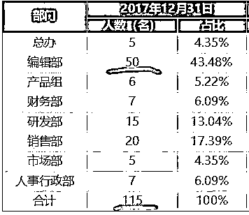
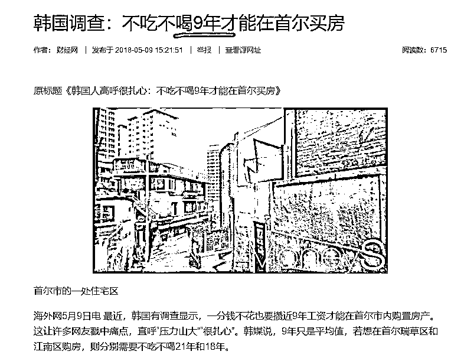
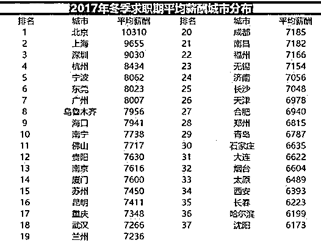
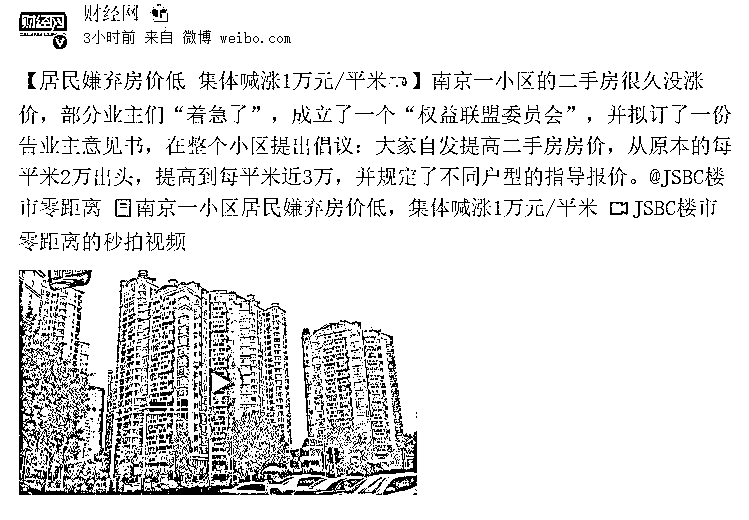
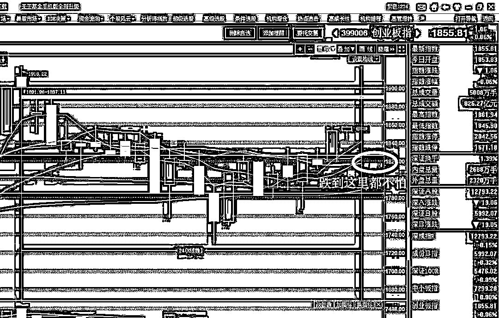

# 女人最喜欢看什么样的文章

紫竹张先生

经济-金融-投资，点击右边按钮关注我

 

昨天整个自媒体圈被量子云给刷屏了，这家位于深圳的公司卖给了 A 股上市公司，交易作价 38 个亿，而我在研究这家公司的数据中意外的发现了一个有趣的事情，那就是女人最喜欢看什么样的文章。

这家公司能估值 38 个亿，是因为他们总共运营了 1000 个公众号，其中第一大公众号卡娃微卡拥有粉丝数 1566 万人，这么多公众号要保持日更，怕不得几千人进行内容创作吧，但是并不是，按照这家公司披露的财务数据，这家公司总共 100 人，其内容生产部门，只有 50 人。

接近 1000 个公众号，总共 50 人负责，差不多平均一个人要负责 20 个号，而且其大号不是一天一篇，而是一天八篇文章，一个头条七个次条。对于我这种一日一更的人来说，也就是其生产效率大概是我的 100-160 倍，直接把我碾压成灰灰。

一个人一天要更新差不多 160 篇文章，这数据好像不对吧，按照个个都是短篇，每篇 1000 字计算，别说他原创，就算让他对着书打字，一天打 16 万字也不可能啊。其原因非常简单，这是一家纯粹的自媒体公司，他们的套路是不原创，直接从网络进行搬运和简单加工改写，所以可以达到一天百篇以上的战绩，按一天 10 小时工作制，一小时能产出 10~16 篇，几分钟就一篇，这快餐简直太有效率，和原创精品根本那是两码事。

但是这些营销号的文章呢，就是有人喜欢看，以其第一大公众号卡娃微卡为例，过去几天，其头条标题为：

*5 月 7 日：你见过老公哭吗？网友们的经历让人泪崩……*

*5 月 6 日：头胎才 14 个月就被逼着生二胎：没分寸的婆婆，中国女人心中永远的痛*

*5 月 5 日：被小姐妹毁掉的中老年妇女*

*5 月 4 日：穷养妻子的男人没有未来*

清一色鸡汤，而且是毒鸡汤，熟读这些毒鸡汤的女人会认为不认识口红色号的男人就是不爱自己，不管这个男人多么赚钱多么顾家多么洁身自好，离婚是最佳选择。而实际上，这些看似站在女性角度来攻击周围一切的毒鸡汤，是诸多女性公众号吸粉的不二法宝，他们根本不管这些内容是真是假，有用还是没用，是能帮助女性更好的生活还是更差的生活，只要能吸引眼球，吸引流量，他们就直接发送这样的文章。

而且更恐怖的是，这种文章已经形成了工厂化流水式生产，这些企业把女性的弱点和喜好挖掘的清清楚楚，可以每天机械式的生产类似的毒鸡汤，他们笃定，只要是这样风格的文章，女性一定喜欢。

这是多么可怕的一件事，这种女性鸡汤号的壮大，一半是不负责任的鸡汤文制造商的责任，另一半恐怕就是女性自己的原因了，如果拒绝阅读，拒绝关注这种公众号，而转而看一些理性、客观分析现实的公众号（比如我），这种毒鸡汤也不会那么泛滥。

老实说，这种文章套路我也能轻松的写出来，写出的鸡汤保管让别人像打了鸡血一样亢奋，可惜我责任感很强，我宁可写那些客观描述现实但是女性并不怎么喜欢看的文章，理性分析是我的特色，就算增粉慢我也认了。

* * *

我今天还看到另外一个事，韩国媒体抱怨都城首尔房价太高了，高到什么程度呢，**高到首尔人不吃不喝 9 年才能买一套房**，还特地强调说，9 年只是平均值，如果要在首尔中心瑞草区和江南区买房，那更是要高达 21 年和 18 年。

听起来好像韩国人民已经处于水深火热之中了，韩媒声嘶力竭的控诉高房价，我顺手百度了一下北京的人均工资，按照 2017 年冬季的统计数据额来看，月薪高达一万元。

当然，这个数据刚一出炉，就有好多北京人喷说自己被平均了，自己的收入扯了祖国大腿了。这个我们先不管，姑且算这个数据是真的，而且再姑且算这个数据是税后收入，没有扣税，没有扣五险一金，拿到手就是一万。

那么在这个数据下，北京人 9 年不吃不喝可以攒 100 万，21 年不吃不喝可以攒 252 万，100 万想在北京五环买房？252 万想在北京二环买房？做梦吧你，付个首付都不够。相比脆弱的韩国人民，北京人的神经简直太坚韧了，韩国人民必须向我国学习，别没事乱喊乱叫，50 年不吃不喝买套房还差不多。

除了北京人，今天南京人也闹新闻了，南京一小区的业主，嫌弃自家小区涨的慢，呼吁大家都提价，大家联手把挂牌价从 2 万提升到 3 万。

这种事情在房市里是个稀罕事，简直是在搞笑，可以博大家一乐，其实在股市里，这种事很常见，我们经常在某股的股吧里听到有小散呼吁，大家都不卖，这股就会涨停，到时候大家就都能卖个高价，这样大家都赚钱。

听起来好像是那么回事哦，如果大家都不卖，那么卖盘就消失了，一点买盘进来就能把股价推的很高。理想很丰满，但是现实很骨感，不管股吧多么热闹，小散多么团结，只要价格上去了，必然有人偷偷的卖，我自己赚一点钱走就行了，你们玩你们的涨停去吧，我不后悔，所以价格也就上不去。。。

南京这套小区是一样的情况，有很多业主闻风而动，有人听闻了这件事之后就去中介门店要求涨价 20 万，我不管是响应号召真心为了小区谋福利也好，还是想自己趁机多卖点钱也好，总之是有人涨价了。但是还有很多人，趁着其他人涨价的时候，原价不变，快速脱手，当地的小区中介接受媒体采访的时候表示因为小区体量较大，低价急售的房源依然有很多，‍经过买房人的理性选择，该小区最近一周的成交单价，依然保持在 21000 元出头，简单的说，我撤退，你殿后。。。

~~~~

今天**又炸一个传销骗局平台“云联惠”**，其骗局的核心套路就是弄了一个商城，搞购物返点，购物多少多少时间之后全额返还，我很久很久之前就说过，类似于这种购物全额返款的所有平台，全部是骗子公司，一律不靠谱，没有例外。

我曾列举过很多这种骗术，都是那种没有正经收入，而靠一些奇奇怪怪的噱头给予回报的公司，基本都在评论区，大家看了之后要记住。

还有一点就是很多人曾留言问，身边的朋友 XX 深陷某庞氏骗局不可自拔，问我怎么办，我的回复也一律是找几篇类似的骗局文章发给他，他能醒悟最好，不能醒悟的话，就劝他不要再追加投入了，其他也没什么好办法，有的人着迷了是叫不醒的，没办法救所有人，但是能救一个算一个。

~~~

今天三大指数收于横盘，上证指数跌 0.07%，创业板跌 0.06%，等同于不涨不跌，这个走势就是横盘，是非常健康的一种走势。在这波突破之后，即便创业板回调 2%，他都处于所有重要均线之上，还是多头趋势。

跌到 1816 我都不怕，都是直接淡定睡觉型的，离这里足足 40 个点，有什么好怕的，整个 5 月，基本就是睡后收入，睡一觉之后自己的市值就涨了，在 18 年整体去杠杆的熊市背景之下，5 月的难得的好时光，要珍惜，5 月我的确是越涨越卖，但是就涨一点我是不卖的，我还想多赚点。

今天的股市其实并没有太大波动，上上下下都属于微弱震荡，最终收盘也是横的不能再横了，而各版块也没有什么特别出彩和特别倒霉的，振幅过弱也没有做 T 价值，我今天自己的小 T 上下挂单都没有成交，就这么干瞪眼一天，躺着过去了。

不过躺着睡觉耗时间也有他的好处，这种上涨的趋势中，躺着过半个月，就能获得不少的睡后收入，过了 5 月，恐怕上半年都不会有什么好行情了，珍惜 5 月。

<link rel="stylesheet" href="view/css/APlayer.min.css">

