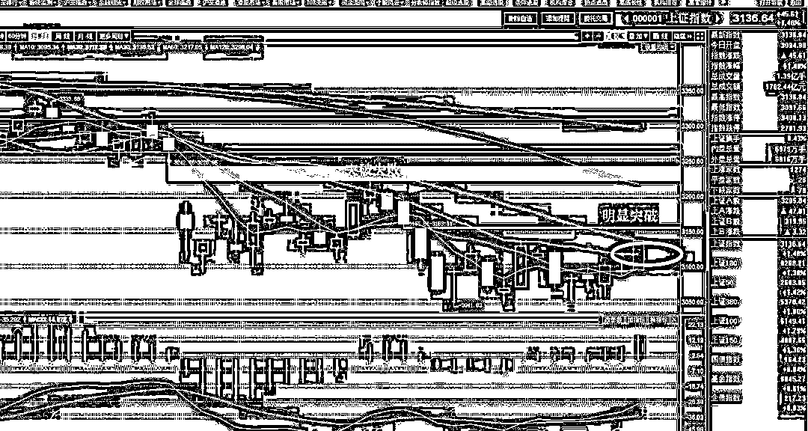
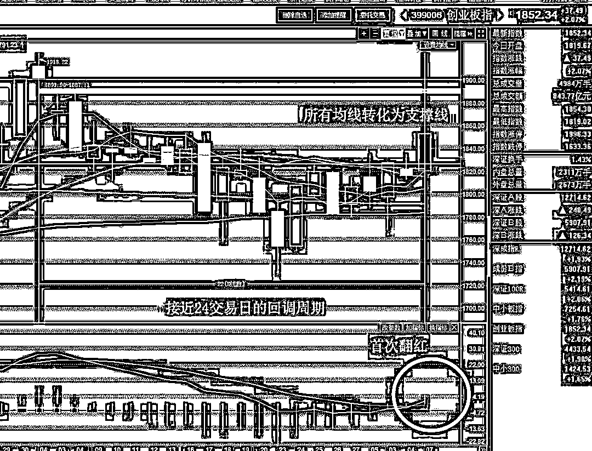
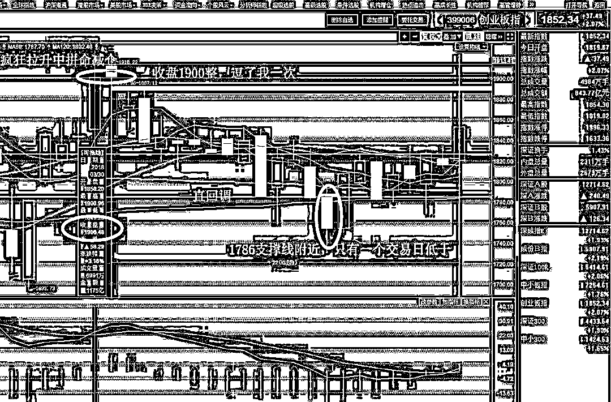

# 4 月重仓抄底，迎来 5 月的上涨

紫竹张先生

经济-金融-投资，点击右边按钮关注我

 

今天，市场发动一根中阳线，三大指数全面突破 20 日均线的压制，形成了一副明显的上涨姿态，创业板 5 月涨幅已经达到了 2.6%，上证指数也跟随上涨，数月来，首次突破 20 日均线。

而对于创业板来说，今天一根中阳线，站在了所有均线之上，下方的均线全部转化为支撑线，这根中阳线可以说标志着 5 月上涨的开启，而能预兆多空能量的 MACD，也首次翻红。这一切，在回调周期接近 24 个交易日的前提之下，可以说基本预示回调即将结束，上涨即将开启。

在 3 月末的拼命拉升中，我一路减仓，在 3 月末 4 月初几乎把创业板的仓位几乎都减没了，我疯狂看空，创业板接近 1900 点的时候，我曾说过绝无可能收盘站稳 1900 点，冲顶就应该空仓，否则打赌吃鼠标，我从未如此坚定的看空过，我认为整个 4 月都是下跌的，不可能涨。当时国家队和我开了个小玩笑，收盘硬拉到 1900 点整，一丝不差，如果能岔开 1 个点，我直接就封神了，可惜了我当时的一块巧克力，被我捏成了鼠标状。但是我的结论是没有错的，1900 点就是顶，然后整个 4 月都在狂跌。

在 4 月初，持币不动，就等下跌，然后在 4 月的中下旬，我提出回调大概应该持续 24 个交易日左右，结合五一的因素，应该在 4 月底之前，完成加仓，不求买到最低点，按照分批加仓的原则来做，我预设的合理回调点位大概是 1786 附近，实际走势，整个 4 月只有一个交易日是低于 1786 的，那一天是 4 月 23 日，遭到了中美贸易科技战中兴被制裁等大型黑天鹅，可以说这个点位制定的是非常合理的，因为超大黑天鹅是预测不到的，而我们提前制定的抄底策略才是正常的大概率炒股行为。

到 4 月底，把仓位提升到了重仓，坚定的看好创业板，同时认为上证也会跟着上涨，五一节假日，安心持股过节。在假期里，美股狂跌，假期之后，美国贸易代表团访华，诸多利空，一概不理，大 A 股自有国情在。四月我的口号是看跌，但是越跌越买，五月我的口号就是看涨，但是越涨越卖，这个口号我给大家重复强化不亚于半个月了。

那么 5 月什么时候卖呢，今天刚来一根中阳线，很多人就沸腾了，说我挣钱了，好开心，要不要赶紧卖掉止盈落袋。这就有点不对了，布局了一个月，才赚二三个点就要撤退，那还布局干嘛。我这里分析这一波上涨可能的见顶区间。

首先，1900 点是肯定挡不住的，在 3 月底那一波的上涨里，我打赌说 1900 点一定过不去，而这一波，我认为 1900 点是大概率直接被突破的，道理很简单，整个 4 月的回调，其实走势非常坚韧，回调速率极为缓慢，向下跌破 1800 点日子没有几天，基本都是靠贸易战等利空给砸下去的，如果没有这些黑天鹅，搞不好 1800 都跌不破。而今天创业板收盘已经 1852 了，刚刚起势，如果突破到 1900 附近就跌下去了，那顶多只能算个横盘，而且做个双头，会变得非常难看，那 4 月还不如一口气跌下去算了，不会有那么多买盘来这里布局的。

突破 1900 之后，我认为这一波创业板很难突破 2000 点，首先千整数关口那就是雄关，上证跌破 3000 点很难，创业突破 2000 点也很难，我怎么看，一口气涨那么多直破 2000 点，都悬乎，能回调再破，就很不错啦，而且涨到 2000 估计要耗费一个月左右，那就到 6 月了，6 月本来就缺钱，就算不跌，疯牛狂奔破千级别雄关，我怎么想那都概率有点小。。。所以，创业板我的打算就是在 1900-2000 区间，分批清仓，把仓位给降下来，5 月份是 4 月布局的收获期，越涨越卖，一波龙虾肉等收割，我第一波的计划是 1886 附近，这个位置我们大概已经赚了 5%了，个股的话大部分都 10%，而且这里有个缺口，可以进行第一步收割，我打算先减 1 成创业板，然后期待可能性的小回落再买回，估计会回踩一下 1856。如果买不回也没事，这部分已经赚到手了，剩下的在 1900-2000 区间内慢慢出，根据形势来，突破之后这里哪里是顶不好说，一步步来，到时候再看。五月清仓之后，6 月底我会看情况再买回来。

而对于上证指数来说，无脑出售，3200 之上开始卖，3200/3250/3300 附近各减 1 成，敢冲 3300 我就敢清仓上证，别看今天贵州茅台大涨 6%，18 年的风头不会在上证指数，当然暴跌也不会，所以筑底的时候我死命拿，冲高我就敢卖，跌不慌，涨不贪。

总的来说，在横盘筑底阶段，别说大阳线了，一根中阳线，千军万马来相见，今天这一根中阳线直接打开了局面，明后天不管是小阴线还是横盘，都属于上涨趋势，就算中阴线，也顶多打回横盘而已，而现在是 5 月初，做多资金已经开始蠢蠢欲动了，5 月收获的希望已经开始出现，虽然总基调是越涨越卖，把我们 4 月布局埋伏的筹码卖给那些追高的人，但是也别急着卖，一点一点的出，因为上涨不言顶，顶部不好测，只能大概预估，但是我这人有个特性，逃顶功夫是抄底的二倍以上，从 15 年股灾过来的人都知道我这个习惯，三次股灾全部高位精准逃顶，比抄底功夫高多了，所以不用担心坐电梯，高抛完全没问题，我甚至都有一丝追求精准高抛的贪念，如果是分批高抛，那把握性更大了。这一波做完，安心等下一个波段的埋伏和收获，如此反复。

<link rel="stylesheet" href="view/css/APlayer.min.css">

