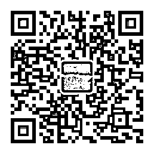

# 中美经贸磋商，美方谈判代表狮子大开口

紫竹张先生

经济-金融-投资，点击右边按钮关注我

 

本周五，中美代表在北京开始进行经贸磋商，周五夜间离开北京，与其说这是过来谈判的，不如说这是过来下通知的。而我方对这次谈判下的结论是双方进行了坦诚、高效、富有建设性的讨论。

1、双方均认为发展健康稳定的中美经贸关系对两国十分重要，致力于通过对话磋商解决有关经贸问题。

2、双方就扩大美对华出口、双边服务贸易、双向投资、保护知识产权、解决关税和非关税措施等问题充分交换了意见，在有些领域达成了一些共识。

3、双方认识到，在一些问题上还存在较大分歧，需要继续加紧工作，取得更多进展。双方同意继续就有关问题保持密切沟通，并建立相应工作机制。

这个典型的外交辞令，直白的翻译过来就是双方互不接受对方的态度，在某些领域达成了一些共识，但是没有谈妥，在一些问题上存在较大分歧，连共识都没有。而坦诚、高效、富有建设性的潜台词也很直白，坦诚就是有话直说，高效就是双方直接开干一天回国，建设性就是谈不成。

美国鹰来去匆匆，到底来北京谈了什么呢，根据目前已经披露的资料，我们可以看到美方简直是狮子大开口，开出的条件任何人都根本无法忍受。我把美方要求汇总如下：

美方要求中方要缩减贸易逆差 2000 亿美金，特朗普之前开价 1000 亿美金大家认为是狮子大开口是把，现在直接开价 2000 亿美金，中方要进口价值 2000 亿美金的美国商品，或者减少对美国的出口来实现这 2000 亿美金的逆差缩减。

关于这一点，胃口实在太大了，之前特朗普发推特开价 1000 亿都被认为是疯了，现在倒好，直接开价 2000 亿，这根本就是漫天要价，等着落地还钱，打个 5 折还剩 1000 亿呢。你以为这就完了吗？远远不是，美方的其他要求还有：

1、中国应立即停止对中国制造 2025 的政策支持。

2、中国应废止以市场换技术的政策。

3、中国应加强知识产权保护与执行。

4、中国应对美国开放外资市场，并应在 7 月 1 日之前，给出负面清单（也就是不允许美国投资的领域清单）。美国会检查这个清单并提出优化方案。

5、中国应移除在非关键领域的关税壁垒，在所有非关键领域，中国对美国商品的关税不能高于美方关税。

6、中国应接受美国与欧盟仍然不承认中国在 WTO 体系内是“市场经济国家”的定义，中方不反对。

7、中国应接受美国与欧盟仍然不承认中国在 WTO 体系内是“市场经济国家”的定义，中方不反对。

8、美国将审查中国对美敏感领域投资，如中国制造 2025 的那些领域。对于美方的限制，中国不得反对、挑战、报复。

9、美国将对自己认定的关键领域（如中国制造 2025 相关的）增加进口限制和特别关税，中国要接受这个条款。

10、还有更离谱的呢，每隔 3 个月，中美应开会，美方会检查中方进展，如果美国认为中国不够配合，没有完成上面的条款，美国会单方面对中国产品增加关税或进口限制，加到自认为足够的程度，中国理解美方的行动，不作出报复，不找 WTO 投诉。

这些条款直接把我给看傻了，这是啥东西啊，我都懒得评论这些条款哪些是合理哪些是不合理的了，如果是我去谈判，我估计都懒得开口和对方讨价还价，因为实在是太离谱了，换成我代表中国谈判，我谈的结果，估计也就是双方进行了坦诚、高效、富有建设性的讨论，其他没了。有些网友对此的评论很合我心意，那就是这种条约应该带着航母过来谈。

而美国人也没有任何谈的诚意，来的时候就已经提前通知了美国代表只呆一天，我周三的时候看到这个行程安排，就知道美国是来下通知的，压根没想过认真谈，而美国代表的态度也是异常的强硬。

简单的说就是，要么接受我的条款，要么贸易战开打。而实际上，就像上面网友说的，这种条款除非带着航母编队过来，否则是绝无可能同意的，也就是美国必然要启动 301 法案针对中国。

既然美国知道肯定谈不拢，那为什么还要特意派代表来北京转一圈呢，就为了蹭几瓶茅台喝？肯定不是的，我个人认为，特朗普这么做的原因，很有可能是他根本没打算短期结束贸易战，首先贸易战谈个很好的结果就很难，中美互相依存谁也离不开谁，但是如果谈不了很好的结果，下一任选举特朗普就肯定要下台。

在美国，所有政客的行为都是为了争取选票，只要能拿到选票，无所不用其极，那么特朗普把贸易战打的轰轰烈烈，所有选民就会把希望寄托在特朗普身上，贸易战打的时间足够长，过程足够艰辛，吸引的眼球和注意力才会越多。特朗普必须表现出一副为了美国制造业选民的利益拼了命的态度，已经为了获得最终战果遇到的 N 多困难，才能让选民把他视作希望之星。如果一二个月就结束了贸易战，那么特朗普的努力也太不值钱了吧。

所以，从这个条款我们可以推算出特朗普未来的政治方针，那就是贸易战会是一个长期、艰巨的拉锯式战斗，上次我预计的是半年，现在看来可能半年还未必结束的了。

# 人民日报对这次谈判发表社论:中方绝不拿核心利益做交换，回绝美方漫天要价。这一次，我支持人民日报，就和美国按半年的时间计划去慢慢打吧。

* * *

周五夜间，美股大涨，道琼斯指数大涨 1.39%。纳达克斯大涨 1.71%，美国代表只是带来了一份谁都认为不可能执行的声明而已，并没有任何成果带回家，所以我并不认为美股大涨是因为美方谈判代表过来狮子大开口一通要价，而是他自身要涨。

那么对于 A 股来说，周四的深 V 阳线之后，周五在不清楚美方代表会开什么条件的观望心态之下，走出了横盘小阴线整理，我感觉还是非常健康的。

在整个四月里，我们越跌越买，在四月底结束之前完成了加仓，仓位直接从轻仓提升到了重仓，非常看好 5 月的反弹，而从整体走势来看，最弱的上证指数已经跌不动了，连续多次向下试探 3050 点都被打回去了，有人死守 3000 雄关，而更强的创业板在四月的回调里，几乎没怎么回调，跌的非常少，只跌了 5%，相对于上证来说非常强悍了，而目前在诸多重要均线之上，对于一个还处于回调期状态的指数来说，非常之强悍。我们回过头里去看一下整体的走势，与其说他是在回调，不如说是振幅略大的横盘。

而对于一直拖累创业板的白马蓝筹来说，在业绩地雷陆续引爆之后，还稳住不跌的，那基本就暂时摆脱风险了，等所有的地雷陆续都引爆了，那么压在大家身上的枷锁估计也就打开了。我个人认为，随时可能开展一轮上涨行情，现在的图形明显已经筑底，向上突破是随时可能发生的事情。

这一波向上，在 1850 附近盘亘那么久，所以一旦突破，1900 是挡不住的，只是突破时间可能很长而已，所以我们向上暂时不卖，而向下有恐慌性低吸机会，就要大胆再度吃货，我 4 月份一口气把仓位提升到 7 成，始终留有 3 成子弹，就是因为预期的底部实际上比这个是要低很多的，但是他始终不跌让我很烦恼，4 月底之前一定要把仓位提升起来，否则踏空风险是远大于套牢风险的。如果有一次超大黑天鹅能把上证击破 3000 点，顺带把创业板给拖下去，那个时候就是满仓的机会。

但是目前看起来几率是非常小的，横盘时间越长，向上的概率越大，因为回调的时间已经高达 21 个交易日了，但是没事，在 18 年这种弱势行情下，7 成已经足够重仓了，没有天大的便宜，轻易不满仓。

对于下周，我是非常看好的，一句话，重仓持股待涨，涨起来之后，才考虑什么点位高抛，4 月越跌越买，5 月越涨越卖。

~~~

**今天发一个招聘广告****，**由于平时事情太多，时间精力不足，所以我打算招兼职创作人，能够帮我处理一些文案问题，要求爱读书、有一定知识储备，热爱财经和投资，在财经领域有自己独到的思想和看法，如果内容质量非常好，可以升级为内容合伙人，参与核心内容的创作与管理。

有兴趣的小伙伴以任意话题撰写一篇文章，和个人简历一起发送到邮箱 723791931@qq.com。

憋说话，扫我，瞄~