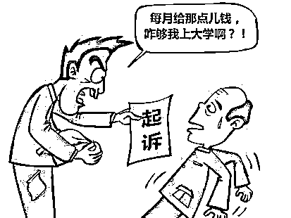
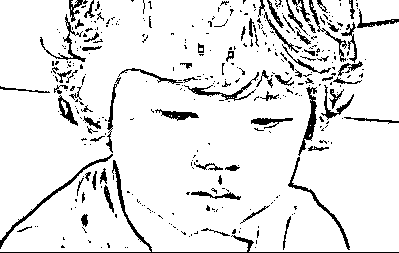

# 生几个孩子最符合经济学原理

紫竹张先生

经济-金融-投资，点击右边按钮关注我

 

今天周五，收盘之后打算说点杂谈，正经的大文章周六发，周日到周四交易日发文章，能让我想轻松愉快的随便说点啥的估计也就只有周五了。

今天说的是，生几个孩子最符合经济学原理。首先，在现代社会中，生孩子肯定是巨亏的，把一个孩子抚养到经济独立按 20 年计算，至少要花费 50 万+一套首付。。。而指望小孩养老回本，那是别指望了，他不给你啃出六个钱包，掏空全家族祖祖辈辈的钱去买房就不错了。

这种坑爹货生 1 个就够多了，还用讨论生几个吗？生小孩会明显降低生活质量，同时自己付出的投资基本看不到收回的希望，**从经济的角度来看，生小孩是一个比买中石油还坑爹的投资**。

**但是如果不生孩子的话，那么我们挣钱的意义是什么呢，**年轻时还好说，等到了五六十岁的时候，就感觉人生一点追求都没有了，了无生趣。而且处于物种繁殖的角度来说，人类天生是喜欢生育后代的，或许有人不喜欢生育后代，那么这种人的基因一定会随着时间化为飞灰，留下的都是愿意生育后代的，所以**虽然是亏货，但是从基因延续的角度来说，我们必须生育一个孩子。**

那么只生育一个孩子是否能保证我们的基因延续呢，并不一定，无论再好的医疗，再全面的保护，也挡不住意外的发生。据第五次人口普查资料推算，中国有大约 3.91%的人活不过 18 岁，5.1%的人活不过 30 岁。足足 3.9%的人活不过 18 岁，各种原因都有，这个概率就很吓人了，正常来说 18 岁以下的孩子是没有后代的，也就是说每 25 对夫妻，就有一对面临失独危机，这就很吓人了**，大概是你们一栋楼里，就会有 2 户人家失独！**

如果只生一个孩子，那么有大概 3.9%的概率无法成年，也不能给你带来孙辈作为基因补充，虽然是小概率，但是这种小概率一旦出现是非常致命的，能给你的生活带来毁灭性打击。对付这种小概率出现但是损失巨大的事情，最适合的莫过于买保险了，买保险是专门解决这样的困扰的。

但是很不幸，养孩子这东西就不是从钱的角度考虑的，而是从基因延续的角度考虑，如果从钱的角度考虑，那么一个孩子都不应该生。所以保险完全不能解决这个问题，如果孩子不幸死亡了，那么不管保险赔付多少钱，都无法解决这个问题，如果钱能解决这个问题的话，不生孩子能获得的钱更多。

所以，这个时候就要上另外一道保险了，我能想到的唯一保险，就是生二个娃。。。其保险费很高，保费大概是 50 万现金+一套首付，但是他可以把你失独的风险，降低到万分之 16，也就是一万对夫妻，才会有 16 个遭遇此不幸。

这个概率勉强可以接受，也许你不信，家里孩子保护的那么好，怎么会活不到成年，哪怕是万分之一也不能接受啊，概率不应该是 0 吗？

其实现代社会的成活率已经非常的高了，刚解放的时候国家做过人口普查，那个时候，中国人活不过 18 岁的概率高达 50%以上，人口的平均寿命仅为 35 岁。大家可以询问自己解放前出生的叔叔阿姨辈，他们那一辈，每一对夫妻平均会生育七八个小孩，其中活下来的，一般就三四个，其余全部因为各种原因挂掉了。

**为什么古人十四五岁就必须结婚了，因为着急啊，**至少要生 4 个孩子才能保证人口不缩减，要生 6 个以上才能维持人口正增长。按照怀孕+哺乳+备孕耗费一年半时间来计算，6 个孩子需要连生 9 年，这 9 年里，妇女一直处在怀孕、生产、哺乳、再怀孕的流程里，堪称生育机器。

按照这种极限算法，才勉强够繁衍用，因为夭折率太高，如果中间但凡出现什么意外，拖上那么几年，比如中间生个病耽误了怀孕什么的，那么恐怕时间就不够用了。还有一个就是这个平均年龄的问题，实际上大城市里，活到四五十甚至六七十的并不少，平均年龄定在了 35，因为 20 多岁因为种种原因挂掉的其实是很多人的，每次生孩子对妇女来说都是鬼门关，这不是开玩笑的，6 个孩子没那么好生，所以，古代的妇女生育对家族的贡献是非常大的，这一点回头展开说。

其实女孩子生育能力最强的就是十五六岁，男孩子也一样，大概二十三岁左右吧，然后就开始慢慢下滑了，到了 30 岁之后，你会发现，生育难度急速上升，怀不上的人特别多。在古代，30 岁还能抱上的孩子，称之为中年得子，宠爱的会不得了，因为 30 以上真的会很难生育，别相信什么现代食物激素多所以导致生育率下降的鬼话，生育率下降最关键的一点就是生育年龄大幅度提升了，好多城市里的人都是 30 多才开始生孩子。我可以明确的告诉大家，也就幸好现代医疗条件好，饮食条件好，那些 30 多岁的人还能怀上孩子，要是摊到古代那种恶劣的条件，30 岁以上还想怀孕，只能去求送子观音了，运气好会送你一个，难度堪比摸彩票。

然后扯回话题，生孩子，按理说是生的越多越安心，但是生育成本实在是太高了，多了实在生不起，生一个的话，4%的概率又有点吓人，所以**我认为生 2 个最经济划算**。

这里需要进行声明，我不是给二胎政策打广告，我今天只是科普数据，科普一堆数据，都是国家公布，网络可查的。养育孩子的成本有了，夭折的概率也有了，到底生几个划算，根据各家情况可以心里掂量一下，能生 2 个还是生 2 个，如果实在负荷不起，至少也生 1 个，没有孩子的话，赚钱真的没什么意义了。

长按上方二维码关注我