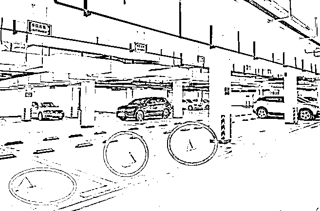
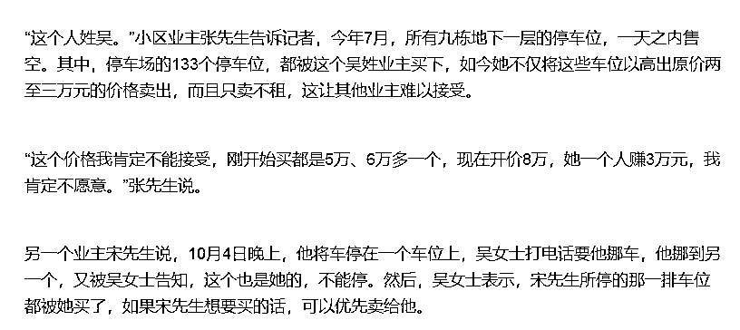
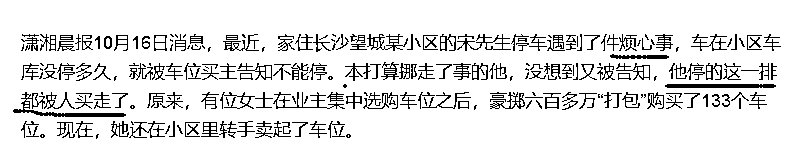
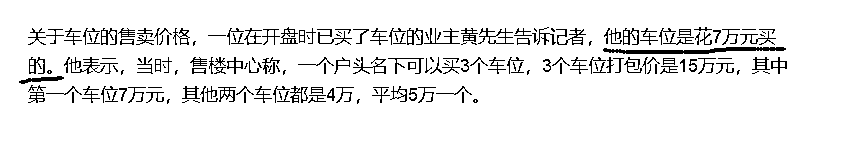

# 如何评价一次性购买 133 个车位的长沙业主

喜欢我的都关注我了~

这几天，媒体纷纷报道湖南长沙冒出的一个土豪，她一次性豪掷 600 多万打包购买了某小区 133 个车位，然后把车位锁上，直接每个加价 3 万在小区出售，而且只卖不租，引起了巨大的争议。

先看看详细背景，今年 4~6 月，这个小区业主进行了车位集中选购，当时购买车位开发商给予优惠，第一个车位 7 万元，第二和第三个车位 4 万元，打包价 15 万元三个车位，平均价 5 万元一个。

车位卖出了一部分，但是并不多，今年 7 月，有人发现，该小区 9 栋地下一层的所有停车位一天之内全部售空，经了解发现，不止 9 栋楼下，整个小区共计 133 个车位被一位吴姓女子买下。

这位土豪买下车位之后，立刻全部上锁，禁止其他业主停车，然后挂牌出售，只卖不租，且加价三万，引发部分业主巨大的不满。

这个不满的原因，主要来源于心态失衡，前几个月公开发售的时候 5 万一个都不愿意买，这才几个月就要 8 万一个，要是买了吴女士的车位，那感觉就像吃了苍蝇一样恶心，感觉自己智商被侮辱了，但是如果不买，又害怕后面车位被卖空之后没有车位可买。还有一个小原因就是当初买房的时候，开发商赠与业主免费停一年车位的优惠，这个优惠是针对没有卖出的车位可停，已经卖给私人的车位，自然不能免费停，原来可以很爽的免费停的业主变的非常不满。

囤积大量车位的吴女士是否涉及囤积居奇，是否涉及炒作车位，是否涉及违法，立刻激起的网民的热烈讨论。

法律和感情的冲突

吴女士这事，从法律上是没什么可说的，明显的不违法啊，买车位这个事情法律上并不禁止，他和买房子是两码事。

但是从感情上，很多民众非常痛恨囤积大量房产吸血的炒房者，他们找不到人可以骂，正好吴女士大量购买了车位并涨价出售，于是直接就把吴女士大量购买车位的行为等同于大量购买房产，找了一个靶子然后开骂。

实际上，市场经济下，任何商品都不应该有任何行为的限购，买卖自由，你喜欢大米，你买一万吨都是你的自由，别人只会惊叹你为什么这么有（sha）钱（mao），绝对不会嫉妒你家有一万吨大米。

但是什么时候大量购买大米有罪呢，那就是战争和饥荒年代，这个时候如果有人恶意囤积大量的大米然后高价出售，是会被政府严格打压和处罚的。政府控制购买大米的行为是违法自由市场准则的，但是在特殊情况下，是有利于社会稳定和发展的。

而房子，也是因为触发了民生领域特殊情况，所以才引来政府一系列的限制措施的，房地产市场并不是一个自由市场，大家怎么骂政府高价卖地都可以，但是他的一系列管制措施，的确遏制了很多有钱人入场炒房。

但是车位就不一样了，没有房子住，你可以说你活不下去了，要露宿街头，但是你没有车位就活不下了，这怎么看都是有毛病的，政府不会在这上面多加管制的。对自由市场干涉的越多，经济越糟糕，这是谁都知道的道理，房子只是个例外。

而实际上，该小区的车位是非常充沛的，吴女士虽然买了 133 个车位，但是依然谈不上囤积居奇。

物业的潘经理对记者说，小区 7 栋到 11 栋的地下车库，第一层共计 470，第二层也差不多，合计 900 多个车位。按照这个数据可以类推出，1~6 栋也差不多这个数量的车位，我不知道还有没有 12 栋，就算没有，这也逼近 2000 个车位了，吴女士的 133 个车位虽然看起来多，但是还是没有办法影响市场，只能说是个大买家而已。

开发商表示，吴女士一口气吞下 133 个车位后，目前依然还有 300 个车位可以租售，如果大家觉得吴女士的价格贵，欢迎来开发商这里购买。另外开发商还表示，吴女士购买的价格比集中选购阶段的业主购买价要贵，每 3 个车位大概要贵 5000 元左右。

看完这些信息后，我真的对那些“愤怒”的业主表示无语，不清楚你们在愤怒个什么，无非就是想占点小便宜没有得逞而已。什么叫“他停的这一排都被人买走了”，意思就是他一直没有买车位，以前老是在占别人的车位停呗。

开发商那还有 300 个卖不掉呢，你怎么不去买。。。

从经济学上分析吴女士的行为

上面是一次正常的口水对喷战，没啥好说的，这事几乎没什么辩论的余地。我今天想谈一谈的其实是，吴女士这种行为能否获利。

从表面上看，吴女士以 5 万的均价拿下车位，转手 8 万一个出售，肯定是暴利啊，这还用问吗，如果法律不管吴女士的话，那吴女士就是投资大师，膜拜的偶像。

我只能说，你们想的太简单了，吴女士的这种行为压根不赚什么钱，而且是很冒险的行为。首先，开发商那里的车位不是 5 万元一个，你回头再仔细看看，如果你只买一个，那么价格是 7 万元，如果你一次性买 3 个，打包价 15 万，这样才能算出来均价 5 万一个。

也就是说，如果你去开发商那里买一个车位，那么成本是 7 万，去吴女士那里买，成本是 8 万，如果你一次性向吴女士打包购买，那么肯定也会有相应的降价，不可能 3 个车位打包要你 24 万的，可能只有 6 万一个，打包 18 万。

赚 1 万也很多啊，难道不是吗？当然不是了，你想的太简单了。你看的是标价，而不是实际成交价。如果吴女士立刻卖掉了这 133 个车位变成了现金，那才算赚到了暴利，否则都不算。

把买来的货物卖掉才叫商业行为，否则叫收藏行为。。。我去淘宝买几万件商品，直接加价 50%挂上去，是不是我就发财了？当然不是，你这批货全部会砸你手里，亏死你，不信你去试试看。

吴女士这里也是一样，她的利润和她脱手的时间成正比，每多持有一年，她的成本都会增加。正常的商业融资率大概是 10%以上，这里面是包含了风险溢价的，也就是说，她一年不加价 10%，做这个事情毫无意义。

如果吴女士购入的这批车位，以均价 5 万买入，均价 6 万卖出，陆陆续续卖了 3 年的话，那么她是铁亏的。

另外还有最重要的一点是，车位的价格其实是个房价呈高度正比关系的，只不过是因为不能贷款没有杠杆率，无法吸引职业抄家而已。很多人会有这样的印象，小区里的车位不买，过几年就涨疯了，所以车位也是必涨的。持有这种印象的人，你可以看看你们小区那几年的房价，和车位上涨就是前后脚的关系啊，房价不涨车位肯定不会涨，房价一涨，车位很快就会涨。

所以，房子的租售比达到了 70 倍，靠租金 70 年才能回本，车位也差不多，因为没有杠杆的原因，租售比低了一点点，也低不到哪去。

很多人说，租车位多好啊，把买车位的钱拿出去存理财，都比买车位强，性价比太差。说完这话之后，转身就去售楼处排队抢性价比更差的房子了，这是大脑分裂症吗？

而大家都知道，租售比 70 是非常不正常的，因为最低的房贷都有 5%利率了，而你的出租收益只有 1.5%，换成这世界的任何一种投资品，让你以 5%的成本去购买，回报率只有 1.5%，你都会骂那个人失心疯了。

但是偏偏房子，你觉得没有任何问题，因为你押注房子一定还会涨，只要年涨幅高于 4%，抵消掉 5%的成本，你就不会觉得亏，一旦房子停止上涨，你就会大亏特亏。

而车位，其实也是一样，开着十几万的车，用着几十万的车位，在大城市非常普遍，而车位的租金其实并不高，投资回报率非常低，比房子好，但是也只有大概 2%左右，你存银行理财，都比这个强，但是为什么人们还是要买车位呢，还是因为赌它上涨。

所以，吴女士的这次购入行为，是在赤裸裸的赌她小区的房价上涨，如果房价没涨，反而下跌，车位的价格一定跟着下跌，这批车位砸手里几年没出货，那就别谈暴利了，不亏钱就不错了。

囤车位和囤房子是两码事，二者的区别大概相当于和平年代囤粮食和战争年代囤粮食的差距，完全不可同日而语。

更别提，我认为她这个阶段囤车位，可能根本挣不到钱，吴女士就算把价格标到 100 万，那也是她自己的事，如果不能成交，那就只能收藏起来玩一玩了。

大概就是这样，我今天写这个文章，不是告诉你们囤车位无罪，而是想告诉你们，这个阶段不适合囤车位，过一段时间在考虑吧。

觉得此文的分析有道理，对你有所帮助，请随手转发。

长按下方图片，识别二维码，即可关注我

近期精彩文章回顾（回复“目录”关键词可查看更多）

华为员工都这么穷，怪不得拼多多能火 | 房价跌 20%就会全面崩盘，地产杠杆远比你想的要脆弱 |  为什么碧桂园的质量那么差 | 清醒点，放弃全面开征房产税的幻想 | 央行和财政部隔空掐架，我支持央妈 |中国土地制度源自香港，但是香港却是劏房密布 | 为什么中介哄抢租赁房源，因为贩毒都没它来钱快