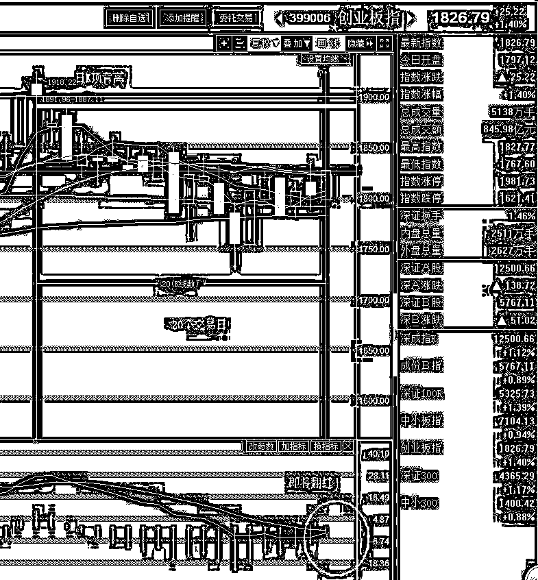
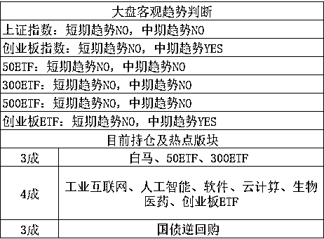

# 丹东房价一夜暴涨说明了什么

紫竹张先生

经济-金融-投资，点击右边按钮关注我

 

最近几天丹东房价刷屏了，前几天朝鲜宣布要和平发展经济之后，被围追堵截的炒房资金突然找到了一个宣泄口，那就是丹东。丹东是距离朝鲜最近的中国城市，有人把他类比当年香港和深圳的关系，如果朝鲜改革开放，很明显丹东的房价是一个利好，所以，丹东的房价起飞了，2 天之内暴涨 50%，从 3500 元飞升到 5500 元每平。

看到这里，我想起了 4 月份刚被冰封的海南房价，海南也是在中央出台利好政策之后，一夜沸腾，到处抢房，然后紧急出台多个政策才勉强冰封住。这些房价暴涨的事情，说明了中国的房市已经出现了和股市完全一致的炒作现象，这是典型的炒概念，炒题材，中国的房产市场，已然资本化和投机化。

其实投机资金的数量并不多，以丹东为例，这个小城市每天的产权办理速度只有 200 多户，每套房子的单价也就 5000,这就是一个标准的小盘股，突然被巨大利好给拉涨停，这就是无量封涨停啊，几天时间当地政府就反应过来了，能交易的房产没有多少套。

但是这种完全类比股市的现象值得我们深思，海南出利好了，海南版块概念直接涨停，海南房价也跟着涨停，丹东出利好了，房价也直接涨停。**这种速度的上涨完全是股市类投机资金的手笔了，**绝对谈不上刚需、自住这类话题。这和中央的“房子是拿来住的”是完全背道而驰的，可以说是对中央政策赤果果的挑衅。

所以，这些地区的房价一定会被限制住，海南直接套用当地缴纳 5 年社保才能买房的政策就让海南楼市一夜冰封，因为海南本地人才多少资金，海南又不是北京，一旦没有外地人的参与，少了资金，别说房子本来就有泡沫，就算这些房子真值这个价，一时半会他也涨不上去，因为钱不够多。要是当地人觉得不值这个价，那就更涨不上去了。

我个人是明确反对去海南啊，丹东之类的炒房的，海南我之前说过，今天我就说丹东。丹东这个地方算不算利好，算，应不应该大涨，我觉得按股市的预期算，他也该涨一半。但是他容量太少，承受不了多少买盘，而且一定会出台限制性政策，否则地方政府无法向中央交代。在和专业炒房团的大佬抢吃的时候，还要承受地方的限制性政策，我觉得划不来，尤其是**朝鲜开放也不是 100%的**，这里面也会承担一定的风险，如果朝鲜明确要 100%的像中国那样开放，丹东房价翻一倍都是值得的。

但是这里面的风险还真的是有的，朝鲜不可能像中国那样开放，邓爷爷那样的伟人是很少有的，中国改革开放等于否定了大半的政体，以至于**苏联和朝鲜都称 1978 年的中国为修正主义，**意思就是我们私自修正了社会主义的定义，修正主义不是什么好词，和叛徒的意思差不多。。。

但是就是这种修正主义，让中国发展神速，朝鲜如果要获得中国的速度，也要否定自己大半的政体，当年中国的毛主席刚刚过世，国内无人能大权独揽，哪怕邓都不行，元老太多，这也是改革的前提条件之一。对比**朝鲜目前金将军如日中天，大权独揽的威望，朝鲜要彻底改革开放，难**。朝鲜更可能的是那种不改政体，只打算吸钱的改革，这种改革效果很差的，中国改革初期尝试过，别说外资，连华侨都不敢来几个。

总之，我不建议去丹东炒房，这个是结论。另外海南和丹东的炒房热，说明当前的房市还没被压制死，如果把政府的调控手段称之为温和调控逐步冷却的话，那么现在只是从沸水压制到了 90°左右，仅从海南和丹东炒房热来看，我就可以大胆断定，整个 2018 年，我们不可能拿得到便宜的房贷，一定是基准利率上浮的，恢复下来至少等 2019 年再说了。基准利率上浮 20%和下浮 10%的利率导致的利息差距是很恐怖的，**30%多的差距。每年别人还 10 万利息，你就要还 13 万。。。**

~~~

据新闻报道，今天早上，美国贸易代表团将抵达北京，按照预定计划，将在周五和中方会面，并在周五夜间离开北京。

按照这个描述，好像谈判的时间只有一天？这个速度能谈个什么出来，是来例行通告美方态度的吧，稍微有一点分歧，那都不是一天谈得拢的，毕竟这都是动辄上千亿美元的生意，明天一天的谈判，我觉得顶多就是交换一下双方的态度，互相表个态，如果是正儿八经的谈判，应该是谈不拢就不走那才是正常的行为，不会预设离开日期的。

所以，今天早上处于对贸易黑天鹅的担忧而引发的再度跳水，在创业板杀跌到-1.8%之后，直线反弹，到了收盘，反而涨 1.4%，其中应该有一半的原因，应该是解除了对谈判的担忧。虽然不知道明天的谈判结果会怎么样，但是仅仅从这个谈判时间来看，爆不出太大的黑天鹅，小的让步可以接受，大的让步不可能美方过来喊一嗓子，我方就同意了，多没面子，至少也拉锯 N 天才有可能同意，那么仅仅一天的谈判时间，是不够的。

而在早上的时候，其实是很危险的，急速下杀是非常恐慌的，但是出于对近期筑底的信心，这里我们是坚定持股的，如果没有坚定的信心，早上说不定就被洗出去了，因为真的很吓人，长期横盘之后突然剧烈下杀，特别说一些老手。但是如果信心坚定的话，早上是个难得的日内 T 机会，今天的振幅真的很大，一天之内生吃 3%的涨幅很容易。

今天上午的这个下杀，具有明显的洗盘效果，对于回调末期来说，这种底部震荡的越厉害，则底部越扎实，如果能有个放量长阴然后下影线，那就预示一波上涨阶段 100%的即将开启。在上一次的顶背离之后，这一波的回调阶段是 24 个交易日左右，本来觉得结合一个五一假期的转折因素，可能会提前个几天，如今看，是提前不了了，不过已经度过了 20 个交易日了，就算五一的向上转折能量没有逆转过来，他也就只剩四五个交易日左右了。

而与此同时，MACD 也即将翻红，这个时候明天来中阴，也只是打回到继续横盘的状态而已，别说涨，哪怕是横盘，也能顽强的向上一步步慢慢拉红，那么在回调的末期，只要这个一翻红，很有可能由创业板带头的一波上涨阶段就再度开启了。

这一波的领头羊明显是创业板，蓝筹白马刚一个又一个的雷，股市不相信什么超跌反弹，而他们也不是超跌，去年涨那么多了，今年这只算是一个回调而已。不过即便不是他们领涨，跟着小盘一起普涨还是很正常的，这一点信心是很足的，因为上证的筑底也快结束了。

总之，整个 5 月，来黑天鹅只是暂时休息一下，没黑天鹅分分钟就会向上蹿，外围这几天跌的的确很惨，美股这回还在跌，跌的还挺多，-1.2%了，但是我国自有国情在，顶多一个低开而已，以前你涨那么多的时候也没见 A 股涨啊，现在 A 股跌辣么久了，怎么也该反弹一下了，有利空消息，也就顶多压制几天吧。

长按上方二维码关注我