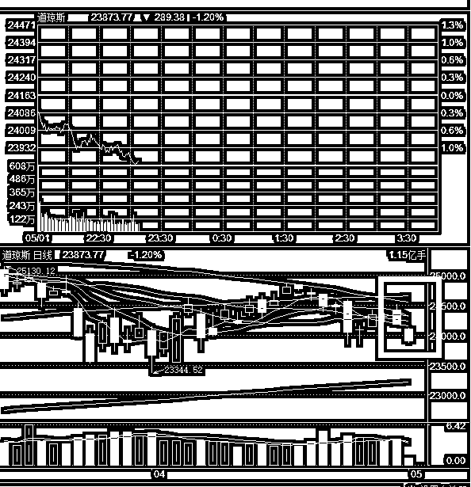
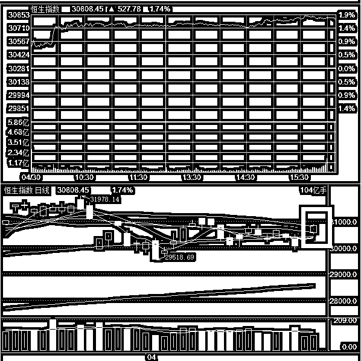

# 一转眼就开市了，假期都发生了啥？

紫竹张先生

经济-金融-投资，点击右边按钮关注我

 

时间过的好快。一转眼就开市了，按理说这个五一，有休市了四天时间，但是就是感觉特别快，产生这种感觉的原因，可能是因为这四天过的特别平静，资本市场没有什么太大的新闻，大家都去关心广西的**东北花臂哥偷香蕉事件**了。

偷香蕉事件我们有空再谈，说说假期发生的事情，假期基本没事，**美国忙着和欧洲打架，没空理会中国**。美国对欧盟的钢铝关税豁免是 5 月 1 号到期，法国和德国都去谈判请求续期，而且要求的续期额度是永久性。

哎，**我都不知道欧盟哪来那么肥的底气**，到期的关税豁免，是不是要求再续一年，而是直接要求永久豁免，搞的我一度以为这不是美国四处挑事，而是欧洲开始对美国发起贸易进攻。。。

特朗普当然不会同意，他现在全球到处点燃贸易战火，试图谈出点成果给美国选民交代呢，怎么可能会放掉嘴里的肉。特朗普要求欧洲主动放弃掉 10%的市场份额让给美国，然后我再谈谈关税豁免延期的市场，至于永久豁免，那是不可能的。

这事现在还在扯，美国已经把对欧盟的钢铝关税豁免延长到了 6 月份，看这个架势特朗普是一定要拿一点好处的，不然绝不放手。

至于对**中美的贸易谈判**，今天上午中国明确表示拒绝特朗普的二项贸易请求，第一个贸易请求是要求中美逆差缩小 1000 亿美金，这部分逆差中国希望通过购买美国高技术产品来实现，美国希望购买石油等基础产品来实现。第二点是要求中国政府官方禁止向人工智能等高端制造领域进行补贴和扶持。

这件事有二点看法，**第一点是美国实在太过分了**，类似这种方案估计提都不敢对欧盟提，就小心翼翼的要求降低钢铝 10%的份额都被明确拒绝了，中国的实力还是太弱了，特朗普对中国的贸易提案简直就是狮子大开口，对比起来对欧盟的贸易战就算赢了也只是开胃小菜而已，中美才是主战场。

**第二点就很奇葩了**，美国居然要求中国扩大对美初级产品的进口来弥补这 1000 亿逆差。我们从小到大被灌输的都是发达国家通过向发展中国家倾销高级工业产品，发展中国家只能向发达国家出售初级产品，这里面存在剪刀差，发达国家利用这个剪刀差不断的收割发展中国家的血肉。

按照这个理论，目前的现状是中国请求美国来剥削自己，美国不同意，然后美国要求中国来剥削美国，不然我跟你急？

首先传统的剪刀差理论肯定是没有错的，中国自己现在都在把一些低级制造业转移出国了，美其名曰对外投资，其实就是耗时耗力污染环境还不挣钱，索性挪到国外更穷的国家去赚一点人力和环境红利钱。那么唯一能解释这一点的，就是中国现在已经足够强大，强大到和美国相差无几，对于差不多的对手，比如德国和意大利之间，是不存在剪刀差一说的，双方都只想挣钱，同时不加强你科技树就行，中美目前就是这么个情况。

中国和美国的差距已经缩小到大概是德国和意大利的差距了，想想都有点小激动，争取早日缩小到德法之间的差距吧。这次的贸易战，弱还是弱，被欺负还是被欺负，不过**从一些小细节，可以看出来中国已经比以前强大太多了**。

* * *

由于假期的主要战斗是美国和欧盟展开的，所以对中国影响不大，美股连续下跌，到了今天晚上还在跌，这肯定是个利空，如果单独**看美股的走势**，节后要完。

但是**我们看一下港股**，很奇怪，在 4-30 日，也就是本周一的交易日里，港股奇怪的大涨，而且是异常强势的跳空高开+全天高位强势横盘。

在周一开盘之前，美股是大跌的，开盘当天，日本也没怎么涨，**香港股市突然这么莫名奇妙的暴涨肯定是有原因的****，**我个人估计，是打算对 A 股造成一定的影响，这种阳线会明显的对市场人气造成影响，毕竟，相对于欧美市场来说，港股对 A 股才是联系最紧密的，欧美对中国的影响，其实都是通过对香港股市产生影响之后，才侧面对 A 股产生影响的，因为外资很难参与 A 股，但是可以参与港股。

今天五月一号，香港放假没有开市，但是我个人认为，足够对冲掉美股连续大跌的影响，按惯例美股大跌 A 股是要低开的，但是我认为明天可能低开的不会很多。

在这种行情下，我认为对我之前的战略判断干涉不会太大，节后的走势很明显比 4 月强势，上行概率大，**我个人偏向于多头**，持仓已经说明一切，在五一节前完成了预设的加仓动作，大仓位过节，不惧怕假期利空震荡，足够说明态度啦。

四月的走势是非常难受的，非常弱，各种利空黑天鹅漫天飞，隔三差五就冒个黑天鹅砸一下，密度之大瞠目结舌，不过四月总算是熬过去了，趁机加点仓，四月执行越跌越买的策略，五月执行的是越涨越卖的策略，这是总策略，至于细节策略，也就是什么点位卖过一段时间会告诉大家的。

长按上方二维码关注我