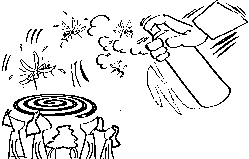
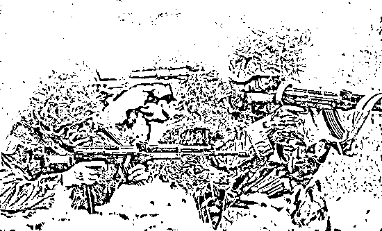
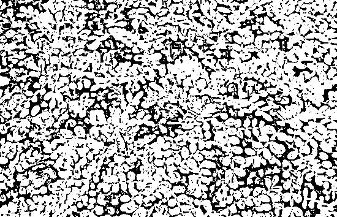

# 夏天驱蚊的几个小绝招

紫竹张先生

经济-金融-投资，点击右边按钮关注我

今天休息一下，因为平时的精品课程打磨时间太慢，反复优化导致 7 到 10 天才能堆出一篇，正好趁假期推进加速下，不过今天也有东西给大家看，去年夏天的时候我写了一篇关于如何驱蚊的方法，非常实用，今年夏天又到了，大家可以温故而知新。 

过了五一之后，蚊子开始逐渐活跃，从南方开始向北方蔓延，到了六月份的时候，全国都应该笼罩在蚊子的阴影下了，这个时候说防蚊还是比较合适的。

常规家庭对付蚊子的方法，有蚊香和杀虫气雾剂二种。对于高层住户，房屋密闭性较好，蚊子也较少，纱窗就足够防蚊了，通常对于零星进入的蚊子，全房喷杀虫气雾剂即可。对于低层用户，5 楼以下，尤其是对于那种开放性较大的房屋，蚊子进入渠道较多。比如你在 1 楼，即便你住的是别墅，也很难逃脱蚊子的魔掌，你开一次门，就能进几只蚊子，而房间里只要有 1 只蚊子，你一个晚上都别想睡好觉了，所以通常采用蚊香进行长时间的驱蚊。

今天给大家介绍的是**新兴的驱蚊方法**，很多人应该已经知道，但是更多的人应该不知道。

10 年前，英国特种部队为了解决野战部队在野外丛林被大量蚊虫叮咬的问题，发明了驱蚊水，只要喷在迷彩服上，可以保证 8 小时蚊虫退避，我国到目前为止，都把这项物资作为野战部队和铁道工人的标配物资。从 3 年前开始 广泛进入民用领域，野战部队的最初发明，效果良好，但是不能喷皮肤，只能喷在衣服上，弱毒。目前已经研发出了宝宝用品，虽然效果略弱，但是无毒，是可以直接喷在宝宝皮肤上的那种，价格也便宜，淘宝大概卖一二十块，不过还是建议喷在衣服上比较保险。喷了之后有什么效果呢，你带孩子出去玩，去热带丛林地区，别的孩子被蚊子咬的满头包，你家孩子身上干干净净一个红包都没有。驱蚊水，最适合的情况，就是户外运动，尤其是去蚊虫多的野外进行运动，备上一瓶，你会舒服很多很多。

除了驱蚊水，这世界上还有一种东西叫**驱蚊草**。记住是驱蚊草，并不是猪笼草和捕蝇草。猪笼草和捕蝇草专门灭杀苍蝇之类的飞虫，但是对蚊子无效，因为他吸引不来蚊子。而驱蚊草，始终释放一种让蚊子厌恶的气息，一株没多少用，但是如果有个十几棵，这一片区域蚊子是不会来的，驱蚊水就是以驱蚊草为灵感进行研制的。

驱蚊草对于高层用户没什么用，**对于别墅用户特别有用**，别墅的庭院里种上一小片，效果非常好，淘宝也有卖，非常廉价，就是邮费而已，大概是 8.8 包邮送 500 粒种子那种价格。。。

最后，祝大家五一快乐，节后发生的大概率是好事，不用操心。 

长按上方二维码关注我