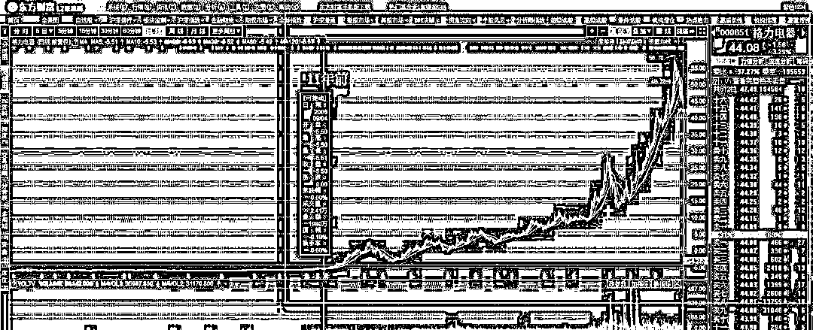
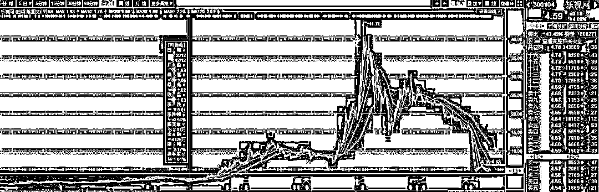
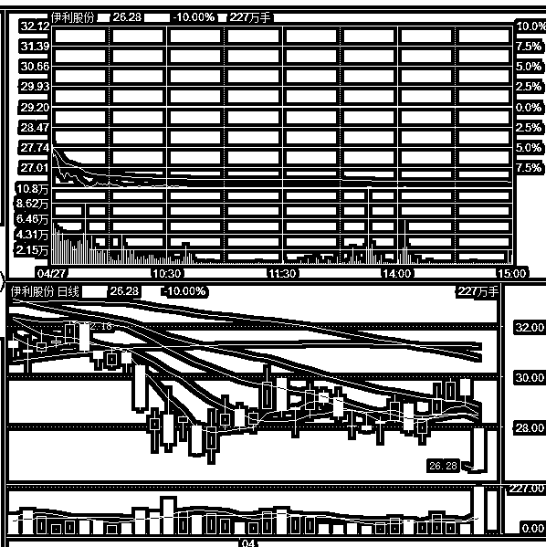
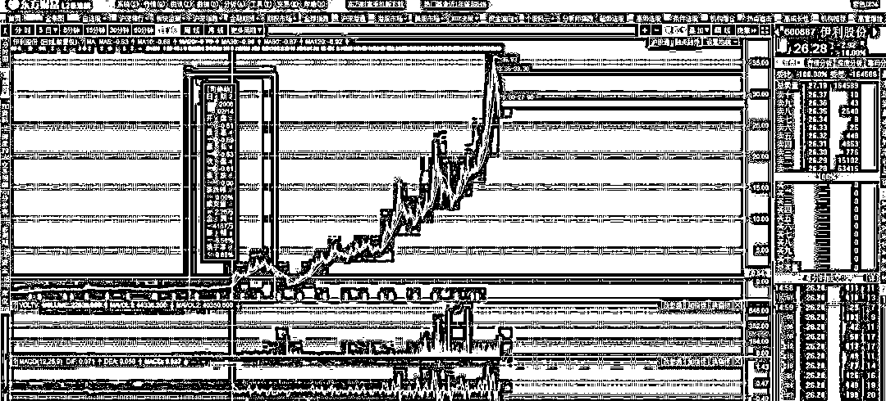
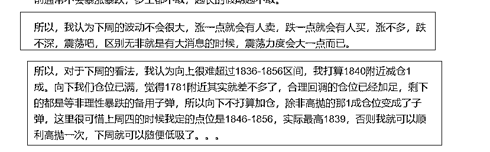

# 白马跌停潮，谁是好孩子，谁是坏孩子。

<link rel="stylesheet" href="view/css/APlayer.min.css"> 昨天格力跌停，今天伊利跌停，每天都倒下一个白马龙头股，引发白马跌停潮，这是为什么呢？

今天收盘之后，市场流言说：动物园的草不多了，过去一年里全喂给白马了，所以园长决定每天杀一只白马，好省点草料喂给马上入圆的独角兽。

哈，这当然是个段子，其实白马倒下的最根本原因是，不符合预期，也就是股价对不起他们自己编写的故事。以格力电器为例，很多人说是因为董明珠宣布要做芯片才跌停的，别的公司说自己做芯片都会涨停，而格力说自己要做芯片就跌停的原因，是因为格力真的要去做芯片。。。

其实事实不是这样的，格力就算做芯片，也是空调上面的普通芯片，技术含量很低，投入也不大，格力跌停的最关键原因是，他 11 年来首次没有分红。很多人不服气了，A 股很多公司从上市到现在几十年从来没分过一次红，这种垃圾公司都没有跌停，格力这么多年分了那么多红，一次不分就跌停，这不是鼓励坏孩子吗？

有一个著名歪理，就是好孩子和坏孩子理论，好孩子次次考 90 多分，有一次考试考了 80 多分分，被家长老师好好的训斥了一遍。一个坏孩子，次次不及格，有一次突然考了六十多分，家长老师大为称赞。这个歪理告诉我们的道理是，天天做好事的人，有一次不做好事就会被人骂，天天做坏事的人，有一天不做坏事了，就会被交口称赞，事实真的是这样吗？

肯定不是，我们以连续 11 年高额分红，今年首次不分红的好孩子格力来看，时间拉回到 2006 年，从 06 年开始，连续 11 年，格力的股价呈现单边上涨不回头的走势，和之前 N 年的底部横盘萎靡不振形成了鲜明的对比，08 年股灾，15 年股灾，对格力来说，都只是上涨途中的一个回调而已，活脱脱的美股走势。如果 06 年买入 100 股格力持有不动，如今仅仅通过分红除权，成本都被打到了-5.5 元以下，对应今天 44 元的股价，简直恐怖，对这 11 年来的格力股价他们的口号是，没有最高，只有更高。

格力在这 11 年里玩了什么高大上的概念吗？没有。做了惊天动地的重组并购吗？也没有。法宝就是空调卖的很好，业绩年年增长，年年给股东高分红而已。所以，市场已经对格力这种好孩子给予了足够多的奖励，如果没有高业绩高分红的支撑，格力的股价就是飘在天上的无根之水。那么当高分红这个根基被抽走之后，格力的股价当然要吃跌停，这完全符合市场逻辑，预期你高分红，但是没有，那必须杀跌。

我们举例另外一个极端，玩概念，玩重组并购的大哥乐视网，从 12 年开始股价也曾是一路飙升，但是他的起飞借助的是创业板大牛市，借助的是概念泡沫，由于始终没有高分红的支撑，别说 11 年暴涨了，3 年之后就崩盘了。

这就是典型的坏孩子，格力电器仅仅只是不分红就会吃跌停，而乐视网经过大量利空，连续暴跌之后，如今别说愿意分红，只要乐视网发个声明说明年能还清所有欠款，实现企业盈利，乐视网至少 5 个涨停起步走。

这是市场在奖励坏孩子吗？并不是，因为乐视网的股价已经反映了预期，格力电器的股价也反应了预期，持有格力的回报绝对是大于持有乐视网的，市场已经奖励了好孩子，而且预期好孩子明年会做出更好的业绩，所以才会给今天这么高的股价估值。

说到业绩增长，就要谈一谈今天跌停的伊利股份了，昨天说格力跌停，其实只跌了 9%，加上今天的跌幅才算一个完整的跌停，伊利今天就牛了，完全跌停且全天封死，跌停板上放量买单入场都没能撬开，对于一只白马股而言，这种闪崩的走势完全不符合他的身份，蓝筹白马本身就是低波动稳健的代名词啊。

格力是因为不分红导致是跌停，伊利也是因为不分红吗？不是的，伊利今年决定 10 股分红 7 元，不算多，但是也不少啦，他跌停的主要原因是 17 年归属于股东的净利润只有 60 亿元，同比增长 6%。

要是乐视网，别说 60 亿了，给 0.6 亿净利润都能吃 5 个涨停，但是对于伊利就不行了，今年利润增速仅仅 6%，和去年比几乎没有增加？那你去年股价 17，今年 30，你觉得合适吗？伊利股份 06 年以来的走势是这样的。 

经分红除权，06 年的持股成本低到了-0.6，如今股价 26，虽然比格力差了一大截，但是也是赤裸裸的长牛股了，但是他并没有泡沫，分红虽然不多，但是年年业绩高增长，支撑伊利高股价的并不是年年高分红，而是年年都要高增长，这就是预期。今天预期破灭，自然要吃个跌停。

白马的问题并不是自身做的不好，而是去年涨的太高，按照 17 年白马爆发式的涨幅来倒推他 17 年的业绩，白马必须做到理论上的最佳业绩和最佳表现，才配得上他 17 年的涨幅，只要没达到这个最佳预期，那么就是不符合预期，就会一泄如注。。。他们还是比垃圾股强很多，但是垃圾股跌透了，股价过低，白马股涨多了股价过高，所以就导致垃圾股只要没利空就会涨，白马股必须出大利好才不会跌的现状。

这方面看到极致，就是上证和创业的区别了，去年上证一直涨，创业一直跌，今年就会反过来，所以就是我一直不愿意加仓上证的原因，3 成封顶，再怎么看筑底我都不买，拉高 3200 之上就开始分批出，创业逢低就买，上限 7 成，至今为止，效果不错。

上周末我和大家对本周的分析是，本周是节前最后一周，预估是总体横盘，涨了就会有人卖，跌了就会有人买，无非就是有重大消息的时候，振幅会大一点而已，原话如下。 

本周五天已经走完了，走势基本完全符合预期，唯一意外的就是，本周创业板连吃几个黑天鹅，各种莫名其妙的利空汹涌而来，所以本周收出了很长的下影线，不过最终还是收涨于 1805，周涨幅 1.28%，上证指数周涨幅 0.35%，基本横盘。

本周创业板的走势就是涨了看空，跌了看多，周一因为钱荒暴跌，周二三无理由暴涨，周四美国调查华为加格力跌停引发暴跌，周五再无理由暴涨，阴阳线都有点长。

不过我们可以发现的是，下跌都是有理由的，而且理由很充沛，并且都是市场预料不到的突发黑天鹅利空，但是上涨都是莫名其妙的，周二创业板收涨 3%，周五创业板收涨 1.37%，你说出啥利好了么，没有，莫名其妙的就涨了。

我对整个 18 年的看法是利空的，十年一轮回，今年很难有什么好行情，所以始终谨慎参与，以练手为主。尤其对于白马股，我向来的看法就是，价值投资只是投机口号，投机概念之一而已，没有什么价值投资一说，那个涨幅实在太不切实际了。公司是好公司，但是好公司只有搭配低股价的时候才是好股票。。。

但是对于创业板就不一样了，创业板有没有业绩，没有，是好企业吗，不是，就是投机而已，和价值投机差不多。但是从技术上来看，他跌不动了，那就可以买一点试试看。

创业最近不管是 1900 回落，还是整个 4 月的回调，还是本周的强势横盘，都非常符合预期，那么按照预期，5 月的时候，创业板会有所表现，不然对不住那么多利空都没砸死的创业板。

创业板拉上去之后怎么办，涨一截卖一截，创业板发动局部牛市几乎不太可能，不符合监管层价值观，不过涨一段还是可以期待的。至于上证就当压舱石放那吧，不做指望，不然一点仓位都没有也不合适，放着吧，上证再差，也不至于跌破 2850 股灾最低点吧，要是这个低点都破位了，还谈什么注册制和 IPO 啊。。。至于加仓他那是不可能加仓的，除非监管再呼吁我们价值投资，那我跟风。

五一放假之前，收个关门红，然后 IPO 的数据是 2 家 15 亿，监管这是让大家安心过节，大家可以舒服的度过自己的假期了。

~~~

马上五一了，祝大家节日快乐，阖家欢乐，今天没操作，就不发持仓图了。

长按上方二维码关注我