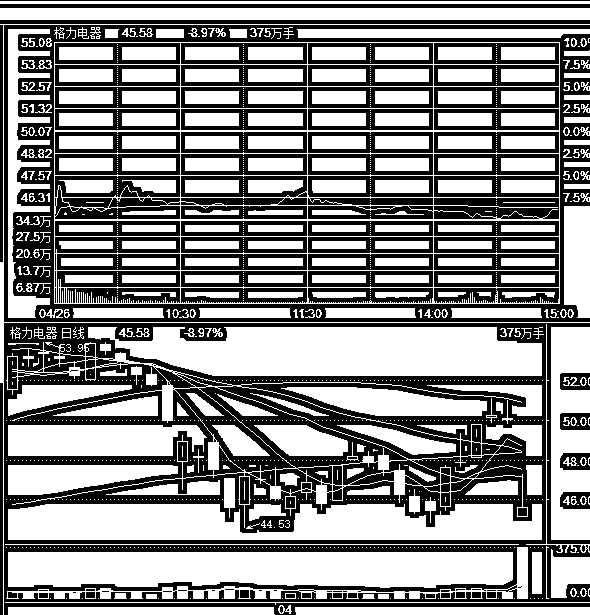
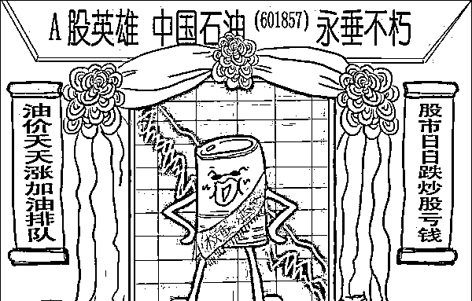
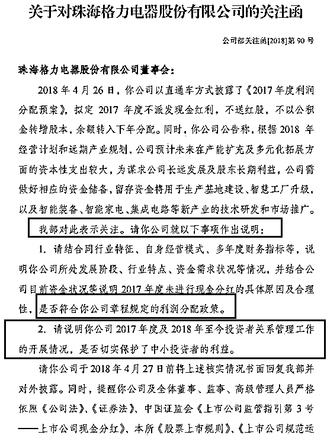
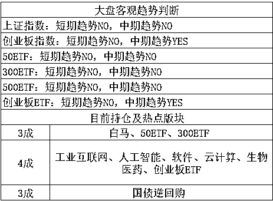
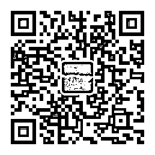

# 董明珠宁可拿 100 亿买理财都不愿意分红

<link rel="stylesheet" href="view/css/APlayer.min.css">

01

昨天晚上和大家说格力电器业绩增长 45%，净利润 224 亿元，但是居然宣布不分红，而与此同时，格力拿出 100 多亿去买了理财产品，董明珠宁可拿 100 亿买理财都不愿意分红，严重低于市场预期，因为他一直是价值投资的好孩子，市场预期他是一定高额分红的，也在股价上提前给予了溢价估量。然后今天格力直接就跌停开盘了，巨量成交 171 亿，**收跌-9%，无数机构资金出逃，格力的股东喜提跌停一个**。

很明显，**分红是格力维持和刺激股价的重要方式**，如果格力和大量垃圾股铁公鸡一样不分红，格力不可能维持如今的 2700 亿市值。格力的事情先不谈，我们谈一谈，A 股的历史，和过去大股东刺激股价的招数有哪些。

首先来到 1990 年，中国股市诞生，当时的背景是很多国企濒临破产，嗷嗷待哺，银行实在承受不了输血的任务，这些国企已经穷到连利息都付不起，拒绝继续贷款。国企向中央诉苦，再给我几个亿，不，几千万就行了，我就能把企业盘活。

中央也没钱啊，也不敢让银行继续承担这个风险，这些国企都和无底洞一样，最后到底能不能活谁也没个数。于是就设立了股市，为了保证国企的公有制属性，只拿出一小部分股份向公众发售，确保国资绝对控股权。

当时的情况是，民众拿真金白银认购国企的股份，国企拿钱回去救命，至于让出去的股份，那只是名义上给了民众而已，国资具备绝对控股权，企业怎么运转，小股东不可能有发言权。小股东认购的股份是可以流通的，而国资为了保证国企的绝对控股权不允许国企的股份流通，也就是股价涨跌和大股东一毛钱关系都没有，跌成 0 也无所谓，涨上天也没关系，所以分红，做业绩刺激股价什么的，更是不可能有。当时的股市现状是，国企从股市拿了钱回去就完全不管股市了，股市的钱就是白送的，国家用这笔钱保住了国企，也规避了风险，就算这国企破产了，按照股份制的原则，也是散户自己负责，国家无责，这笔钱连利息都不用付，多好的事情。而民众认购的股份，就是赌场的筹码，他们压根没指望过拿分红，也没指望这企业做大做强，就瞎 JB 炒呗，价值投资，笑话，这就是股市的第一阶段，赌场阶段。

02

然后我们谈谈股市的第二阶段，分红阶段。后来 A 股这种长期堪比赌场的行为让高层实在无法忍受了，企业上市就是为了圈钱，回馈股东根本就没在考虑范围之内，小股东对企业毫无影响力，大股东也无法从股价涨跌中受到影响，二者呈现绝对割裂，唯一产生联系的时候，就是 IPO 圈钱的那一刻。

所以，后来发动了**股权分置改革**，允许大股东的股份进行上市流通，而原先不能流通的股份，则应对流通股给予一定补偿来获得流通权，最终目标是实现大小非全面流通，大家的利益一体化。股权分置改革大幅度增加了市场的流通筹码，被视作巨大利空，每一次尝试性推进，都引起了股市的剧烈下跌，比现在的注册制还要恐怖。但是等全部执行到位的时候，也就是 2005 年正式宣布，股市触底回升，从 1000 点暴涨到 6000 点，开启了 3 年大牛市。

大股东的筹码可以交易了，股价涨他会受益，股价跌他会受损，这个时候大股东就开始正视股价了，小股东虽然还是很难干涉公司决策，但是至少双方的利益有的时候是有共同点的。这个时候大股东做市值管理，刺激股价的手段主要有分红、高送转、产业并购玩重组、员工兜底增持等等。其中唯一真金白银拿出来的，只有分红，其余都是玩虚的，这是股市的第二阶段，已经诞生了一批茅台啊，格力啊这种开始愿意分红的好企业，被统称为蓝筹白马，其余都是垃圾题材，只玩虚的不分红。

但是这个分红也是很讲究的，如果一个企业当初让出去 10%的股份，圈了 20 亿，多年累计分红 100 亿现金，是不是股东超赚呢？不是的，因为 90%的股份持有在原大股东手里，这 100 亿分红，90 亿是给了大股东，10 亿才是给了散户。而当初从散户手里圈走的钱，就有 20 亿，这根本不算巨额分红。所以现在网上很多分红表，对应的圈钱数量和历年累计分红数量的对比，都是有问题的，能对比的只有当初 IPO 发行的股份所分到的红利和当初 IPO 圈钱的对比。而不能忽略这个股份数量的差值，其中最凸出的典型，就是中石油，90%以上的股份都是国资持有，历年累计分红 3500 多亿吧，当年只募集了 500 多亿，分红总数看起来高达募资数的 7 倍左右，当中石油的股东是不是爽歪了？肯定不是，如果你当初 IPO 的时候认购了 100 万中石油股份，现在累计分到你手中的红利绝对不是 700 万元，零头都没有，不信你可以试试。问君能有几多愁，恰似满仓中石油。

030~~~~~~

然后我们就要提到股市的第三阶段了，中国目前连第二阶段分红提振股价都还只能少量推行，第三阶段就更不谈了，但是可以给大家介绍一下，大小股东权益天然不平衡，小股东很难对公司决策产生影响，大股东天然能控制公司，但是分红的时候却是按比例进行分红。极端的例子如 A 股的保千里，大股东能掏空上市公司 60 亿资产，小股东都别说干涉了，连察觉反对都做不到，小股东的股份投票权犹如废纸，但是分红的时候却是一样的分，这显然不公平。

为了平衡分红的时候大小股东的利益冲突，在美国最流行的做法并不是分红，而是回购股份，企业把盈利拿出来，并不分红，而是直接回购本公司的流通股然后直接注销，这必然会推升股价。而股价的上升对所有股东都有利，对于交易频繁的小股东来说更有利，对于交易流通困难的大股东来说，他能控制公司而小股东很难控制公司，也算一个权利的平衡，而且回购股份还可以免交红利税收。

由于美股强大的退市制度，已经形成了良币驱除劣币的氛围，别人都回购股份，你不回购，投资者就不买你家的股票，跌到一定程度整个公司的股东都受不了。这个时候，美股就进入了股市的第三阶段，**回购股份是刺激股价的重要手段，而是不是 A 股这种少量回购玩个花头概念**，美股那真的就是动辄几亿几十亿美金的回购，回购之后直接注销股份，等同市场上突然出现了几十亿的买单然后永久锁仓，你说股价涨不涨，比分红刺激有效的多，也公平的多。

对于 A 股来说，如果退市制度不健全，注册制不落地，无法驱除劣币，别说第三阶段了，第二阶段都还没完善呢。董大姐说的一句话是至理名言，我就是 5 年不分红，你们又能把我怎么着，要是可口可乐的总裁，借他十个胆子他也不敢对媒体这么说。

**所以 A 股任重而道远啊，未来要走的路还长着呢。**

040~~~~~~

谈谈今天股市吧，今天格力电器跌停，盘中遭遇 171 亿的巨额卖单，连绵不断的抛售让大量的抄底买单入场却始终拉不起来股价，深交所都着急了，发文质问分红方案是否符合股东利益。

监管的态度很明显，要的是风平浪静，**别给我惹幺蛾子**，董明珠这么个搞发引发了格力股价的巨幅动荡，而格力又是指标主要成分股之一，还有一个示范的连锁反应，监管不生气才怪。正好，今天凌晨，美国宣布对华为启动调查，引发了市场对贸易战扩大的恐慌，华为和中兴不一样，华为没上市，但是华为的很多供货商都上市了，中国软件今天在港股大跌 20%

于是大小盘齐跌，监管层更生气了，反正这个锅格力背定了，**当年要不是监管层罩着，董明珠早就被野蛮人给撵走了，如今居然不顾大局引发资本市场剧烈动荡，那还了得**。

在监管层的施压下，董明珠服软了，**昨天刚宣布不分红了，今天晚上立刻宣布，18 年会进行中期分红，**分不分红小股东甚至机构都没有建议权，只能靠监管插手，市场力量无法干涉，这说明中国离成熟的资本市场，还有很久的路要走呀。

我在周末的时候说过，本周属于横盘，不会跌，也不会涨，顶多碰上黑天鹅的时候振幅大一点而已，本周一开盘，剧烈下跌，盘中一片恐慌，我晚上坚定看多，五一节前不可能大幅下跌，要是非理性杀跌，我不介意把逆回购的子弹库都调出来。周二剧烈反弹，全面普涨，创业板更是大涨 3%，我开始看空，敢涨就敢卖，节前不适合大涨，1840-1856 我会卖出，周三冲了一下没冲到位，周四的时候由于格力不分红导致价值蓝筹股普跌，美国制裁完中兴之后今天凌晨宣布调查华为引发小盘股普跌，导致一片绿油油。

其实，就算昨天格力分红了，今天早上美国也不调查华为，也最多向上冲一点点，后面还是会跌，我对此有充分的信心，最多也就 1840 上面一点吧，这波没冲上去也无所谓，这位置我只打算卖 1 成的，也就是小 T，做不做都那样，4 月我们的任务就的月底之前，低位吃饱筹码，目前的拉升都是假拉升，真正的拉升，在 5 月。

创业板 4 月在 1900 点冲击失败后，向下跌的时候跌的如此缓慢，中间美国玩科技制裁，对以科技创新为主题的创业板构成如此之大的利空压力，也没跌多少，整整一个月，跌的幅度可以说非常少，至少比我 4 月初的预期要少，后来我都被迫提升底部高度来吃货，要是以前的创业板，4 月初的时候就跌成渣了，一地便宜等你拿。如此强势的对待利空，当跌不跌，一旦利空消停了，你说 5 月向上概率大还是向下概率大。

明天就周五了，节前最后一个交易日，**我的态度很明确，重仓过节**。

~~~

哒哒哒，今天仓位没动，小 T 没做成，不过走势既然符合大势，我们更安心，这都是碎肉，大肉在后面。

长按上方二维码关注我