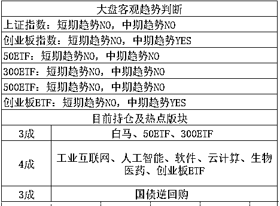

# 给妇女增加收入其实是害了他们

首先，感谢戳次条文章的，戳次条的都是真爱，关于楼市杠杆分析和六个钱包买房的，请戳头条，今天话唠停不住了。

首先我要说的是今天看到的一个新闻，河南新规要求给女职工必须发卫生费，至少 50 元，该办法规定，不得因女职工结婚、怀孕、生育、哺乳等，降低其工资、福利待遇；在孕期，女性怀孕不满 3 个月且妊娠反应严重，或者怀孕 7 个月以上的，不得安排其从事夜班劳动；孕妇难产的，可以增加 15 天产假；用人单位给女职工每月至少发放 50 元卫生费。

听上去好像好好哦，给女职工增加的可是实打实的福利，其实，这个福利看起来是对女生好，实际是凭空加重了女生负担，会导致更多的女性失业。如果政府真的对女生好，想增加女性收入，应该直接进行财政补贴，只要企业雇佣妇女，每个月政府出钱补贴女生 50 元，如果女生有产假，产期工资，政府来出，直接从税收里进行转移支付。

现在这种，政府不出一分钱，瞎出政策，你让企业多发 50 元企业就老实的多发 50 元啊，原来某女生工资是 A 元每月，现在会增长到 A+50 元每月吗？不会，每个月到手工资会变成 A-50，加上补贴 50，正好是 A 元。如果政府不允许，那么明后年男同志涨薪 100 元，女同志涨薪 50 元，正好打平了。

还不准？哇政策这么严格的啊，没有漏洞钻，要求男女同酬甚至女生更高酬，同时女生还有这么多福利，真麻烦，我不招女生了还不行吗。招了女生不给福利是违法的，不招女生总不违法吧，要么你政府来发工资啊。

市场经济自有他的规律，同一层的员工付出=收获，没有任何一个老板会有性别歧视，他们看待每一个员工，都是从产出来衡量的，私企老板会因为一个平庸员工是男的，另外一个优秀的不得了的员工是女的，就让那个平庸男当领导，简直是笑话，老板都是一切向钱看。

现在招工的手歧视女性，完全都是这些莫名其妙的女性优待政策所导致的，女性优惠政策越多，企业主越不愿意招女性，就算招来了，也是 10 分才能只给 7 分工资，因为你的另外 3 分工资，都体现在产假等杂七杂八的优惠里了，男员工没有这一条，所以能给 10 分工资。

所以，这种表面的女性优待政策，其实一点优待都没有，该拿的钱一分没有多拿，相反，是在给女性挖坑，对那些优秀的女员工，是大大的不公平。

鼓励女性生育，鼓励女性就业，就算要补贴，也一定是把企业的钱先整体征收上来，提升企业整体税负，然后再定点由政府补贴给女性，虽然从根子上来说都是企业出钱，但是这个激励是完全不一样的。

缺点也有，企业的整体税负已经很高了，再提升，企业受不了，于是政府只能喊喊这种不要出钱，实质上毫无作用的口号了。

~~~~

我昨天晚上刚举过小龙虾入侵个例子，今天就爆新闻了，小龙虾价格再次起飞，部分涨幅达 60%，资本入局搅动千亿元市场。

老实说，去年的小龙虾就已经很贵了，四五年前吃龙虾还是个很便宜的，适合大排档吃的东西，去年龙虾这东西已经被摆到了饭店上面，装修的还特别好，动辄二三百一盘，超级贵，如今居然告诉我部分涨幅高达 60%，你的意思是今年要卖三四百一盘？

小龙虾被吃到这个份上，真的是要吃绝种了啊，爱护小龙虾，从我做起，拒绝吃龙虾，放生大自然，吃的人少了，有利于降价方便以后拼命吃。。。。 

~~

今天热点散乱，东一锤西一锤，创业板收盘再度上涨 0.7%，收盘 1820 附近，强悍的不得了，周一的大跌不仅留个长下影线，被全部收复了，而且涨幅甚至把上周的总跌幅也全部收复了，周一的钱荒引发的下跌，简直是诱空。

今天创业板 1820，只要再涨一点，就到 1840-1856 了，我还是会卖的，但是有可能本周都到不了，因为本周不适合大涨，也不适合大跌，周一的大跌给了空头一个大大的教训，哭惨了，如果短期上涨过多，多头也会被教训，大家都这么认为，所以涨到这个点位有点难，如果二三天内到不了，那就放假了。。。

不过，对于节后，我还是非常乐观的，你想啊，整个 4 月，创业板始终在回调，从 1900 点开始向下调整了足足一个月，到了 4 月底，居然还在 1800 点上方，尤其是中间有大半个月，他是在 1850 附近晃荡的。

如此强势，愣是不跌的创业板，你见过吗？至少去年一年没见过，去年，甚至前年，创业板那可是爹不疼妈不爱，就一个字，跌，以及反弹后继续跌。。。

今天还有一个重磅新闻，格力业绩增长 45%，净利润 224 亿元创历史新高 ，但是拒绝分红，一分钱都不分，身为价值投资的龙头，居然不分红，你是鼓励投资者去炒差价吗？为什么董明珠今年不分红呢，因为去年和中小股东闹崩了。

他们的矛盾暂且不提，我觉得董明珠这话非常有问题，我就是 5 年不分红，你又能拿我怎么样，中国股东的地位可见一斑，就是没地位，这也是过去很多年，价值投资的大公司不受资本待见的原因。这里面，保险的野蛮人入侵才是激活的重要钥匙，因为野蛮人有能力掌控公司，对公司董事长构成了重大威胁，野蛮人的确是搅乱了资本市场，这是坏的一面，但是好的一面我们也必须要看到，没有野蛮人的威胁，这些上市公司实控人真的是无法无天，无人能治。董明珠还算好的，只是不分红显示股东无权而已，类似于保千里这种，实控人掏空上市公司 60 亿资产，小股东们也是无能为力，无法监管。

不提了，格力电器拒绝分红，利好题材概念股，就是那种没啥业绩的，就瞎炒概念赚差价的题材股，大部分聚集在创业板，所以利好创业板。

今天实在写太多了，不能再说了，要收笔了，其余的明天说，创业板再涨 1%，就先卖个 1 成，这波抄底已经很爽了，4 月越跌越买加仓任务圆满完成，剩下的就是越涨越卖。 

~~~

没什么要说的，表格没动。 

长按上方二维码关注我