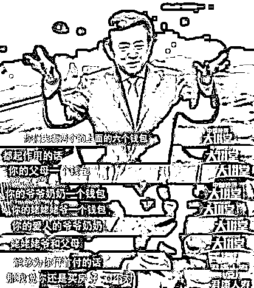
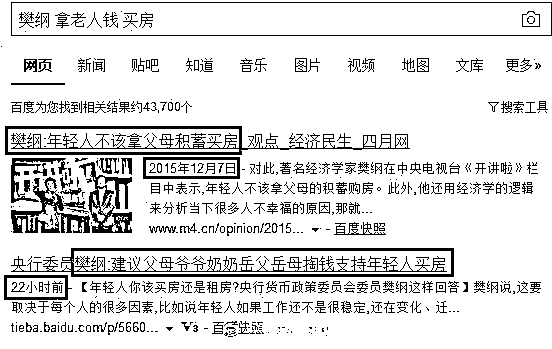
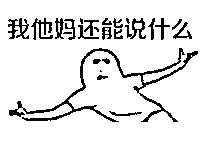
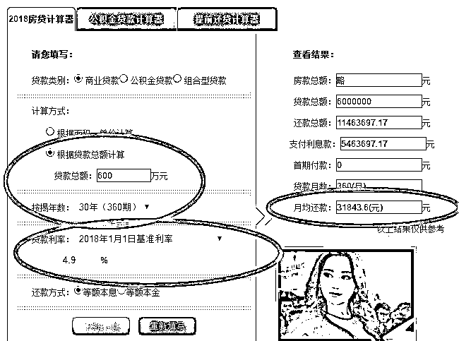

# 六个钱包买房真的合适吗，论杠杆牛市的兴起和崩溃

**紫竹张先生**

**经济-金融-投资，点击右边按钮关注我**

01

今天被六个钱包刷屏了，央行货币政策委员会委员樊纲用六个钱包的言论，把自己挂在了舆论的风口浪尖上，喷他的口水可以化成太平洋，那么他到底说了什么呢。

樊纲在一个节目里回答观众“**年轻人应该买房还是租房**”的提问时表示，年轻人结婚如果买房买不起，可以把你父母、你爷爷奶奶，姥姥姥爷，你妻子的父母，爷爷奶奶，姥姥姥爷这六个钱包合在一起，如果这六个钱包能帮你凑够首付的话，那么最好还是买房子。

六个家庭，12 个人的多年积累，拿出来给孙辈凑首付，这就是鼎鼎大名的六个钱包，真是倾三代之力凑一个贵族，不，是凑一个首付。然鹅，这位砖家，为什么说是砖家呢，因为他在 2015 年 12 月，这一轮房价翻倍暴涨的前夕，曾公开呼吁，年轻人不应该拿父母的钱买房，他之所以这么说，估计是因为那个时候房价已经 5 年不涨，然后泡沫还没挤干净，价格还是虚高。 

还是这个人，在这一波房价翻倍暴涨，泡沫在原来就没挤干净的基础上直接翻了个倍的情况下，居然让年轻人拿父母的钱买房了，不仅呼吁年轻人拿父母的钱买房，还呼吁拿父母的父母的钱，对象父母的钱，对象父母的父母的钱，整个家族榨干最后一滴血，掏空六个钱包来买房，简直是赤裸裸的高位接盘啊，还是在国家严控房价，大型调控的背景下，这位砖家的脑洞，我只能说 666，不然我还能说什么。

02

今天我讨论的重点并不是六个钱包，而是**如今房价的泡沫到底是怎么吹起来的**，很多人有这种疑惑，在北京，哪怕是郊区的小破房子，首付至少百万起，而且不能有贷款记录，至于去市区买，百万简直做梦，300 万起。而一个大学生起薪 20 万已经算是中国学生中的绝对精华了，5 年之后薪水涨到 30 万以上就算不错了。一年攒十几万属于非常省吃俭用了。

那么问题来了，就算是这么精华的学生，他凑够 100 万的首付都非常困难，这种人当刚需买婚房都难的话，中国的所谓刚需都是哪来的？中国人都那么富裕了吗，怎么跑出来这么多富贵的刚需，百万，几百万的首付都是天上掉的吗？

这里就要提一下杠杆的魅力了，在杠杆环境下，多头是越打越强的，一直打到泡沫崩盘为止。如果一个人 10 年前花了 30 万首付购置了一套总价百万的房产，现在翻了 3 倍，300 万卖出去，扣除银行贷款 70 万，净赚 200 万元，到手 230 万现金，拿出 200 万购置一套 600 万的房产，不是问题。

这就和房租类似，很多人觉得大城市的租金一个月六七千甚至八九千很贵，但是这种人的租客，大部分都不是刚毕业的学生，而是有自己的房子，不过距离工作地点很远而已。他们把自己的房子五六千租出去，再六七千租一个自己满意的房子，付出的差价只是 1000 元，所以他们觉得六七千的月租并不贵，如果他们自己的房子租不掉或者无房可租，六七千的租金那是真的贵。

对于购房一样，很多刚需付出的都是差价而已，卖老房子买新房子，但是要注意的是，住房是有杠杆的，还是以我上面的例子，当年用 30 万首付购置的百万标价的房子，如今 300 万卖出去，他这 10 年又攒了 50 万，那么他是不是买的 350 万的房子呢。

并不是，仅仅到手的 230 万现金，用 3 倍杠杆就可以撬动 750 万的房子，如果加上这十年 50 万的储蓄，那么 280 万现金他可以购买一套 840 万标价的房子。

这个人其实没什么钱，收入也不太高，一年也就攒个 5 万块钱吧，如今购置一套 840 万标价的房产轻轻松松，不需要砸锅卖铁，而且是唯一住房，彻底刚需。实际上属于他自己挣的钱就是十年前的 30 万，以及这 10 年里攒的 50 万而已。

这就是杠杆的魅力，有了杠杆的参与，假设中国整个房地产市场价值 100 万亿的话，每上涨 10%，就能产生 10 万亿的盈利，这部分盈利提取出来后，可以化作 20~30 万亿的买入资金，重新入市作为买盘推动房价继续上涨，而很多人看到这么多买盘汹涌入市全部惜售，100 万亿的存量筹码中，最多 10 万亿愿意出售，对决 20~30 万亿的买盘完全不是对手，于是供不应求，市场火爆，我把这一套称之为多滚多的杠杆奥秘，和杠杆崩塌时候的多杀多相对应。

03

为什么我对这一套这么熟悉呢，因为 2015 年的股市就是这么玩的啊，股市的杠杆是 3~5 倍，只要股市一直在涨，就会有源源不断的浮赢出来，惜售不惜售无所谓，涨到你惜售，出来的浮赢再乘以 3~5，就算原本是势均力敌，但是如今敌方兵力增加 3~5 倍，你空头怎么打的过。

那么股市是怎么崩盘的呢，去杠杆，证监会主席看到涨的太好了，大势已成，所谓牛市不言顶，涨多少都是合理的，决定清理场外不受控的配资，保留场内配资即可。结果短期内卖盘（被清理的配资账户）超过了买盘，造成了短期下跌 20%以上。15 年大牛市都翻倍上涨了，跌个 20%算个啥，正常回调！牛市不言顶！

是这样吗？还真的不是，因为有很多配资账户是无法被监控到的，杠杆太高，3~5 倍，跌 20%就彻底爆仓被强平了，本来在杠杆牛市里，是多滚多，多头不断的把浮赢化作新的账户。如今一旦短期超跌，本来按技术该反弹的，结果变成多杀多，配资账户不想卖但是被强平，本来是纯多头的，如今作为纯空头直接摁着跌停砸。越跌，爆仓的账户越多，一直跌到无底深渊，等整个牛市的大势被逆转之后，所谓兵败如山倒，大家都不相信还有牛市的时候，还想再玩多滚多那就不可能了，于是牛市终结，中央大计泡汤，不得不重启楼市拯救经济，肖刚引咎辞职。

楼市的原理是一样的，如今看到人人惜售，买盘汹涌，到处都是挥舞的钞票，部分政府限价新盘甚至全款才能买，支撑整个楼市的，至少 50%的资金都是银行的钱，而另外 50%，谁也说不清到底是借了多少人的，很多人的首付并不是自己的，亲朋好友甚至现金贷都去借，整体来看，我估计 60-65%的楼市资金属于借贷资金。

那么，当全国楼价普遍下跌 20~30%的时候，就非常非常的危险，这个时候有一部分房主，实际上已经是负资产，爆仓了。但是只要你还还得起月供，银行是不会收回这套房产强行拍卖的，这一点比股市好。如果大家的楼市梦还没有碎，很多人是还能咬牙支撑个三五年的，期待时来运转的一天，毕竟如果把房子卖了，那就真的一无所有了，留着房子还能留个梦，这一点在股市里表现的淋漓尽致，股票套牢了，拿 10 年不动留给孙子，何况房子，割肉没那么容易的，所以国家特别喜欢卖给刚需。

国家最怕的就是炒房族，或者伪刚需，他们其实也是散户，套牢了也不会卖的，但是他们过度使用杠杆，他们的月收入不足以偿还月供，买那么贵的房子，完全是指望房价继续上涨。一旦房价下跌，跌穿到负资产，他们抗不了几年就崩溃了，一旦断供，银行就被迫收回房产拍卖，那个时候就可怕了，多杀多，房价会跌到无底深渊，跌多少都是有可能的。

在中国，纯粹的炒房客已经被国家严格限制了，这类人破坏力最大，可惜如今被限制的无处施展。但是这种伪刚需，只留 3~5 年的现金流备月供，一旦 5 年不涨，家庭资金彻底断流，月供不是不想供，是实在找不到钱了。

03

我还是以上面那个能买得起 840 万房产的“富豪”为例，他每年只能攒下来 5 万元，购置这套房子需要向银行借贷 600 万，如果房价再翻倍，他就轻松暴赚 840 万元，从一个屌丝一跃成为千万富翁，但是这 600 万的月供是多少大家算过没。 

我给他按照月供最低的 30 年等额本息来计算，利率也不上浮了，就按基准利率算，他每个月需要偿还银行贷款 3.2 万元。他们家庭一个月只能攒 4000 元，一年才 5 万，他一个月上哪还 3 万多远。

为了打这一仗，他一年的储备金需要 36-5=31 万元，储备 5 年，他需要预留 150 万元资金当月供，或借或预留或找高利贷都可以，只要 5 年内涨了，他就熬过去了，熬不过去，资金链断裂，一旦断供，这套房子就会被依法拍卖。扣除拍卖折价、税费等，哪怕房价原地不动，这户人也是一夜返贫，如果在这期间，房价下跌了 10%，加上税费，这户人直接就破产了，如果是因为 20%以上的跌幅，这户人可以跳楼了。

这就是伪刚需，这种人特别的多，小户换大户，大户换豪宅，房地产 20 年的大牛市，近 20 倍的涨幅，催生出相当多的这种伪刚需，用一点点启动首付，加上杠杆，催化出了如今巨无霸级别的庞大地产牛，这种人已经被贪婪蒙蔽了双眼，20 年的经验告诉他们房价只会涨不会跌，而且他们也会日益增加的家庭财富证实了这一点，受过家庭财富几何级增长膨胀刺激的人，基本上不会按月收入来制定自己的月供，都是超额设定，把卖房钱预留个几十万就可以拉。

一旦房价下跌或者横盘太久，3~5 年之后，这批人一旦撑不住断供了，中国房价会有巨大的问题，中国目前的房价过高，导致首付是个很大的问题，但是并不是最大的问题，仅仅月供，很多人已经承担不起了。

**我对房价一贯的看法就是，一轮翻倍已经到顶，必须横盘，横盘 3~5 年之后，必须要涨。**因为任意阶段，回撤不能超过 20~30%，否则极易引发最顶部买入的人爆仓，这批人很少，甚至说相对于总量来说极少，但是他们的卖盘如果控制不好，抵消了买盘，一旦引发多杀多，房价会杠杆杀杠杆，整个中国经济就完蛋了，所以一轮房价翻倍就已经很多了，不能再涨了，不然容易失控。

而最佳的房价控制手段，是只有横盘和上涨二种走势，每上涨一轮，就会引发整个楼市总市值一个飞跃的增长，其中额外产生的浮赢，加上杠杆的威力，会产生数倍的买盘来重新托住房价，这样的房价操盘，才符合国家利益。不过横盘太久，容易引发一部分人月供断流，这也非常危险，所以 5 年基本算一个极限，必须要拉一下。所以这就是我在 16 年底提出的结论，中国房价在一波翻倍暴涨之后，未来会横盘 3~5 年，然后开启下一波。

这样涨到什么时候是个头呢，一直到泡沫自然破裂为止，目前股市的最高纪录，是涨到过 100 倍的 PE，楼市涨了 20 年，都没涨到过这个纪录值之上，目前的 PE 是历史最高，也就是 70 倍 PE，就是说你在北京买一套房，收租金的话，大概 70 年可以收回成本。

中国楼市从来没整体崩盘过，所以对于楼市的大盘，无法测顶，按照股市的经验来看，如今这个价位基础上，再涨 50%，就会直接崩盘。如果拖 3~5 年不涨，经济收入上来了，房租提升了，整个楼市的泡沫就下去了，假设房租上涨 50%，那么楼市的 PE 就会下降到 50 倍左右，这个泡沫还算行，再涨一倍才会破裂。如果房租上涨 100%，那么楼市的 PE 会降低到 30 倍左右，和如今股市的 PE 都差不多，30 倍的 PE 其实是非常良好的，除非金融危机，否则一定是控得住的，释放几个政策就拉起来了。

现在，大家知道，为什么政府在严控房价，坚决不允许房价上涨的同时，突然对提升房租那么有兴趣了吧，**一切都是有原因的**。

~~~

一不小心写的实在太多了，今天话唠，写了 4000 多字，其实我还想写今天关于妇女增加收入的分析，小龙虾大幅涨价的分析，还有市场分析的，要是都写，不知道有多长了，拆分到次条去写吧，否则文章实在是太长了。。。请戳我今天发的第二条文章，戳次条文章的都是真爱粉，记得转发哦。

长按上方二维码关注我