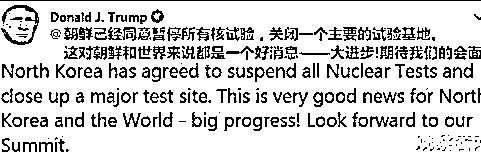
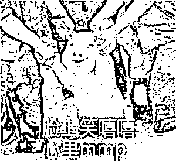
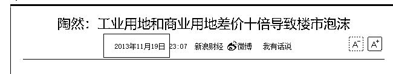

# 核武危机告诉我们，科技兴邦、炒房误国

<link rel="stylesheet" href="view/css/APlayer.min.css">

近日，朝鲜最高领导人金正恩宣布，朝鲜从 21 日起将不再进行任何核试验和洲际导弹的发射，废弃朝鲜北部核试验场。只要朝鲜不受核威胁挑衅，朝鲜绝对不使用核武器，不泄露核武器和核技术，集中全部力量发展经济，并将与周边国家和国际社会积极展开紧密联系和对话。

然后，特朗普立刻发了个推特，称这是巨大的好消息，期待和金正恩的见面，并且将此推特置顶。 

中国外交部也立刻发布声明，朝方有关决定有助于进一步缓和半岛局势，有助于推动半岛无核化和半岛问题政治解决进程。我们祝愿朝鲜在发展经济，提高人民生活水平的道路上不断取得成果，支持朝方通过对话协商同有关各方解决各自关切，改善相互关系。（央视）

看起来好像是中美联手，朝鲜立刻让步，无条件宣布停止核试验并废气核试验场，朝鲜核武危机得到巨大缓解，是一个巨大的好消息。但是等一下，我们想一想，以前朝鲜是一个无核国家，就算再怎么做核试验，他也没有实战的核武器，对中美这种核大国构不成任何威胁。但是现在朝鲜成功进行核爆试验，成为了有核国家，手里捏着核武器，就算以后不进行核试验了又怎么样，以后谁还敢随便欺负朝鲜，逼急了玉石俱焚。至于说停止核试验，废弃核试验场，中美等大国现在也不进行核试验了呀，这丝毫不影响中美等国的核武能力。  

01

朝鲜核武危机持续好多年了，每一次朝鲜进行核试验，都会引来严厉的制裁，别说美国，中国都要制裁朝鲜，中国需要的是一个可控的无核朝鲜，而不是一个有核的、不可控的朝鲜。但是今年这次朝鲜核试验，并没有引来任何制裁，相反在核试验结束后立刻得到了中国最高领导人的接见和会谈，然后美国最高领导人也非常期待和朝鲜的会谈。

今年的核试验有什么特殊之处呢，居然没有对朝鲜发起更严厉的制裁还对他这么友好，很简单，因为朝鲜这次核爆成功了。核试验成功之后，不管你承不承认，朝鲜就是一个有核国家了，再怎么制裁他也不可能退回到无核国家的行列，在这种前提下，朝鲜宣布自己放弃核试验，全力发展经济，已经是最好的结果了。

**回顾一下历史，新中国成立后还能仰仗苏联，和苏联关系破裂后四面受敌，美苏皆是敌人的情况下简直是和全球为敌，和朝鲜的处境何其相似。**这种情况下，中国勒紧裤腰带，忍受全部的制裁，硬生生的发射了二弹一星，奠定了中国的大国根基。正是因为有二弹一星作为威慑，中国改革开放后才敢裁军，然后全力发展经济，这才形成了今天中国的辉煌。朝鲜的所作所为，完全就是在复制中国啊，只不过出于国力和人才的限制，没有二弹一星，只弄出了最关键的核弹而已，不过这也够了，这足够支持朝鲜后续的裁军，释放劳动力减轻国家财政负担，全力改革开放发展经济，成为一个小中国。不管我们如何讨厌金正恩，仅从朝鲜国家角度来说，这个八零后无愧于明君称号，政治智慧和手腕极高，并不是一个好欺负的对手。 

而对于美国来说，朝鲜拥有核武器，他是比中国还难受的，因为朝鲜和美国属于敌对国家，美国曾明确宣布三大邪恶轴心国，就是伊朗、伊拉克和朝鲜，朝鲜如今核爆成功，美国也不敢说他的邪恶轴心了，相反要全力拉拢，不然特朗普也不会那么欢迎金正恩访美并且把推特置顶，特朗普一定是脸上笑嘻嘻，心里 MMP。

说到**三大邪恶轴心国**，伊拉克已经被灭了，朝鲜如今有了核武器已经没办法灭了，就只剩下伊朗了，伊朗也在不断核试验，可惜还没成功，所以他现在依然是邪恶国家并且没有资格和平发展经济。

**说到伊朗，就不得不提到中兴通讯了，**这个在最近几天非常热门的名词，中兴被美国制裁，禁止出口芯片导致濒临破产的原因就是因为中兴通讯违规向伊朗出口源于美国的产品和技术。美国向伊朗全面禁运，中兴向美国购买产品和技术，然后偷偷转卖给伊朗，美国能不生气吗？

在美国，政府没有掌握确凿的证据是不敢贸然对企业下封杀令的。否则，相关的利益资本会将政府告上法庭，使其决策无法执行，造成政府的公信力下降。向中兴禁运会严重伤害中兴的美国芯片供货商的利益，中兴在 16 年被禁运就是中美大企业合力解除的。但是中兴在被抓住违法时说谎，在缓刑时说谎，在观察期时又说谎。在美国这种极其注重诚信和合规合法的国家里，这简直无法忍受，所以这次中兴的制裁很难解除，因为中兴在美国法院里已经信用破产了。

**中兴是中国企业，和美国的冲突为何说他违法，原因很简单**，美国宣布对伊朗为敌对国家，全面制裁并禁运，如果一家美国企业偷偷向伊朗出售这种高端产品和技术，这是什么行为？在任何国家，这都属于卖国行为，公司负责人会被直接抓到军事法庭。美国公司这么做属于卖国违法，外国公司这么做，美国会怎么判案，肯定只会比本国公司判的更重，这毫无疑问，不可能说外国企业做这种事反而无罪。所以说之前三番二次给中兴缓刑，真的是中美大资本家合力干涉美国司法的结果了，涉及利益太大所以美国也不敢随便判案，但是数次挑战了美国红线，他真的受不了了，悬在中兴头上的达摩克利斯之剑终于砸了下来。 

02

这次**对中兴的制裁，别说持续 7 年，几个月中兴就得全面停产，**因为核心技术和产品全是美国的，没有这些核心芯片，整个产品线全部瘫痪，库存的芯片只能供应一个月使用。那么既然中兴已经接近停产边缘了，中兴会暴跌然后退市吗？还真不会，有好事者算了这么一笔账。

中兴目前在深圳湾总部的土地价值 36 亿，深圳科技园 18 万平、西丽工业园 50 万平、张江 12.5 万平、天津 73 万平、成都 5 万平、廊坊 2000 亩、河源 3000 亩、南京 1300 亩及市区 12 万平、重庆 150 亩、西安 2000 亩，还有一个三亚开发中心，总的土地价值超过 500 亿。

而工业用地和住宅用地在 13 年的价格就是 10 倍以上差价，16 年住宅用地飙升了一倍，工业用地价格上涨很少，那差不多就是快 20 倍的价差了，也就意味着，如果中央给个政策，允许改成住宅用地，土地价值估计能飙升到 5000~10000 亿以上。

乖乖，只需要一个政策，公司净资产轻松突破万亿，A 股还是有一定溢价的，按市净率 2 倍来算，中兴市值也应该是 2 万亿，要是按照高科技企业市净率 10 倍 20 倍那种，简直不敢算。

中兴的危机根本不算什么，中央都不需要出钱去救，一个政策，中兴的市值马上就能从一千亿突破到二万亿，中兴的危机不算什么事，没有什么危机是是卖一块地解决不了的，如果有，那就卖两块…

对于中兴而言，做做产品线就能发财，做房地产更能发大财，实在犯不着去研发花钱不讨好的芯片。做芯片是不可能做芯片的，这辈子都不可能做芯片，投入又高，回报又少，靠房地产生活的好滋润，地价一年时间就翻倍，就算把土地租出去，一年都有几十亿收入，才不要辛苦做研发呢。售楼小姐和中介，个个都是人才，说话又好听，哪个不比做芯片强。 

03

全国资本都去做房地产，没有人愿意扎实搞研发的结果，就是整个中国强大的外表，被一颗芯片给扒的精光，厉害了我的国还没几个月呢就变成了皇帝的新衣。而朝鲜勒紧裤腰带搞科研弄出了核武器，一下子跃居强国之列，整个朝鲜羸弱可欺的外表，也一下被掀开，露出了里面狰狞的爪牙。

这就是典型的科技兴邦、炒房误国，希望经过这一次朝鲜核爆和芯片禁运的鲜明对比，国人能醒悟过来，让中国早日实现强国之梦。

~~~ 

今天一不留神写多了，就当一篇大文章发了，本来是拆成二段的，现在拆成二篇文章，后面的市场分析部分，我今天发次条，请戳主页下面第二篇文章。

紫竹张先生

房产-金融-投资，点击右边按钮关注我

