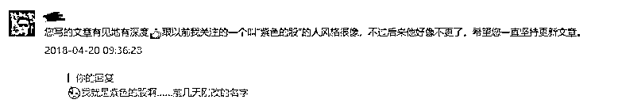
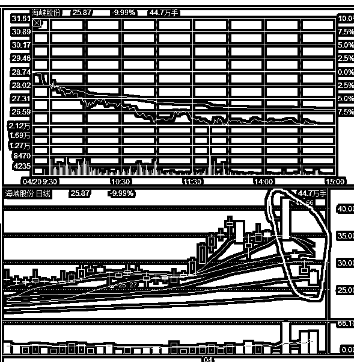
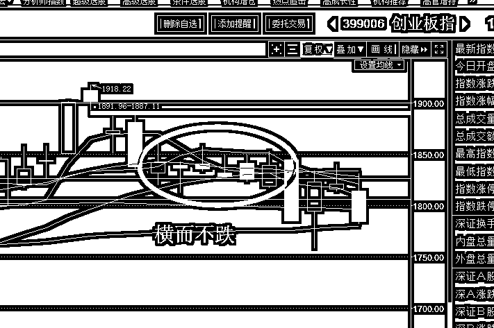
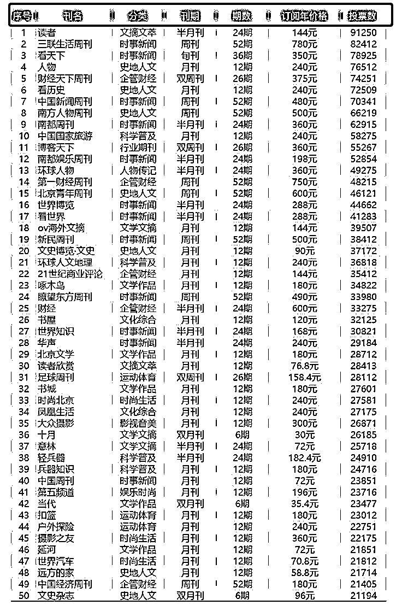
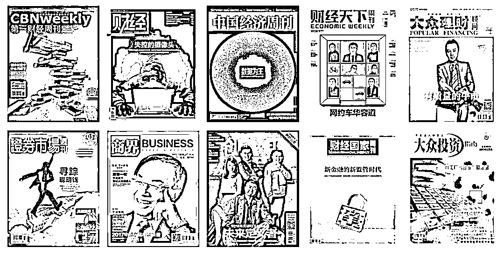

# 我是紫色的股，我改名了

今天先给大家说个事，那就是我改名了，我原名紫色的股，改名为紫竹张先生，改名原因我前几天已经说过啦，那么为什么我今天会再强调一遍呢，因为我原来以为，改名的时候系统会自动发布一条通知给大家，然后所有人就会知道我改名了，难道不是这样吗？

真不是，因为**我昨天收到了这么一条留言**。

简直是天雷滚滚，直接把我雷的里焦外嫩，这位兄弟直接刷新了我对公众号的认知。。。所以我觉得我今天有必要特地发一条改名正式通知。另外我对这位兄弟犀利的眼神也深表敬佩，只要文风不变，不管我换什么马甲都能被认出来啊。

所以，我今天直接以改名为文章标题，希望这样的话，能够简单粗暴无歧义的做一次正式通知。另外，我几乎每天都会更新，更新频率非常稳定，所以大家每天都能看到原创，这个是非常需要毅力的，希望大家每天点赞支持。

* * *

本周大事特别多，我简单的和大家梳理一下，上周末，海南概念爆出巨大利好，多项政策落地支持海南发展，很明显周一开盘，海南概念版块一定会受到游资和散户的大力追捧。

当时我把海南和雄安做了横向对比，都属于政策性地区利好，雄安无论是利好的实质性，还是牵动的目光，还是事前的保密行为，都远远超过海南概念，但是雄安的结局是见光死，连续壮观的一字板后，套死了无数的游资和散户在山顶上，雄安概念完美的解释了什么叫要么买不到，买到就是坑。

而这句话我也送给了海南概念，直接警告海南概念就是**要么买不到，买到就是坑**，周一海南概念全体封一字板，周二就开始大面积炸板暴跌，然后连续暴跌一周，龙头海峡概念本周直接暴跌 40%之多，而且今天再度封死跌停，预示下周还要跌，估计要腰斩才稳得住，追一字板的，亏的骨头都没了。

随后，**在周二，突发黑天鹅，美股宣布制裁中兴通讯**，禁止对其出口 7 年，对于高度依赖美国芯片的中兴来说，别说 7 年，7 个月就破产了。这种制裁引发市场对中美贸易战延伸到技术战的担忧，导致中国科技股大幅下跌。

在这个黑天鹅之前，创业在 1900 点遇阻回落，触发顶背离，但是在 1826-1856 附近长期横而不跌，我们仓位长期只有 1 成，一直苦苦盼跌，日 K 顶背离回调是 24 个交易日，持续到 4 月底为止，越接近 4 月底，希望越渺茫，我在周末定下计划，即便本周不跌，我也会加仓 1 成，下周再加仓 1 成，价格条件不满足，时间条件满足了，我也会加仓。

所以这个黑天鹅给了我们一个难得的机会，如果没有这个大利空，有没有机会那么低的位置吃到还真不好说，同时，制裁中兴给了我们一个非常好的切入机会，那就是芯片概念股触发一个套利机会，没有大资金提前潜伏，没有人能预料的到美国会有芯片制裁这一招，所以芯片不会开盘一字板，那样主力吃不到货，导致周三的芯片套利空间很大，同时成功概率极大，粗略估算 9 成把握是有的，这样的套利机会几个月才能出现一次。 

随后在周三，触底反弹，反弹强度非常惊人，同时芯片股全体涨停。然后周四我们预估因为创业依然处于回调周期之内，所以不会冲太高，估计 1846-1856 就要止步，因为之前横盘期就没突破过这个位置，所以要减仓，而芯片股周四明显还要冲高，那么二天之内的涨幅就太大了，应该减仓。

周四的时候，创业见顶回落，高点 1839，差一丝，估计有人抢跑，芯片收长上影线。回到正常区间，这个时候我们的对策就是持股不动了，7 成仓在哪里都是重仓了，涨我会卖，跌我不会加仓。

有人会问了，那你还有 3 成仓打算什么时候用，**我的回答是，除非大牛市降临，否则这 3 成仓我基本都不会用**，始终做国债逆回购，他们的唯一作用，就是等非理性杀跌。大家知道股市并不是纯理性的，情绪化挺严重，不然不会有大牛市和大熊市这一说。等突然非理性暴跌的时候，3 成仓就可以捡便宜了，这就是他的作用。

而本周五，中兴董事长殷一民开发布会，说美国的禁令可能导致中兴通讯进入休克状态，同时在发布会上大打爱国牌，把中兴的未来和民族情绪进行绑定，这说明情况已经很严重了，**中兴很有可能搞不定美国，如果真的禁运，中兴还真要完蛋**。受此刺激，今天大盘全体回调，同时芯片股再次冲高。

至于下周，很明显，处于回调的最后一周，24 个交易日即将过去，没几天了，我们的策略很简单，无惧最后洗盘，拿好筹码，回调了那么多个交易日都不跌，可想而知后面会怎么涨，越靠近回调的末期，越不敢卖，因为随时可能涨。

在这个全中国都被芯片掐住喉咙的档口，阿里巴巴宣布全资收购中天微，宣布讲自主研发打造“中国芯”，其实芯片不是拿钱能烧出来的，不然国家早烧出来了，几十个亿对国家而言算什么。不过**阿里这波蹭热点，蹭的 666，**这爱国主义宣扬的，**马云不愧是政治智慧最高的中国企业家**，芯片明显会受到国家扶持，这个时候收购芯片企业，不仅可以赚钱，还能爱国，二全齐美。

本周汇总大概就这么多，其他的我们周末聊。

~~~

**在中国，不只是股票，任何一种投资，都离不开对经济形势的判断和对国家政策的正确解读。**我会常看像《财经》，《第一财经周刊》，《证券市场》这些权威财经杂志，来作为获取重要信息的来源。而像上述的那些老牌杂志社，深入中国经济二三十年，对中国经济和国家政策都有着极为老道的分析和见解，并且政府的经济指导有时也会通过他们向外传递，被投资者当成重要的「战略信息库」。

所以在这里我给大家推荐一款我经常用的**「名刊会」**，里面除了刚提到的那些杂志，还有更多财经、时政类别等。作为一个金融投资者，这些都是不可或缺的。名刊会里订阅了 150 本国内知名杂志的版权，以电子渠道进行销售。

以下是**前 50 种**杂志的列表，如果其中有你喜欢的一本杂志，那么成为会员就已经值得；如果有两本或三本，就可以偷着笑了，而且杂志都是正版，与各大杂志社紧密沟通，第一时间更新上架：

而这款 APP 会员的价格也很公道，作为紫竹张先生的粉丝可以享受限时 65 折（128 元)的价格。这种资讯，对一个投资者来说相当重要，但是价格比你操作股票的手续费还低。

**【紫竹张先生公众号粉丝专属】**

**原价 198 元/年 **

**只需 128 元/年（6.5 折）**

** 限时优惠（4 月 20 日至 4 月 30 日) ** 

**订阅名刊会，享受的 5 大会员权益： **

**会员权益 1：畅享 150 本热销杂志，只需 1 本杂志的钱。**

收录的杂志，都是从龙源期刊网的 3000 种签约杂志中精选出的 150 种。 

**会员权益 2：历史期刊数据库，往期杂志也可以看。**

可以搜索到任意话题的资料，而且绝对够深度。 

**会员权益 3：特色听名刊，专业播音员精选文章诵读。**

开通了“听名刊”的频道，在驾车等不方便阅读的时候可以打开听文章。 

**会员权益 4：专栏定制+特色栏目，推送各个领域的好文章。**

根据实时事件和读者反馈，会定制相应的专题专栏。 

**会员权益 5：文章个人收藏，也可以分享给好友。**

分享给其他喜欢阅读的知己，收获彼此的精神共鸣；好文收藏到自己的剪报里，形成自己的知识体系。 

**会员客服服务：**你有任何问题，都可以拨打客服电话（01056276931） 

**有兴趣的话可以扫描下面的二维码，订阅 「名刊会」** 。 

 

使用名刊会，可以关注「名刊会阅读服务」公众号，也可以下载 APP，但是如果你想**65 折**订阅「名刊会」，**只有通过本篇推文的订阅二维码或者点击左下方“阅读原文”，才可以获得杂志特权的优惠哦！**