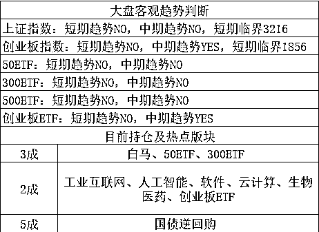

# 汽车关税降低后，老百姓买车能便宜多少钱

<link rel="stylesheet" href="view/css/APlayer.min.css"> 我们知道，最近中国已经宣布未来会大幅度降低汽车关税，汽车关税的税率会从 25%降低到 15%或者 12.5%，降低了好多，那么我们买进口汽车能便宜多少钱呢？

很多人会有这种感觉，100 块的进口车，关税 25%，那么售价就是 125，现在少了一半的税收，那么 115 就买到了吧，便宜 10 元，是这样吗？那说明你对现有税收体系并不了解，关税真的不算大头。

以一辆报关价 30 万元的 4.0 排量的汽车为例，那么国外经销商拿 30 万元走人，接下来国内经销商需要缴纳多少税费呢，需要缴纳关税 7.5 万元，12.5 万元排量消费税，8.5 万元增值税，装卸运输费等不算，国内经销商拿到手的成本价就 58.5 万元，经销商总要赚点吧，这价格就嗖嗖的上去了，70 万起步。如果购买的是低排量的车，消费税会低一点，但是和报关价相比轻松翻倍还是很正常的。

这一波假设最终宣布关税降低，根据税费计算原则，消费税等也会同步降低，公式如下：

*关税=关税价格×关税税率*

*消费税={（完税价格+关税)/（1-消费税税率）}×消费税税率*

*增值税=（完税价格+关税+消费税）×增值税税率*

公式很烦对不对，直接看最终数据吧，假设关税下调到 15%，那么这辆车的关税为 4.5 万元，同时消费税会降为 11.5 万元，增值税降为 7.8 万元，总税费为 23.8 万元。相比关税下调前，总共节约 4.68 万元，终端售价大概从 70 万起步，降低到 65 万起步左右。

没省太多，消费税占据如此大的比例，大家没想到吧，今天给大家科普一下，看完之后大家就会知道为何国外车售价那么便宜，国内会贵那么多，真不仅仅是关税的问题。不过 5 万元的成本减少是实实在在的刺激，肯定会增大进口量。不过现在贸易战，我还是鼓励大家少买进口车，看中国外品牌可以买合资车。

为什么合资车就可以买，因为合资车里，国资占据的收益太大了，以宝马为例，他如果想在中国合资建厂，政府会给予关税全免的政策，对应的消费税增值税都会降低很多，但是要付出的代价是，这个厂的一半收益，都归中国所有，因为国资占据一半的股权，另外所有的生产线，技术文件，管理模式，机密资料都在中方伙伴面前暴露无遗，因为中方是占股大于 50%的大股东，自然有权利查看一切文件，这就是鼎鼎大名的以市场换技术，中国靠这个条款飞跃了好长一段科技树。

最后号召大家买国产车和合资车，坚决不买外国车，因为被封的帖子记录会永久保存，被封次数太多估计就直接上黑名单了，所以现在赶紧改善印象，通过这种爱国号召给自己加点分减少一点黑名单概率。

 

**......**

今天最大的亮点就是海南板块，受到周末巨大利好的刺激影响，今天全面高开，高开到什么程度呢，大面积一字板。对于这个版块，我的态度和昨天是一样的，要么买不到，买到就是坑。。。

这个版块是游资最爱，类比雄安概念，游资必上，而去是无脑上，但是当年的雄安那么大的题材和概念，拉了那么多一字板，游资冲进去之后也是高位接盘死的一塌糊涂，现在海南的题材明显没有雄安大，里面潜伏的资金还那么多，雄安潜伏的人还比较少，种种比较下来，真的风险大于收益，不建议无脑追一字板。

今天创业板低开 1816，随后大幅高走，证明创业板逢低就买的策略是正确的，周五的时候 1826 就吃了 1 成，今天就有人问，是不是吃少了，踏空了呀，我昨天直接满仓就好了。今天上午涨的太快太猛，小白有如此感觉很正常，下次可要记住了，炒股不能如此极端，以及如此贪心。。。

因为刚看到这个留言没几分钟，指数飞流直下，从+1.5%直接被砸到了-0.5%，再度回到了 1816 的支撑位，然后再次反弹，尾盘收于 1838

我的原计划就是创业板 1826/1816/1806 分别吃进 1 成，把上证的仓位越涨越卖给调过来，但是上证没有高抛成功，3200 就熄火了，导致如此吃货仓位有点重，就改成 1826 吃 1 成，1806 吃 1 成，1786 吃 1 成，因为我预估的调整极限大概就是 1786。 

但是今天看起来，调整的可能比预想的还要轻，但是我暂时并不打算追，因为上证太弱了，比预想的还要弱，这已经从 3200 又回到 3100 点支撑位了，今天收到 3100 的支撑反弹，但是反弹绵软无力，收盘才 3110，这个收盘价，创下本波段新低。。。

不过我并不担心上证，崩盘是不可能的，无非就是这个地方盘整多久反弹而已，我不会减仓，但是也不会加仓，总策略就是涨了就卖，减仓之后，就可以大幅度的调仓创业了，创业的加仓会更大大胆奔放，现在，就拖时间呗。

上证我不担心他崩，而创业非常的强，我也不担心他飞，回调期还没有完全结束，他涨上去压力非常大，我觉得还是有一定的低吸机会的，目前总仓 5 成，仓位有点多，创业的价格死活不下去，导致我也不敢奔放加仓，反正，本周是必须逢低再加 1 成的，因为回调期最多下周结束，不会持续太久，除了分价格阶段加仓之外，为了防止不跌，我还会分时间加仓，不一定非追求买最低。

**......**

另外说一下 P2P 平台的知识，任何人推荐的平台，甚至你自己亲自去考察过的平台，能保证 3 个月不出问题，就说明他考察的已经非常到位了，所以一定要分散投资，同时经常考察其公司信息，考察一次可以管用 3 个月，如果考察感觉不妥，就及时更换平台。比如团贷网，去年我考察的时候就认为他没啥问题，不过一年之后，最近和很多业内人士的聊天，感觉这家平台可能存在一些问题，虽然未必会有啥事，不过肯定是有点隐患的，如果有人投资这家平台，可以考虑先换一下。

对于这种考察法，需要庞大的业内人脉来获取内部资料，其实还有一个个人适用的粗略试探秘诀，在这家存钱做理财的同时，用家人的账号注册一下，每半个月贷款个一二百元什么的，利息没多少钱，主要试探他的放款速度，放款快速则应该没什么事，放款速度某一段时间和以前相比突然减缓，那么就建议把资金从这个平台转移到另外一个平台。

大概就那么多，分散多平台投资，经常亲自考察其公司信息，以及贷款速度侦测法都是可以尝试的渠道。

~~~

创业的软件今天表现非常好，目前持仓 2 成，后面还会继续加仓，鉴于最近横在 20 日均线不走了，反复贯穿磨损，所以临界点提升 20 个点到 1856。

紫色的股

经济-金融-投资