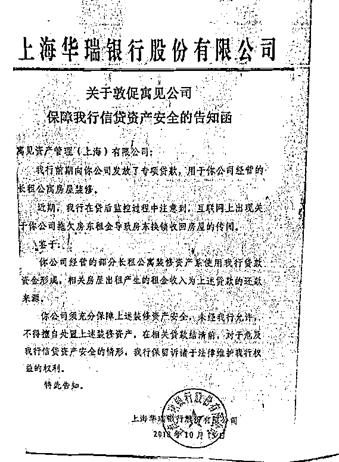
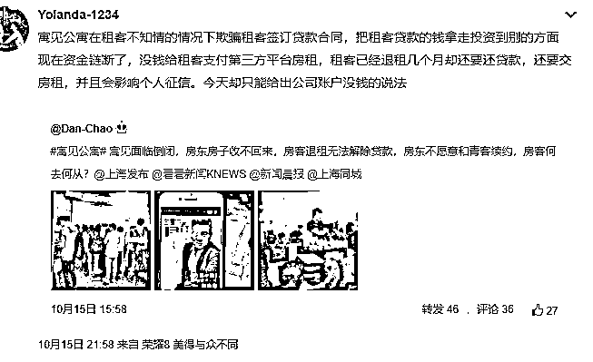
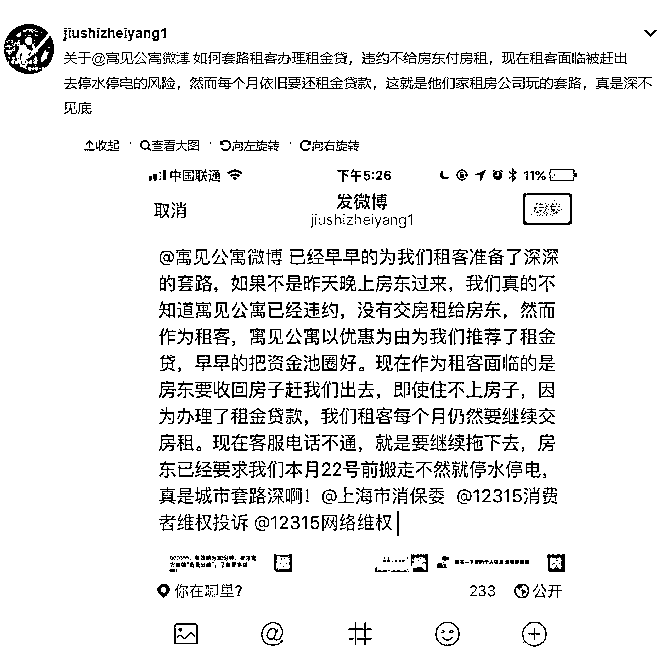
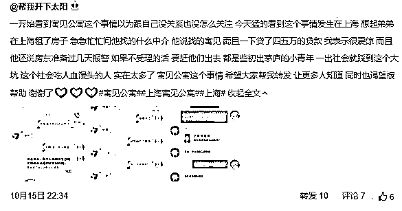
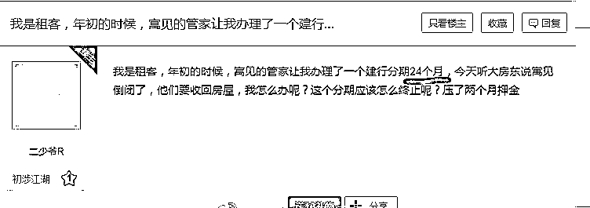
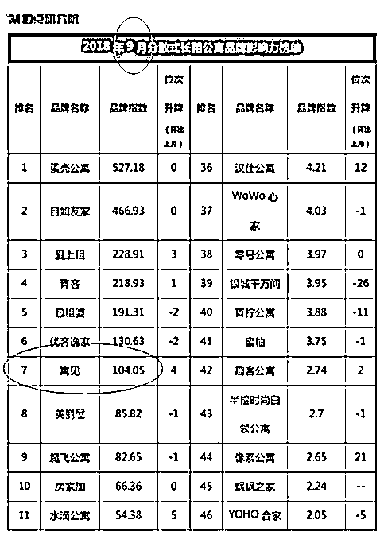

# 排名前十的长租公寓爆仓了，房东租客损失惨重 | 紫竹张先生

喜欢我的都关注我了~

8 月中旬的时候，我写的一篇《为什么中介哄抢租赁房源，因为贩毒都没它来钱快 || 紫竹张先生》刷爆朋友圈，捅破了中国长租公寓蕴藏的巨大风险，由于被强制限流转发不予显示，最后止步千万阅读。

在这篇文章里，我详细的揭露了长租公寓诱使不明真相的租房者签下租金贷，一次性收取租客一年甚至几年的租金，然后自己按月付给房租，空手套白狼获得了大量的资金，这完全是利用租客的个人信用在诈骗现金，一旦资金链断裂，后果不堪设想。

房屋租金之所以狂涨，和长租公寓不惜代价抢房源密不可分，而长租公寓之所以敢亏钱抢房源，就是因为房源可以套现，以充沛的现金流来维持规模扩张。

当时我想的是，提前揭露这个问题，可以在风险还没有完全膨胀起来之前消弭于无形，整个行业会更健康更规范，不至于最后暴雷的时候，满大街都是上访维权的业主和租客。

但是在我发这篇文章的第二天，杭州鼎家长租公寓就应声跑路，人去楼空，4000 余租户租金被卷走，我以为后面的长租公寓都会痛改前非及时消除风险，没想到我低估了这个行业的泡沫程度，他们挪用的租金数量之大，像吸毒一样已经到了停不下来的地步了。

今天又看到一个震惊的消息，寓见长租公寓资金链断裂了，广大业主和租户维权无门，这个可不是一般的资金链断裂，银行的公告都贴到门口去了。

在银行的公示贴到门口的同一天，网上已经开始到处曝光寓见公寓资金链断裂，开始大面积拖欠房东租金导致租客被房东上门收房的新闻。

寓见公寓无力支付给房东租金，给出的解决办法是把租约转移给青客公寓，由青客公寓重新签约 5~8 年。房东当然不同意，他们又不傻，这事情的核心是租约的事情吗？这事情的核心是寓见公寓你还欠租客一大笔租金呢，青客当然愿意承接你的房源，但是他们肯定不会承接你的负债，你这个负债窟窿之大，没有人承受得起。

房东们现在唯一想做的事情，就是赶快把租客赶走，收回房子重新出租来降低自己的损失。

但是租客也冤啊，他们很多人已经在寓见的恶意诱导之下，签下租房贷，一次性付款一年的租金出去，金额达到四五万元。

你以为这是最惨的，不，还有一次性付两年的人出来发帖维权了。

寓见公寓可不是什么小虾米，是赫赫有名的长租公寓，前十的头部玩家，排名高居第七，他这次一爆仓，带来的是整个行业的惊天动地。

而寓见公寓本身，也是一个明星项目，是由小米旗下的顺为资本领投，2017 年持有的房源就高达二万间以上，里面的每一个房东和房客，都是这次爆仓事件的受害者，他们损失惨重。

1**法律层面上租客完败**

长租公寓倒闭了，房东和房客该怎么办呢，首先我们理一下顺序，这个事情首先是房东和长租公寓签长约，一般是 5~8 年以上，长租公寓改造后承诺按月支付给房东租金，然后加价出租赚取利差。

然后公寓方会和租客签短约，通常是一年左右，按理说也应该是按月付钱，因为租客没钱，几乎不可能有租客同意直接提前支付一年的租金出去。

所以这个时候公寓方就开始下套了，告诉租客不仅可以月付，而且可以支付一个月租金甚至免押金，这对租客很有诱惑力，因为很多房东要求他们押二付三或者押一付六，动辄数万的金额对他们的资金具有巨大的压力。但是实际上，公寓方诱使他们签下了租房贷，以他们的名义直接贷款数万元，然后一次性拿走。

当大家都守约的情况下，这种玩法一点问题都没有，甚至可以说是盘活了经济，解决了问题，但是当长租公寓把提前收取的租金挪做他用的时候，一旦出事，问题就来了。

从法律意义上说，当长租公寓暴雷的时候，房东是绝对优势方，从法律层面上如果打起官司，这里面涉及四个主体，要分别进行三场官司。

这四个主体分别是：房东、公寓方、租客、租房贷资金方，涉及的三场官司分别是房东和公寓方签订的租赁合同，公寓方和租客签订的转租合同，租客和资金方签订的贷款合同。

在这三场合同里，房东和公寓方签订的租赁合同，房东完胜，合同约定按月支付租金，公寓方断掉了租金，房东自然要收回房子，没有问题。

在公寓方和租客签订的转租合同里，租客应按月交租，享有租赁权利，租客没有违约，公寓方是违约方理应赔偿，但是公寓倒闭了啊，主体都不复存在了，所以租客应该找公寓平台的麻烦，而不是找房东的麻烦，房东和租客没有任何一份法律意义上的合同。

在租客和贷款方签订的贷款合同里，租客必须要还款，这个没话说，在法律意义上贷款方的钱是给予租客你这个人的，租客要负担还款的责任。

理清之后大家可以看到，从法律意义上说，租客是最大的受害者，所有的损失，租客一个人全扛。

2**实践操作中租客还有救**

但是房东也别高兴太早，这只是从法律层面上说，实际上基本不会这么操作。因为法律对租客的保护是很严格的，自古以来就有买卖不破租赁的法律传统，也就是说业主卖了自己的房子，如果里面是带租约的，就必须等到租约到期才能赶走租客。

但是法律没有考虑到，当长租公寓诞生后和租房贷一结合，产生的巨大法律漏洞应该怎么办，按照现有的法律条文，处处针对租房者，而实际上租客是社会中的最弱势群体，而且在整个事件中，还是遵纪守法没有任何恶意的人，执法者绝对不会硬性驱赶他们。

所以，当以前零星出现中介卷款跑路的事件时，租客只能自认倒霉，但是当大规模卷款涉及数千人甚至数万人流离失所的问题时，执法者就不会去僵硬执行法律条文了。

在法律上，业主是有权利拿着房产证直接找开锁公司把租客的东西全部扔到楼道里的，但是如果数万个业主都这么干，产生的社会动荡绝对是政府和整个社会都无法接受的。

现在公寓平台捅出一个天大的窟窿后倒闭了，还剩下三方活着，房东、租客、贷款方，目前所有的损失全在租客头上，但是租客无力负担，而这里面实力最强的就是贷款方，而实际上贷款方心里也都是很清楚这笔钱的流向和用处的。

所以实际操作中，最有可能的操作方案，就是贷款方负担一大部分损失，剩下的一小部分损失房东和租客均分，所以租客不用如此慌张。

3**房东和房客应该怎么做**

但是我这里所说的方案，必须政府这一级的力量出面才有可能实现，贷款方绝对不愿意承担这个损失，所以房东和房客不能内战，应联合请求政府的支援和仲裁，这不是法院能处理的事情。

这个损失是一定要有人出来抗的，全部推给最弱势的租客是最常规的做法，但是当租客人数多到一定程度的时候，这就不现实了，相反，租客的权益是会被最大程度保护的，因为维持社会稳定的需求。

1、在已经爆仓的公寓平台里，受害的房东和租客，我这里没有什么好办法，债务黑洞已经掉下来了，现在无非是把谁塞进去填黑洞而已，要么是贷款方填，要么就是房东填，要么就是租客填，没有什么好办法。

所以唯一的行动方案就是立刻联合报案，确定损失，这么做当然不是指望还能从公寓平台的破产清算里拿到多少钱，虽然债权高于股权，但是但凡长租公寓还有钱，都会想尽办法续命不会停止支付租金的。报案的唯一目的，就是为了下一步的请求政府援助，出面施压从而让贷款方来填这个坑，免掉租客的贷款。

这不是什么好办法，但是这是目前唯一可行的办法，死马当活马医。

2、对于那些还没和任何长租公寓签约的房东和租客，对于房东，签约的时候一定要在合同里注明自己的租客只允许按月或者按季付款等，绝对不允许出现租客付了一年的钱而自己只能按月收钱的事情，不管租客的钱是自己出的还是贷款出的，都蕴含巨大的风险在里面。

而对于租客，请千万长点心，除非直接付钱给房东，给中间方钱时必须一月一付，否则都潜伏风险，无非是风险爆发的时候你是亏一季度的钱，还是亏一年的钱而已。

3、对于那些在其他还没爆仓的长租公寓里，房东和租客现在只能干一件事，烧支香祈祷自家的长租公寓没事，如果不幸爆仓了，请参考第一条。

大概就这么多，我曾在 5 月底的时候预测过 P2P 暴雷潮的出现，建议无脑撤出所有的 P2P，过半年之后再看看风头，而今天我预测长租公寓的暴雷潮，很有可能随着寓见公寓的倒台而连锁出现，过去几年上了高杠杆的长租公寓，全得遭殃。

不过唯一的缺点就是，P2P 我还可以提前喊话让你们紧急撤出，这个长租公寓完全没办法撤退，只能闭着眼等命运的裁决，不过攻略我都写给你们了，虽然不能完美解决问题，但是总归可以解决一部分问题，在没出事之前，只能多点几根香。。。

而对于那些还没租房的人，请千万仔细阅读本文，知晓厉害关系，租房合同不能乱签，一定要看清楚里面有没有贷款陷阱。

觉得此文的分析有道理，对你有所帮助，请随手转发。

长按下方图片，识别二维码，即可关注我

近期精彩文章回顾（回复“目录”关键词可查看更多）

华为员工都这么穷，怪不得拼多多能火 | 房价跌 20%就会全面崩盘，地产杠杆远比你想的要脆弱 |  为什么碧桂园的质量那么差 | 清醒点，放弃全面开征房产税的幻想 | 央行和财政部隔空掐架，我支持央妈 |中国土地制度源自香港，但是香港却是劏房密布 | 为什么中介哄抢租赁房源，因为贩毒都没它来钱快