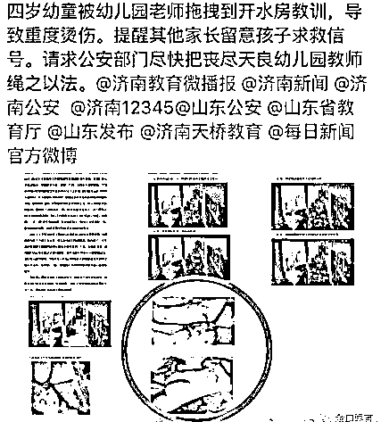
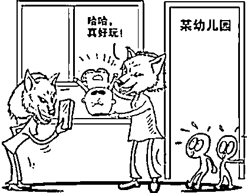

# 我们能永封内涵段子，为什么不能永封幼儿园

<link rel="stylesheet" href="view/css/APlayer.min.css">

近日，济南再度出现一起高度恶性的虐童事件，一名 4 岁幼童腾腾（化名）在幼儿园被老师拖进开水房，出来后孩子大腿、臀部、后背、会阴大面积烫伤，目前男童全身裹着纱布，靠每日输血和输电解质维持生命。

孩子父亲事后描述，烫伤的创面就像剥了皮的兔子，令人不忍直视，幼儿园的监控显示，当天上午 10 点 08 分，由于早操时在地上打滚，腾腾在排队回教室的时候被班主任虞海波，拖进了开水房，再出来的时候，已是大面积烫伤，奄奄一息。孩子母亲懊悔不及，痛苦说自己不配做孩子妈妈，因为出事前几天已经有了预兆，在此之前，孩子已经连续三天表示不想上学，还说过几次，老师打他。可腾腾妈妈却忽视了孩子几次递来的求救信号，认为只是孩子调皮被老师教训，身为一个家长的善良让她相信老师，而继续送自己的孩子去上学，从而导致了悲剧的发生，毁了孩子的一生。

对于这种恶性虐童事件，这几年频频爆发，并不罕见，在 2017 年，被媒体直接曝光的虐童事件就有 20 起以上，其中比较著名的有：携程亲子幼儿园虐童事件，温岭教师颜某虐童事件、金色摇篮幼儿园虐童、三色幼儿园虐童事件等。

有问题的幼儿园一个接一个的曝光出来，对幼童造成了终身性的严重伤害，但是最终都是只处理了涉事教师，而并没有处理相关幼儿园。我曾经分析过为什么幼儿园虐童事件频出，其中一个非常关键的因素就是人，幼儿园招聘的教师素质太低，素质低的原因是因为开的工资太低，无法吸引足够的优秀人才。

很多人无法理解，收费高达 5000 元一个月的高档幼儿园，怎么可能让一个老师平均管理 10 个以上的孩子，而每个老师的薪酬居然低到 3000~5000 左右，你没看错，有的幼儿园开价只有 3K 一个月，5K 的算顶配了。**那些幼儿园难道不知道这么做会导致教育和照顾质量变差吗？难道他们不知道那些持证的幼师才是真正合适的照顾者嘛？**

他们知道，但是他们不想付那么高的薪水去招聘持证幼师，能用 3K 的工资招到人手糊弄过去，为什么要花费 1W 的月薪去招聘优质幼师，资本家考虑的是利润最大化，低薪幼师搞出了事怎么办？开除，然后写个检讨就是，和平时节约的工资成本比起来，这么做明显是划算的。

在教育机构隔靴搔痒的处罚导致幼儿园普遍缺乏敬畏之心，都抱着多赚一天是一天的心理从而使腾腾成为了下一个牺牲品的同时，我们可以看到，前几天，监管部门强硬的直接永久封禁了一个估值百亿的产品“内涵段子”及其公众号，没有给任何检讨、整顿的机会，直接斩立决，吓的各大网站纷纷连夜自行整改，**抖音为了防止出事直接把评论都给关了**。

**人民日报是如此评论的：长期以来，一些互联网企业抱着“一边写检讨一边挑战底线”的想法，在政府一再禁止下不断地发布传播低俗不良信息，严重影响社会风气**。归根结底，就是因为以往政府的处罚还不够重，罚款、约谈与企业因此获得的巨额利润相比可谓微不足道，自然无法形成震慑。要杜绝企业的这种资本取向，唯有增大其违法成本，让投资者发现挑战底线将会血本无归，才能引导他们在决策中有所顾虑。

这段话说的一点都没错，只有让投资者发现当监管动手的时候，有概率让他产生无法忍受的重大损失，才能让其收敛，这在美国有一个专有法律名词，惩罚性赔偿。我们曾看到，美国一些消费者因为一些“小事”向美国企业索赔几百甚至几千万美元，在我们看来不可思议，近乎敲诈勒索的行为，居然得到法院的支持，其背后的逻辑就是“惩罚性”赔偿，用来震慑其他企业，杜绝类似行为，这是在法律监管欠缺的时候，最好的保护人民的办法。

**同理，当幼儿园恶性虐童事件发生的时候，我们必须针对性的永久封杀一家幼儿园**，并且支持幼童家长的巨额索赔金要求，直接把一家幼儿园罚的倾家荡产，整顿幼儿园市场的最好办法就是开放牌照吸引大量资本流入，同时严格监管鼓励其优胜劣汰，这样才能培育出成本低、服务好，把家长的需求当成上帝的需求的幼儿园。

我国的娱乐市场监管已经严到变态的程度，骷髅模型过于恐怖不利于青少年身心健康要整改，给它的模型长点肉就健康了，射击类游戏角色被命中后喷出红色的血液过于血腥，改成绿色的就不血腥了，更别提广电总局对影视作品的监管力度如果放到股市，中国的上市公司早被罚的全军覆没了。

与其把监管的精力放到这些事情上，不如多下点力气去监管下和群众生命安全高度相关的食品、幼教行业，以幼教为例，类似于腾腾这种足够毁他一生的事情，假设你每天送自家孩子去幼儿园都有十万分之一的概率碰到，你每天晚上睡得着觉吗？每天辛辛苦苦挣钱不就是为了下一代能健康成长吗？一旦碰到了一次这样的事情，直接把整个家庭都给摧毁了。

我们无法甄别哪些是好老师，哪些是坏老师，监管机构也无法甄别哪些幼儿园是遵纪守法，哪些幼儿园是浑水摸鱼的，但是如果偷工减料的幼儿园不被驱逐出市场，那么他们就会把遵纪守法的高成本幼儿园给逼破产，所谓劣币驱逐良币，而**监管层的一个最重要的职责，就是消灭劣币**。

我们的确很难甄别谁是劣币，但是劣币自己知道，那么在监管层没有好办法的时候，谁出事就重罚谁，罚到具备杀鸡儆猴的效果，让其他人都心寒自己整顿的地步，才能最大化的降低这种恶性事件的概率。

**在美国，虐童是非常严重的罪行**，只要你怀疑附近的某个孩子可能受到了虐待，你就有义务向监管部门举报，如果你没有举报，随后爆发了事件，你就要受连带惩罚责任，包括罚款或者监禁甚至可能承担民事责任。看到没，别人虐待了儿童，你仅仅是没有提前举报，你受到的惩罚，可能就不亚于国内真正的施暴者，惩罚力度简直太变态了。对幼儿教师，美国要求门槛也很高：本科以上学历，持有资格证，通过背景考核，上岗后也要经过严格的综合培训和定期考核。如果被发现有招聘不合格幼师的幼儿园，轻则罚款，重则关闭。相比之下，中国对幼童的保护实在太弱了。

**相比娱乐 APP，幼教行业对我们的生活影响更为重要，**我们既然都知道为了有效震慑其他娱乐平台，必须增大其违法成本，挑战底线将会血本无归才会让其决策的时候产生顾虑，那么我们为什么不能让挑战我们底线的幼儿园血本无归，这样才能让他们决策的时候产生顾虑来保护我们的孩子，我们不要求幼儿园能教出什么天才，能有多高的教育质量，但是我们的底线是绝对不能突破的，那就是不能虐童！

面对这种有可能毁掉一个家庭终身幸福的事情，谁都不知道会不会落到自己头上，所以每一个中国公民都不应该保持沉默，而应该发出自己的声音，让监管看到人民的需求，我们迫切的需要增大幼儿园的违法成本，我不希望再看到恶性虐童事件，我们可以永封内涵段子，为什么不能永封一家幼儿园。

紫色的股

经济-金融-投资