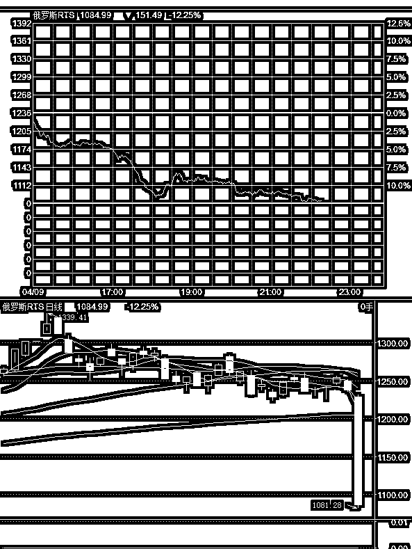
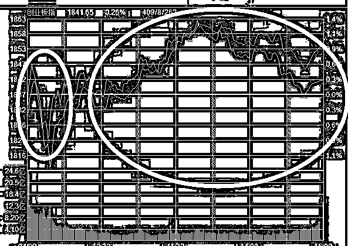
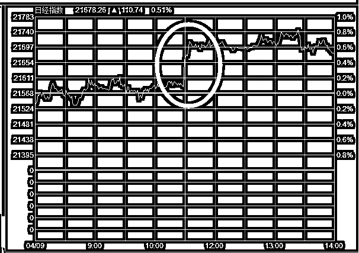
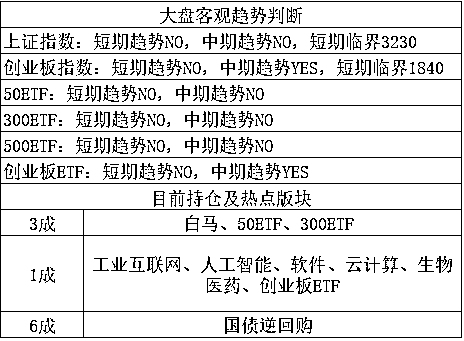

# 俄罗斯被贸易战打出原形，相比之下中国简直太强大了

<link rel="stylesheet" href="view/css/APlayer.min.css"> 大家都知道，随着中国几十年的改革开放发展，曾经的大哥俄罗斯已经被中国超过了，但是超过的幅度大家可能不太清楚，只是感觉中国比俄国强，但是强多少，估计强的有限吧，这应该是大多数中国人的认知。

但是这轮贸易战，打出了俄罗斯的原形，俄罗斯的军事实力还不好说，但是经济实力实在是太弱了。特朗普和中国狂打贸易战，中国寸步不让，不管 30 亿还是 500 亿还是 1000 亿，一律跟，有多少怼多少，出这么大的事，中国股市风平浪静，几乎没什么波澜。但是当特朗普休息了一下，大嘴向俄罗斯开炮的时候，第一轮炮火打击，俄罗斯就直接跪了，大家看看今天的俄罗斯股市走势，截止 10 点的数据，俄罗斯股市下跌 12%，另外在港股上市的俄铝公司暴跌 50.43%，市值跌去 355.44 亿港元。

和这个狂霸的数据一比，中国的熔断简直是太温柔了，那么俄罗斯是遭到了怎样的制裁才被弄的这么惨呢。

美国财政部 4 月 6 日宣布，将对一批俄罗斯个人和实体实施制裁，制裁名单中，包括 7 名俄罗斯商业领导人和他们拥有或控制的 12 家企业，以及 17 名俄罗斯高官，此外还包括一家俄罗斯国有武器进出口企业及其下属银行。其中，就包括俄铝的大股东欧柏嘉。

这份新的制裁措施标志着华盛顿对俄罗斯的打击大幅升级，对此，俄外交部发表声明说美国这么做是在出昏招，是不可能收到意想之中的效果的。而俄驻美大使馆也指责美国对俄罗斯的这一制裁是在摧毁全球自由贸易和经济融合发展。

这个言论好熟悉啊，20 年前中国被美国揍的时候，好像就是这么抗议的，纯口头抗议而已，一点反击的措施都不敢说，不像这次的中国，只反击，不抗议。而俄罗斯的股市，也直接反应了他的经济实力，在欧美市场非常平稳的时候，自身大幅度断头式暴跌。

网友评论这一轮贸易战，王老吉和加多宝打架，打的热火朝天的时候回头一看，不小心把和其正给弄死了。

* * *

俄罗斯的事情暂且放到一边，他跌那么惨的唯一效果就是衬托中国这一轮贸易战的强大，他的股市暴跌并不会干扰到中国股市，目前唯一能对中国股市产生影响的，就是美国股市，美股今晚表现平稳，上周五暴跌之后，今天收复部分失地，总体来说，还算良好，所以外围不会对明天的股市产生重大影响。

而昨天晚上，我们预估的是，虽然行情不太好，但是如果今天继续下跌，会开始逐步增仓，毕竟创业已经暴跌百点之多，买一点，不过分，先补 1 成，再跌再补即可，毕竟这里是支撑位。

今天开盘，三大指数小幅低开，随后迅猛拉高，但是仅仅拉升 2 分钟之后，剧烈跳水，开盘的时候波动异常剧烈，这也预示了全天的资金分歧是非常之大的，暴跌之后，又迅速拉高，但是收盘之后还是回落，开盘 15 分钟的走势，基本就是全天波动的缩影。

而实际上，10 点半之后的那一拨拉升，是非常诡异的，当时日本和香港的指数都出现了突然拉升，原因不明，A 股不明就里的跟风拉升了，我们可以看到日经指数在今天盘中的突然拉升。

而实际的原因至今没有明确说法，貌似是美国那边口气又缓和了，贸易战减缓之类，但是这个不重要了，因为我 A 股一般还是按照自己的节奏走。

什么节奏呢，那就是今天上午剧烈跳水的时候，最低点 1816，和昨天说的 1800 附近还差一步，所以就没动手，很可惜，估计有人抢跑了，我之前感觉的是差不多下跌百点了就该买了，没想到这个百点是从极限高点 1918 开始计算的。。。不过话说回来，我上次说不可能一口气突破 1900，赌收盘价不会高于 1900，结果来个假突破忽悠我的账还没算呢，实际上也没站稳 1900，次日开盘直接就掉下去了，那天收盘还故意刚好拉到 1900 整，真是醉了。

好了这个不谈了，创业板今天再次收盘低于 20 日均线，日 K 顶背离继续确立，加上 MACD 翻绿，形态并不好，实际上，今天必须大阳线才能有一线希望向上反转，否则日 K 顶背离之下，1800 都很难最终挡住，1800 既然今天还差 16 个点，我就没动，由他去。

而接下来，我的看法依然和昨天一样，跌下来我依旧会接，1 成 1 成的补，但是如果不跌的话，那就继续不动，看谁耐心好，美股今晚的确大涨，但是对 A 股的大势影响并不明显。何况今天 A 股还宣布人民币贬值了。

根据新闻报道，中国正在考虑使用人民币贬值来应对当前与美国的贸易争端，知情人士表示，考虑的贬值方式可能是循序渐进的，而非一次性的，以降低对金融市场的冲击。知情人士表示，一些高级官员正在评估人民币贬值对出口、相关公司行业和经济的影响，并对不同的贬值幅度产生的影响进行分析。

而人民币的汇率应声下跌，这个政策的确有可能是在恐吓美国，但是的确也是有可能执行的，不过如果执行，那么中国的楼市股市会双双受损，中国积累了天量的国际投机资金，一旦结束升值，这些投机资金会大量流出，带来的基础货币损失，会让中国的货币政策非常的被动，如果引发了经济剧烈动荡，可能得不偿失。

对于中国股市，我的看法非常明确，蓝筹中期看跌，短期看筑底，创业中期看涨，短期看回调，操作上，蓝筹拿死不卖，等涨了就卖，创业逢低就加仓，但是不追高，就这样。

另外简单评价下今天最热的二个版块，海南版块和北斗版块，首先可以定性，二者都是典型的概念性炒作，怎么上去的，将来还会怎么下去。在这二个版块的比较里，海南版块的预期性太过一致，因为几乎所有人都知道今年 4 月会在海南开会，这不是秘密，估计有见光死的可能性，所以其持续时间估计会比北斗短，鉴于创业板的不稳定因素，暂时都不建议追高，只建议回调买进，其中北斗预估会优于海南。

* * *

创业板短期翻 no 了，不过明天如果跌到位了，我会考虑吃货，毕竟仓位不够嘛，至于上证预期的筑底反弹，我觉得目前的仓位够用了，就不动了。

紫色的股

经济-金融-投资