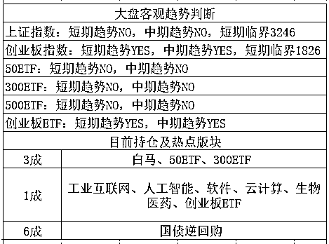

# 春夏交替之际，谨防感冒

<link rel="stylesheet" href="view/css/APlayer.min.css"> 今天中招了，得了感冒，所以今天写的短一点。。。

周末本来是有很多新闻的，但是今天都略过不写了，就科普下感冒常识吧。首先，春天和秋天的换季时分，由于忽冷忽热，是感冒的天然高爆发季节，预防办法倒是有，古人已经告诉你了，春捂秋冻，这个办法就是规避忽冷忽热的，这个办法能够有效降低感冒中招概率。

但是这只是降低概率，做好保暖措施并不能让你免疫感冒，因为感冒病毒是世界上变异率最高的病毒，每年都会出现大量的变种，东南西北各不同，其变种数量并不亚于计算机病毒的数量，而且优胜劣汰之下，每年总能变出一个非常强势的变种突破相当多人的防御，来达到自己的毒生辉煌，这也就是感冒疫苗这东西研制成本非常昂贵，而且有效时间非常之短，年年都要注射新疫苗，感冒疫苗获得了世界上研发过程最简单、平均成本最昂贵、疫苗效果最差，存在感最弱的多项称号。

还有一个小常识，那就是感冒是无药可治的，由于感冒病毒的强变异性，没有任何药物能对感冒进行针对性的治疗，研发新药的周期是 10 年以上，感冒病毒一年就能变种好几次，这游戏怎么玩。。。

你一听，不对吧，药店卖的那么多感冒药难道是我眼花了？这世界上所有的感冒药，其药效都不是针对感冒病毒的，是针对你自己的身体的，这个药吃进去，感冒病毒不会受到一丝一毫的伤害，但是这个药能缓解你因为感冒带来的本能免疫反应，就是鼻塞、流涕、咳嗽、喷嚏、发热等症状。既然没有感冒药能消灭感冒病毒，那么我们的感冒是怎么好的呢。

**答案就是：它自己好的......**

感冒被医学界定义成没有特效药，但是自愈率极高的疾病，所以一切的治疗方案，都是辅助你的免疫体统，而所有的感冒药，都是降低免疫体统生效时候的不适反应，让你在轻松愉快中免疫消灭感冒病毒，仅此而已。

换句话说，这个感冒药你吃和不吃，感冒好的时间都是一致的，看你的免疫系统运作的情况，但是感冒药能够有效降低身体的不适程度，也是非常有意义的，有利于身体的自我恢复，以及防止高烧等造成额外伤害，所以感冒药该吃还是要吃的。

那么有没有什么独家秘方能够提升免疫能力，更快的消灭感冒呢，还真的有，那就是热水。白开水具备让身体发汗、补充体内水分，促进新陈代谢，有效提升免疫力，是唯一能对感冒病毒进行遏制的神器，是治疗感冒的第一神药。

所以，当你感冒很难受的躺在床上的时候，如果你的男朋友端来一杯热水告诉你，把这个喝了吧，喝点开水就好了。别忙着揍他，因为。。。

他说的是真的！

* * *

 周五让大家指定话题，结果房地产类以碾压性的优势获得了第一，我没想到写了那么多地产类的大家的热情还是那么高，地产真是永不退色，是当前中国最大的热点和话题入口。。。

周五夜间，欧美没有开盘，休市一天，在创业板大涨的情况下，IPO 没有加速，反而减速，数量依然是 3 家，但是金额降低为 16 亿，按这个势头监管层是要固定每周 3 家，让大家适应，并不想过多的干涉市场，不过这么少的金额，短期肯定是利好。

而周五全天，创业板高开高走，单边上涨，形态是非常的强势，在周末并未出很大利空的情况下，下周继续冲高一段是毫无疑问的，所谓惯性。

创业板和新经济是我非常看好的，是唯一的短期和中期全部 YES 的版块，3 月份我逃顶 2 成，说白了还是个意外，我原计划是打算做 T 的，后来全球风云变幻，黑天鹅来袭所以导致看起来是逃顶了，暴跌的时候，我虽然并不敢抄底，打算再看看能不能多跌点，但是也绝对不割肉，因为我觉得中期趋势是 YES 的人没有一次性被打死的，想多跌点，无非是当时贪了点，谁都知道这种破位大阴线不可能一夜翻转，怎么都要跌一段，鬼知道特朗普就是和你玩过家家的，贸易战说打就打，说停就停，我之前预计贸易战打不起来，那也是双方互相僵持互喷口水一段时间啊，这个时间再短也不至于短成这样，大战一夜消弭。。。破记录了。

那么在今天，创业板依然是我最看好的，站稳压力线没有买回是因为上证和深证都处于 20 日均线之下，是一个局部行情，而且老实说，4 成仓位并不算低了，极限也就 7 成，而且创业是非常舒服的一直挣钱，尤其是春节前拿的 3 成底仓。

而越涨仓位越轻，本来就是对的，越涨仓位越重，我觉得在 18 年是非常找死的一种行为，所以看多创业，但是我并不打算追高，我只会越跌仓位越重，创业板什么都好，就是短期涨太多了。。。

所以，我的措施就是底仓不卖，一动不动，但是并不打算追高，如果创业继续连续拉高，他的抛压会非常不稳定，随时可能爆发，而获利盘在任意时刻都有可能涌入蓝筹玩一波，到时候我会选择高抛蓝筹。

高抛蓝筹之后，把仓位从 4 成降下来，才好去追高创业，4 成仓位之后贸然追高，只能对不能错，后续机动力很弱，所以我不会轻举妄动，毕竟这不是真正的牛市，只是局部行情。

下周只有 3 个交易日，然后是清明节，我目前的计划就是持仓不动，一股不卖，虽不加仓但是也不会冲高卖出，找个机会调仓换股。

之前意外暴跌我不慌，如今意外暴涨我也不贪，我老老实实挣自己那点小钱就行了，我的策略很简单，始终呆在市场里，大横盘和下跌行情的时候，以保本和微盈利为主，活到牛市，别人都熬不住了或者死了，我还在，然后牛市带我飞。。。

**多年股市的精髓告诉我，从不指望在非牛市赚大钱的人，才能真正的吃到牛市的大钱。**

* * *

上证的临界点下降了 10 个点，创业的临界点上升了 10 个点，这一波没有用客观趋势交易，所以错过了周五的 3%，不过也因为是没用，否则上周五暴跌之后，本周一开盘就应该全部割出来了，割肉之后暴涨 8%，周二收盘之后突破临界，有勇气追回来的人估计没几个，鬼知道贸易战会不会突然又变卦，然后反过来再收割一遍。。。

趋势交易表格是很有用的，但是大环境剧烈波动的时候，要用更宏观的方法去判断进行补充修正，不能僵硬使用。在没有外力干涉的前提下，他是非常好用的，以后你们会知道的。

 新读者输入 QS1 查看表格用法

紫色的股

经济-金融-投资