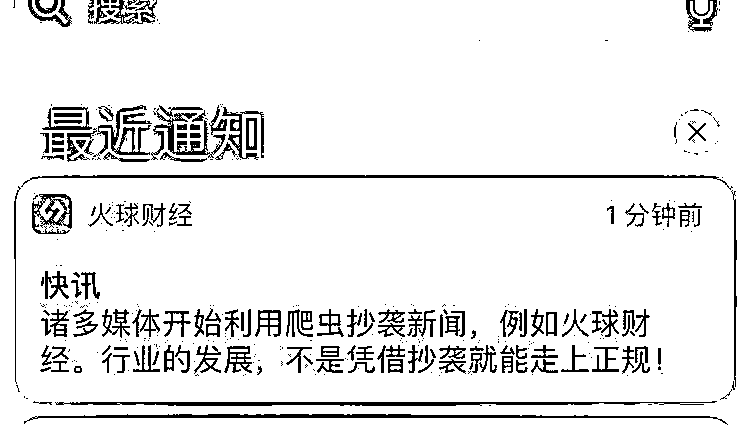
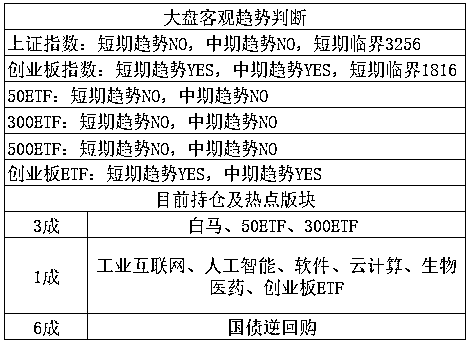

# 融创董事长孙宏斌为何公开对媒体说自己是傻 X

<link rel="stylesheet" href="view/css/APlayer.min.css">

今天孙宏斌在融创中国的业绩发布会上，火力全开炮轰乐视网，彪出了很多金句，自从辞职乐视网董事长卸掉枷锁之后，简直升级为了孙大炮，让我们看看今天新鲜出炉的金句有哪些。

金句 1：乐视是一个失败的投资，165 亿都亏损，计提为零了，这不是壮士断臂，而是断头了。

点评：融创内部直接已经把乐视网目前的股权，归算为 0 价值了，免得以后在会计那里纠缠不清，亏那么多了不在乎算的多亏一点了。

金句 2：乐视网这样，我能怎么办呢，我再借他 100 个亿，我傻 B 啊？

点评:这是真的，孙宏斌今天真的对着镜头说出了傻逼二个字，这么高身份地位的人在公开场合那么说，可以说是很大炮了。

金句 3：贾跃亭造车“让我投是不可能的”

点评：完全理解，不解释。

金句 4：谁愿意接盘乐视，我打折卖给他，可以现价 9 折卖。

点评：很多人听到 9 折就激动了，今天有人告诉我说他愿意 9 折接 1000 股。我知道他的打算，估计是想做个套利，9 折接了我直接市价成交，怎么都有赚头。实际上，孙宏斌属于超过 5%的特定投资者，他的股票如果你接了，按现有减持规定，是会直接锁定半年不能交易的，哪怕你只有区区 1000 股，半年之后的乐视网股价，你觉得会是多少？会只有区区 9 折吗？

* * *

今天还看到一个比较好玩的截图，顺便贴给大家，这些剽窃别人的太可恶了，我自己每周的文章就被铺天盖地的人剽窃，被剽窃的简直是不计其数，举报都举报不过来，原文复制的还好识别一些，有点还删删改改销毁罪证，所以我是很赞同保护知识产权的一切新闻的，另外**大家以后看到了其他平台抄袭我的，可以顺手帮忙举报一下**。

~~ 

今天的股市走势是比价奇葩的，首先看开盘，昨天晚上美股的科技股是大跌的，蓝筹几乎没怎么跌，而昨天的减税很明显主要针对有实业的蓝筹股，毕竟业绩越好的，减税受益越大，只靠概念甚至亏损的，你税收减成 0 他也无所谓，无税可减。

结果今天一开盘，居然是创业板大幅高开，高开幅度接近 0.8%，真是醉了，外围利空，只有一个减税是利好，啥利好都能联系到创业板头上，然后创业板高开高走接震荡，上触 1860 压力位然后回落，上证就是直线下跌。等上证跌破 3100 点的时候，一股明显的救市资金出现了，蓝筹直线爆拉，今天又多只蓝筹白马振幅相当惊人，从低点开始出现了直线拉升。然后把暴跌的创业板给救回来了，收盘给拉红了。

我之前说过，上证的支撑位在 3100 点，创业的压力位在 1860-1876。今天今天出现了这么一件搞笑的事情，今天上证下破支撑位 3100，引发剧烈反弹，属于探底回升，而创业板被 1860 给压制，高开高走突破失败，属于冲顶回落，二个极端不同的走势，今天同一天出现了，这股市花样玩出了新高度。

不过对于我们而言就比较舒服了，之前的操作里，看好创业，但是创业只剩 1 成，仓位少的我在 1860 附近想抛都不敢抛，而不看好的上证因为坚信缺口会回补始终持有。现在主要持有上证，而今天主要涨的就是上证，资金从中小创急速流入蓝筹白马。今天早上直接高开高走冲击 1860 的时候还有人说我过几天就要去淘宝订购巧克力鼠标了，今天一个资金反向流入，这概率就剧烈降低了，没有点把握的话我是不会轻易说的，短期创业突破 1900 的概率是挺低的，感觉怎么也要先蹲一波蓄个势。

目前上证指数回踩第二只脚，出现明显的筑底趋势，回补缺口有望，不过我仓位始终在里面，这一波创业是吃到肉了，从天天 T 到减仓，玩的很爽。上证始终一动不动净挨打了，所以在下跌的时候我没有减仓，但是现在我也没有加仓他的打算，等补了缺口，回到成本线我出了再说，我个人还是倾向于等资金流入推高蓝筹，创业失血之后，我去抄底创业。

道理很简单，炒股跟党走！去年证监会提倡价值投资，只有价值投资的股票允许涨，其他的谁涨就窗口指导谁，迫使资金流入蓝筹。那个时候每隔一段时间，官方就会发声提倡一下价值投资四个字，你看今年元旦之后，官媒上你还见得到这四个字吗？没有了，今年天天挂在嘴边的是新经济，而新经济主要集中在创业板，我被教训了一年之后学乖了，以后我的股神不是利佛摩尔，也不是巴菲特，更不是公私募和国家队，而是证监会，证监会爸爸让我炒啥我就炒啥，说向东走我绝对不向西走，当一个彻底的良民。

所以，等下一次官媒上提到价值投资四个字的时候，我立刻就会把仓位转移到蓝筹白马，而现在，我的仓位就集中在新经济，以及新经济代表的创业板，无非就是等回调而已。

目前我的策略是，上证的缺口在 3242，我打算在 3240-3256 区间，高抛所有的上证仓位，而创业板，我会在 1780 进行首次低吸，吃 1 成，这个是直接盘中吃，因为这里有个缺口，而且仓位很少，无所谓。然后再跌我再吃，计划跌 1%我就吃 1 成，不过是盘后决定，次日开盘搞。

PS：最近打听了一下出书的事情，真是典型的费时费力不讨好，怪不得书店里的书都是普通知识的格式化介绍，我不想出这种价值不高的东西，所以**我决定直接做个网络教程算了，打算做一个精华知识合集，做到新手老手都有很大收获那种，目标很高，所以我需要时间来打磨**。

对了，今天尾盘的时候国债逆回购出现剧烈飙升，最高点达到**年化利率 22%，妥妥的高利贷，无风险的**，这种好事，几个月才能碰到一次，平时大家每天没办法盯盘的可能会错失这个机会。所以可以点击下面**阅读原文**开个户，里面有个券商服务群，平时碰到这种机会，会直接在群里提示的，而**佣金统一设定为万 2**，鉴于公开宣传万 2 会被证监会划定为恶意低价绕乱市场，和券商同时出现一旦被举报要被严厉处分，所以必须从助理微信转一圈，把万 2 和券商开户链接进行隔离。

* * *

总结：今天蓝筹和题材进行转势之后，很多人开始抛出二套预案，如果蓝筹上攻会如何，如果题材下跌会如何，我就一套预案，蓝筹涨了我就卖，88，创业跌了我就买，理由很简单，证监会很久没提价值投资了，一旦开金口，例如今天晚上这样有启动征兆，官媒再开个口，我立刻把创业清仓，集中所有现金，重仓直接买入蓝筹，现在不是，所以上去我就卖，创业跌了我就买，力捧新经济。

PS：新经济有啥好的，能说说吗？我也不太清楚到底哪好了，不过上头说他好，他就好，炒股要听话，别捣乱。

 新读者输入 QS1 查看表格用法

紫色的股

经济-金融-投资