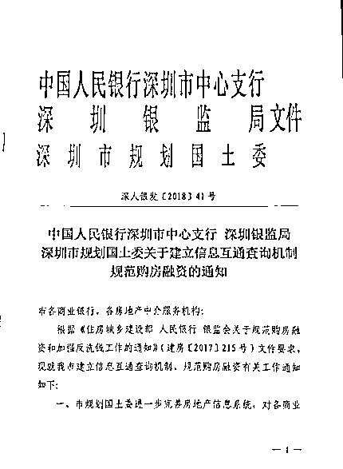
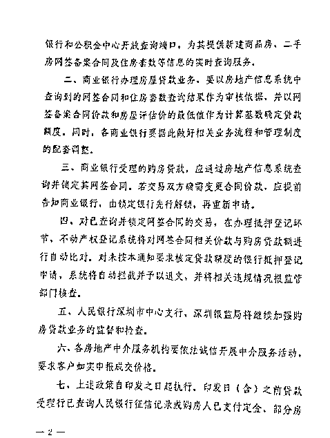
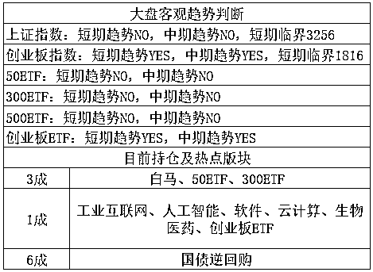

# 重磅！房地产实行三价合一，房产投机的人倒霉了

<link rel="stylesheet" href="view/css/APlayer.min.css"> 今天房地产出了一个重磅新闻，深圳出台重磅地产政策，**实行数据互联**，三价合一是**专治阴阳合同**的，那些购买二手房投机的人要倒霉了。

、

三价合一是什么意思，简单的说，就是二手房交易时涉及的银行贷款评估价、实际成交价、国土局计税评估价这三个价格将不再割裂，而是同步一致。

这么做有什么好处呢，在之前，不少二手房的买家会尽量做高评估价，这样可以多批贷款，但是等到了房地产登记部门提交的备案上面，为了少交税费，又会尽量的压低成交价，这就是所谓的阴阳合同。在之前，中介甚至可以帮客户做到 1 成甚至 0 首付购房，这么低的首付放大了房地产的风险，有违中央方针，给经济带来了极大的不稳定性。

执行三价合一之后还有一个特点，那就是银行评估价、实际成交价和国土局计税价里，实际成交价是不能确定的，因为买卖双方很可能搞阴阳合同，那么政府目前倾向的是按银行评估价和国土局计税价里，按低的取。原因有二个，第一个是这样可以大幅度减少银行发放的贷款，压制房价并且降低市场风险，第二个是可以降低名义房价。

而评估价格，通常是市场价是 7-8 成，一个市价 300 万的房子，首套房可以 3 成首付，但是如果价格只给你估 210 万的话，你只能贷出来 210*0.7=147 万，你需要自付 153 万首付，这就直接提升到了 5 成首付，而之前，经过中介的暗箱操作，有可能你只需要付 30 万甚至 0 首付就能搞定。

这中间差距可就太大了，如果是 1000 万甚至更贵的房子，那就更离谱了，对于二手房的交易来说，绝对是个坏消息，而二手房价格降温，对于一手房也不是啥好消息。

当然，这个作用力并不是特别猛烈，而是一个比较温和的药方，效果和之前的上浮基准利率差不多，并不足以导致地产垮台，但是短期进行降温，不可避免，而按照上头目前的意思，深圳开头，这个政策有可能很快推广到全国。

对于这个政策的效果我进行评估的话，大概是贷款利率从上浮 20%增加到上浮 30%的样子，不过是精准打击二手房交易，对于解决目前很多城市的一二手房倒挂，是很有帮助的，我怀疑就是针对这个才出台这项政策的。

今天其实还有一个更重磅的新闻，吴小晖被起诉诈骗 652 亿，职务侵占 100 亿，这个惊天数字是妥妥的全球第一金融大案，后面是否有来者不清楚，但是肯定前无古人。

 这个事情吧，本质上还是个郑智问题，无非就是当官的按贪污处理，从商的按诈骗处理，所以这个话题虽然大，但是我无法拓展描述，分分钟可能就碰红线了，如果是按照新闻通报的复述一遍，我觉得大家看新闻就够了，今天审判现场的进度几乎是被刷屏了，每半小时就有新闻弹出来汇报一下进度，大家看看新闻就行了，官媒报道的文案一定是审查过的没问题，其他的我今天就不展开评论了。

对了，昨天碰到一个好玩的事情忘了和大家说了，据说中国某教授发明了猪脸识别技术，称在菜市场扫一扫猪头，就能得知该猪所有的信息资料，能有效的帮消费者分辨出这个猪的品质，是有机绿色猪肉还是普通猪肉，目前正在申报专利。

我想问的是，我已经很多年没在菜市场看到猪头了，如果肉铺就剩一个猪腿的时候不知道能不能扫一扫，或者肉铺那挂一个绿色有机猪头实际上卖给我普通猪肉，不知道能否分的清楚。

还有一个比较重磅的消息，中国又降税了，从 5 月 1 日起，制造业的增值税率从 17%降低到 16%，交通运输、建筑、基础电信服务等行业及农产品等货物的增值税税率从 11%降至 10%，预计全年可减税 2400 亿元。另外还有把企业小规模纳税人门槛从 50 万上调到 500 万，以及对装备制造等先进制造业、研发等现代服务业符合条件的企业和电网企业在一定时期内未抵扣完的进项税额予以一次性退还，合计减税 4000 亿。

没的说，利好，但是对大盘的整体趋势影响不大，但是这里面点名的几个行业，估计会炒一波，主要集中在制造业，自行注意即可，利好算中等偏大，期望值也不要太高。

* * *

为啥呢，因为今天多只妖股集体炸板，炸板高达 50 家，其中一小半股票打板的游资当天亏损高达 10%以上，最狠的一个 603712 当天亏损 17%，游资今天元气大伤，损失惨重，满屏幕的吃面。

今天虽然指数跌的不多，但是出现二个极端，第一个极端就是白马跌的特别多，大面积的击破年线，连茅台都跌了 5%，第二个就是游资股跌的特别多，换句话说，最稳的和最激进的，今天都死的挺惨，高不成低不就的，今天反而没太大事。

昨天美股暴跌，导致今天 A 股低开，创业低开 1.36%，然后直接高走，拉升速度特别快，直接冲到 1856 然后回落了，收盘翻绿。还记得昨天晚上我们制订的高抛区间是多少吗？没错就是 1860-1876，今天的高点极度接近区间。

但是我没有卖，今天又是一动不动，为啥呢。因为我底仓太少了，创业板仅仅 1 成仓，如果今天高抛了那 1 成，我就空仓了！在看好创业板的时候怎么也得留点底仓吧，不然总感觉怪怪的，要是一点创业底仓不留，我觉得不太合适，如果他今天接近 1876 回落的，我肯定就卖了，制定的计划要执行，但是 1856，还差一丝丝才进 1860 呢，我就不打算卖了，后面跌了都不后悔。如果我今天持有的底仓是 6 成 7 成，其中创业有个 3 成 4 成，接近 1860 压力位的时候突然变弱，先卖个 1 成出去心里是毫无压力的，今天我肯定跑了。

从指数来看，创业明显比上证强太多了，风口继续在创业是毫无疑问的，单看创业本身，今天的走势已经很强了，尾盘妖股批量炸板，都没把他给炸到 20 日均线之下，不过就我个人意见来看，创业板受游资等短期激进资金的影响是很大的，加上大环境不稳定，所以短期不按照趋势做，按照越低越买，越高越卖来做，是比较合适的。而现在创业板的走势，要么上要么下，先冲再直接下的概率有点小，底仓太少不敢动，所以剩下的 1 成干脆不抛了，就放着吧，如果上的话择机抛掉上证的，再移仓过来都可以，跌的话就更开心了，我下一波要多多加仓创业板，免得拉高之后我不敢动。

总结：经过今天盘中的思考之后，我决定剩下的仓位都不动了，上证向上补了缺口才会卖，这几天怕是不可能了，要等一段时间，创业板向上就不卖了，向下会不断加仓，大概就这个思路，今天尾盘炸板太多，就算有减税利好，我也觉得短期不稳定因素太多，蓝筹白马的形态也实在太差，差的吓人，所以适当谨慎是好的，虽然创业板短期中期全部 YES，但是不建议追高，可以多看几天，再定策略。

当然，如果创业板疯了一样直冲 1900 的话，我宁可空仓也会直接砸灭他，本周创业板站上 1900 的概率无限接近于 0，我可以赌上一块巧克力味鼠标，因为那是在美股暴跌的时候发动 A 股大牛市的征兆，怎么看都太玄乎。 

 新读者输入 QS1 查看表格用法

紫色的股

经济-金融-投资