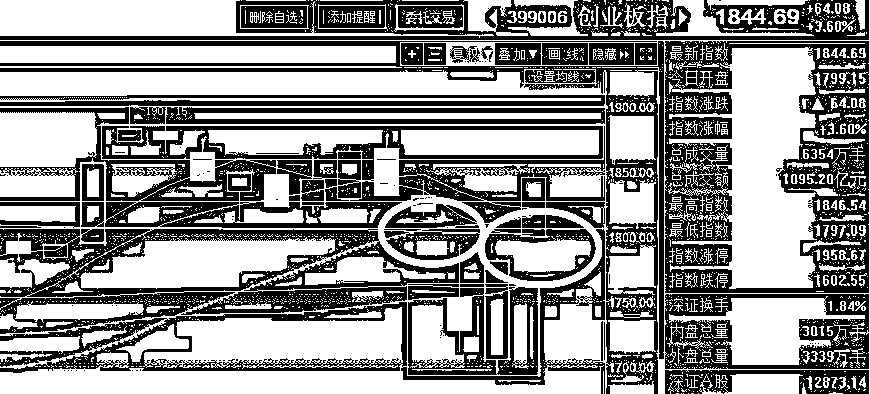
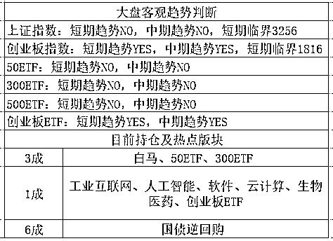

# 滴滴打车遭遇危机，挑战者接二连三的出现

<link rel="stylesheet" href="view/css/APlayer.min.css">

今天我打了个车，意外的发现，销声匿迹很久的补贴烧钱大战又开启了，有人狂砸现金挑战滴滴打车，烧钱额度惊人。

前几天看到美团打车正式开启下场挑战我还没啥感觉，因为我平时打车很少，都自己开车，但是今天偶然打了一辆车，正面再感受了一下几年前的那股烧钱大作战，觉得还是有必要说一说的。

打了出租上车之后，在行驶的途中，**师傅拼命的推荐我下载一款叫嘀嗒出行的软件，说可以便宜我 9 块钱车费，**我懒得费那个事就拒绝了，但是师傅太热情了，最后架不住就下了，当然也有一部分原因是行驶途中有二十分钟那么长，闲着也是闲着，9 块也是钱啊。

下了之后就和师傅闲聊，师傅说，这款软件是这几天刚开始烧钱补贴的，他也是今天才开的，我算是他第一单，下软件之后客户可以免 9 元，然后会奖励司机师傅 12 元，这是首次下载，以后司机用这个软件接乘客的话，每天首单是奖励 15 元，然后是 12 元，剩下的都是 10 元每单。他几个同事前几天开的，每天都额外赚好几百，很爽。这个烧钱额度惊呆我了，就算只在大城市推广，这也很烧钱啊，这补贴力度堪比当年滴滴。

我们都知道，滴滴烧了很多年的钱，烧掉的人民币可以绕地球三圈，每天打的 2 块钱上班就是滴滴搞出来的。后来滴滴打败了大部分竞争对手，成为了亚洲最大的独角兽，获得了市场支配权之后，取消了所有的补贴，开始对司机的收入进行抽成。

按理说，滴滴平台拿了投资人的钱，巨额亏损那么多年，如今终于一统天下，开始赚钱回血，是很正常的，不过滴滴似乎抽的有点多，回血的速率之快，让滴滴的估值瞬间暴增，顺利获得了很多融资，在账上还有几十亿美金没动的情况下，今年 4 月还获得了 55 亿美元的融资。

这下可把很多竞争者嫉妒坏了，滴滴平台的原理很简单，几乎没有什么技术护城河，无非就是靠天量资金的不断燃烧吓阻了很多竞争者，如今补贴消失之后，马上就有很多人蠢蠢欲动了。

先有美团打车，后有嘀嗒打车，滴滴好不容易刚灭了竞争对手，稍微一放松立马就有人冲进来变成新的竞争对手了，开弓没有回头箭，这 2 家一旦入场，不烧个几十亿血战一场是不会走的，不然前期烧的几亿全部白烧了。

如果滴滴打车已经上市的，就冲这些竞争者入局，少说跌个 20%，不过这也侧面说明一个问题，真正的独角兽创业公司，还是要靠技术垄断，单纯靠钱砸出来的独角兽，盈利能力堪忧，你不赚钱那没事，一旦你赚钱了，马上就会有新资金冲进来要分一杯羹，这就很尴尬了。连滴滴打车都这样，技术含量更低，纯靠资金堆积的共享单车，我更不看好，要么始终不赚钱，一旦赚钱速率超过普通投资，马上就有跟风资金做出下一个 XX 单车。

* * *

贸易战这东西结束了，双方都到谈判桌上了，今天还都宣布自己已经获得了谈判优势，一定会为国民谈出最有利于本国的条件。我估计最后谈判结束的时候，双方都会宣布自己获得了谈判的胜利，咳，这是套路。当然，实际的最终谈判结果，一定是中国要吐出一点利益，毕竟经济实力差距摆在那里，有多大的经济实力，就有多大的谈判能力，谈判技巧可以获得一点小利益，但是不可能逆转乾坤。

不过从这件事，我们可以看出一点东西，我周末和大家说，预计的是肯定打不起来，拖个半年就会重回谈判桌，这在历史上是有案例可查的，一般不会过于扩大化，但是僵持一段时间是必须的，谁都不愿意主动低头。但是股市一暴跌双方立马开始谈判了，耗时仅仅 1 个交易日，简直是史上最快贸易战媾和，带来的后果就是股市暴涨暴跌，直上直下，全球股民都在玩过山车。

不过**贸易战和平解决对大家都是好事，尤其是不用担心民生领域的涨价了，也不用刻意多买点米面肉储备在家了，可以天天吃新鲜的了=。=**

* * *

今天创业板再度出现暴涨，跳空高开 1.1%，然后高开高走，收涨 3.6%，普涨，收盘百股涨停，上证都跟着涨了 1%，满屏红，非常和谐。

从昨天的低点开始计算，昨天收盘的时候已经反弹了 5%，今天再来个 3.6%，合计 8.6%了，创指数已经回到了 1844，和上周我们减仓的区域已经差不多了！

之前，我们持有 3 成上证做压舱石，创业持仓 4 成，上周三把创业减仓 2 成，周五的时候打算继续减仓，但是一个黑天鹅突然暴跌，直接低开焖杀，不给任何减仓机会，我也就顺手做了个 T，吃了开盘反弹的差价之后，继续维持原仓位不动，毕竟我手里还有 5 成子弹，创业板的中期趋势可是 YES，一口气被弄死基本是不可能的。暴跌之后，其实我感觉还是挺不错的，毕竟在这种突发黑天鹅面前，还逃了一部分仓位，后面再跌一点抄个底，爽歪歪。

周一开盘之前定调，贸易战不会持续发酵太久，会重新谈判的，中国让一点利益，给特朗普一点台阶，这事就算平了，所以收盘价 3100 之下，有一点点企稳征兆，就要开始增仓。

结果周一破了 3100 一瞬间，创业板就立刻开始带头起飞了，周五低开我还做了个 T，周一我就一动不动，因为大国争端，怎能如儿戏，周五才开战，你 TMD 周一就停战了？在逗我吧，我已经尽量低估贸易战的影响，但是没想到这么低，这么短的时间就结束了。我觉得如果说周五的贸易战暴跌是黑天鹅的话，出乎市场意料，那么周一的突然暴涨，也算黑天鹅，绝对也是出乎市场意料。今天，创业板把缺口给补了，顺便还弄出了一个向上的岛形反转，你说逗不逗。

鉴于昨天已经反弹了 5%，而且气势如虹，我觉得今天差不多能回补掉 1814 的缺口，鉴于可能的抢跑因素，提前一点，昨晚预估的是 1790-1806 吧，也不多卖，只卖 1 成，持仓从 5 减到 4，以防连续冲高，创业仓位实在太少了。结果今天直接高开到 1800，涨 1%，我开盘就给卖了 1 成，后面就目瞪口呆的看着他发疯一样的涨，昨天到现在已经涨了 6%了啊哥哥，你不休息下？结果收盘涨到了 8.4%

今天收盘之后，发现和上周高抛的位置已经相差无几了，创业板几乎收复全部失地，只有上证软绵绵的在下面。我们这一波操作，高抛是对的，今天开盘略微减仓其实也是对的，就的低吸的时候犹豫了一下，根本没想到贸易战结束那么快。目前可惜的是，创业仓位太少了点，只有 1 成了，再卖就没了，不够机动灵活。

所以，根据今天的图形，我轻易不会再卖出创业板了，只会择机等低吸，而上证的仓位等回补了缺口会基本放弃掉。不过我还是认为这一波是冲不破 1900 的，明天冲击 1860-1876 区间，我会提前逃跑再减剩下的 1 成，我觉得我接的回来。

这属于典型的左侧猜顶，不属于趋势的右侧交易，不过鉴于最近一段时间大环境特别混乱，特朗普把国战玩成了过家家，我觉得我还是谨慎点好，暴涨之后逐步减仓我觉得还是更踏实一点。

~~

中期趋势就是厉害，创业板第一个翻 YES，我这里上证持仓 3，创业持仓 1，并不代表我不看好创业，而且恰恰相反，非常看好创业，至于为什么仓位不对头，好像反过来了，我这一波实盘就是这样的操作的。。。我也是很迷醉，特朗普实在是耍人，不过顶部减了一点仓，暴跌后一股不卖，周五做了个 T，还算有点小小成就。

PS：下一波我不打算要压舱石了，真是废。。。 

 新读者输入 QS1 查看表格用法

紫色的股

经济-金融-投资