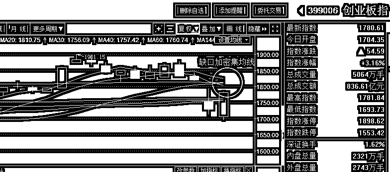
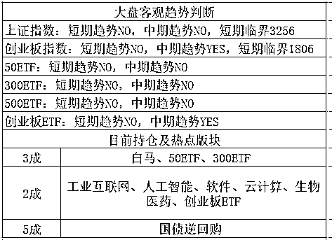

# 中国宣布禁止进口一样商品，美国人恐慌了

<link rel="stylesheet" href="view/css/APlayer.min.css">

今天有一个新闻挺有趣的，涉及**贸易战里中国对美国的首场胜利**，不过内容有点上不了台面，但是想了想，还是和大家说一下，毕竟这是首个禁止进口的商品，让美国宣称本国一个重要行业遭遇了被摧毁的风险。

这个商品，是废料，中国是全球最大的废料买家，但是已向 WTO 表示，将停止接收废塑料和废纸等洋垃圾。美国废物循环利用协会称，该禁令将摧毁一个支撑着 15.5 万个工作岗位、每年对中国出口废料金额达 56 亿美元的行业。美国上周五夜间对 WTO 表示，中国执行此项禁令，已对全球金属废料供应链造成根本性破坏，采用过度的贸易限制措施，有违其 WTO 的义务。并表示要求中国即刻停止实施这些举措，并以符合金属废料贸易现有国际标准的方式加以修正；

中方代表同意考虑这些意见，但同时表示，每个国家都有责任处理掉自己产生的废物，中国人口众多，中方必须限制废品的进口，保持国内环境的清洁。

这个新闻挺逗的，第一次大国争端的局部胜利，以拒绝废料进口实现，**如果美国继续惹怒我们，我们将停止进口你的垃圾，让整个美国垃圾遍地，这场景想想都有点小激动呢**。

美国的废品，出口到中国，收了大概 56 亿美金，中国处理这些垃圾的确能提取很多有用的物资，但是带来的巨大的环境污染。美国山清水秀，中国雾霾遍地，以前是中国没办法，太穷，如今中国有钱了，足够保护环境了，恰逢贸易战，我觉得洋垃圾这种东西，是第一个要坚决禁止进口的，**中国在去年 7 月就宣布要禁止洋垃圾进口了，但是一直不执行，文件上显示始终是待定，今年贸易战的关键节点突然抛出来要立刻执行，**我觉得也是故意的，不过这个故意弄的好，我是强烈支持，哪怕只能恶心恶心老美，也可以的。而且这是直接禁掉了 56 亿美元的行业，比之前对 30 亿美元农产品征税要厉害太多了。

美国觉得贸易逆差过高，要求中方缩小，中国表示很多高精尖的设备都想购买，价格好商量，美国不卖，出口禁令，给多少钱都不卖。但是对于洋垃圾，中国不想要，美国却强迫中国购买，哪有这种道理。

而中美之间，目前已经坐在谈判桌上开始谈判，以求避免贸易战，受此影响，这个时候美股已经上涨了 2%之多，贸易战威胁大减。

* * *

乐视网在昨天孙宏斌疯狂唱空攻击下，今天早上宣布紧急停牌，没有欣赏到预料中的跌停秀，被停牌避险了，不过停牌之后，依然是死路一条，孙宏斌都唱空到哪个份上了，不跌都有鬼了。。。

~~

今天**游资大佬孙煜**因为炒作**贵州燃气、天华院**遭上交所限制交易三个月，自 2018 年 3 月 26 日至 2018 年 6 月 25 日不得买入和卖出在本所挂牌交易的所有证券，账户直接被冻结。

这个就厉害了，对于游资来说是很伤的，游资连停牌都怕，更怕这种股票实际在交易，但是自己却不能交易的情况，等于任人鱼肉啊，贵州燃气还能炒几天不好说，但是 3 个月后肯定是一地鸡毛，这个毫无疑问。

据说是因为首次警告大额买单封涨停要求撤单的行为后，孙煜不思悔改，3 月 8 号继续盘中大单拉升，被系统检测到，直接被判处极刑，这种惩罚对其他游资来说都有一个威慑作用，简单的说就是要听话，警告之后还不听话，我是有办法治你的。**朕给你的，你可以拿着，不给的，你不能硬抢**。

* * *

昨晚我们对周一做出的判断是周一大概率是要跌的，但是底仓不要轻易卖，留着，因为大概一个月内我觉得是会回封缺口的，做好仓位控制，价格越低，仓位越重。等杀下来，让后续的子弹捡个便宜。什么时候算便宜呢，预估收盘 3100 之下，只要有一点点企稳征兆，我可能都考虑增仓。

结果今天一开盘，直接低开到 3117，离 3100 只有一步之遥，我当时想，低开那么多，收盘估计要落在 3100 之下的，希望盘中强一点，那明天直接开始增仓，要是弱，还得等几天。

低开之后继续剧烈跳水，9 点 39 分，直接击破 3100，见到了日内最低点 3091，然后引发了抢跑。9 点 40 分开始，创业板开始一波惊天地泣鬼神的暴力反弹，从-2%跌幅，到收盘居然有 3%的涨幅，如果大盘击破 3100 的瞬间抄底创业板，那么日内指数涨幅会吃到 5 个点，而个股自最低点涨幅超过 10 个点的高达七八百只，15%的有几十只，甚至天地板 20%的都有几只，全天涨停超过 50 家，简直吓人。

周一会跌我预料到了，周一跌倒 3100 会有支撑我也预料到了，不过我的交易体系都是以收盘价为准的，要通过大量的观察才能下结论。所以我今天的操作就是丝毫没动，开盘没有买，收盘也没有卖。不过昨晚对缺口的分析，认为缺口必补，底仓不割肉，反而要越跌越买的判断，应该帮助大家免于恐慌。

按照剧本，这里是要震荡阴跌的，一旦收盘低于 3100，我马上就要考虑增仓，无非是根据盘中强弱情况决定补仓的仓位和时间而已。而今天创业板惊天暴涨之后，我又根据新形势改策略了，因为明天创业板一旦向上冲一冲，创业板的缺口就被补掉了，补了之后理应减仓然后再观望处理，所以我决定这里减仓一成，剩下的继续看看，区间大概是 1790~1806.

为什么今天暴涨的是创业板而不是上证，这里是中期趋势的威力了，上次有人问我，临界点是以短期趋势为基准的，那中期趋势有啥用呢。这个时候大家就看出有啥用了，中期趋势为 YES 的指数，第一波暴跌是死不掉的，回血会很迅速，所以可以大胆做多。中期是 NO 的，那就不好说了，谨慎做多。

这一波，我们加仓、减仓、做 T，吃肉基本都来自于创业，如今第一波反抽的还是创业，压舱石上证在那里一动不动，净挨打了，我上次和大家说过打算仓位分配比例是 46 开，下一波我打算 37 开了，上证操作起来不舒服。

不过看好创业归看好创业，明天我还是要卖创业 1 成，而上证我不打算动，因为大环境不稳定，但是我不认为他会股灾，所以谁涨的多我卖谁，不涨的就拿着不动，上证的缺口还是要补上的，只不过需要的时间久一点而已。

明天创业板冲高被我们卖掉是大概率的，卖掉之后，跌下来，还会加仓创业板，高点抛了不少创业，目前仓位有点少，仅有 2 成，机动力不足。而上证的 3 成就一动不动吧，向上反抽补掉缺口之前没有太多想法。

~~

今天没有割肉，也没有加仓，一动不动的一天

紫色的股

经济-金融-投资