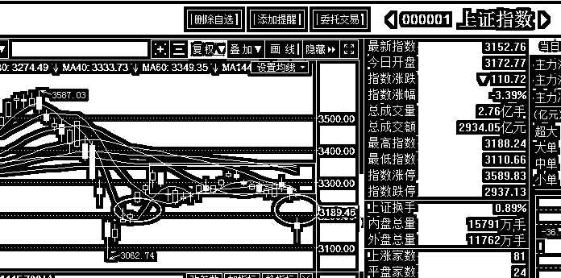
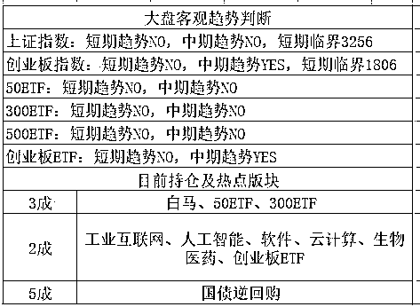

# 孙宏斌辞职后开始曝光乐视所有老底

<link rel="stylesheet" href="view/css/APlayer.min.css">

周日下午 2 点，孙宏斌在辞职后首次对乐视网问题进行正面回应，称辞职董事长之后，很多问题就可以合法合规的谈了，以前什么都不能说感觉很憋屈，如今可以和中小投资者一起骂，然后对乐视网的老底进行了大曝光，我来给大家逐一汇总下。

**1、辞职原因。**

孙宏斌说自己提前卸任乐视网董事长的原因是要对散户负责，乐视停牌之前只要 18 万散户，但是复牌之后居然有 33 万散户，机构全跑光了，而且很明显有人在炒作，很多散户声称是因为看好孙宏斌才买入的，所以干脆辞职，以免将来散户亏了，他付不起这个责任。

点评：这点我完全理解，孙自己持股才 5%，股价上涨他只有 5%的好处，跌下来他负全责都骂他，这种冤大头的事情换谁都不愿意做。

**2、乐视网具体的困难是什么**

孙宏斌：极度缺乏资金，已经资不抵债，版权摊销、利息每年都要 20 多亿，赚的钱都不够覆盖利息，怎么做都很困难，现金流也没有，利润也没有。

点评：老孙说到底就一个意思，乐视网没救了，完蛋了，反正我是救不了。

**3、乐视网危机能解决吗**

解决乐视网的危机需要百亿以上的资金，而且需要钱合理合规的进来，如果没有外援资金进场，仅靠乐视网自己变卖核心资产是远远不够还债的，乐视网很有可能已经是负资产，且现金流已断，要么破产重整，要么就只能退市。

点评：这句话的意思就是对乐视网估值是 0，把壳价值，各种金融牌照价值都算上也是负资产，只有破产和退市二条路选，这可真够狠的，一口气要把乐视网砸到底啊。

**4、对乐视网的小股东有什么想说的吗？**

孙宏斌：不要瞎炒，要看基本面，现在我也是散户，我也投资失败，以前我是董事长说什么都违规，现在辞职了可以和小股东一起骂。孙宏斌说，自己最想对乐视投资者说的话是“如果挣钱了，祝贺你；如果亏钱了，跟我没关系，别骂我，我还想骂人呢，因为我比你亏的多”

点评：我辞职了，我也亏很多，乐视网将来如果跌了和我没关系，概不负责别找我，要是我这么唱空他，他居然还涨了，那算你运气好，大概就这个意思。

**总结：孙的持股太少，这次报道一出，堪比核武器级别的唱空，**足以说明孙的意图就是希望乐视网跌，暴跌，目前的价格他是远远不满意的，否则不至于这么唱空，他可能希望的是腰斩再腰斩，然后他再以白马骑士的姿态杀回来接收大部分股权，那个时候你让他去维护股价，他可能才有动力。

* * *

周五的 IPO 是 3 家 26 亿，我本来以为全球金融市场剧烈动荡，监管层会呵护一下市场，没想到一点没减，量还增大了，我就纳闷了监管层哪来的那么大信心，这么笃定 A 股安稳无忧的，利空不解释。

周五晚上，美股横盘了很久，然后尾盘剧烈跳水，继续暴跌，收跌 1.77%，这也是利空不解释。。。

周末还有个消息，公布了独角兽的名单，名单太长我就不列了，估计 A 股沾亲带故的又会趁机蹭下概念，但是对大盘没啥好处，覆巢之下焉有完卵。。。

**周末消息面汇总，明显偏空。**

* * *

周五的时候我们知道，贸易战全面爆发，全球股市都大幅暴跌导致 A 股同步暴跌。其实提前几天的时候我们就已经感知到危险了，我在周二就进行了适度减仓，并在周四晚上说，鉴于大环境的不稳定，且靠近临界点，要么暴涨要么暴跌，所以周五的时候还会再进行略微减仓。

减仓的逻辑是什么，周五一根小阴线所有指标就会全部转 NO，且大环境变差，但是在大环境变差的一堆理由里，贸易战只是一笔带过，大家可以看周四的文章，只花了一小段。因为根本不曾预料过特朗普会出那么重的手，按照常规政治逻辑，贸易战都是先打很长时间口水战，最后才慢慢动手的，哪有上来就掏刀子的。

所以这超过预期的东西直接就引发了全球股市的暴跌，从暴跌的幅度看，包括美国在内的投资者，都认为这是超预期的利空行为。

所以就以我的预计大盘的轨迹，是大概率向下，但是向下之前会有个小阴线击穿支撑位，然后才会慢慢向下，绝对不是这么一步到位的暴跌，这是黑天鹅级别的股灾级暴跌。

那么事情已经发生了，我们接下来应该怎么做呢，首先，保留的 5 成子弹有了大用，跌下来就是机会，但是千万不要乱打出去，一旦提前抄底耗尽了子弹，再跌下去那可就真没啥办法了，只能无脑不动等解套了。而周末的消息总体明显偏空，所以下周一，我的计划是按兵不动，暂时不抄底，等形势稳定。

那么有没有可能一跌不回头呢，我的看法是不会，我们看看大盘，出现了一个典型的岛形反转图形。

什么叫岛形反转，以一个跳空向上的缺口，后面接一个横盘，然后以一个跳空向下的缺口结束，中间的那个横盘像不像一个海洋中的岛屿，这就是岛形反转，中间那个横盘越宽大，则岛形反转的力度越强烈，一般来说，中间有 2~3 根横盘的岛形反转，就已经足够强大了，会引发大跌。

而这一次，中间横盘接近一个月，构筑了一个巨大无比的岛屿，如果这个跳空缺口不补，一路向下跌，那么这种级别的岛形反转，足够让大盘直接腰斩，2008 年曾经出现过这种级别的岛形反转，后果是从 3300 一路跌到了 1600.

那么这次会跌那么多吗？如果真跌那么多，那股市几乎就崩溃了，是扎扎实实的系统性风险，股市这东西，不涨就不会跌，不跌就不会涨，已经连续 2 年压制股市的上涨了，涨一个监管就砸一个，当时挺讨厌的，但是现在则有好处了，那就是股市很难暴跌，因为始终没怎么涨。

加上国家队的资金是始终存在且待命的，既然这样的话，那这个缺口就必须要补上，只要把这个缺口回封了，那岛形反转就不存在了，这种持续向下的压力就不存在了。

故，我个人认为，等局面稳定之后，有可能会触发一轮级别较大的反弹，至少这个缺口是要回封掉的。而在局面稳定之前，强烈看空，管好自己的手，暂时不要补仓，所有趋势都转 no，全球股市都暴跌，各种支撑全被打穿，要么横盘稳定多天，要么继续暴跌，一步杀到位，否则的话，谁敢入场。

所以做个总结的话，那就是周一大概率是要跌的，但是我的意见就是底仓不要轻易卖，留着，因为大概一个月内我觉得是会回封缺口的，做好仓位控制，价格越低，仓位越重。而周一我们的子弹不要轻举妄动，等机会，看看到底能杀多深，让我们后续的子弹捡个便宜货。

预估收盘 3100 之下，只要有一点点企稳征兆，我可能都考虑增仓，当然目前这个是预估，要等实盘看盘之后再定。

紫色的股

经济-金融-投资