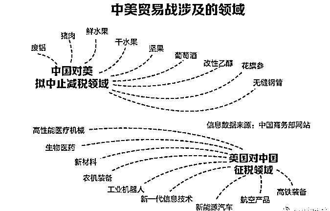

# 贸易战里的大国争霸：宁可不要 GDP，也要发展高精尖

<link rel="stylesheet" href="view/css/APlayer.min.css">

中美刚刚爆发了贸易战，美国和中国都互相执行了贸易制裁，二大国的贸易争端直接引发了全球股市暴跌，但是我们对比了一下双方的贸易制裁清单，会发现一个非常有趣的事情。

如图所示，美国对中国征税的领域，全部是高精尖的工业产品，而中国对美国征税的领域，全部是农业产品和一些低附加值的初级产品。网友对此评论说，看完之后，我才发现这是**特朗普带着一个农业大国，向一个工业大国发起了贸易挑战**。

但是实际上，中国和美国的工业实力肯定是反过来的，这是公认的事实，正常来说，应该是美国制裁中国的低附加值产品，中国制裁美国的高附加值产品，**为何会反过来呢**。

因为贸易战归贸易战，贸易战里也隐含着大国争霸，并非纯粹的经济因素。实际上，**美国这一次对中国的征税领域，全是从中国的强国战略《中国制造 2025》白皮书上直接抄来的，**简单的说《中国制造 2025》要大力发展哪个领域，本次就制裁你哪个领域，就是要拖慢你发育，能拖几年就拖几年。

所以，这些高精尖的领域，中国不可能和美国对着制裁，能想出的贸易反制，就是一些初级产品领域，因为这些领域虽然美国无所谓，但是中国也无所谓，这些初级产品发生了贸易争端，**只会损伤中国的 GDP，但是不会损伤中国的硬实力**。

* * *

大家可能奇怪了，GDP 不就是硬实力吗？实际上不是这样的，**GDP≠实业，实业≠硬实力。**

首先和大家说说为什么 GDP≠实业，产生 GDP 的方式有很多种，但是未必都是由实业带来的，比如在香港，服务业非常发达，同样是理个发，可能要比内陆不发达城市要贵三四倍，所以仅仅理发行业，就会直接提升三四倍的 GDP 贡献度。而香港发达的商业，给里面的各种品牌支付了各种溢价，都会导致 GDP 的提升，这种 GDP 提升的是城市的软实力，会让香港人过的更加精致幸福，但是如果碰到战争，犹如精美的亭台楼阁，并没有太大用处。

我举个例子，**香港的 GDP，有大陆的 20%之多，但是假设到了战争年代关门单挑，5 个香港能打的过大陆吗？**别说 5 个，15 个也不行，你本土产多少粮食？本土产多少钢铁？飞机大炮工厂的产能是多少？

那些大家很是看不起的钢铁厂、加工厂等高污染低附加值的产业，里面的那些设备，等到了战争突然爆发的时候，那是你花钱买都买不来的，滚滚的钢铁洪流能直接碾压无数个类似香港这样的金融城市。

这也就是为什么近些年中国的资金在金融和地产领域空转，中央非常讨厌，非要迫使他们回流到不挣钱的实业里面去，因为真到了比拼大国实力的时候，北京的金融民工再多，高楼大厦再宏伟，还不如河北那些脏乱差的钢铁厂好用呢，当年抗日的时候喊出的实业救国口号，可不是白喊的，为啥没人喊金融地产救国。

* * *

**故 GDP≠实业，然后我们来讨论下为什么实业≠硬实力。**

因为实业分很多种，河北的钢铁厂算实业，航空超级合金工厂也算实业，而实际上我们知道，改革开放以来我国顺利成长为世界第一工厂，美国的产业转移占据了主要因素，**美国放弃了很多实业，把这些工厂转移到了中国，**中国因此获得了很多投资，也获得了很多技术，这样才从一穷二白成长到了如今这种巨无霸的国家。

那么美国转移到中国的是什么实业呢？美国放弃的实业全部是低技术含量低附加产值高污染高耗能的行业，就好像河北那些钢铁厂、电解铝这些行业一样，那些真正高精尖的产业，是绝对不可能把工厂搬到中国来的。

高精尖科技有什么威力，还是以河北的钢铁厂举例，你拿河北的钢铁厂的产品造出的坦克，去横扫非洲那些穷国，或者香港这种空有 GDP 但是没有什么实业的金融城市，那是轻而易举，但是真正的大国对决，那就是一堆破铜烂铁了。

因为**真正的大国对决，可不是比 GDP**，最终都是以战争来作为最终体现，真正的战争里，一架最新的五代战机，横扫二战时期的普通战机几百架都没有任何问题。二战时期的飞机需要视距内才能发动机枪扫射攻击，而现在的战机能让对手连人都看不到就被导弹凌空打爆了，飞机多有用吗？

就好像当年清朝僧格林沁带着五六万步骑兵，八里桥一战，以 10 倍的兵力差距，毫不畏惧的冲向英法联军的步枪战阵一样，全军溃败，死伤三万多人，英军死亡 2 人，法军死亡 3 人，清朝从此士气被彻底打崩。

**落后产能和高精尖产能的区别，就好像清朝大刀的产能和英法联军火枪的产能差别一样，**数量多意义是不大的。普通钢铁厂再多，也没啥用，无非就是靠污染换就业，仅此而已，能用于五代战机发动机的超级合金，那样的钢铁厂才是大国实力的真正体现。中国别说五代战机发动机的金属不达标，连四代战机的发动机金属都有点问题，耐久性特别低，飞一段时间就得整体换发动机，中国战斗机的发展目前受制于发动机质量不行，而发动机质量不行的一个最大短板就是金属质量不行。在高精尖的合金始终造不出来的同时，河北的钢铁厂铺天盖地，号称全球钢铁产能一半在中国，中国产能一半在河北，这种低技术的钢铁厂，只能民用，对于大国实力帮助有限，美国如果缺这种钢铁，分分钟就能修几百个低级钢铁厂，他现在只是因为他高污染低附加值所以放弃掉扔国外生产了而已，但是最顶级的合金厂，一律放在美国国内，中国多次试图购买技术或者收购股份，都以国家安全为名直接驳回，简单的说就是给多少钱都不卖。

* * *

**故实业≠硬实力**，能用于大国争霸的实业部分，才是真正的核心竞争力，宁可放弃一万吨普通钢铁，如果能换来一吨高科技合金的产能，那简直都是太划算了。

所以中国近些年拼命推行产业升级，推工业 4.0 计划，出《中国制造 2025》白皮书，就是要不惜一切代价发展自己的高科技产业，提升自己的硬实力。而这些产业升级，才是真正的威胁到了美国的地方，美国可以把普通钢铁让给你中国生产，但是高端的合金一定是要保证垄断权的，如果这个优势丧失了，那么美国的霸主地位就真的是被挑战了，一旦枪杆子出了问题，所谓的美元霸权，金融帝国不过是一个笑话而已。

* * *

我举个例子，1987 年爆发过一起震惊世界的**东芝通敌案件，日本东芝机械公司被彻底搜查，所有高管被逮捕**。

这是为什么呢，因为 1981 年，东芝机械和苏联人串通，以向苏联出口二轴联动数控机床的名义，狸猫换太子，偷偷向苏联出口了四台九轴五联动大型数控螺旋桨铣床！

这种机床有什么用呢？不就是卖了 4 台机床嘛，有什么大不了的，犯得着把东芝上下的高管抓了个遍吗？都是数控机床有什么区别呀。

这种九轴五联动大型数控螺旋桨铣床可以通过一套复杂完备的算法和精准的控制系统完成复杂曲面的数学建模和高精度加工，非常适合加工核潜艇所需要的高性能螺旋桨。不要说在苏联，就是在西方世界，也是高精尖的技术。苏联为了这 4 台机床，向东芝支付了 37 亿日元的天价费用，但是实际上，这几台设备根本就不是金钱可以衡量的。

因为螺旋桨加工精度水平落后，苏联的大国重器核潜艇对美国的威胁一直很有限，其噪声水平巨大，比西方的无声潜艇差距简直不可以道理计。资料记载：当时苏联建造的“阿尔法”级攻击核潜艇，当它在挪威海域活动的时候，引起的水声振荡有时甚至可以被设在大西洋另一侧的百慕大群岛的美国海军水声监听站探测到！

苏联认识到，如果不解决这个噪声问题，将来打起仗来，无论制造多少潜艇，都只能是纸老虎，因为潜艇只要一旦被侦测到，离死就不远了，被人发现的潜艇就是个死潜艇。

但是苏联的机床加工精度始终达不到美国的标准，所以苏联得到这几台机床后，如获至宝，拉到军事基地里秘密大量生产，以年产量 16—18 个的速度生产螺旋桨，供应苏联海军最新型核潜艇。

几年之后，苏联的潜艇实力得到了飞速提升，鸟枪换炮，美国海军发现不对劲了，以前的苏联潜艇侦测起来简直太容易了，在海底航行的时候发出的巨大噪音简直是在鸣笛前进，200 海里之外就能被美国海军舰艇上的普通声呐轻易发现。

在 1986 年爆发了直布罗陀海峡事件，美国和苏联的核潜艇直接相撞，直接原因就是苏联潜艇实在太安静了，美国的声呐楞是没侦测到，当然苏联的声呐也没侦测到美国潜艇，所以双方都没发现对方的存在，最后直接一头撞在一起了。

这下美国人火大了，几十年来都是美国潜艇碾压苏联潜艇，只有我在你面前隐形，哪有你在我面前隐形的道理，于是下令彻查此事，到底是为什么在几年之内苏联潜艇发生了如此天翻地覆的变化，不查清此事，美国人睡觉都不踏实啊。

这一查，就把东芝给查出来了，加上线人报案，美国掌握了充足的证据是日本通敌，于是日本首相被迫向美国道歉，同时严厉制裁东芝公司。

人也抓了，钱也罚了，但是这 4 台设备是已经到了苏联手里了，就是这四台机床，把这个苏联的军工水平和国家实力提升了一整个台阶，从此美国的监听优势荡然无存，苏联潜艇和寂静的大海融为一体，再也难以轻易的被侦测到。

区区 4 台精密机床，有如此巨大的威力，东芝公司偷偷出口这些设备，最终是以日本首相的国级别道歉来收场的，你说高精尖技术在大国争霸里的地位到底如何。

所以，不仅仅这些尖端技术出多少钱美国都不卖，而且你自己研发他也不乐意，趁着这次贸易战，顺手打压一下，能拖几年就拖几年，只要我技术始终领先你几年，保持一个领先优势那就足够了。所以我们可以看到，美国如果全心全意要发起贸易战，限制中国的低端产品是威胁最大的，能直接动摇中国的经济和就业人口，但是美国偏不，我就限制你的高精尖产业，低端产品你继续造，那个没关系。

所以，在这次贸易战的同时，我们也要看到这是一次大国争霸的碰撞，中国的高精尖技术目前和美国比，还有相当大的差距，落后一代都不止，这么大的技术代差情况下美国都产生危机竭力打压，这正说明我国的发展策略是正确的，就是应该产业升级，宁可不要 GDP，也要发展高精尖。

**友情注释：所有的赞赏都会进入我们家领导的零花钱账户。。。**

紫色的股

经济-金融-投资