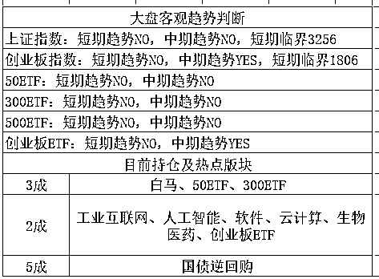

# 美国挑起贸易战，中方霸气宣布 30 亿美元反制裁措施

<link rel="stylesheet" href="view/css/APlayer.min.css">

今天凌晨，美国总统特朗普签署总统备忘录，依据“301 调查”结果，将对从中国进口的商品大规模征收关税，并限制中国企业对美投资并购。特朗普在白宫签字前对媒体说，涉及征税的中国商品规模可达 600 亿美元。

而在之前的吹风会上，特朗普曾表达了贸易战的思想，中国商务部曾表示，中方绝不会坐实合法权益受到损害，必将采取所有必要措施，坚决捍卫自身合法权益。所以世界就已经预料到了，中美之前会掀起大的贸易争端，故特朗普签字的那一刻，美股直线暴跌，到收盘居然跌了 3%。

而随后，中方直接霸气宣布 30 亿美元的反制裁措施，宣布对美 30 亿美元的产品加征关税，含 128 项产品列表，直接开启了贸易战的对抗模式。于是，今天开盘，亚太股市吓尿了，日本股市在 A 股开盘之前，就已经暴跌了 3.8%，全球股市皆绿，而且都是暴跌模式。

首先，为什么特朗普非要挑起贸易战，贸易战是不是通过损害中国的利益来让美国获利。答案是贸易战的确会损害中国的利益，但是并不能让美国获利，美国一样受损，是一个**经济上双输**的结果。

那么既然是经济上的双输，为什么特朗普坚持要开战，很简单，为了他的**zz 利益**，总统竞选的时候特朗普就曾以制造业回流作为竞选口号，很多大工厂主也都是特朗普的竞选大金主。

要知道，贸易战对中美二国是双输，但是对于制裁的对象行业来说，则是局部有利，比如特朗普制裁中国的钢铝行业，直接导致中国黑色系期货价格大幅暴跌，而**中国制裁美国农产品，直接导致中国的农产品行业今天大幅度涨停**，就是这个道理。

那么由于贸易战受益的行业，自然会支持特朗普开启贸易战，这些人的选票，则是特朗普开战的重要动力。

那为什么中国不让一步，而是果断的和美国正面对抗呢，因为特朗普开的制裁条件只是第一步，**区区 600 亿美金，这是一个试探**，如果中国此时让步，那不仅不会息事宁人，而且会刺激的美国得寸进尺的疯狂扩大制裁范围。

道理很简单，美国宣布制裁你，你立马怂了，美国说啥就是啥，那么好欺负的话，就说明特朗普的制裁政策是对的，为美国人民谋取了巨大的福利，是诸葛亮再世，如果特朗普不这么冒险一搏，这些利益中国永远不都不会吐出来给美国。那么为了进一步扩大战果，不仅不会放松制裁，反而会马上就宣布你 6000 亿美金的商品都违规，也要征收关税，一直到试探到你底线为止。那么整个贸易战，特朗普受益最大，美国大企业主受益其次，甚至美国人民也受益，中国人损失惨重。

那么，为了不让事态进一步扩大，不让贸易战进一步失控，中国就会第一时间**以战止战**，在第一时间宣布了反制裁措施，足以证明**这个新闻稿是早就写好的**，就等特朗普宣布贸易战然后我们这边直接宣布了，美国开启贸易制裁我们必定受伤，只有让美国也受伤，才能换取和平。为什么选取农产品作为反制裁惩罚对象，因为我们进口的主要产品几乎都是农产品，这方面美国有得天独厚的优势，很多农业州也正好是特朗普的票仓，精准打击，对一个政客，讲美国全民亏损还是盈利是没有用的，只有他的票仓受损了，他才会真正重视。

中国外交部强硬回复中美贸易战，中方不想跟任何人打贸易战，但是如果有人非逼着我们打，我们一不会怕，二不会躲！

**为什么美国宣布对中国 600 亿商品征收关税，中国只宣布对美国 30 亿商品征收关税呢**，是因为中美经济关系的不对等，说实话，中国经济相对美国还是弱，依附性还是强一点，真开启贸易战，是没办法等量的互相伤害的，只能说你伤我 1000，我伤你 300，这已经很不错了。这次宣布的 30 亿商品，只是一个警告，表达中国不害怕贸易战，有骨气。同时留底牌，比如美国仅仅大豆去年向中国出口就有 139 亿美金，大豆向来是农业州最重要的出口产品，这是中国的底牌之一，这一波还没掀开的原因是还没到彻底撕破脸的时候，如果特朗普进一步扩大贸易战范围，中国还有余力继续跟进，区区 600 亿，中国的确有能力第一轮就宣布对美国 600 亿进口商品等量制裁，但是如果这么做了，后续就没有什么牌了，那就只能干看着特朗普在政治上纵横捭阖了。

所以，这就是我国今天直接硬怼美国霸权，寸步不让，但是惩罚性商品金额只有 30 亿美金的缘由，这种做法在政治上是完全正确的，而且给自己留有的余地和底牌颇大，特朗普若是再进一步，我国必然也再进一步，这是特朗普完全预计的到的结果，这样就会让特朗普很难受了，如果征收惩罚性关税没有获得想要的政治成果，或者反而在政治利益上面得到了损害，那么特朗普显然就不会再继续扩大贸易战了。

而既有的贸易战，就是双方已经开口的部分，那是必须持续下去的，**少则半年多则一年，然后以中国略微让步，给美国一个面子收场，这也是 zz 潜规则**。

* * *

神仙打架，凡人遭殃，昨夜贸易战的风波引发了全球股市暴跌，美股跌 3%，日本跌 4.5%，香港跌 2.45%，所以我大 A 股，今天也跟着跌了 3%

昨天我们对局面进行了分析，三大指数都接近了临界点，近期不是暴涨就是暴跌，综合大环境因素来看，向下的概率大，所以暂停公开带大家做 T，而且打算有上拉机会就从 5 成底仓缩减到 4 成，我在任意情况下都会保留 3 成底仓免得手生，所以趋势没有破位的情况下，4 成已经很低了，等趋势破位那一天，我再减到 3 成。

而昨天晚上外围跌那么惨，而且今天 A 股肯定是低开，低开之后由于趋势向上，大概率直接反抽，打算做个 T，盘中拉高再慢慢减仓，我原计划是这么打算的，鉴于接近临界点，而且注定低开，这也是我昨天判定向下破位概率大的原因。

但是木有想到黑天鹅这么大，贸易战的规模也影响力超乎预料，加息都没弄崩全球股市，特朗普一个命令，全球股市都吓崩了，A 股开盘之前，日经指数就已经是暴跌 3.8%的状态了，A 股如果平开或者小幅低开一定是直接抛压重重的，结果干脆直接就上证低开 3%，创业低开 3.8%，低开之后如预计的有反弹，创业板反弹了 2%左右，然后由于彻底破位，继续下跌，整个市场已经是恐慌了，我是上午 11 点就感觉到恐慌气氛了，可惜了，我今天开盘习惯性的做 T 去了，一买一卖，仓位冻结了，毕竟中国不是 T+0，导致今天没办法减仓，索性就不动了。

按照原计划，如果没有大环境的剧烈波动的话，是有一个缓慢的破位过程的，今天只要收阴，就会破位，然后就可以按部就班的走了，结果来个直接一步到位。。。

暴跌是有感觉的，而且认为是大概率，并且也做好了准备，提前几天也开始逐渐缩减仓位预备风险，部队已经开始撤退，而且未来还打算再撤 1 成的殿后部队，如果看到收盘破位情况严重，极限情况可能会撤 2 成，留 3 成底仓 7 成子弹就够了。

可惜下跌来的速度太快，直接一步到位了，殿后部队直接活埋没给撤退机会，现在的情况是，趋势彻底破位，但是由于下跌速度过快，已经没有破位走人的价值了。。。这里已经接近二次探底的区间了，下周再过几天，就可以抄底了。。。

由于趋势向上，一次是打不死的，昨晚也说了等二次探底之后，我还要加仓，给二次探底的机会，是要做大 T 的，那可比这每天做小 T 爽太多了，小 T 都是碎肉，大 T 才是大肉。

那么接下来的几天里，暂不动弹，这里只需要整体大环境一稳定，A 股马上就可以进行抄底，而且估计稳定时间只需要几天。

* * *

昨天说，今天一根小阴线就会全部转 NO 了，可惜直接来了跟超级大阴线。。。新读者输入 QS1 查看表格用法

紫色的股

经济-金融-投资