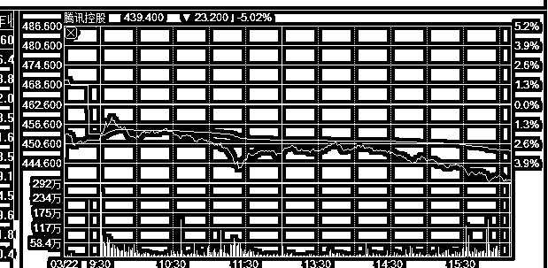
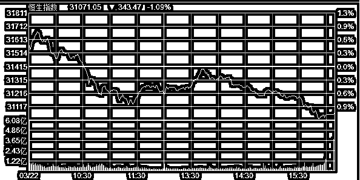
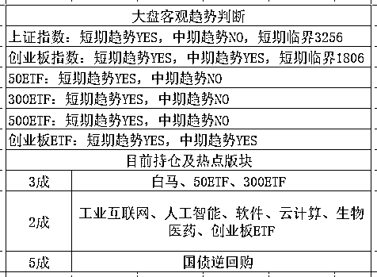

# 未来 3 年要加息 8 次，美联储加息计划刚刚公布

<link rel="stylesheet" href="view/css/APlayer.min.css"> 今天凌晨 2 点，美联储宣布最新利率决议，上调利率 25 个基点，利率区间由 1.25-1.5%上调至 1.5-1.75%。

美联储自 2015 年 12 月启动本轮加息周期，至今已经加息六次，加息启动之前，美国利率是 0-0.25%，放水放到了极限，等于送钱。2 年零 3 个月后，如今是 1.5-1.75%，而根据新任美联储主席鲍威尔的现场致辞，预计 2018 至 2020 年加息次数分别为 3 次、3 次、2 次，与去年 12 月公布的点阵图对比，美联储官员暗示的 2019 年和 2020 年的加息节奏变得快了一些。

利率决议一出，美元应声暴跌，加息明明支持强势美元，为啥美元会跌，**因为市场预****计鲍威尔属于鹰派，按照市场预估，18 年的加息次数应该是 4 次，如今少于预期，所以美元开始暴跌**。

按照点阵图，目前已经加息 6 次，未来 3 年还要加息 8 次，扣掉今天的这一次，那么累计是 13 次，加息周期历时 5 年之久，利率会从 0-0.25%提升到 3.25%-3.5%。

那么这会对经济造成什么影响呢，我们应该对比上一轮加息周期，上一次的加息周期是 2004.6-2006.7 余额，在 2 年的时间里，连续进行了 17 次加息，每次加息 25 个基点，把基准利率从 1%上浮到了 2006 年 6 月的 5.25%

**加息的原因是为了遏制房地产泡沫的疯狂蔓延，这么狂野的加息直接刺破地产泡沫了吗？**没有，次贷危机从 2006 年 3 月，大概加息到 4.75%的时候就开始酝酿了，但是仅仅是酝酿酝酿，地产价格几乎丝毫不跌，次级贷款正常运转，一直到 2007 年 8 月份，才开始总爆发，一朝崩盘。大家应该都看过电影《大空头》吧，里面全力做空次贷的几个基金经理，以为 06 年就会崩盘，结果拖到 17 年 8 月，差点被拖到资金链断裂。

所以，经济航母的惯性远超我们想象，治大国如烹小鲜这句话说起来很容易，真做起来，是很难的。如果 04 年美联储不开始疯狂加息，美国地产泡沫不知道会膨胀到什么地步，毕竟加息 17 次都没挡住他的步伐，但是加息速度过猛，最终还是引爆了经济，最终演变成金融危机。

所以这次他学乖了，提前布局，用 5 年慢慢加息，然后反复放风，每次加息都把自己未来 3 年的加息计划公布一下测试下市场反应，市场一旦暴跌，死给你看，马上就改口修正计划。

而我国也已经针对这个情况，提前遏制了地产的价格，而且中国自己到现在还没有跟随加息过，所以我认为中国地产因此崩盘的概率不大，美国加息对中国地产的影响，始终是建立在美国加息逼迫中国加息，中国加息才是实质传导到房地产的作用力。

但是在美国年年加息的大环境下，你**指望地产还能产生暴涨，我觉得是不太现实的事情，**不跌，维持横盘，真的已经很强了，政府其实是在护盘。

* * *

所以，**加息对中国股市的影响并不大**，甚至从某种程度来说，还算是个小利好，**中国对此唯一的反应就是上调国债逆回购的 7 天期利率 0.05%，仅此而已。**

那么什么是今天影响股市最大的事件呢，我们可以看到，今天创业板盘中被打到 1814 点后完美反弹，又吃了一口 1%的反弹碎肉，走势完全符合预期，我们昨天预计的是 1806-1820 区间之内会触发反弹。

但是我们同时可以看到，上证指数走势不符合预期，或者说白马蓝筹走势不符合预期，今天蓝筹白马股纷纷暴跌，拖累上证指数收跌 0.53%，动用了其他指标股才把指数对冲上来的，对于压舱石来说，这个挺过分了，因为他一个月来就没怎么涨，也没怎么跌，今天居然没压住。

从盘中走势看，蓝筹全面走弱是因为港股腾讯的原因，腾讯昨日发布了异常靓丽的业绩报表，日赚 2 亿，每股盈利同比增长 97%至 2.206 元，这是一种什么样的增速，这是养眼到爆炸的增速。

所以我们可以看到，9 点 30 开盘的时候，蓝筹都有一个小幅冲高的过程，因为如果腾讯受到业绩刺激大涨的话，对所有蓝筹都是一个龙头带动作用。但是我们可以看到，9 点 30 分一开盘，腾讯股价低开 2.3%，全天放量暴跌，到收盘成交 322 亿，收跌 5%，对比平时放量约 3 倍。

322 亿的成交量，在 A 股都算巨无霸了，整个香港今天的成交量才 1500 亿，1/5 都在腾讯上面，业绩这么好的情况下产生如此暴跌，发生了什么？鬼知道发生了什么啊，大资金砸不可能无缘无故的，自己也跟着先跑了再说吧。所以恒生指数开盘冲高 1%，然后收盘被砸的-1%

对应的，**A 股昨天刚有个****中国平安****，业绩靓丽但是高开低走套了一批人，今天又来个****腾讯****，业绩更养眼，走的更过分，低开低走全天暴跌**。那么其他蓝筹会怎么走？要是业绩差，直接暴跌，要是业绩好，业绩最好的几个股走势也就这鸟样，还能好哪去。

受此影响，今天白马蓝筹全面暴跌，业绩预估越好的跌的越惨，对今天的大盘构成了沉重的抛压，影响非常之大，中小创的反弹有个前提，蓝筹白马不能轻易乱动，你可以不涨，但是不能暴跌，那是定海神针。

今天的创业板从 1814 完美位置反弹，拉升 1.4%左右到了 1841 就掉下来了，也是这个原因，我昨天说吃一点点反弹肉就撤退，本来是预防美股加息出幺蛾子的，没想到是腾讯出问题了，今天买入之后，看到蓝筹全体暴跌，心里发慌，拉一点点我就 T 掉了，只吃了大概 0.6%就跑了，因为蓝筹跌的太瘆人了，尾盘创业连续下跌，我估计考虑的都和我差不多，都是看蓝筹行事的，蓝筹跌一点是利好，暴跌就不是利好了，真的会影响市场多空情绪的。

腾讯为什么今天暴跌，是因为腾讯最大股东 NASPERS 要减持最多不超过 1.9 亿股，价值 830 亿港币，大概占总股本的 2%左右，NASPERS 是腾讯最大股东，持股 33%，多年来一直锁仓。

这 33%的股份是哪买的呢，是 01 年从李泽楷和 idg 手中买的，当时花费大概 4000 万美元，李泽楷出手的时候已经爆赚千倍，但是如今 NASPERS 只是把这 33%其中的 2%套现，就价值 106 亿美元。。。

从今天交易量来看，出完还早，还得好几天才能稳定呢，别人减持是别人的自由，不过会对这几天的盘面产生影响，今天创业板 1814 点开启反弹，如果不是蓝筹跌那么惨，不可能只反弹到 1841 的，而且尾盘也不会跌，蓝筹跌和昨天的平安和今天的腾讯有直接关联。

* * *

还有个消息必须要重视一下，近日，富士康工业互联网股份有限公司 IPO 申请获得证监会发审委审核通过，富士康工业互联网股份有限公司拟面向公众发行占总股本的 10%，募集资金总额 272 亿元。

**独角兽富士康终于上市拉**，哪怕 IPO 就是 1 家，募资金额也高达 272 亿元，这**抽血有点厉害了**，而且对应的，富士康上市的第一天，这盘子的流通盘就是 272 亿，总市值是 2720 亿，这可怎么炒，这盘子大的炒不动啊，指望富士康涨太多是不可能的，盘子实在太大。

当然，富士康首日破发也是不可能的，这可是钦点的独角兽第一股，要是首日破发出现在他身上，那可真是搞笑了，脸面何存呢。所以估计应该仿照当年的农行上市，有一个幕后的绿鞋机制，特地安排一批资金确保他不出幺蛾子。

但是即便他不可能破发，巨大的抽血效应也是肯定存在的，272 亿的新股啊，以新股的巨大换手率来说，这股一天成交个 50~100 亿简直太轻松了，**对蓝筹股构成利空**。

* * *

今天晚上美国会宣布贸易策略，欧美股市担心贸易战爆发，预计**美国将在今晚向 WTO 起诉中国，**可能会征收高达 500 亿美元关税，而中国也曾表示，如果美国这么干，中国不排除向美国的大豆征收惩罚性关税，如果双方都这么做了，那有可能爆发全面贸易战。

所以为了避险，今天欧美开盘全部大幅下杀，不出意外，明天 A 股也是低开。

* * *

而对于整个股市来说，三大指数都接近临界点了，今天顺利的在指定的位置再 T 了一把，明后天我就不打算那么干了，暂停做 T，维持底仓不动。

因为这 T 做的很顺利是有前提条件的，大环境稳定，按技术走，所以屡屡高抛低吸，每波的底部和反弹的幅度都差不太多，但是像今天这种，一连串的大事件爆发，还去预测 T 就是自己找虐了，大环境极度不稳定的时候，多看少动。从大面上说，明天低开反弹的概率极大，但是我打算自己做做就行了，这一波不带你们做了，盘中修正的概率极大。

总体而言，股市接近临界位置，就像我昨天说的，未来的一段时间内，不是暴涨就是暴跌。而从目前的种种新闻来看，趋势目前依然是向上的，但是全是利空，所以综合对冲，向下的概率应该还偏大一点，我觉得是 46 开，向下 60%概率。

不过鉴于趋势是好的，一波倒 V 顶翻转也是非常困难的，所以我不会盲目杀跌，目前仓位控制的挺好，上证 3 创业 2，总仓 5，我打算有上拉机会就缩到 4，各减个 0.5，没上拉机会就拿着不动，等二次探底之后，我还要加仓，给二次探底的机会，是要做大 T 的，那可比这每天做小 T 爽太多了，小 T 都是碎肉，大 T 才是大肉。

有上拉机会就全部减掉行不行，不行，炒股就是炒概率，估摸了下跌概率是 60%，你就得持有 40%的仓位，这样才不会进退失据，而且除非极端股灾情况，轻易是不会空仓的，建议大家最低也要持有 30%的仓位，否则很快就失去股感了，我国庆的时候曾一周不看盘，回来之后感觉大盘的分时图和我是二个世界的，非常陌生。。。

**总结：**三大指数的临界点明后天都会触及，如果大环境是风平浪静，这个时候应该是满仓杀入的机会，破位就走，不破位就享受大反弹就是，很安全。但是如今利空满地走，建议等等看吧，先忍几天。

今晚利空满地走，但是趋势向上，综合起来估测明天是低开反弹，就不带你们公开做 T 了，没有大概率把握的这种碎肉迷你 T，我通常是不会公开说的，一般 1~2 个月我才会有机会公开带一次，这次连续三四次反复刷碎肉，是机缘巧合才有的，不是每天都有的，没有大概率把握的事情轻易不要做。 

上面是我的主观判断，下面的客观趋势表格大家也看到了，全线接近临界点，明后天只需要一根小阴线，有可能全部从 YES 翻到 NO。 

新读者输入 QS1 查看表格用法

紫色的股

经济-金融-投资