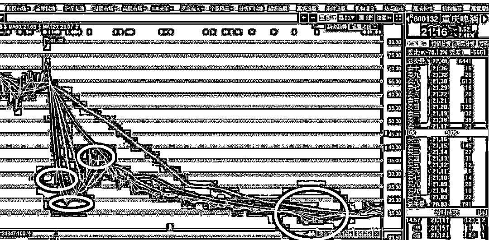
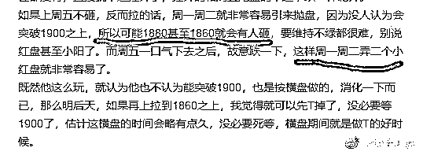
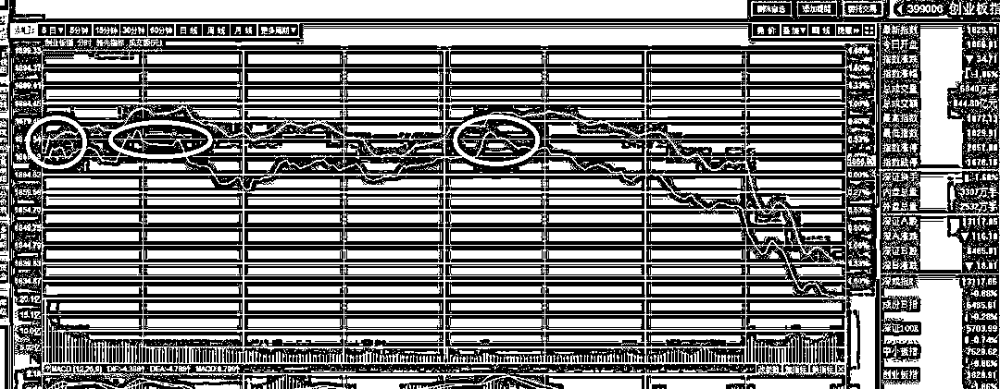
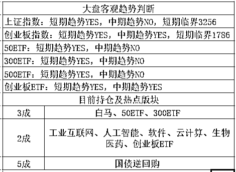

# 震惊！紫色居然要求他的粉丝做这种事情

<link rel="stylesheet" href="view/css/APlayer.min.css">

**我今天有 2 个想法，**第一个想法是总有很多人问我有没有入门级的书籍，回头我打算自己写一本试试，**我觉得我说的会比所有人都透彻**。第二个是我有改名的想法，感觉很多大 V 的名字都比我起的霸气或者接地气，我这当初随便起了一个，但是暂时想不出来啥好名字，好头疼，**大家有没有啥好的建议**。 

~~~~~~

乐视网昨天冲击涨停，开盘涌出的二百万卖盘直接就吃了，全天出现 491 万手买单，视基本面，监管警告于无物，游资说，有钱真的是可以为所欲为的。

乐视网的基本面是一个连董事长都没有的公司，整体巨亏，已经亏的只剩内裤了，乐视网本身就是靠概念和 PPT 里塑造的美好未来活着的，贾跃亭走了之后，就什么都没了。孙宏斌来当白马骑士接盘，现在也走了，那还有什么。当然 A 股的壳是有价值的，但是乐视网即便如此暴跌，市值还剩下 234 亿呢，什么壳能要这么贵。

乐视网短期做出什么业绩那是不可能了，七大子公司几乎全军覆没，唯一能指望的就是自救行情，自救的手段就是拉涨停，利用涨停的制度性漏洞来获取溢价，监管已经叫停一次，今天破板还拉涨停，真的是无视监管层呀。。。

其实**有一个股和乐视网很像，那就是重庆啤酒**，2011 年疫苗双盲试验失败，连续跌停，很多机构都活埋在里面了，从 81 跌到 28 的时候徐翔接盘，觉得连续暴跌，差不多了，也被活埋，然后在 18 附近二度接盘拉升，最后拉到 39，获利解套走人。

当主力顺利跑路之后，这个票就开始回归真正价值了，经过 2 年的无限阴跌，最后跌到了 10 块钱。。。就算是当初最低点 18 抄底的，也又吃了个腰斩，39 那接了徐翔盘的散户，亏 75%

乐视网如今就是典型的游资大户被套，疯狂自救，里面的公私募机构认命了都已经出局，连掌舵的老司机孙宏斌都认命出局了。。。但是里面还有相当的游资大户已经深度被套，他们就在里面封板自救，最后是他们吃散户回血，还是散户吃他们发财，结局显而易见，最后他的跌幅不会比重庆啤酒少哪去，监管层再三示警，不是白示警的。

~~~~~~

昨天和大家说了**ST 华泽**，预计要吃 50~60 个跌停，今天复牌，毫无悬念的吃了第一个跌停，但是出乎意料的是，第一天居然有 221 万元的买入，这个股已经那么红火了，几乎所有的人都在说这个股要跌停，**这种情况下还有人买入，可以说是真的需要补充智商了**。

~~~~~~~

昨天盘中做 T 是不是爽爽的，昨天晚上和大家说，创业板已经从横盘空间的下缘，也就是 1816-1826 区域，连续反弹到了 1860 的上方，接近横盘空间的上缘了，我周一的时候给大家制定的横盘空间的上缘是 1860-1880,因为我们不想参与 1900 的破壁之战，而且根据我们的分析，这一轮突击八成是要失败的，那么在突击之前，我们让一点空间，提前卖出，等回落再买，等下一轮凸凸，岂不是更安全。

这个图是我周日晚上发的，预测了本周初的走势，昨天晚上还再度强调了一次，所以我昨天让大家今天早上开盘随便冲高一下，就可以开始收肉了，把这一轮下跌到横盘空间下缘的多次抄底的 T，全部收掉，横盘空间上缘可以保留趋势底仓，但是做 T 的那部分仓位，应该全部走人了，谁也不知道横盘哪天结束，选择方向之前，都是大仓按趋势走，小仓按横盘做最为稳妥。

昨天晚上这么说了之后，今天开盘就涨，股市全红，一片普涨，祥和无比，倍给面子，上午在 1870 附近给了 2 次跑路机会，下午还给了一次。跑完之后，从 1876 点，非常接近 1880 了，突然开始大规模跳水，涨幅从+0.64%一口气暴跌到-1.86%，收盘居然是 1829

跌那么多是什么概念，瞬间就是 2.5%的跌幅出来了，1829 这个位置吧，几乎就是我们划定的横盘空间的下缘了，本来以为今天高抛之后，要看他们冲击一下 1900 的，我们等他冲击失败，过几天再慢悠悠的接回来，谁知道一天之内就完成了从 1880 的横盘上缘的附近直接掉到了下缘的附近。

虽说横盘区间做做 T 只是打发下无聊的时光，收点蚊子腿的肉，练练手感而已，大头还是趋势交易，但是这么给力的送钱也实在是太爽了。

这一次的 T 判断，基于 3 点，首先是我们认为 1900 是很难突破的，其次是我们认为周一周二是闭幕式，红是超大概率，所以下缘跌不破。第三是因为今天晚上美联储新掌门人会第一次对货币政策进行表态，加息可能是大概率，所以我连 1900 都不想等，1880 之前就提前一步撤了。

**这三点综合导致这几天我们买了就涨，卖了就跌，狭窄空间里居然 T 出了波段的肉感觉，**这一切都是拜郑智因素所致，所以玩经济的人，郑智要学好，准确判断郑智意图，就能大概率获胜，当 2 个大的郑智事件叠加到一起，还都判断出了市场的反应之后，那就是大概率*大概率，2 个 90%的把握叠加一起，就是 99%的把握，基本等于预测未来的感觉。

因为把握性大，所以今天高抛的时候，看情况太舒服，于是顺手多减了点，不仅仅是拿来做 T 的仓位抛光了**，底仓也都多额外减了 2 成，**今天收盘归属于国债逆回购现金部分，明天开盘估计我是要补回底仓的。另外做 T 的部分，也会全部再买回来。

今天尾盘暴跌如此之多，收盘 1829，明天轻松就会进入 1816-1826 的横盘区间下缘的，这里面，我觉得可以再次 T 买入了，这个区域的支撑是非常强力的，鉴于今天尾盘的暴杀，看空人数骤增，我决定略微下浮一点，1806-1820 左右吧，差不多就是 20 日线附近，买入之后，应有反弹，这一波反抽之后，就是迎接方向选择的时候了，要么暴跌击破支撑位，要么暴涨突破天花板，所以我们会在吃一点点反弹肉之后，继续撤退，等反向明朗了再进去。

至于大盘，横的不能再横了，当压舱石放那调节仓位吧，没有 T 的价值，放那等着就行了。

新粉丝输入**QS1**关键词查看表格用

紫色的股

经济-金融-投资