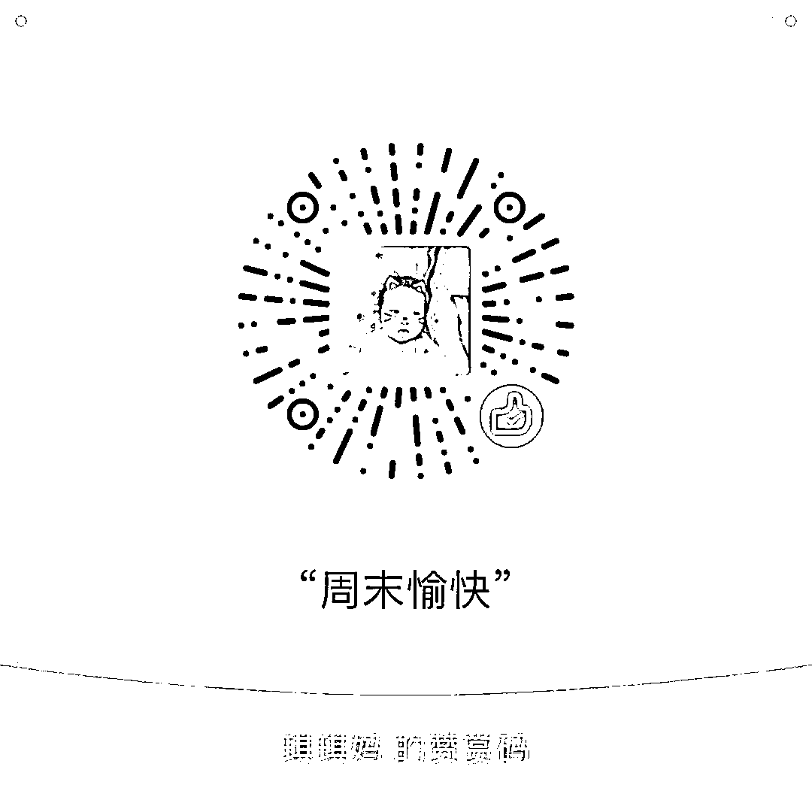

# 不要把你宝贵的时间，浪费在兼职上

<link rel="stylesheet" href="view/css/APlayer.min.css">

 现在流行兼职赚钱，最常见的兼职就是下班之后跑滴滴，而从另外一方面，我们看到这世界上所有的成功人士都是不做兼职的，那么究竟谁是对的呢。我的意见很明确，如果你想成为成功人士，那么不要把你宝贵的时间，浪费在兼职上。

我们看一个案例，李嘉诚是香港首富，但是李嘉诚会亲自修剪自家的草坪吗？除非某一天他想体验一下劳动乐趣什么的，否则一定是请人来修剪草坪。

李嘉诚请人修剪草坪是因为他有钱吗？不全是，哪怕李嘉诚没钱，他也不会亲自修剪草坪，这里面就要涉及经济学的比较优势了。

假设请来的李四花费 3 个小时就能修理完草坪，而李嘉诚 2 个小时就能修理完草坪，因为李嘉诚聪明，那么李嘉诚应该做香港第一的修草工吗？

不应该，因为李嘉诚做自己的事情，一小时可以赚 100 万港币，而李四不修草坪，去做其他事情的话，一小时只能赚 20 港币，那么帮李嘉诚修草坪的价格只要高于 20 港币，低于 100 万港币每小时，李嘉诚就不应该自己修草坪，而应该花钱请李四来做这件事。

这就是 18 世纪经济学家李嘉图提出的比较优势理论，写在了大学的每一个经济学课本里，贸易的基础并不是绝对优势，而是比较优势。在改革开放之初，中国靠给美国做衬衣做袜子得到了大量的贸易订单，1 亿件衬衣换一架飞机的大单就是这个时候产生的。

美国愿意让中国帮他做衬衣，是因为美国工厂的衬衣生产力低于中国吗？现在的中国倒有底气说这种话，但是刚改革开放之初的时候，中国就算做衬衣，也是做不过美国的，中国衬衣就是质次价廉的代名词，美国造的衬衣才是高档货，实际上那个时候只要是外国生产的，哪怕是一个螺丝钉，从性价比上来说都碾压国内的产品，毕竟都是现代化工厂生产出来的，所以那个时候就有了哪怕月亮都是外国圆的说法。

但是 80 年代中国依然能用 1 亿衬衣换一架飞机，为什么呢，因为那个时候的中国做衬衣烂，但是做飞机更烂，从比较优势来说，做衬衣还稍微好一点。所以哪怕美国在衬衣和飞机生产领域都具备绝对优势，也能和中国产生互相交换的贸易，这样各方都可以获益。

比较优势的核心理论就是，单独一个人或者单独一个国家，其精力和机会成本都是有限的，哪怕你各方面都是全球第一的人才，最聪明的做法也不是四处出击，事必躬亲，而是把有限的时间、精力和资源放在自己最擅长的地方，换句话说就是最赚钱的地方。

做兼职也是这个道理，如果你做本职工作一小时能赚 200 元，兼职跑滴滴一小时能赚 20 元，你的最佳选择不是去跑滴滴，而是集中精力去做好本职工作。李嘉诚如此聪明，我相信李嘉诚就算卖包子跑滴滴都远远比一般人做的好，他为什么不一个人把全中国的事情都做了，因为他一天只有 24 个小时啊，而且没有分身大法，所以他把自己每天有限的时间集中在自己最能赚钱的领域，然后请别人来做其他事情，这一过程，叫社会分工。

社会分工是市场经济条件下，整个社会所有人都充分发挥自己劳动力的最优选择，在帕累托最优条件下，每一个人应该只从事一份工作，而且这个工作会细分到极致，一个机器由 10 万个零件构成，分工到极致的社会，会让一个人会专门负责做其中的一个零件。

那么为什么中国还有人做兼职呢，做兼职只会在一个条件下成立，那就是市场经济失效，社会资源没有调配到最优化。比如你在一个单位，不加班的话每个月赚一万块，每天加班 4 个小时，还是一万块，你的努力，企业没有立刻给予你激励。

这个时候你还会加班吗？不会的。而与此同时，如果你每天花 4 个小时去跑滴滴，一个月能多赚个 3000 块，月入达到了 1.3 万，这个时候你就会选择做兼职。

所以，根据比较优势原理，在市场经济最优化的情况下，每个人都不应该做兼职，应该集中精力做好本职工作，把所有的时间投入到自己获取报酬最大化的领域。但是同样根据比较优势原理，在市场失灵的情况下，在完成本职工作之后，你额外投入的时间给予你的回报，低于兼职获得的收入，那么你就应该去做兼职。

兼职的存在是社会分工不合理的表现，而如果你在做兼职，那么有二种可能，第一种可能是你没有找到自己最有优势的领域，否则的话你应该把所有的时间都投入这个最有优势领域来获取最大报酬。第二种可能是有人钻了社会机制的空子，比如在某些国企或者政府单位或者个别企业的人员，工资固定制所以下班了去做兼职赚外快，但是让他们辞职去专门做兼职的那个领域他们又不愿意，这是为什么呢，因为现有的本职工作给予了他们超过应有价值的回报，其性价比超过本身在市场竞争中能获得的报酬，所以对他们个人而言，做本职拿死工资，下班了去做兼职，才是个体最优化的选择。他们这么做获得了超过自己能力之外的收益，这个社会机制漏洞所赋予的。

我们每个人、每个国家，都有所长，有所短，当每个人都能做自己最擅长的事情的时候，生产就会变的更有效率而在当前中国社会分工还不尽善尽美的情况下，是允许兼职的，看你属于上文中的哪一类了，但是如果你能完美发挥自己能力的条件下，你应该是不存在兼职这一说的，而唯一的一种最适合做兼职的属性是钻社会机制漏洞的那一类，这种也不可能发财，只能小康。

所以，我希望大家的最优选择是找到自己最擅长的那个领域，投入全部的时间，这才是个体最优化的选择，不要把你宝贵的时间，浪费在兼职上。

紫色的股

经济-金融-投资

